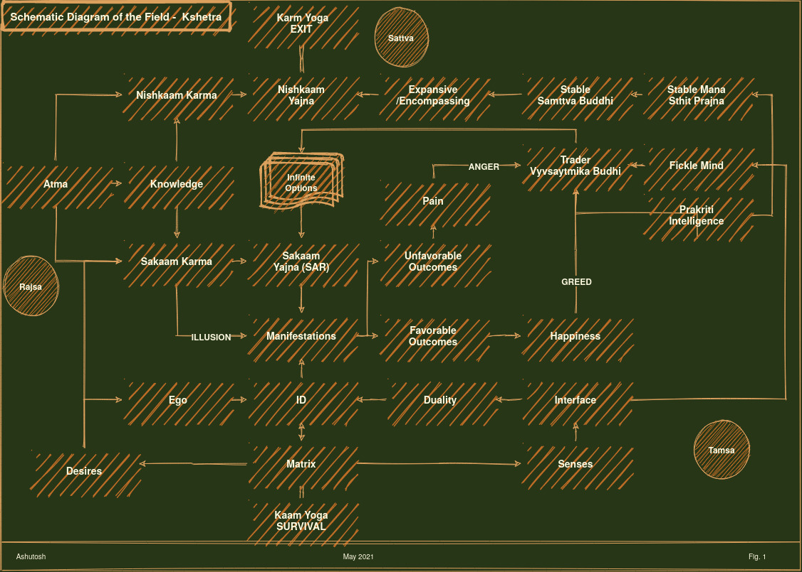

<h1>4.3</h1>

At the expense of over-simplification, here is a schematic diagram, just to recap the previous chapters and make room for the things coming up in next chapter. Krishna says - one understands this field through `Samttva Buddhi Yoga` , also sometimes refrred to as `Nyaan Yoga` but one must work hard on righteous actions `Karm Yoga` to get ever lasting peace and finally the exit. 

> Idam Shariram Konteya, Kshetram Iti Abhidheeyte ; 
> Etad Yo Vetti Tam Prahuh, Kshetra-jna Iti Tad-vidah | [13.2]

> This body is known as the field. One he sees it that way, is the knower of the "Field"
