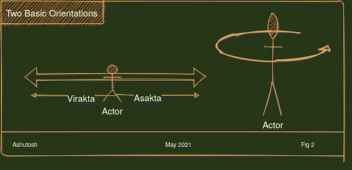

<h1>Chapter 5.0</h1>

Most of the movies you go to watch, you probably already know the end. A good movie however is the one that keeps you guessing and ends with a twist - an unexpected outcome. A movie would be bland if nothing surprising happened. Even a documentary need to have a shade of sensation. A  book , an article , a conversation - they all must have something that was previously hidden . Or was purposefully kept secret.

> We seek what is hidden. 

## Internal Strength - `Aatmik Shakti`

If you been on social media - Reddit in particular where they indulge into deep analysis :-) of the "movies" , they put a "Spoilers Alert" - particularly for the new popular ones to save you from discovering the climax inadvertently. So that you don't miss the excitement of the hidden. What if you go to watch the movie not for the story or the climax but for the craft of making a movie - do you think spoilers will ever hinder you from watching? In fact there are many movies that you re-watch , again and again - why ? Because they take you on a journey. You are now interested to check how they were made ? Who made them , who acted in those movies beyond the top cast and what exactly is being said beyond the obvious story line. The obvious now becomes unimportant - you are seeking a higher purpose , your own interpretation - you see such movies as part of what defines "you" and the beauty is - that part is something you can't express . It can't be communicated. You have started decrypting knowledge out of the movie that you watch again and again - No worries about spoilers. Just the action of watching it again always throws in a new piece of knowledge. A piece of knowledge that was hidden to you thus far. 

The question is - How to ascertain what is "open" and what is "not" ? Is there anything that is NOT at all hidden from you ? That you know for sure. That doesn't make you go through a two hours long hustle to reveal itself ? I am sure there are many things. How do you know them ? One obvious answer is "you can do them" . Can you cook something ? Can you write a poem ? Can you breathe ? The solid things - things not left to a chance or hope. You may not be able to communicate everything about them but you know everything  that takes to get them done. Repertoire of such activities that you can do on your own is called `Aatmik Shakti` - Your personal wealth. This wealth is not human specific. It belongs to a system. The system could be a nation, a business , a species. For example anyone can mix sugar in the water but "Coke" does it in a specific way that makes it so addictive. Starbucks has a very specific way to set up coffee shops , America has something unique in the culture that makes it the land of opportunity. In fact, every human too is a complex system. 

> "Action" - being able to do something, is a living proof of the knowledge. That's is what makes "Actions" and "Knowledge" connected at the hips. In essence knowledge transcends into "Actions". And stays in spaces that are beyond communication - beyond the perception of senses and thus are hidden to the observer. 

There are many things that you naturally imbibe from the family, the place you are born or the culture of the work place. Such things add to your `Aatmik Shakti` without you even knowing them. These things are bucketed under a common term called `Samskara`

## Orientation - `Aasakti` v/s 'Virakti"

Let us take this argument a bit further for fun sake. What if you say that "watching the thriller" is also an action that you know how  to do. You know how to click on Netflix icon. And select a movie to play ( btw selecting a movie on Netflix is arduous just for the sheer number of genres and the huge selection with in each category ).  Fair enough. You are a Netflix Expert :-). But then the question might be what do you know about the "Netflix" streaming platform ? Just the clicks to consumption or you want to understand how Netflix is streaming globally to millions of viewers at the same time. Why do they drop all the episodes of a season together in one shot v/s other platforms that make you wait a week .. The point I am making is - being able to use a ready made app or being able to eat a pre cooked meal - in itself is not a skill, it can be a skill if we are trying to decipher the platform , the app , the product - But we digressed .. let us get back to the our movie. 

The question then is - what are you watching this movie for - for the story or for the craft ? Are you envisaging a career in production? Are you trying to get some inspiration from the movie you are watching ? Or you may be a critic who is going to write a review . In such case the story doesn't matter. In fact a bad movie too is as much a lesson as a block buster because a bad manifestation teaches you what not to do. Gita says such a person , who  is looking at the thing - for what it is worth - objectively and dispassionately -  is the one who sees the (hidden) truth and is called a `Virakta`.

If you are seeking the story then you are consuming  the narrative. If it gave you a bigger thrill,  it was a good movie, else it was a waste of two hours and you move on to the next best rotten tomato. If you see yourself in this category , then you are opposite of `Virakta` . Such a person is called `Aasakta`. Such person is driven by the desire of sensory consumption of manifestations. They are not using the manifestation (in this case) for inspiration. The important idea is that the same visible act could have two exactly opposite orientations attached to it. 

The example of a movie or a book is easier to comprehend. You can easily tell if you are seeking inspiration or are you seeking the sensory pleasure. Important thing to know is seekers of inspiration are as eager (or enthusiastic) as the seekers of pleasure. So you can't tell looking at someone else as to what their motivation is. But you sure can tell about yourself. You know what you are looking for .......but what if we made it little harder. 

> Instead of you watching the movie , if we make you a character in the movie ?

### Game vs a Book

A book is essentially a "single player game". A game on the other hand was supposed to be a multi player thing till the video games showed up and now with proliferation of broadband internet, the video games too turned into the multi player games. Nevertheless , for the sake of this metaphor, the game is a "multi player" call of Duty. 

A single player game is easy to analyse because you can easily decipher as to what is your motivation and what exactly is your orientation. A multi player game gets  bit harder - for one it is more immersive and second it brings number of other emotions - for example competition and recognition - the notion of a  win or a loss. Even in a book - try adding a villain. Most of the page-turners that turn your brain inside out are narratives of many many characters. Characters that look life like. A gripping book entangles your brain in such a way that you become a part of the mult-player narrative and you know what a roller coaster it is. 

> What if the game you are playing is "Reality"?

### Competition 

Competition  is  the key driver of our modern reality. Competition is exponential by nature. Two people start a game, if it catches on, more and more players join in. Rewards become richer. People start drawing pleasure just by watching other people compete. Why do you think you go watch a soccer game ? I mean if we need to explain the soccer mania to an alien civilization, It will be hard to put in words as to  why more than a billion people obsess over bunch of players striving to push a ball into a goal post. What purpose ? Why Nations label their teams with their colors and flags ? These days, younger generation is watching others play even the video games . I was told never to venture into "Twitch" - it is addictive :-) 

The point is, once competition start, it grows exponentially. The logic , the purpose and the rationale takes a back seat. Krishna calls it `Spriha`. 

It is hard to understand your own motivations - `Aaskti or Virakti` even in a simple game ; imagine the plight of player caught into the competition - `Spriha`. When you are competing, there is no way to control the bugs. Desires, Anger, Greed , Delusions fire up the competition. This is the place for Matrix - `Maya` to become a score keeper. Matrix tracks your dollars , number of shoes in your closet, ties and fur coats in your ward robe. And yes , the best way to spark a competition with your neighbor is to park a Tesla Model S in your driveway :-)

On the other hand , a `Virakta` loves to stay in solitude ` Ekanata`. Away from the game . Always lost in the "Actions" and always ever in peace. Such a person is called `Udaseen` - some one who is not interested to play the exponential game. Who thinks soccer is fun for the players but it is essentially twenty odd youngsters trying to somehow sweat out their excess energy. Nothing more. He takes the narrative for what it is worth. No decorative flowery words. No cheer leading. Krishna says being `Udaseen` is a pre-requisite for controlling Curiosity `Mana` and Intelligence `Chitta` and thus getting to a stage of stable intelligence `Buddhiyoga` and becoming `Sthit Prajna` - the stable genius. And this is the only way to enhance your `Aatmik Shakti` - Internal strength ; because internal strength is gained through practicing what we received from our `Samskara` - the culture. Not by chasing the sensory fulfillment. 

### Organization and self governing mash up . 

Let us continue with the metaphor of soccer game. I had loved to use the "Cricket" as my analogy but arguably Soccer is bigger than Cricket. 

The game was simple. Twenty young players competing to post a ball through a goal and in the process sweating out excess energy. It is good to be fit. Even better to build camaraderie. But what is this multi-billion dollar business around this simple game ? We have clubs buying players, stadiums that can fit thousands of people to watch who incidently pay hefty amounts to grab the front seats , the telecast rights. Can you believe more than a billion people watch the soccer world cup final or for that matter soccer in Olympics. Under the banner of "higher , faster and better" ; we have built a multi billion dollar industry. 

Though it is quite a task  to explain this massive organization around a "simple" game to an alien ; to us it seems natural. It is in everything - countries , businesses , religions. We take very simple ideas and organize around them to essentially keep us away from the basic game. Ask yourself how many people who run the business of soccer actually play soccer. This is NOT to downplay the people who build stadia. Or the ones who telecast the matches. They have their own organization. The idea is when many games criss cross , build on each other, we create an organized , interdependent, civilized world. In other words we now have a complex self organizing system. In this system  , very few actually play the basic game. Most others are consumed in managing or mashing up various games. At this stage, even those who actually play, are at the mercy of the system that we built. They must strive to fulfill the needs of the system instead of enhancing their own internal strength. They must deliver the "outcomes" - `Sakaam Yajna` becomes the law of the land. 

### Race - The secondary game. 

A point comes when the simple basic game is turned into a gamble. Bookers can gamify anything. Soccer, cricket, stocks , political outcomes - even art. Players in this new game have nothing to do with the underlying game. They have probably never even seen  it. In fact most of us with retirement accounts are already playing one such secondary game. We are already investing in equity markets. Most of the investors in the securities market have never built a business let alone taking that business to the public offering. Such people, having lost touch with the underlying basic game, view this new game as religion. They are driven by the "doctrines".  They are easily swayed by the  desires and are focused on outcomes. They change their slots in hope of jackpots. No one cares as long as the stock price is going up . There is no underlying control , no skill , not even something that you could practice. All a matter of chance no matter how many big mathematical models we may build.

This is not as simple as reading the book now. We are in a game of epic exponent. So much so that underlying Truth and even our motivations are hidden to us. All we care is survival and growth. What we see in macro economic world is in fact the reality of our internal manifestation. Our bodies are one such self organizing system that consists of multitude of basic and secondary games - we call these games our `Vrittis` - things we do . The building blocks of our perception and behaviour. 

Welcome to the "Race". 

Unfortunately this race is not between the likes. The race is for the survival and growth. Millions of people survive on Hinduism just like most of us have at least  ten percent of our portfolio in Apple. For such people, Hinduism must survive at the expense of any other entity - it doesn't matter if other entity is a country or a business or other so called "religion". Because all of them have the same fundamental architecture. A simple game that went super nova and formed a massive organization and then lost touch with itself. The outcomes of this race are beyond anyone's control and many times it is unclear who is fighting whom ? - Android is better than iOS ; Mac wins Windows ; Tesla v/s the Fossil Fuels ; Dems v/s Pubs; America vs Islam ; Palestine v/s Israel ; China v/s Free Speech ; Cryptos v/s Fiat  - The race is endless and we are in a perpetual state of war - `Yudha`. 

#### Redefining Survival

It is as much at work place as at home and even with in us. Where ever we lose the touch with underlying Truth , Matrix ` Maya` can gamify the exponential expanse and have the players of this secondary game fight for survival endlessly. Survival in the game becomes "REAL" survival. We all know we can live a peaceful life if we minimize our spread and may be move to a low cost habitat say away from the urban centers but we don't. Actually we spend very little effort on physical survival now. Most of our resources and actions are dedicated to the games we bet on ..

#### Unpredictable 
The thing about this secondary game (created out of fluff ) is the outcomes are purely random. Bigger the game more random they are. In fact , they say "Cricket" is a game of chance. Means the moment you add more players (even in the basic game), the predictability suffers. You can't predict how the simple game of Soccer would shape up. Even super computers can't guesstimate the outcome. Well yes , you can say Maradona had a hand of God. Good players , place , weather - but you know , best of critics have failed the predictions even in a two players game such as "Chess" . Imagine someone trying to predict the stock market or the elections .. 

Krishna says - you can't escape this war - `Yudha`. But his description of war is little different ..

### Frame and Facade
With in any such organization , for example - political - where the new currency is "Control" rather than serving the people ; religious - where most of the constituents are seeking survival rather than truth ; Business - where mission is growth (market cap) rather than innovation ; there are always unorganized constituent who want to seek the underlying game. These `Virakta` want to see the game for what it is worth. They question the legitimacy of exponential expansion. Such people - though quiet, pose  quite a challenge to the stakeholders of secondary market. Such outliers can call a spade a spade. They can reveal the TRUTH that it is just twenty odd youngsters sweating out their excess. Such people must be weeded out because they pose a higher risk than the other external secondary games. 

This is the war with in. The rebellion. It again occurs at every level. The best way to control this rebellion is to frame the population in "exit fear" and build a facade of fictitious higher purpose in the secondary market. You have heard the term "walled gardens". Facebook's stated mission is about "connecting people" - facade ; and the exit fear is you will lose touch with your network. As if there was no network before Facebook. As if people were all disconnected. You can find such rosy statements all around secondary markets. 

So the clamp is closed. On one side you are driven by desire to survive on the other side you are famed into fear of exit. And to misguide your motivation , you are given a rosy , uplifting slogan. Krishna says this the  `Bhrama`. Maya creates `Bhrama` in individuals such that they are blinded to their own motivations. 

There is no way to physically fight this war because more you "physically" fight , more you are entangled in the game. 

> This war is with in us though it manifests into everything we are engaged in. It is not about my country or my religion or my technology. It is about two conflicting orientations. One that seeks to see as they are and the other that cares about sensory fulfillment. 

## The Spin 

Now that we a handle on the two basic orientations - one that focuses on the core of the game and seeks to act `Virakta` and the other that expands the exponential fluff and seeks to survive in it , let us see their impact on the constituents of the system. 

> These two diagrammatically opposite forces create a spin .. 
Just like in a Tornado. The warm moist air wants to rise up , the dry cold air wants to go down. A spiral is formed and the whole thing starts spinning. So much so that a tornado can gain speeds up to 200 miles per hour  - easily sweeping everything that comes in it's way - homes , cars , fields. Spin is not limited to tornadoes. Every thing spins - the planets , the stars , galaxies and even the black hole. Do we also spin ? 

### Energy for the actions

We talked about "Knowledge" and "Actions" being tied at the hip. In the hypothesis, we said that [protected] knowledge is the source and energy of all the "Action". Think of this "spin" as the energy that lends the system it's actions holding the knowledge with in it. 

> Every being has a unique stable spin. This is called the `svabhava` - the nature of one's own  manifestation. Think of it as a sum total of all the internal manifestations such as heart beat to our ability to digest the food. Plus all the things that we get influenced through our `Samskara`. 

Krishna says your `Svabhava` will anyway force you into your natural actions even if you try to abandon them. `Aaskati` defocuses you from your `Svabhava` to the things you are chasing for. `Virakti` (or `Anaskti`) brings your focus back so that you can attain your natural equilibrium. 

### Chakra

While every God or Deity holds a weapon - say a sword or a hammer in their hands , Krishna's weapon is unique. He sports a `Chakra` on one of his fingers. Symbolically - it is the spin of the entire universe and when used as a weapon , Krishna can alter the spin of any manifestation. He can hold the spin to have any one drop dead or increase the spin to manifest the ever expanding universe. In essence, Krishna rules the spin. With his blessing, his followers attain their natural spin and indulge in their natural actions `Karm Yoga` and thus attain the peace. 

### Hath Yoga

`Hath Yoga` is a `Tantrik` practice with it's roots in Hinduism though we find it's variants in Buddhism and pretty much every ancient belief system. Generally speaking, it postulates that there are thousands of `Chakras` in human body - always spinning and regulating what we do based on our origin and `Samskara`. Each of these `Chakra` is represented by a lotus flower with as many petals as the very fundamental "games" - activities or `vrittis` attached  to them. The `Chakras` are spread across human body but seven of them aligned to the spinal column are the ones that control all the rest. These seven, starting with the `Mooladhara` at the bottom of the spinal column and `Sahsrara` at the top of the head , hold the key to a sustained , peaceful deliverance of our purpose based on our `Svabhava`. 

For example the six petals of `Swathishthana` chakra represent the `Vrittis`: affection, pitilessness, feeling of all-destructiveness, delusion, disdain, and suspicion.  The petals of `Manipura Chakra` correspond to the `Vrittis` of spiritual ignorance, thirst, jealousy, treachery, shame, fear, disgust, delusion, foolishness and sadness. 

The bottom five `Chakras` indulge  the five elements - Earth, Water, Fire , Air , and Space ; through their respective senses fine tuned to measure the variations of each of the elements.  `Hath Yoga` as a  practice - provides the framework of body postures `Mudra` , breathing techniques ` Pranayama` and chanting of specific sounds `Mantras` to control these `Chakras` to enable the energy flow through all your body such that the activities `vrittis` attached to each of the `Chakra` attain equilibrium. 

Think of above said `Vrittis` as the fundamental games that are foundation to our consciousness and cumulate into our natural spin speed - the `svabhava`. The code for all these `Vrittis` is said to be rooted in respective `Chakras` while the lowest `Chakra` `Mooladhara` holds all the `Samskara` and the "intelligence" - known as `Kundalini`. It is depicted as a snake curled up onto itself hiding the knowledge.  A `Hath Yogi` balances the `Samskaras` and `Vrittis` by raising the `Kundalini` to respective `Chakra`. 

Krishna says , " Many sages try to understand `Atma` - the protected knowledge through Pure Meditation (`manan and chintan`) or  by `Tantra` . He adds -   the easiest way ,however, is to stay stable in mind and intellect and focus on righteous actions that are based on your `svabhava` because the actionable knowledge and energy for such basic games is already built in to you. He further adds ` Karm Yoga` is thus most effective way to attain peace and is accessible to every one for it's simplicity. That said , `Hathyoga` does present a very thoughtful model of human consciousness. It will be a good idea quickly walk through this model to appreciate the complexity with in us . 

