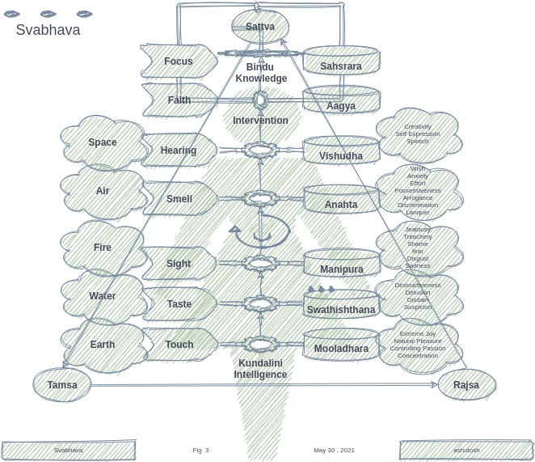

<h1>5.1</h1>

Now that we have basic idea of `Vrittis` - the fundamental games to create the consciousness , let us see how we observe them and how such observations lead to the spin - the basic motion of the universe. Did you notice, other than we humans (and few other conscious species) , every thing else just revolves - spinning around themselves and  around something else. Earth rotates around its own axis and then it rotates around the sun. Sun does the same . Moon goes around the same way - around itself and then around the earth. Even the sub atomic particles do the same. Even the quarks - Angular and orbital momentum is the only thing that leads to all the interactions in this manifested universe. But we digress - lets focus our `Senses` on the `Senses` themselves :-) 

## Senses

There are five primary SENSES `Indriyas`  of a conscious agent - HUMAN and most of the four legged animals that roam the earth. Other species may have less or more senses. For example trees have only one sense - that of touch. Irrespective of how many senses and how we define them - the primary purpose of the senses is to consume the information. They are receptors of information and the only way to do this is to engage with the manifestations. As we noted earlier in "Getting Started" that manifestations are nothing but information. The food that you ate in lunch today is nothing but information that you consumed through your senses of taste, smell and sight. You could tell with your sight New York Style Pizza that you ate this afternoon is different from the Domino's regular thin crust one and it just smelled great. And of course it melted in your mouth .. This information - received through three senses - creates a visual - a placeholder for the Pizza in our mind - Such a visual is called `Dhriti`. Pizza is just a trivial example. The idea of `Dhriti` is our ability to restrain our senses so as to sustain information. Yogies train their senses to stay focused on a specific manifestation. The constant vigil of senses on a specific `dhriti` (or a group of them) is what forms an opinion - `Dhaarna`. In reference to `Dhayana` - if your `Dhayana` is focused on say `Pizza` - the idea that New York Pizza just dissolves in the mouth is a `Dhaarna`. `Dhaarna` is very specific to you. I may feel that New York Style Pizza makes a mess on my plate as well as in my mouth. 

> In essence `Vritti` is your natural response to a specific sensory observation. `Dhriti` is your ability to hold your focus on one of such `Vrittis` on demand. Being able to see how you respond to a situation (before or after) is a very useful tool to   help form our opinions - `Dharana`. 

Just like the `Vritti` - that's is your specific decrypted knowledge of the basic games (emotions) - the way you roll - the way you act, `Dhritis` are basic forms of information blocks that our senses retain even when we are not in touch with the manifestation. `Dhritis` lead to `Dhaarna` - a topic of particular interest in `Dhyana`. `Manan` is focusing on some topic to evaluate your `Dharna` v/s other opinions such that you could reason your position v/s others. Where others are coming from ? Once we do that , we lose unnecessary passion for "our" ideas v/s them. In a way we start seeing the things for their worth - An important pre-requisite for `Chintan` - your design as well as the action plan. Continuing with our `Dhyana` on the "New York Style Pizza`. If you consider my opinion , you may agree that it does make a mess while it still tastes great in the mouth !

Broadly speaking - `Dhritis` are the primary control over senses .It is what lends us observation and focus. They are the perceptions that lead to opinions. 

### A Book vs A Movie

Before we look at the "senses" in detail, there is one more important point to establish - where does the fickle mind comes from - the `Chanchal Mana`. If you picked up a big book on say quantum mechanics from your library - a somewhat labor intensive topic, you will find ypurself jumping from one chapter to another. You wanna check the bredth and the depth. You even consider if I should really spend time on this ? You basically want to check everything that the book offers before you really get down to serious reading. You might even check the back ground of the authors. The reviews. You move from page five to fifty one and then back to page ten. Gradually the thing start shaping up . It is never sequential. In fact , it is not a bad thing because you have limited time and it makes sense to make sure that it is worth investing on a long read . Fickleness is thus a judicious way to maximize the return on your investments. 

A movie has a different delivery. Once you start, you are caught into the audio visual experience. You rarely fiddle with the remote to go forward and back. You can do it but you don't because flipping  the scenes in a movie is not as easy as flipping the pages on the book. You take your only shot at the movie and end up forming a "quick opinion" at the end. Either it is good or a waste of time. 

Now imagine you are in a game - "Call of Duty" ..every time you play with bunch of friends, the way it happens is always different. More the players , more complex it is to roll back. And there is absolutely no way to move foreward without actually playing the game.  How do you ascertain if it was a good use of your time. You must retain the information of important moves to go back over. That's where `Dhriti` comes in. You have the ability to run the game (or the movie) back in your mind to review your opinions. After the game , if you invest some time in `Manan` - you might find why others are falling head over heels for the `Titanic` while you thought it was just a time pass. 

In real life, a game that is order or magintude more complex than the "Call of Duty" , `Manan` is thus the only way to ascertain if you opinions hold water. What if you never take time out to perform a ritualistic rview ? What if you keep taking pictures and never go back to see them ? Do you think you can find the right path ?

### Five elements `Panch Bhoota` - five senses

A SENSE explores variations in one unique `Tattva` - the Element and it is the primary mechanism to invoke a perception for the associated `Vrittis` - perceptions related to the specific sense. The elements represent `Prakriti` the "Intelligence". There are five innate elements - `Panch Bhoota`. 

Let us not confuse these ELEMENTS with the chemical elements such as Oxygen or Carbon. The chemical elements are based on number of electrons they have to understand their electro-chemicals properties. The ELEMENTS `Bhootas` described in Gita is a different way to categorize. Just as we can categorize the population by gender or orientation or by ethnicity or by countries. 

#### Skin (Touch - `Sparsha`) - Earth

Touch explores variations in the texture of SURFACE. SURFACE is represented by solids  and thus by EARTH `Prithvi` . Earth is the element linked to Chakra of `Mooldhara`. Beyond obvious perception of touch , it contols four `Vrittis `  - Extreme joy, natural pleasure, delight in controlling passion, and blissfulness in concentration. 

You have probably seen animals rolling in the mud to express the natural pleausre. On the opposite side of specturm, there is delight in holding the passion and concentrating. 

#### Toungue (Taste - `Rasa`) - Water 

Tougue is the only part of the body that can tell the difference in taste. The "taste" is enabled by the liquids `Rasa`and thus WATER `Jala` represents its eleement. The water is linked to the second `Chakra` - known as `Swadhisthana`.  The six petals of this `Chakra` represent the following modes of consciousness: affection, pitilessness, feeling of all-destructiveness, delusion, disdain, and suspicion. `Svadishtana` is often associated with pleasure, sense of oneself, relationships, sensuality and procreation. It is blocked by Guilt. Svadhishthana is also associated with the unconscious and with emotion. It is closely related to the `Muladhara` in that `Muladhara` is where the different `samskaras` (potential Karmas) lie dormant, and `Svadhishthana` is where these `Samskaras` find expression. `Svadhishthana` contains unconscious desires, especially sexual desire. Thus, in addition to sense of taste (the tongue) it is linked with reproduction (the genitals).

#### Eyes (Vision - `Drishti) - Fire

Eyes explore variations or different shades of LIGHT. Nature produces the medium of light through element -FIRE `Agni`. In traditional `Hathyoga` the Chakra for fire is `Manipura` that comes with the vrittis of spiritual ignorance, thirst, jealousy, treachery,
shame, fear, disgust, delusion, foolishness and sadness.

Manipura is considered the center of dynamism, energy, will power and achievement, which radiates prana throughout the entire human body. It is associated with the power of fire and digestion, as well as with the sense of sight and the action of movement. Through meditating on Manipura, one is said to attain the power to save, change or destroy the earth (living soil).  Being related to the sense of sight, it is associated with the eyes, and being associated with movement, it is associated with the feet.

#### NOSE (Smell - `Ghrana`) - Air 

The variations in SMELL `ghrana are enabled by the AIR. If there is no AIR there is no smell.  The `Chakra` related to air is `Anahta`. The `vrittis` of this Chakra are
 1. asha: wish, desire, hope
 2. chinta: thoughtfulness, anxiety
 3. chesta: effort
 4. mamta: possessiveness, fondness
 5. dhamba: arrogance, vanity
 6. viveka: discrimination
 7. vikalata: languor
 8. ahamkara: conceit, egoism, pride
 9. lolata: covetousness, avarice
 10. kapatata: duplicity, hypocrisy
 11. vitarka: indecision, argumentativeness
 12. anutapa: regret, burning misery

#### Ears (Hearing - `Shravan`) - Space

Like two dish antennas, ears are always open to observe the variations in the sound of SPACE. SPACE is the fifth element called `Aakasha`. The Chakra for space is `Vishudha` .  This chakra is known as the purification center. In its most abstract form, it is associated with higher discrimination and is associated with creativity and self-expression. When `Vishuddha` is closed, a person undergoes decay and death. Just like ears , when it is open, negative experiences are transformed into wisdom and learning. The success and failure in one's life are said to depend upon the state of this chakra, whether it is polluted or clean. In addition to the  element Akasha, or Ether, and the sense of hearing, this `Chakra` is related to the action of speaking.

>> So five SENSES of conscious agents to measure variations of the MEDIUMS of five Elements. In other words - five Sensors to calibrate five Fields. The collection of these five fields is CONSCIOUSNESS FIELD. We can't observer anything that's not described by sight , touch , taste, smell or space. This, however, doesn't mean there is nothing beyond our senses. There is whole lot more beyond our sense observable universe.

### Sensory overload

This five senses and attached `Vrittis` and `Dhritis` , you can imagine the expanse of different profiles we can create to create a dyanmic mood. `Hathyoga` is a way to control these moods through brute force. Krishna says that it is quite fuitile to try this route because no matter how careful you are, `Maya` can always play a trick. In essence , `Maya` doesn't even need to do anything. Trying to control your `Vrittis` is like walking on the water. What Gita suggests is to just remove focus from the sensory gratifictaion and place it in "Action". He said 

> Indriyani Parani Ahur, Indriyebhya Param Manah; \ 
> Mansas Tu Para Budhir, Yo Buddhe Parastast Tu Sah|
>
> Senses are all powerful but know that stable mind is even more powerful than the senses. Intelligence can tame the mind and knowledge is the one that keeps intelligence in check.  

The next question is, are senses only a tool for observation or they do something more than that. I mean if I see a lion in the jungle, I am sure I am  going to tell you walking by my side ! Wouldn't you. In fact you might pull out your iPhone X and start making a video (of me negotiating a lion :-) to tell the whole world about the observation your eyes just took. Instagram goes to jungle with us , isn't it ? 

### Senses as a "Service"
 
 You must have heard "software as a service" .. how about if I say our senses are also a "service". Anyone can subscribe to our senses. That is what communication is all about. We communicate what we sense. With people around us , with people connected to us or people we want to connect with. ..but most importantantly - with our selves. - our "identified self". Just like software as a service, we need to subscribe to the senses. The sensors that we direcrtily subscribe to - means our eyes , our ears ; talk direcly to our `Vrittis`. Such a communication is a pure communication. Means if you see a lion with your own eyes , you will get a pure invoation of your perception - means you can feel afraid or you can can feel amazed at the majestic lion based on if you saw him in the zoo or the jungle. However , when you hear an observation through someone else, her perceptions and opinions are mixed in the situation. It will take a lot to invoke the primary intended perception in you. Such communication is called impure. All impure communication leads to something Gita says `Sang Dosha` - The curse of connection. 

### Communication

The idea that "I" can subscribe to your senses gives rise to communication. All animals can communicate but we humans have taken it to the next level. The reason - we want to present communication as pure as we can, means we want to hide our `vrittis` in the communcation. Thats why we use manifestations to communicate. Language is a manifestation of endless practice we did growing up. We trained our mind and tongue to speak each word correctly, then we trained ourselves to form the sentences and paras . A daily ritual of Actions that we do to date. And then we discovered that we can communicate even better if we make it a story, a narrative. Even better if we make it audio visual. All in pursuit of expressing the reality of our senses. Or hiding  the excessive details  - "Knowledge". 

### Art 

When we gain expertise, in communication - the manifestation that we are using - spoken word or visual ; becomes a piece of art. A painting of Micheal Angelo can communicate lot more than many written books. And one `sher` - a verse of gazal ; of Mizra Galib can say more than a lecture on the topic. The cleaner the expression better the artifact. 
 

### Silence

The purppose of our primary senses was survival. But all the secondary impure communication we get can spoil even our primary senses. It normally leads to fickleness of mind. The fickle mind takes over our intelligence and we start taking pleasure in information consumption . As we noted, our primary senses , in connection with our perceptions can create lot of information , the additional impure communication can lead to absolute noise. The idea of not letting our senses consume any noise is called "Silence". Silence is thus not imited to you speaking . Not listening to others is as much important in silence as your own speech.

The modern augmentations of communication , audio and visual - can absolutely derail our natural rythem . Which means lot higher "spin". 

That brings us back to the question - Are we spinning ? just like the earth does . To understand this , let me address the last topic of this chapter .. 

## `Svabhava`

Earth is rotating. Around its own axis and around the sun. But we walk on the Earth. Rivers and wind flow in different direction. Do they slow the Earth down ? 

The information that our senses gather is too large that the secondary communication should not be able alter our natural rhythm. This rhythem is our `Svabhava`. We develop it mostly with our own senses. Nurture can play a role but that is very limited. Facebook and Netflix - well I don't know :-) 

`Manan` is  the way to weed out external noise through "Silence" and then review our opinions v/s other alternatives. And gradually come down to our `Dhritis` and `Vrittis`. So much so that we are able to ascertain our `Svabhava`. 

Krishna says that your `Svabhava`  (or confusions there in due to noise) will anyway force you into actions. Might as well try to remove the confusions and do the actions with veracity. 

> The important thing is to get to your natural spin and stay there in that state. There is nothing wrong about spinning faster or slower except that such states are transient by design. Today you migh be spinning faster , you probably saw a James Bond Blockbuster and the other day you don't want to get out of your bed. The reason we should stick to our natural spin is that is what is most sustainable and thus that is the place where a long term activity ritual - `Yajna` is most likely. Even a `Yajna` taken up for a specific targeted outcome .. If you want to be in eteranl peace ie `Karm Yoga` wherein your entire lifestyle is `Action` based , being in your natural spin is kinda a fundamental requirement. 

As depicted in the chart above, the three profiles `Guna` can be easily ascertained by the state of your `spin`. If  you are spinning faster, you are probably trying to achieve more than what you natutally can - Such a state is `Rajasa`. If you are slowed down and overtaken by the consumption than you are in `Tamsa`. At your natural spin , when you are ready to indulge in `Nishkaam Yajna` - that state is referred to as `Sattva`. 

The beauty of the design is such that there is disproportionately higher failure rate - means there are more pains in the worldly interactions to ensure people get back to their natural spin. The things (manifestatations) of lasting value are normally created through `Nishkaam Karma`. In a way Matrix is a great teacher. 

### `Hath Yoga`

A ritualistic practice, where you try to decipher each of the `vrittis` and try to control it through sustained body postures `Mudra` and chanting of specific sounds for each of the `Chakra`. In contrast to what Gita suggest as `Karm Yoga` , `Hath Yoga` is hard to accomplish- particularly in these times when we it is anyway hard to focus. The more important thing is even if you nail down `Hath Yoga` (and for that matter any other Yoga` ) , you still need to stay in your natural spin and do exactly what `Karm Yoga` suggest, that is , to indulge in `Nishkam Karma` and manifest to attain everlasting peace ; why not do it from the get go. 

### Reincarnation 

The idea of reincarnation is pretty simple. The question is will you keep spinning for ever or if there is some rest on the way. What if your apparatus gone very old ? 

Think about a computer. You install programs and applications on top of what was already delivered to you by the vendor. What if the camera suddenly stopped working and you have no time to find a fix. First thing you do is reboot. When you reboot, all the software that you installed is still there (hopefully) , may be you lost some work that you didn't save. When you reboot , it generally clears your cache, unless you are expressly decided to open some applications on the start up , all the programs are closed - you are back to your natural state of computer. You still carry millions of lines of code delivered by Apple and you have all the new apps that you installed. And you also have all the pics that you stored - unless you are paying Apple Tax for the iCloud :-)  .. 

### Mentor

Identifying and understanding your `Svabhava` is probably the most difficult initiation for someone aspiring to pursue `Karm Yoga`. It is what is known as `Self Discovery`. One of the way Gita suggest is to develop a mechanism to see yourself as a third person. Look at yourself from a distance. Such a vision is called `Atmoupamyen Drishti` . This is a habit that can be cultivated but it is not easy while someone else looking at you can easily describe your motivations. Someone with deeper understanding `Tattva Darshi` - who can see the things at elemental levels - can easily tell you what your motivations are. Why and how you are spinning. How mundane and may be misplaced our desires are that are causing us to spend unnecessary cycles into wasted effort. 

In `Hath Yoga` such an initiation through a mentor is accomplished by a touch at the two petaled `Agya` chakra situated at the center of eyes above nose. The two petals represent `Duality`. Duality is what separates you from the mentor. By way of touching this `Chakra` , we are stating that we are now one with the mentor and will follow her per the guidance. When  we surrender our `Actions` and `Outcomes` thereof to the mentor , she is called a `Guru`. In a way Sun is `Guru` of Earth and Earth is that of Sun. That is the reason, In Sanskrit , gravity is termed as `Gurutvakarshan` - continuous pull towards your `Guru` such that all your motions are dedicated unto her. 

This is a good Segway to dwell a little on `Duality`. Let us see the next chapter ..
