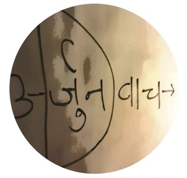

<h1>`Sandarbha`</h1>
<iframe src="https://archive.org/embed/arjunUvaach/0dot0.mp3" width="350" height="40" frameborder="0" webkitallowfullscreen="true" mozallowfullscreen="true" allowfullscreen></iframe>

                                                                                                                                         j
America is the melting pot of all nationalities, all religions across the globe. It is the land of opportunity. Working here for last twenty plus years, I happened to visit all corners of this great nation. If you leave the coastal areas, and if you go to the interiors ,you  get to know people who are curious about India - the land of Yoga and the `Vaedik` philosophy - The mystical nature of India. People used to ask me to describe India - in different ways ; in different conversations. Initially , in the early days, I used to respond ad-hoc depending upon who I was talking to or depending on the situation or the conversation , without giving it much thought. As I grew older , got more comfortable in terms of my understanding of the American culture of openness and genuine curiosity , I really thought about what India is? It occurred to me if you want to give a concise answer ; the problem really is how do you represent a billion plus Indians - Hindus, Muslims , Sikhs and hundreds of more religions and their factions. The question is valid but the answer is difficult. How to say  what is India ?  Its a land of billion plus humans; a large agricultural base; growing very fast in technology; hundreds of political parties; all sorts of weathers; the tallest of the mountains; the deepest of the seas. But if you really want to put a very concise answer that is really meaningful - after lot of introspection and thinking consciously , I reached a kinda conclusion that India is actually two stories - The story of `Rama` and the story of `Krishna`. These two epics go beyond casts , regions and even religions. They are woven into the fabric of Indian psyche. If you get these two rather big narratives, the `Ramayana` and the `Mahabharata` you can get ninety percent of what India is. In mean if you happen to be in India and you are know these two epics well enough, you can come out of any conversation on top  as someone who knows what India is. 

The remaining ten percent is where we get down to the deeper philosophy . Unfortunately just "stories" don't work out well in such conversations. We need an appreciation of the scriptures such as `Vedas` Upnishdas` `Puranas` and `Samhitas`. Reading and understanding all them is love of labor. And pretty confusing too because things have evolved over thousands of years and they may contradict each other. That is were `Gita` fits in. Gita packs the entire wisdom in seven hundred verses that are easy to understand . Form placement standpoint , Gita is not a separate book by itself, it is one chapter of the epic  `Mahabharata`. The best part is it rendered in a conversational format.   A conversation between Krishna and Arjuna in the middle of the great war - the `Mahabharata`. In the larger epic of the same name , Krishna is the multifaceted incarnation of the God - as a king, a diplomat , a messenger and a friend and the one who stands up to the evil .  Among all these and many others, his role as the driver of Arjuna's chariot is one that is contextually (and probably otherwise), the most fascinating . This role is symbolic of one who is leading us on a righteous path; particularly when we are stuck into dilemmas. 

Dilemma is the most crucial aspect of this mega narrative - `Mahabharata`. Arjuna was confronted with most daunting challenge humanly possible - something beyond imagination. Destiny had forced him into a situation that demanded taking a point at  his own family for a righteous cause. He had rather give up his own life than to put his loved ones into harm's way. In a way, it was the existential question - "To be or not to be" ; to choose his life v/s those who are the very reason of his existence.  Despite being the most skilled warrior of his time, he was now a victim of "cycles of time". No one , not even God himself, may change this basic nature of our reality;  that good and bad times are two sides of a single coin. 

## The cyclic nature of our Reality

Gita targets this  timeless, universal problem - the cyclic nature of our life. That is what makes it ever relevant.  The birth and death are cyclic , so are the day and night. In observable universe, everything grows and then diminishes. Greater the rise, bigger the fall. Every success finally meets it's failure . This is as true in business as in our emotional lives. Happiness and pain is a never ending cycle. Planets, stars and even black holes can't escape this truth.

Krishna says ..

>  Jatsya hi druvo mrityur, dhruvam janm mritasya cha;
>
>  All things born in truth must die, and out of the death in truth comes life.

## The `Nirvana` Solution

Krishna, in said conversation, lays out an elaborate  method to help us stay afloat in the waves of joy and grief associated with the rise and the fall . A method that was unheard till he said it and remains unique to date.  This message of `Karm Yoga` is both - rational and practical. It doesn't warrant a leap of faith because it is experiential. Not only does it offer the exit from the cycles - `Nirvana`, it also makes the followers feel "blessed and blissed " that obviously translates into worldly success.  Thus `Karm Yoga` is a  useful guide rail to navigate modern life. 

Being a skeptic myself, it wasn't easy for me to jump into Gita blindfolded. Truth be told, I did my due diligence :-)  Here is my rationale before I took on the journey. First obvious comfort was ..

### It didn't ask me to give up anything. 

The ideas of Gita appealed to me because it didn't ask me give up my life for a strange unknown blessing. All it basically says is just do your duties without worrying about the outcomes. 

### No religious overload .
It didn't ask me to visit a temple or light up the candles at a church. In fact it didn't sound religious at all. It calls for realization of your inner "self" and it says once you know yourself, you are the God !

Despite being part of Hindu scripture (s), Gita doesn't belong to any religion nor does it advocate a specific God or a specific way to worship. In fact, it  rejects the popular religious ideas. The situation itself was very symbolic - you have a king talking  to a prince in the middle of a war. There were no long bearded monks there. This discourse was NOT at a Himalayan cave . In fact , it was not even a discourse - it was a one on one conversation. And the outcome of this conversation  was the biggest blood shed ever known to the mankind - at least, till the time of its writing. There sure is nothing religious about it. 

### A very different approach 

It came as a fresh air to my goal (outcome) oriented thirty years through the corporate ladder. Everything should not be a calculation. I should be able to do things just for my (inner) sake. 

### Made me more effective 

Being attached to "Actions" made me more effective at my chores. I got better at fitness. Once I stopped chasing a number for "Financial Independence" and started focusing on right investment actions, the number automatically came through. 

All above are good, but the thing that really won me over - the very sharp logic !

### The sharp logic

If we start a game, a common perception is that there are two possible outcomes  - we win , or we lose. Win means we are happy, lose means life sucks. In a normal game, if we keep on losing, ultimately we  run out of the chips or the casino closes (assuming we are not at 24 X 7 Las Vegas :-) . So the third possible outcome is the game ends.  What if we are in a game that can't be stopped ....ever ?

Isn't life one such game ? Leaving the concept of reincarnation at a bay (for the time being ) - I asked myself - Is it possible to be alive but not play the game ! 

#### Can I pack my cards ? 

The obvious answer was to get to a sustainable financial independence[FI], resign the regular job. Try to live with in my means. I did all that . But many of you who reached FI would vouch - the game doesn't stop. Portfolio,  pandemics and politics never stop. And of course the body itself needs us to go on . It goes on and on . Only the  events change - cycles don't. Desires , happiness and pain are kinda built into us. No matter where we go , no matter what we do,  our mind can't get over the game . 

There seems no option to pack the cards ,  sit in the casino bar and just enjoy a drink - no game. 

Even if I don't "use" the exit, there must be one. Where is my third option ? To just "be" -  at peace.  I thought doing "nothing" might work. It doesn't. In fact , being able to do nothing is very difficult. It is the freedom. Freedom is actually tied to the actions. Anyone can think or imagine whatever they want to do; but that is not so when it comes down to actions. For actions we need permissions. There are permissions to be sought at the work place, at home ; even from our own body. Our ability to do what we want to is freedom. And if we want to do "nothing", then being able to do that is freedom. Turns out this ultimate freedom isn't possible. No matter what we do , we still need to breathe, drink , eat and millions of other chores to run this body. With every single layer of sophistication or automation, we add another layer of chores that must be done. Charging our cell phone is now as important as drinking water :-)

It just seemed unfair that I was neither asked if I wanted to play in the first place, nor do I have permission to leave. No doubt this is a beautiful physical reality but it feels like a beautiful jail if we don't have the permission to see past it. Or do whatever we want to . On top of that - the reincarnation thing (if true) sounds as if , I am stuck here for the eternity , playing these Squid games :-) . Isn't it ?

#### Gita's take on this HARD problem .. 

Gita says where the world looks at only two outcomes - heaven or hell ; both being here in this physical reality ,   there does exist a third option - `Nirvana` - that is to exit this game . It suggests a simple approach to accomplish this third stage -  Indulge in actions whole heartedly but give up all the expectations. That seems counter intuitive because desires (or passions) are the very reason we indulge in actions. The good news is, Gita, just doesn't offer the dictum; it also offers a roadmap. A definitive overall one stop solution !

Krishna says - `Nirvana` is the real victory and that is the real goal. And he proposes `Karm Yoga` as the only path. In essence, Gita gives a new destination and also paves the singular path to it . Why singular ? Why only path ? Because , it says , all other paths finally lead to `Karm Yoga`. 

In nutshell, it says that the pains and happiness are attached to the "the expectations v/s the outcomes".  If  favorable we are happy , Otherwise not.  Actions done without  attachment , on the other hand, have two different properties - peace and knowledge. If we focus on actions (and do them as a ritual without attachment- `Yajna`) we will attain the peace and decrypt the  knowledge. And finally this knowledge automatically solves the puzzle and thus the exit - `Nirvana`. 

And here is the Kicker - It says that we don't need to perform any special drill . All we need to do is just change our approach to "Actions" . From attached to detached. 

### No Brainer

If all I need to do is change the approach to things I anyway do - invest in stocks,  love my dogs, run , chat with friends, take care of a family , drink some good wine and come up with occasional tweets :-)  ; then obviously there is no down side to trying out `Nirvana` route !

### Alexa - put me on `Nirvana` mode ..

Unfortunately , Alexa still doesn't have the `Nirvana` skill :-) . So the journey is really to learn (and experiment) how to focus solely on "Actions" . Without any consideration of "outcomes". 

Turns out it is harder than what I thought. Desires creep into everything we do. Thus `Karm Yoga` is a skill , just like playing the Violin. The good news is Gita has all the information. We still need to practice though ; because just information is not sufficient. Gita is experiential. 

Somewhat better news is, the work done on this path never goes wasted. This assurance comes from the "auto save mode" :-) Krishna knows, we will wander off track ; get swayed by the desires- thus the assurance that once we start on `Karm Yoga` , just like swimming , we will never forget it. We can always come back at any point, reset our password (if forgot), and get started from where we left .. 

### Isn't Nirvana a Desire ?

Yes it is, aspiring to exit is also a desire, a desired outcome - what a catch :-) .. I thought to myself !

Gita says - only till we are learning . Once we attain `Karm Yoga`, even the desire to exit vanishes - thus the eternal peace. In fact `Karm Yoga` is not about exiting the life. It is about riding wave above the cycles of happiness and pains. Exit happens whenever it needs to happen . At this stage we are not even a `Karm Yogi` . We are simply a `Yogi`  - means connected. 

## Beyond labels

It is hard to label Gita as spiritual or scientific. It offers experiential method that is as testable as science. At the same time it warrants dedication,  commitment and rigor which is common to any "problem solving" apparatus. A new reader might see the later as a "call for faith". The best approach is to treat it beyond labels. Walk the line and determine yourself if it works. If it does, take on to the next iteration. 

As we start invoking Gita into our lives, first curious to see if it works and later as the path pulls us in, we realize Gita is based out of pure logic. It may not not be grounded in the mathematical equations but a slightly deeper experience opens up the door to its superlative rationale that is baked into common sense above all. In a way, it could act as a unifier between two conflicting ideologies of our time - Science and Religion. And that is exactly this book is about . One of my motive is to bridge this gap , at least make a start. 

## The name - `Arjun Uvaach`

It simply means "Arjuna Said" . As we know,  Gita is a conversation where Arjuna asked the questions and Krishna answered them with love and respect. Think of this work,  as Arjuna of this time , explaining back what he understood. A loop back mechanism to ensure intact delivery of communication and also its intent. And also using his own language, his metaphors and his analogies. 

 

My goal is to say it in the most accessible way.  My hope is, in the process, I will be able to boil it down to a modern document that is beyond blind faith and is logically appealing. At the same time I do want to quarantine numerous `Yogas` into their boundaries and stay put on the core message. 

There are four parts of this book.

- Getting Started - is where I want to reinstate the age old, time tested and  proven concepts of Gita in a language that is easy on a  modern reader. The goal is to develop a common Vocabulary and solid grip on the core message. 
- Consciousness - is where I try to build the larger construct of our reality. Who we are. How the whole thing works. Again based on the concepts of Gita but using modern metaphors. 
- Triangulation - is the ways and means to figure out where we stand in the maze of matrix and what is the righteous path forward. 
- Test - As  we know Gita is experiential. This section is to figure out the "ways and means" to  test  the ethos of Gita. The goal is to develop a scientific approach to testing rather than asking for a leap of faith. In addition to being a separate chapter in itself, I have tried to add sections on "testing" inline with other chapters to supplement the ideas and the flow. 

Just like in any other scientific faculty, it is difficult to watertight the different sections. You may find yourself hopping from one chapter to other for  the knowledge is always integrated. I believe a book is only information ; it is a way to organize the knowledge in a template. We can get the template but we need to fill it up with our own imagination. No matter how descriptive an information artifact , there is always room to read between the lines. I feel knowledge lives in that unwritten space. Thus, my request to not hold back your imagination. With every section, try to fill the gaps with your experiences, your perception of reality and hopefully, it will all align.

The work here is not mere reflections of what I read, it in fact,  comes from me putting the ethos in practice to whatever little I could. I don't claim `Nirvana` but I vouch I have seen the tip of iceberg. Peace and happiness were alien to me. I was a wandering soul ever so lost in "what next" and consuming my way to bloat. Gita has helped me focus, remove the unnecessary baggage and fine tune my life. And it remains a work in progress though I see the light at the end ... 

~Ashutosh~

---

<h2>0.0</h2>

