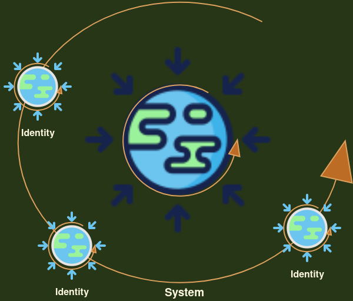

<iframe src="https://archive.org/embed/arjunUvaach/1dot1.mp3" width="500" height="140" frameborder="0" webkitallowfullscreen="true" mozallowfullscreen="true" allowfullscreen></iframe>

<h1> 1.1</h1>
 

In previous section we skimmed over the idea that the physical universe is perpetual. There is no beginning or an end though we find that in both,  science as well as in religions,  there appears to be a distinct start of the physical universe. We don't know for sure if the big-bang was an evolutionary act or it was an intelligent design but there are many things that we can talk of with at least some degree of certainty. My contention in this section is to look at such things and try to deduce the general nature of our true underlying reality. I know it is tall order and I hope you will bear with me. 

One such pretty certain thing is our own life. And the good news is it is part of our universal experience .  We were all born on a specific date . And we will sure die some day. There is no denial to this truth because this phenomenon is under our constant vigil - 24 by 7. In a way , our life is our longest and most meticulous observation. Even better news is we don't need any apparatus of science to observe our life. We all have all the sensors, pre built into us to test this particular reality. 

The sad part however is, even our own birth is something that we didn't get to observe ourselves. Someone told that I  was born at xyz place on such and such date . May be a birth certificate :-) . We obviously have no reason to not believe the birth certificate,  but at the same time  this irksome fact remains that my own beginning is hidden to me. Even more stranger aspect is we don't know anyone who could describe their death . We only see others taking birth or leaving their bodies and we assume that we must follow the same template.  Even this tiny observation - the observation of our own life - seems to be incomplete .  If that is the case, what chance do we have to understand the start and demise of this universe ? Are we getting ahead of ourselves ? Before we try to know everything, shouldn't we try to understand the limits or limitations of our ability to understand things ? Wouldn't it be a good idea to sharpen our axe before we get down to cutting the tree ?

You may say that our own birth and death is kind of a unique situation because we didn't have fully developed senses at the time of our birth and in kinda similar way our senses bail out on us when we are experiencing death. And that is the reason we need to believe others. Absolutely true. But then I may add that none of us have even seen our own faces directly. We need a mirror to see our reflection;  or use a trivial camera to capture our front view. How do we know that camera is showing us our true selfie. May be we can ask our friends if I am looking exactly same as I see myself in my picture ! In a way, my eyes are limited even to observe my own face. I need to depend on others to describe to me how do I look ! To confirm to me that tools that I am using , such as a mirror or a camera are correctly calibrated. 

In a way, our sensory observations are limited. And from sensory observations I mean all that we can observe directly with our senses plus the tools that we need to accomplish our observation - in this case it is a camera or a mirror. In case of mass it is the weighing spring. In case of voltage it is the voltmeter . And so on ..  Btw , don't get me wrong ; I am not against the tools. In fact, I love them but I do see them as something that expand our sensory perceptions. While they provide many answers, they also expand our limitations at the same rate. 

The obvious question is why are we discussing our sensory observations in this section ? Weren't we supposed to discuss the never ending cycle of this universe ? The answer is we need to understand the idea of observation before we attempt to put our arms around the idea of "continuity". Observation is the key to understanding our sensory reality - our tiny box. As shown by Heisenberg in the uncertainty principle, the act of observation, collapses the wave function. In other words, reality emerges as soon as we try to observe something.

Let us take a deeper look .. 

## Observation 

The first obvious thing is that all observations are based on our senses or the extension of senses. As said before, by "extension of senses" I mean all the tools, the machines and the apparatus of science that we use to take the observations. 

The other subtle thing about observations is that we can't fully perceive the boundary conditions. From boundary conditions, I mean the start and the end of an observation. We can never know for sure as to what led to the conditions where we are starting our observation and what happens after we end our observation simply because things prior to the observation duration are beyond our observation . Coming back to our example of observation of life - we don't know what led to our birth and what happens after we die. In other words, if we knew about the boundary conditions, then they are also part of our finite observation and then again we don't know what happened before or after. There is always something before we have complete knowledge of the process and there is always something after we close. For example if we observe our birth say at T-2 , then that T-2 is our birth. We can continue to expand these 2 seconds  say for 13.2 billion years and reach the start of the universe but there is still scope to pre-pone our start by 2 seconds. It doesn't really matter if we are talking of our own birth or the birth of this universe , there is always something more to know - something that created the conditions of our observation - the very observable conditions. Or something that created our sensory perception itself. We now know that universe expanded in that split second before we have scientific fact of observation. That split second is where it became one from zero. Pretty similar to our own birth, the inception of our sensory journey. 

If we leave the murkiness before the start and the same that exists after the end of the observation, we can attach specificity to these two points. This specific start and end is what gives us the illusion of linearity of time. In other words we can say, that linearity of time is a creation of our sensory observations because senses always want to take the shortest distance, the straight line. The underlying nature of time can be say circular or elliptical - we don't know!

The strange thing about our sensory perception is we always want to know about those two seconds. What happened just before the start ? And what is going to happen after the end. In a way we always want to expand our sensory observation. It is because of this reason we have already expanded our tiny box from our own lifespan to the lifespan of the universe - 13.2 billion years. Our tiny box is now a big universal box :-).

This expansionary nature of our sensory perception is what we know as "desire". Desires are what makes us expand our sensory footprint. We want to have bigger home, bigger and many cars just the way want to know everything in our universe and beyond. Before our universe and after it. It doesn't really matter if my observations are small like those of an insect or big like humans , if our focus is expansion - those two seconds - then we are in pursuit of expansion. 

This, however, doesn't mean that we run away from our box. And as a matter of fact , "running away" is not even an option because wherever we may go , our senses are going with us. No matter how much we remove our sensory indulgence we still need to live and breathe. Krishna says that we can neither do away this sensory reality nor do we need to. We should rather focus on removing the expansionary nature - those two seconds - the desires. And after removing the desires and nature of our senses to take a shortcut or make it a straight line. We need to follow the cycle the way it is meant to be. He says 

> Evam [thus] Pravartitam [ transformed ] Chakram [ cycle] Na [ no] Anuvartaytih [ adapts and practices; follows] Iha [ in this life] Yah [ one who];
>
> Agha-Aayuh [ sinful life] Indriya-aaramo [ seeker of sense gratification] Mogham [ uselessly] Parth [ Arjuna] Sah [ that person] Jeevati [ lives].
>
> Thus , one who doesn't adapts and practices this transformed cycle (due to our survival); such a person , full of misconduct and seeker of sensory gratification, lives uselessly. Sensory gratification is in chasing the desires. The expansionary nature of our senses. 

So we understood as to how our sensory observations turn the time into a unidirecional arrow. The fastest way to consume and then keep expanding at the edges to keep inflating our tiny box. The question, however, is if time is not a straight line , then what it is ? What is the underlying nature of our reality ?

## Our Tiny Box

If we see closely as to what we perceive, there are two types of systems in our sensory reality. The physical systems that we can perceive with our senses - we can touch or feel them; for example the earth as part of the solar system, or even the tiny molecular and atomic particles that we can observe through our extended senses. 

On the other side we have meta-physical systems. These systems are based in some physical system but we extend them further. For example a class room is based on physical four walls of a room in our primary school, but a class is lot more than just a room. It is a place for learning , networking and so many more things. We spend most of our lives in these mental constructs. 

## Our circular physical Reality. 

The most obvious fact about our physical systems is that everything and everyone pulls everything else towards its center. Newton named it Gravity. Gravity is a fundamental force. This constant and impartial pull towards the center, gives everything a circular shape. Or a spherical shape if we want to see it in three dimensional model. Effectively in a large enough physical system, once we reach an equilibrium of some sort everything becomes spherical. We see it in planets , stars , galaxies and even in black holes. We know for sure that central pull exists no matter the size or shape. 

Inherent in this notion (of gravity)is the idea that we are also being pulled by everything else. Towards their center.  The existence of two such forces - inwards ; what we call centripetal force and outwards what we know as centrifugal force (may be due to the rotation) is a hallmark of every observable physical system. In a way , the circular or spherical nature of our physical systems is more basic because that is preexisting to our observations of inwards or outwards pull. Two opposite forces exist because there is a continuous spin. 

This outwards pull is what gives the stars and planets their orbits or their identity because otherwise they will just fall into the central one. Lighter things revolve or rotate around more more massive things. Thus the notion of a system in which everything is spinning about itself and also rotating around something else. Planets rotate around sun. Sun rotates around a massive black hole at the center of the milky way and who knows milky way is rotating around some super super massive black-hole at the center of the universe. 

There is nothing in this universe that is not circling around itself and around something else .  We know for sure now there are massive black holes at the center of pretty much all the galaxies that make them go round and round. Now in physical systems, we might see some particles or say some meteorites, that don't seem to obey this rule . They seem to be on their path but we know sooner or later they will merge into a planet or a star. Even the photons (light) shall bend around if the gravity is strong enough - say a black hole. 

Even in the meta physical systems - say a class room. A teacher is the central force . In a family mom holds the strings together. In a nation there are governments as the central force and in business there is always a nasty boss looking over our shoulders :-) In a way , the meta physical systems are not that different from the physical systems. They may not appear to have a spherical shape but the very idea that there is a central agency, means they are spherical in nature. If we try to represent a top down model geometrically , we will end up into a circle on a 2 dimensional paper. In essence a circle or a sphere is the most probable configuration of our systems. 

## Our Sensory Reality 

Contrasting this obvious circular motion , is the most amazing trick that our  senses play on us. We never feel this circular motion with our senses. I don't feel that I am rotating around the center of earth at say thousand miles per hour. I never see myself rotating around my own axis :-). This clearly means that my experience is boxed into something different from the underlying truth. In a way, I have shaped a pseudo stable reality around myself that ignores the fundamental forces of nature. A reality baked in a unidirectional linear time. 

Well , you had say that isn't it obvious because the things around us are moving at the same speed. Just like we don't feel the speed inside an aircraft or a train . True, and that is exactly what I am saying. We are designed to feel and appreciate only what is around us . In our vicinity; our tiny box. If we were to know the motion of entire universe, our heads might even explode. Evolution has designed us to focus on a very narrow slice of physical reality. Or we can say we dramatically inflate our immediate vicinity. 

In a meta-physical sense, I am clinging on to a chosen reality that I deem good for my survival and I want to maintain a status quo. Oblivious to the true  nature of the universe, I spend enormous effort to observe what I desire ; instead of what I should do. Clinging to this tiny reality to fulfill my desires vs using it for a purpose is the key difference that Gita highlights as a differentiator between righteous actions and the bondage.

If this is so, the question is what is the purpose of our  linear stable reality ? There must be a good reason for us to chase survival. There does exist a central pull in every system that we can refer to as God but then why do we have autonomy to maintain our identities ? The simple answer is nature is allowing us to build the skills. Skills to serve a purpose. In a way , our immediate reality is our training and testing ground. It is the launch  pad that enables us seek the deeper truth.  In essence God is important because that is the entire system as we refer to as `Bramha` in Gita, but we have autonomy in our immediate reality . And that is what we need to focus on.

The more complex answer is that the "Time" as we perceive is what our reality is. Our experience is nothing but time. In a way the stable straight live version of time as perceived by our senses is a simpler version of reality that can be perceived by us mere mortals. Even lesser species such ants and animals can perceive this simplified version of time. Thus we don't need to have Godly intelligence to live our lives. So think of our experience of life,  a very constrained demo version of the full app but this constrained version has the code for unlocking the full version - if we wish to. Again - don't get me wrong. Our version of reality is beautiful , just like iOS :-) The underlying command line based systems are lot more powerful but they are lot more complex. If you wish to know more about the underlying reality than buckle up :-) 

### Time 

In fact, the very idea of time is generated out of the circular motion we discussed. A day is completion of a circle around the axis of earth. An year is a completion of circle around the sun. The predictable repeatability of events means existence of circle. The very tic tic of the watch symbolizes a circular motion. In fact, in science, the better way to express time is in terms of degrees of rotation. For example in last one hour while you were reading this book , earth rotated fifteen degrees on its axis - 360 degrees of circle in 24 hours means fifteen degrees per hour. The important thing however is that in this one hour, due to motion of millions and billions of stars, everything changed. In fact, every second , everything changes. Thus, time is a measure of change. 

Question is how do we measure the change ? To measure change, we need something stable. A steady frame of reference. And that is what leads us back to the idea of "observation". Observation is nothing but holding on our senses (or extended senses) on an object to measure the change. It always has a distinct start and distinct end. The key difference that our senses create is the focus. We focus our senses on a specific item and we bring specificity to start and end. In a way, our senses provide the stable frame of reference . Thus the arrow of time. 

In a way, the observation for survival of the physical body is our longest observation. Can there be anything hat is even longer than survival ? That is the food for some thought ! 

As we saw, the desires are there to expand our observations. Those 2 seconds before and after. In a way, desires can expand our observations. If the desires are attached to the survival of physical body, we can extend our physical survival. Yogies can live for thousands of years. If our desires are for something else , and we find that our current physical body isn't capable to fulfill those desires, than we have freedom to choose a new physical vessel. Our concious agent can live as long as we need to resolve those desires through many many lives and in different shapes and sizes. We will cover a lot more on this topic when we discuss the concept of "reincarnation" down the line in this book. 

On the other hand if our observations are infinitely small ; means we observe things as they appear and leave them as they disappear; then we should be able to see our circular reality ! Isn't it ? In a way our senses coupled with desires create the illusion of linearity of time but if we remove the desires and start living in the moment than the true nature of time is self evident to us. Stephen Hawking in his best seller "Universe in a Nut Shell" , argues and asks everyone  to devote more attention to understand the concept of "Imaginary Time" . Wick's rotation to an imaginary frame of reference ,  is a well established mathematical concept that when applied to real time, depicts that the time is actually spherical and for our type of universe it needs to be flat on the poles just like the north and south poles of earth. In essence time and space are pretty similar in a four dimensional space-time model what we call Mikownski Space. In a way , even in our physical reality, the things that we don't continuously observe appear circular. For example we independently are not observing the moon on daily basis. That is the reason moon appears circular. Even in metaphysical systems - if we are not attached to say politics, you will feel as if things keep rotating like a circle. In other words, if we are at a distance from a physical or meta-physical system, things are circular or spherical. As soon as we come close to something , we start focusing on , we start attaching desires , our senses create the illusion of arrow of time. 

## Identity

Thus we can say that desires reshape our reality. This reshaped reality , that seems to have a finite start and end, is our identity. We identify ourselves with the body because that is what we are continuously observing. In addition we identify with friends, family , race , religion , nations , work and so many other things because that is what we are observing. Gita says - this extended identity - `Ahemkara` leads to three other bugs - fear , anger and jealously and together with ego and desires - they create the notion of "Matrix".

So , I guess it is quite clear that we must weed put all the desires if we want to see the underlying true reality. Most religious philosophies and even the common sense would mandate that we cut down our desires and thus action driven by sensory indulgence . Renunciation seems like the best way forward to attain the state of oneness with our true nature. Gita says that this path doesn't work. Instead Gita suggests `Yazna` as the path forward. That brings us to the fundamental question  - What is `Yazna`

### Yazna

Let us say you want to research on cellular biology. You want to understand it inside out. I guess you will grow the cells in a lab. May be from stem cells or some other tissue depending on what aspect you wanna study. It is almost impossible to understand cellular mechanism without having a real cell in your lab. And obviously, you need a lab. A lab is a place where you can remove all the external interactions. You can create a focused environment to study the scope you have in your experiment.

Think of `Yazna` as one of such focused environment that we create to figure out true nature of underlying reality. `Yazna` has many aspects but the core of it is building a skill - doing all the things that you will otherwise do to build a skill in real life but doing so without attachment to worldly expectation. Why ? Because we want to remove all the "desires" from this particular observation. We want to see what happens if we take an elongated observation without the influence of desires. We will talk in great length about the skill building aspect of he `Yazna` in the section on  "Practice and Skills"  ; suffice to say here that Krishna says .. 

> Yajna-arthaat [Done for the sake of Yajna] Karmanah [actions] Anyatra [otherwise] Lokah [world] Ayam [this] Karm-Bandhnah [bondage by work];
>
> Tat [For it] Artham [for the sake] Karm [righteous actions] Kaunteya [O son of Kunti] Mukt-sangh [liberated from the curse of association] Samachara [do dexterously and balanced].

> Things that we do for the sake of `Yazna` - What we should be doing - our ever evolving prescribed set of duties are `Karma`. Rest everything is a bondage to the pseudo reality. Thus do your  actions, liberated from the curse of association and with equanimity.

In a way , the very definition of `Karma` is the actions that we undertake to accomplish a `Yazna`. 

Coming back to our example of cellular biology. If I question why are you conducting the experiment in the first place. May be you want to bring out vaccine for Covid. May be you want to solve the mystery of cancer. May be you just want to understand how the cells actually work. The first two are called `Sakaam Yazna`. The last one , where you only crave for the truth is called `Nishkaam Yazna` - A `Yazna` without desires. You may say there is still a desire. A desire to know the truth . And you are right in your assessment. Even `Nishkaam Yazna` has an underlying desire for true knowledge but given that we already have a physical body ; we can't reach a state of `Absolute No desire` unless we know the truth. Thus this last desire is a valid one - the desire to know the our inner self. Our own copy of true knowledge. The true nature of our underlying reality - the continuum .. 

Krishna says in chapter 18 verse 66 

> Sarva Dharman Parityajya Mam Me Ekam Sharnam Vraza ;
>
> Abandon all varieties of religions and science , just focus on me. Me being the one whose copy exists in you. Thus just focus on your internal knowledge - your `Atma`. 

### History repeats

The notion that time is spherical or measure of a rotational change means that history repeats itself though always with a new(er) set of circumstances. No matter how long we hold illusion of arrow of time, the underlying shape is circular. Which means we can leverage the skills we develop but each time with a new set of challenges. Thus building skills is a useful exercise. Gita says building the skills is collection of something called `Daivy Sampad` - divine wealth. The  system - `Bramha` can assign you certain tasks only if you have some skills. That is very easy to understand. In our workplace , we get to do specific jobs based on what are our skills. If you are a good coder , you will get to code. If you are a good writer , you will get to write the  documentation :-) . Again, this is not to say one skill is better than other. All the skills are equally important. In the bigger universe, insects breed to clean up the mess, then other species evolve to clean up the insects. Thus evolution is about application of skills based on new set of realities. 

Krishna says , with the skills that we build through `Yazna` , we must participate in the worldly activities. The skills are built not to renounce everything , they are there to implement righteous actions. He says .. 

To sum it up and recap , Gita says that our senses are there to provide us a virtual world to hone our skills. Our goal is to develop the skills based on our opportunities in this tiny box. We test and apply these skills in this virtual world but the process of attaining these skills and their application, makes us aware of the underlying cyclic nature of universe - both at physical as well as meta physical levels. In other words, perfecting our game means exit from the game. In that it says that renunciation is good if it is done to focus on your skill building pursuit - Yazna. But renunciation doesn't help if we are trying to run away from our virtual reality - such a renunciation doesn't attract any distinct success. A deep appreciation of our physical reality is paramount to develop the skills and their application. 

Once we develop the skills, and we build innate capability to apply those skills based on new challenges, the assignment of duties gets automated. Thus , evolution automatically assigns us deliverables. We need not chase or worry about what is our righteous goal. Our job is focus on building our capabilities. 

Not only assignment of duties gets automated, even the deliverance comes natural to us as soon as we are ready with our skills. And most importantly, Krishna is there to hold our hands if we falter. We don't feel as if we need to do anything special. The entire process becomes effortless. At this stage we are in unison with the universe. We understand the true reality and we appreciate the beauty of our virtual world. We seek actions and we attain peace. Gita says .. 

> Yah [ one ] Tu [ but ] Atma-ratih [ busy in self ] Eva [ certainly ] Syat [ stays, remains ] Atma-triptah [ satiated  ] Cha [ and ] Manvah [ human ];
>
> Aatmni [ In herself ] Eva [ only ] Santushtah [ satisfied ] Tasya [ for her ] Karyam [ work,, duty ] Na [ does not ] Vidyte [ exists ] .
>
> But one who is busy in herself and stays satiated ; satisfied in herself building the necessary skills, for her there is no feeling of duty . The deliverables and the delivery is automatic. Even building the skills is natural to such a person. 

`Karm Yoga` is the way  to attain this self satiated and satisfied state. 

## Beyond our virtual and physical reality - the unmanifested. 

Now you may say how this all started ? What was there before these physical or meta physical systems came into being. Or what if there is no identity and no control. How do things look like when there are no opposite forces ? It is a difficult question because such a state is beyond our sensory observations. It is even beyond our extended senses. 

Physicists are trying to answer this question for ever. 

I guess we are settled that in our manifested world, both God and Evolution coexist ; God as the core system , as the rules and constants of our physical reality and evolution as our ever evolving pseudo realities; but the question is what was before God or evolution . How did we become One from Zero? One universe held together by a strange force and still evolving at every single level of physical as well as meta-physical. The problem is our scientific models break down at the stage. We can't foresee or perceive what was there before the beginning of time because without the notion of linear time, where do we start the observation and where do we end it ?

Gita says this is a perpetual continuum between observable manifested and unmanifested that is beyond our observations . It has no beginning or end. This too , is in fact a circle. To symbolize this Krishna  bears a circular `Chakra` on his little finger as the only weapon that he needs. In Hindu mythology `Chakra` is the most potent of weapons. Nothing can withstand it. Nothing can destroy it. It also symbolizes that our physical reality is as real as as the unmanifested. There is no reason to think of one as superior to other. 

If everything is circling about itself and rotating around something central in the physical world, and there is a perpetual cycle from  unmanifested to physical and vice versa; then how do we define freedom or peace? Before we know the path to exit , we need to know what is the meaning of exit, `Nirvana`. We know for sure that natural impulse to manifest is as strong as the impulse to be one with the cosmic if not more. Gita says that the exit from this cycle is in the knowledge of this perpetual cycle. We don't need to destroy our beautiful physical reality in pursuit of oneness with the unmanifested. Nor do we need to accelerate the process of manifestation. All we need to do is find the perfect balance. And attaining such a  balance is possible only when we truly feel the knowledge inbuilt to us.

At the same time the knowledge allows us to know that our physical reality is temporary. In essence the knowledge makes us play this circle like a game, without getting attached to it . Thus we can enjoy the motion and attain the lasting peace while performing righteous actions. 

### What do you believe in ?

Coming back to our conversation on the beginning of universe. Intelligent design or Evolution. Or a continuum between manifested and beyond manifested. The more important point is "Do we believe in something?" . Believing is quite different from the blind faith. If we believe in something , doesn't really matter what  , we are in the same camp. The other camp is who do not believe in anything. If we "believe" we are saying there is a question, and there is "a" or "many" answers out there that need to be found. We can believe in "Evolution" or we can start with "Intelligent Design" ; if we conduct our experiments carefully, and assuming there is only one definition of "Truth" , all believers will reach the same conclusion. Non believers- well they won't even start on the quest till they start believing in something. Thus "believing in" is a pre-requisite for the journey. Krishna says that fastest way exit from the cycles is to believe in ourselves. Our own protected and immutable knowledge because we are what we believe in. 

Krishna puts this idea very eloquently in chapter seventeen of Gita. He says

> Sattvanurupa Sarvasya, Shradha Bhavati Barata; 
>
> Shrddha-mayo yam Purusho, yo yat shraddha sa eva sah.

Means the humans evolve their beliefs according to their nature and nurture. We are believers and we are what we believe in. This also means that we are seekers and we always seek the truth. Which also means that any debate on "my faith being right and yours not" is pretty useless. 

### What we know for sure.. 

We know for sure that things work in unison in this perpetual universe. And most of it[universe] is well automated. The car runs: We only turn the ignition and press the paddle. This is not to say that we do nothing. We continuously expand the decrypted knowledge. Our purpose is to decrypt the knowledge. And the best way to do that is to first understand what we are extending. What is our current immediate reality. 

The simple question that every rational being must ask, how and why all this is made available to us ? Who did it? We can name it an "accident". We can attribute all this to a chance. Or even call it "evolution". Those all are convenient terms to "black box" what we don't know. We can hide the unknown under evolutionary rug, but we just can't deny that we are very lucky to be here. Millions of cards must have fallen in right places. Thus we need to perform our set of actions to help push the boundaries in whatever field we are. The knowledge is not limited to the scientists on the bleeding edge. In fact every single skill is equally important. 

### Quest is eternal 

Long before modern science took current shape, humans asked this question. They asked why the sun shows up ? Why weathers change? We now have better explanations but as Richard Feynman once put it "why" can only be explained to a certain degree subject to the knowledge of asker and the explainer. At some point, after peeling few layers, we find there are infinitely many more layers and any attempt to further explain is counter productive. At some stage, we must accept there is more to it than we can fathom. The spirituals named it "God". The biologists call it evolution, the physicists and mathematicians have yet better name - they call it "probability".

The point here is we can't find the true answer ..Yet.   There is a journey we must complete before we get down to writing the answers. Gita says that journey is `Karm Yoga`.  
