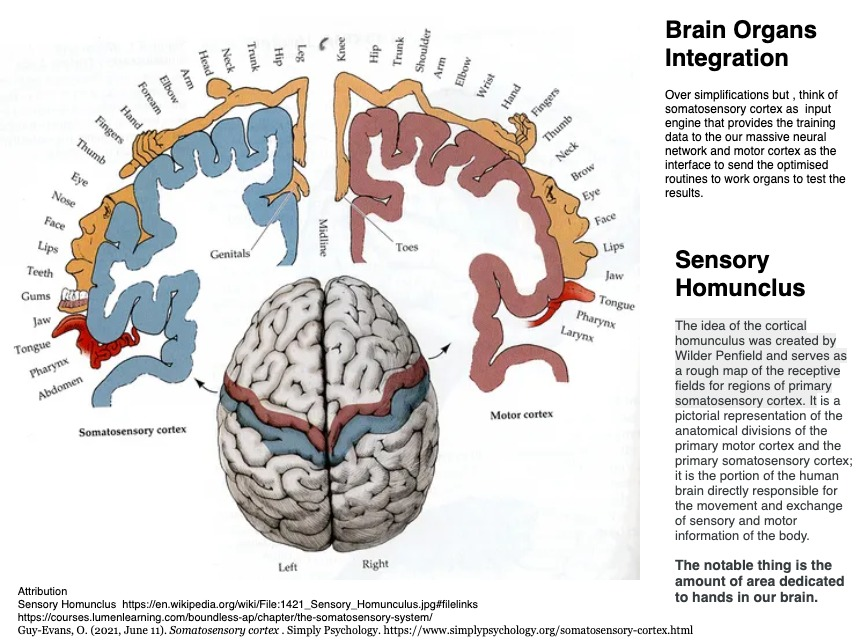

<

<figure>
    <audio
       controls
       src="./2dot1.mp3">
          Your browser does not support the
          <code>audio</code> element.
    </audio>
</figure>
<h1> 2.1</h1>

> We know,  practice makes us perfect. The question is why ? Why is it that we get better  with each iteration? We will primarily address this question and also see how `Karm Yoga` gives a new vantage to actions built through daily reps  - the ritual of actions - Yazna. 

In the last section we expanded the hypothesis that we can decrypt the knowledge by observing the actions . Actions that it guides us into. These are the actions that we  consciously curated such as driving, swimming, cooking , running or any other routine that we do on a daily basis. We also saw that the pre-requisite is to do away the expectations. Which means we need to detach ourselves from the sensory pleasures. This is subtle change - not something that will upside down our lives. The idea is not to despise the senses or the sensory pleasures. Survival is after all important. The idea is to start spending time with actions - may be couple hours daily. Krishna says  ... 

>Yah [one who] Tu [but] Indriyani [the senses] Mansa [ by the mind] Niyamya [as a routine] Arabhte [ndulge in] Arjuna [arjuna];
>
>Karm-Indriyaih [with the active work organs] Karm Yogam [ritual of action] Asaktah [without attachment] Sah [s/he] Vishishyate [excels]
>
> One who initiates actions by regulating the senses with mind, engaged in `Karm Yoga` with active work organs, and detached to the outcomes , that person is special - `vishishyate`, s/he excels. What does regulating the senses with mind mean ? In classical Hathyoga, we have a meta-physical model connecting our spiritual being with the physical body. The  human body is said to have fifty emotions , what we call `vritis` attached to lower five `Chakras` . For example the `vrittis` of hope and compassion are attached to the heart Chakra, what we call `Anahta`. We will dive deep into the chakras and `vrittis` attached to them when we discuss about the senses. For now, suffice to say that Hath Yoga describes five primary senses and five secondary senses. So put together we have ten senses. Thus we can express fifty emotions through ten senses which means a total of five hundred expressions. And each of them can be one that creates bondage or the one that relieves us from the bondage. Thus in all we have a total of thousand expressions that are controlled by our mind chakra;  what we call `Sahsrara`. Thus regulating the senses with mind means, being able to manage our emotional responses and being able to decipher spiritual from physical. Thus Krishna says , one who regulates the senses with the mind and indulges in actions without any expectations of outcomes;  is a special one .. Because once we initiate the actions in such a fashion, practice gets easily accessible. Training becomes a ritual. And as we get better at a specific thing .. but we already knew that .. Practice makes a man perfect.. 

Let us now see why .. 

### The most versatile neural network

Our brain is an amazing learning engine. In `Hath Yoga`, as we said, brain is symbolized by `Sahsrara` Chakra, the top Chakra with a thousand expressions  attached to it, among other things. You can call it a neural network; order of magnitude bigger and sophisticated than any of the AIs we have built to date. For example the GPT3, the biggest of the artificial neural network has some 185 Billion parameters. On the other hand, though not an "apple to apple " comparison, a human brain has roughly 86 Billion neurons. Each of the brain neuron has approximately 7000 synapses. And each synapse is similar to a parameter in the silicon based networks. Which means we have roughly 60 Trillion parameters. Each one of us is carrying a super general purpose AI in our heads that is approximately 300x the largest silicon based  AI built to date. And we have seven billion brains in humans only here on this planet who can learn and collaborate with each other. Add to this trillions of brains of plants and trees and the other species who we haven't yet learnt to communicate with. Imagine the massive neural compute we have at our disposal. In a way we have an intelligence cloud continuously learning, reconfiguring and evolving. 

I am sure the man made neural networks such as GPT3 will grow fast, just like integrated circuits. They might follow the Moore's law.   And one day they might surpass our own brains but the real question is will they ever be as efficient as the ones we have. From efficient I mean the "compute to energy" consumption which basically means cost effectiveness. It might take machines millions of years to reach the efficiency and portability that we already have. They will need to go through the similar , or may be a bit accelerated, evolution cycle  as we already have. And I doubt they will ever be as interoperable as we are because of the biases pre-built into them. Thus as a side note, the AI threats are quite misplaced and that means the possibilities we should focus on are the AI augmenting what we already have. Not that AI is our enemy. 

Not only the brain power, the amazing integration of this compute with our "actions organs" ; for example our hands alone are linked with 200,000 neurons. And each of  the neuron has on average 7000 synapses. That is almost one and a half billion synapses or parameters in our hands alone.  You must have seen the picture of famous [Homunclus Man](https://movementum.co.uk/journal/2020/1/23/homunculus-man )

In essence, we are , not only a vastly superior network, we are also a full package. A complete bundle of hardware and software  for data collection , optimization , as well as testing the results with continuous feedback and improvements. That said, we are fundamentally designed to explore the physical situation we are in. Which means we have two goals - first , extend our longevity through survival or perpetuating our genes and second to explore and truly understand the reality we are in. The second goal is what gives us our eternal quest for the truth, a constant chase to seek the deeper and deeper layers and to finally know who we are.

>`Karm Yoga` is a way to leverage this sophisticated apparatus to its full potential for the second goal. 

### Why skills

If you are going to a potluck party, you do want to carry a home made dish. You pitching in with one dish, gives you access to the entire table. The knowledge verse we live in kinda works on the same pattern. If you bring just one skill to the table, the entire knowledge base is yours to enjoy without any obligation. On the other hand, if you only consume, your own conscious will make you feel bad. It doesn't really matter what you bring as long as you put in effort to cook something. Just one appetizer or an entree. In a way, mastering a skill is the key to all that is there to know. Not only you can share the skill with others and seek information from them. You actually learn all that is there in the process of mastering something. In a way, process of mastering a skill is more important than the skill itself. Thus Krishna says 

> Nityam Yazne Pratishtitam 
>
> Situate yourself into your `Yazna` everyday.

### Training the beast

Now, in modern day science, there are a number of studies done on the sleep cycle. They say we have four stages of sleep and the third of them being what we call REM sleep. This is the cycle,  roughly around two hours that we dream . And one of the theory of the sleep cycle is that at this stage our frontal cortex,  which is kind of the boss of the mind, she goes on vacation. So there is nothing there to take inputs from the senses. So pretty much all our senses as well as our work organs  are paralysed. This is the time when our mind runs through the things that we enacted in  the day and approach them with alternative possibilities. Millions of minor changes to find one that works best. This is the reason when you wake up next day, you are better prepared to take on the tasks. Things appear simpler. Each iteration of `Yazna` and sleep cycle makes us perfect. 

REM sleep is mandatory for our well being. Despite severe competition for survival, evolution has prioritized REM sleep every day. I mean, from survival standpoint, it doesn't appear an intelligent choice to debilitate our bodies even for a moment in  a world full of predators. This shows the importance training our massive neural engine. What appears to be a wrong move is actually an evolutionary advantage. Indulging in actions, is training our mind to unlock the possibilities never known before. In `Hathyoga`, the mind is known as `Sahsrara Chakra`, as we said before. The top most Chakra with 1000s of `vrittis` attached to it. 

>Thus,  in a way,  `karm Yoga` is the `Yoga` of mind.  

That is the reason Krishna said 

>Na [not] Karmnaam [of righteous action] Anarambhan [the ones that are never initiated] Naishkarmyam [a stage where one is beyond actions - such as Krishna] Purushah [a man] Ashnute [one who achived said stage];
>
>Na [nor] Cha [also] Sannyasnat [one who has renounced everything, towards them] eva [] Siddhim [distinguisable success] Sam-adhigacchti [easily goes towards].
>
> A man doesn't get to the status of "beyond actions" `Naishkarmyam` without initiating  the actions. Even the `Sanyasins` - Those who have renounced everything; don't attract any distinguishable success. 
>
> Tasmat Sarv Gatam Bramha , Nityam Yazne Pratisthitam 
>
> Always situate yourself into `Yazna` and create your own "Unique" skill for the all pervading `Bramha` - the entirety. 

### Actions to a unique skill 
Repeated iterations of actions `Yazna` , along with stable `Sahsrara` - the mind Chakra; lead to what we call the "Skills". Skills are thus a marriage of intelligence and knowledge. Intelligence is what leads us to collect the training data in our respective field or role or you may call it the "purpose". We will talk about the word "Purpose" in a bit because there is a bit of confusion around this word. For now,  Knowledge is what our neural engine produces - an optimized efficient way to do the things. This knowledge is something that can't be communicated. Fire can't burn it and air can't dry it because the knowledge itself is not in the realm of the manifested. Everyone has it but it needs to decrypted to enable the skills . Being skillful is a proof that it exists but that doesn't mean we know it inside out. You can feel the presence of this force when you render your skills. But if you continue on this path, with three qualities , Krishna says - `Asakta` , `Muktsanga` , `Samachara` - as a `Karm Yogi` , this knowledge is accessible.  Needless to say, that our machine will produce based on the training data we put in. If we feed it with desires and sensory pleasures, it will create unbreakable bondage. If we feed it with details of actions with three said pre qualifiers, it will fill them up the knowledge. Krishna says ..

> Yajna-arthaat [Done for the sake of Yajna] Karmanah [actions] Anyatra [otherwise] Lokah [world] Ayam [this] Karm-Bandhnah [bondage by work];
>
>Tat [For it] Artham [for the sake] Kaunteya [O son of Kunti] Mukt-sangh [liberated from the curse of association] Samachar [same compassion for everyone].
>
> Actions done  for the sake of `Yazna` - the ritual of actions ; are `Karmas` , rest everything is a bondage to this world. Thus do your actions free from the curse of association and treating everyone with same compassion. 

The skill that we thus create is unique to us. We can publish the action list. But only we know how the thing actually works. Someone performing the same set of actions may or may not get the same skills. This is because actions when communicated in a format that someone could grasp , can not be too detailed or else their senses lose interest. Even great visual communication (think "Game of Thrones":-) can only go to a certain level;  beyond which there is a scope of individual's interpretation. That's the reason we have multiple interpretations for everything. Even Gita has thousands of interpretations including this one. That space , that exists beyond sensory comprehension, is, where the receiving conscious agent is supposed to fill in their own knowledge --> decrypt a piece of their copy of the [protected] knowledge. As they say, "there is always something to be read between the lines".

In essence skill is uniquely yours because the part of knowledge attached to your skill is uniquely yours. No one can take away the swimming you have learnt . There is no way even for you to communicate how "you" swim. Because after a certain degree of detail, it goes beyond sensory comprehension no matter how much you try to spice it up.. In a way, each one of us have a full copy but each one of, as part of this entire system, have a little piece decrypted uniquely with us. We all collectively, along with all the other manifestations , form the system - `Bramha`. In essence, if we identify ourselves as part of this entirety, with our little piece and easy access to the rest, we already know what there is to know. If we continue to think ourselves as unique, we can choose to take trillions of years to decrypt the entire knowledge - one skill at a time. 

> `Karm Yoga` is thus indulging in actions for all pervading `Bramha`. Losing your identity and desires staying satiated in the actions that come to you as your role. 

### There is no Capsule !
You can inspire yourself to get into `Yajna` for a specific skill by someone performing  but you can't learn anything from the communication. Only way you perfect your skill is through  practice. There is no "communication capsule" that can transfer the skills. You can't start singing like Elvis by watching thousand youtubes of him. You will need to practice your self. You will need to fill out the configuration of music with your own voice. Filling your own voice at the right notes is what the "Practice" is for. 

>Lessons are NOT skills. Skill is an after effect of your practice and of course sleep cycles:-)  Good or bad. Skill is effortless orchestration of a set of actions - Violin creating the music in your hands , coordinated motion of entire body  to enable you skate board , dance , music , code - something that you indulge in with your work organs and give your mind a chance to optimize the routine. 

>Inspiration is a "desire" to be something or like someone. `Yajna` is the way to be that thing but it will always be unique to you. 

### Knowing yourself

Skill is your decrypted knowledge . The process of developing skills is essentially knowing yourself. Lets say you have perfected half marathon - it means you know how your heart rate will peak up in the beginning so you need to pace down. You also know, irrespective of competitors, you need to maintain your speed or else your knees would crack at 8th mile. Practice rounds have trained you what to eat, how much and when to sleep night before the big day. More refined the skill, better is your knowledge about yourself. 

> If you make every aspect of your life a "skill", the entire routine, you will know a lot about yourself. Such life style is `Karm Yoga`.

### Manifestation

In a way, skill is an automated module that can be played on a press of button to deliver something. For example - if you are a singer, you can sing on demand in any party , The act of singing on a venue is manifestation of your skill. A carpenter manifests wooden artifacts. A mechanic makes a car. In a way, skills are the know hows to configure the resources in a specific way so that they serve a purpose. 

The universe we observe through our senses is nothing but manifestations. Simple to complex. Automated. Interwoven. But they are all "Information". They can only indulge you or inspire you. System provisions them for you based on what action plan you have in mind. 

> Test - As I said, `Karm Yoga` is a subtle change. We approach the activities or problems, rightly thinking that our mind is our partner in solving them. But we expect our partner - that is our mind to guide us , navigate us to the  most optimum way the very first time and when it fails, we feel as if we are let down, as if  we are good for nothing. May be people laughed at us. On the other hand if we feed our mind with desires, it tries to work out the probabilities of the desired events which normally leads to doubts; what Gita calls `Sanshya` but will get to it later.
> 
> Let us approach one activity in a completely different way. And if you don't want people to laugh at you, feel free to keep it a secret. 
>
> Choose one fairly complex activity - may be a complex dish you wanted to cook. Or a difficult run say 5 K assuming you have never run before. Or a song you thought  you could never sing. Anything. A coding challenge, a writing goal, speaking in a new language ; whatever you feel like fun. Now do this activity for one month just for your mind. Think that you are doing these actions for no apparent "purpose". You are just supplying data to your mind. Devote 30 minutes everyday. And try to see the improvements you make. Key is, don't attach any expectation of outcome. You are NOT trying to become the best chef. Or trying to win a marathon. You are dedicating these 30 minutes just for your mind. There is no weight loss goal. You are betting on wasting these 30 minutes to give your partner a chance. Hopefully, your brain will do you a favor. You will be pleasantly surprised how your work organs improve on the routine. Make sure to not let desires creep in. Even if doesn't work out the way you wanted , you will at least have fun for thirty minutes daily :-) ..Feel free to keep a log. See how the things you need to enable you accomplish this drill automatically show up. Try to measure how the system `Bramha`  is trying to help you out ..

### Purpose

Before we close this section, let us try to demystify the word "purpose". Most commonly we attach purpose to a state. An accomplishment. An outcome. And we continuously seek the outcome. It could non selfish , a moral goal , a higher purpose but nevertheless, it is still a desire. 

Now think of purpose as what actions you are supposed to do. Millions of choices have already been exercised for you to be where you are. In terms of physical and mental capabilities. In terms of your location , access, education. You can't deny that you are where you are because destiny has brought you here. In this state , how you are going to seek the environment to provide data to your mind. What can you train your mind into and help decrypt a piece of knowledge for the all pervading `Bramha`. This little piece is your key to be a part of much bigger system. In essence, you can find purpose wherever you are. 

Now, lot of people say seek and don't settle down till you find your purpose. This is not entirely  wrong. They are probably talking about the quest you must go through before you understand that desires are quite misplaced. And the solution is seeking the pleasure in actions. Such actions can be selfish. And their results are short lived. If you don't want to short sell yourself, the key is to approach actions with three pre qualifiers - `Asakta` detached from the outcomes, `Muktsanga` - free from the curse of association. And `Samachara` - Equanimity , treating everyone with same compassion. Krishna says 

> Niytam [prescribed or pre decided] Kuru [do] Karma [actions in performance of duties] Tvam [you] , Karma [actions] jyayah [better] hi [certainly] Akarmanah [inaction];
>
>Sharira [body] Yatra [journey] Api [even] Cha [also] Te [your] , Na [never] Prasiddhyet [something acceptatble because it is popularly agreed upon by all] Akarmanah [inaction].
>
>Perform your prescribed or pre decided duties for such actions are certainly better than inaction. Even for maintenance of your physical body, "inaction" is not a popular choice 
