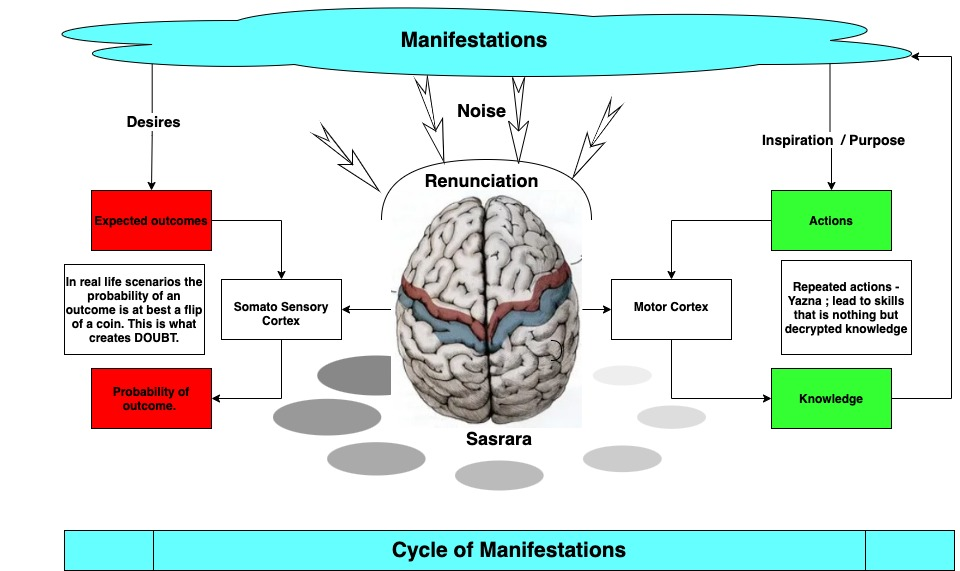

<h1> 2.2</h1>
 

In the last section, we saw that if we feed our mind with desires of a specific outcome (good or bad) ; all our brain does is compute the realistic probability of occurrence. It does suggest a path to accomplish that goal but again you need to practice. The problem, however, is if we are starting with a desire, there is every chance that we might start chasing a new desire the very next day. Thus now we have a new action plan. 

Even if we hold our desires, the environment of our tiny box changes. That means the path to our expected outcome changes. Only thing constant in our tiny box is the change because like all the physical system we too are rotating - may not be physically evident. The new realities often means we need to change the action plans or pivot onto something new. Thus we are constantly changing our actions without giving our brain enough reps to build a skill rooted deep into our physical reality. We crave the possibilities. In essence we are moving from one expectation to another without ever giving ourselves a chance. We are stuck into detours and then more detours with in those detours. In essence we get to a state that we ourselves don't know what exactly we are looking for. 

And every time our brain fails us on first attempts, we feel let down. Another reason to move on to something else. Does it sound like how we live our lives ?

In the last sections we also talked about the idea that the skills lead to manifestation. We understood that our brain - what we know as `Sahsrara Chakra` is a powerful neural network that helps turn repetitive actions into a skill. Skill means you can perform a set of actions effortlessly. You can test this idea in your own lab. Take any activity , say singing  or cooking or running , coding or climbing - anything that you feel like fun; and see how much you improve on 30th day of practice v/s the day you started. Practice makes us perfect. In a way, brain has added a specific knowledge to our actions routine. This knowledge allows us to effortlessly skate board while other people trying to mimic the routine fall on their butts. The problem is we never consistently practice enough to cross a threshold. A threshold beyond which the practice becomes a ritual ; a pleasurable ritual. 

If you feel these ideas are kinda in flux in your mind , you highly request you to check out the previous chapters in a flow - staring from the . As you know , the goal of this part of the book "getting started" is to get a solid grip on the core ideas of Gita. 

Concious removal of desires to engage us in consistent practice - ritual of actions `Yazna` is the fundamental aspect of `Karm Yoga`. Gita adds emphasis on consistency that is a hallmark of stable brain `Sahsra`. Such a consistent person who engages in ritual of actions by regulating the senses and engaging the work organs is called `Sthit Prazna` - One with stable mind. Krishna says 

> Prajhati [ gives up ] Yada [when] Kaman [desires] , Sarvan [all] Parth [ O Arjuna ] Manogatam [one who is beyond fickle mind];
>
> Atmani [ self ] Eva [ certainly / only ] Atmna [ concious of ] Tushta [ satisfied ] Sthit Prazna [ stable mind ] Tat [ s/he ] Uchyate [ is called or known as ]
>
> When a man gives up all the desires of sense gratification and chasing the random goals ; and when his mind thus purified , finds satisfaction in self alone, then s/he is said to be of stable mind. 

Such a skilled person with stable mind manifests. If you are singer , then the manifestation can be a song. For a warrior, the manifestation is victory. For a writer its the words and for poet its the thought. In a way, manifestation is a proof of completion of first two stages - service orientation and skill capture. This is the door to the third stage where you may be called upon by the system for righteous application of your skills. There can be some wait here. But the call comes. It always does!

The question is why should we manifest ? What is the point. The answer is simple. One it obviously completes our Yazna and second , the manifestation we do can inspire someone else to take on their ritual of actions. There is, however a catch, the manifestations can be appeasing to senses and as such cause bondage for other people as well as our own selves. The reason senses attract to the manifestation is they are enticing or else senses don't even look at them ; thus the risk of attachment. That is where the idea of renunciation comes in. 

If you see the graphic below, it is the manifestation cycle but the idea is where the "renunciation" fits in .. 

## Renunciation 

If we see the left side of the graphic above, the manifestations are to engage us. We are tempted to enact them in our lives. We start chasing the expected outcomes. But we fail to put in enough effort for the realization because what youtube recommends you to see is probably a work of lifetime. It will take you as much effort (if not more) to reach similar level of skill. As the expected outcomes get distanced from the actions ; our minds create the doubts because odds for such outcomes are at best a toss of coin. We feel as if our brains are confusing us. At this stage we try to shut down our thinking. We feel as if the most powerful tool that we have in our heads is our enemy. This is evident in our substance abuse. 

The path foreword to get out of such a situation is to cut the noise down. This is what we know as renunciation. Kinda forcefully take our mind off all the cravings we have. Stop using technologies and artifacts that consume us. The goal is to re-set ourselves so we once again have a clear perception  of our physical reality. The goal is NOT to start hating or permanently give up everything. That kind of renunciation doesn't attract any real success. In fact, with this material body, it is not factually possible to renounce everything. Krishna says ..

>Karmemdrayani [Work Organs - Hands, feet] Sanyamya [holding back] Yah [who] Aaste [indulges in] Mansa [mind] Smaran [thinking];
>
>Indriya Arthan [purpose of above work organs] Vumudha [oblivious] Atma [person] Mithya [fasle] Aacharah [conduct] Sa [he] Uchyate [showcases]. 
>
> Holding back your work organs, If one is  mentally stuck into the situation ,  oblivious to the very purpose of our sensory organs,  that person describes himself by a false conduct 

As we successfully gain a good hold of our ground, we need to initiate our journey of `Karma`, that is to re-skill ourselves in terms of of immediate conditions for that is the only path to understand the true physical reality. 

The graphic also explains how we take everything from the manifestation cloud - `Bramha` and again all that we manifest through our skills goes back into the overarching system ; and in the process we decrypt the knowledge and gain peace. Once again a never ending cycle. Such a cycle is called `Kaal chakra` - the cycle of manifestations. 

## The Perpetual Expanse

The obvious question is what is expanse of our manifestations. We can agree that earth is shaped by us. To some extent even the atmosphere of earth is created by all of us , largely by the plants. But what about the stars? The sun - that is the very source of life as we see. What about water and even the land. We sure can't claim to have created all these that we can fathom with our senses and the very basis of our existence. 

Even our own bodies. Should we just black box all these in a single coin called `Evolution` but than the question is who designed evolution? If someone did ? Should we submit to the idea that there are more intelligent beings in existence ? Here is my suggestion - let us look at what Gita says and try to expand the thought . 

One thing is clear, that the things that we manifest - for example cars , smart phones , internet , electricity do enhance our life style but they are not mandatory for our survival  .  For examples fish don't need a sophisticated weather management system or GPS to navigate across the oceans. Even birds fly across the oceans. Gita says that this provision , the core services of our existence is called the basic material nature . And Gita proposes that our universe has eight things that is the basis of this creation. Gita calls it `Ashtadha Mool Prakriti`. Krishna says .. 

> Bhoomih [earth --> solids] Aapah [water--> liquids] Analah [fire --> energy] Vayuh [air- gases] Kham [space --> nothingness] Manah [fickle mind] Buddhih [Intelligence] Eva [certainly] Cha [and] ;
>
> Ahmkara [Ego - identity] Iti [thus] Iyam [all this] Me [my] Bhinna [different] Prakritih [manifest] Ashtadha [eight fold]. 
>
>Solids, Liquids, Gases , Energy and space (nothingness) along with fickle mind , intelligence and ego - all of these are basic manifest of this creation what Krishna calls `Ashtdha Mool Prakriti` - Eight fold basic nature. 

The first five are some time also referred to as `Jada` - lifeless and last three are referred to as `Chetna` - living. The non living - `jada` are also called `Sthoola` means something that our senses could perceive - The solids, the air , the liquids. Last three are called `Sookshma` means they are too fine to be felt by senses - Intelligence, fickle mind and the ego - they can't be perceived by the senses. Senses are designed to take in binary inputs from the `Sthoola`. 

This might sound like a page taken from a totally religious ideology without any scientific basis but if you bear with me for few more minutes, I might be able to convince you otherwise. As I said in the introduction, I want to boil this document to something that appeals to our rationale .. And I hope, in the process, we will demystify many things that are beyond the realm of current scientific quest .. 

### Our Metaverse

To our good fortune, we are recently getting to a stage where practical and mass adopted virtual reality seems like a near term possibility. I mean we started the experiments early 2000s. I still remember my first excursion through "Second life" where IBM ( my then employer ) had built a virtual space. But the tech was still couple decades behind. As expected "Second life" and then a similar initiative Sony play station Home project didn't  get much traction and ended up as an academic exercise but now we are at the cusp of VR / AR revolution. No wonder facebook has renamed itself into "Metaverse". Btw meanwhile VR gaming came of age with immersive three dimensional experience. 

The best way to appreciate the idea of laws of basic nature as described by Gita, is to imagine that we ourselves are building a virtual world. If we were to architect a virtual world say for Oculus Quest, what rules we had choose.  You can call them as the core services of the "Meta verse", that we are building.  Ouite obviously , the first thing we need is the physics engine, so that we could build a non living space like the one we have around us. We need to simulate the rules of physics which basically means we have provisioned the solids, the liquids and the gases. And the gravity. Well , in Facebook Metaverse you can fly so there is no gravity but it is not hard to imagine that we can easily hold your avatar to the ground if we want to . That is not much of a coding challenge  . Lets do it and see how it pans out .. Trust me it will be a fun thought experiment if not of more..

So we figured out that we need the three basic constituents - that is air , liquids and solids - solids are something you can't pass through, liquids are something you can pass through but you will feel the touch and gases , you can of course pass through even without feeling touch. Only way to know the gas is through smell or if a strong wind is blowing it might give a feeling of touch. Absence of all these three we will refer to as space. Just as three primary spatial mediums, we also provision three sensors - that is touch , smell and taste. Touch primarily for the solids , taste for liquids and smell for the gases. And we will talk a lot more about these later in the book. 

Since we have the rules of physics active in this virtual world that we are building means we need to introduce the idea of  energy to allow inhabitants abide by the physical rules .  You can't sell me a refrigerator if there is no electricity. Every time you need mobility in this place, to feel the solids , liquids and gases , to cut through them , to reshape them without somehow bending the laws , you need energy. We can harness energy through say lighting a fire or drinking an energy potion. And of course we electricity as a means to flow the energy.

#### Autonomy ~ free will ..

So we got all the non living things - the five elements what Gita refers to as `Panch Bhoota` ;  that is solids , gases , liquids, space and energy . what about the manifestation of us ? The concious agents. Well we got a sense for each of the elements. Question is how does the concious agent remembers the interactions with these objects and improve on them. That is the reason we need to put in some memory. Obviously we can't put in too much of storage in there because we need the agents to be exploring. Mobility is the key need and so is survival. Why not give a small fast memory or and provision a mechanism to process the data with global compute when agents are inactive - let us call it sleep. So we build a localized brain and a mandatory sleep. All in the metaverse. In a way, the concious agents are free to roam around and explore the virtual reality we created but we get to know all they did when they fall asleep and sync the data up to the cloud. And that is where we can guide the agents as to what next they may do. We want to keep the control to some extent but we do want to give the agents a sense of autonomy. You might think that sleep is just a way to rejuvenate our tired muscles but if we were to waste a third of our life in simply maintaining this body , that is an awful design of a machine. Those who have done an overnighter, they know we roam around like zombies the next day. Totally disconnected from the things around us. No amount of rest can get us the connect that sleep brings .. 

You may say what is the point of building such a virtual world where we have no direct control. We are not with our avatars all the time. Well , we already do such things when we are building  what we call "digital twins" to solve real world problems . And pretty soon they will be common place. For example the digital twin of your car might tell the mechanic as to what could be the probable repair point. Digital twin of busy intersections are already capturing data for the self driving cars. Who knows soon your digital twin might attend work meetings while you are enjoying thanksgiving meal with your family ..or vice versa , depending on what your priorities are :-) Instead of swiping left and right on tinder, you might want to have your your digital twin meet your date first to check the compatibility for a real meeting. Digital twin of south pole might finally set an end to the debate that climate change is real, not a hoax ; or otherwise . Bottom line is we are reaching a stage where real and digital may seem asynchronous but co-exist. This asynchronous design is what allows the illusion of autonomy or free will .. 

#### Time

The fact we have a small but efficient local memory means we need to offload the irrelevant data rather quickly. How do we do that? We need a mechanism to purge that cold useless data from agent memory and retain only hot relevant data. No one wants to keep the memories of your ex alive :-) In fact being able to forget is a necessary aspect of healthy life. So how do we enable the agents to forget. That's where we built the notion of time.  A chronological mechanism to keep track of our rotations. Just like a spinning vinyl. Time only makes sense in the sensory context means if we don't have the senses, there is no meaning of time. Thus time is a derived idea, it is not a fundamental aspect of material nature. It is a mechanism to keep our intelligence fresh. That is the reason we lose sense of time when we are sleeping. You know what I mean if you ever snoozed the alarm a winter morning :-) And eight hours pass in a jiffy. Of course, in modern society, where scheduling and calendaring is an important aspect of life, we have built hundreds of tools around it to keep reminding us that tax date is approaching fast .. 

So in addition to senses the concious agent now has a small local mind to navigate the survival through what we call `Buddhi` - intelligence. This is basically to receive data from the sensors and then we have the access to massive connected compute through a sleep interface what we refer to as `Chitta`. And we have time because we want our local memory to be efficient.  In a way time is a mechanism to purge the unnecessary and retain the relevant. 

#### Fickle Mind - `Mana`. 

Turned out with all the sensors as well intelligence, the agents are still not excited to engage with the virtual world. The metaverse is turning into another "Second Life" ; there is no transformative engagement. So we need to do two things - First to incentivize developers to build more immersive manifestations and second,  we need to create a fickle mind in conscious agents. A faculty of mind that wont let them seek peace; rather make them chase new things , explore new locales, smell new scents, drink new potions , new cocktails- fickle mind. This is what Gita refers to as `Mana`. `Mana` is the seat of curiosity. Intelligence is to `Chitta` - deep mind what curiosity to `Mana` - the fickle mind. Important thing to note is that both `Budhi` - intelligence and `Mana` - curiosity are aspect of our material nature. They are not to be confused with the knowledge. They are ,however, important tools to decrypt the knowledge - `Atma`. 

Let us now look at the last part of eight fold nature. In Sanskrit , the meaning of `Ahm` is "Me" . And `Kri` is the root for doing or creating. Thus the word `Ahmkara` literally means  "creating me". This last core service is what brings life to the metaverse otherwise its just non living and random compute.. 

#### Identity - `Ahmkara`.

Implementation of fickle mind isn't that hard. It is basically to randomize the focus but the question is how do we incentivize the developers build more attractive immersive manifestations. Turns out an amazingly simple idea works like a charm.  A like button - as in "thumbs up" :-) 
You know what I am talking about. And you guessed it right, no one thought about the "unintended consequences". This simple "like" button captured the imagination of entire metaverse because if you don't vote for something with a like, it inherently means a "dislike". This simple like button led to excessive inflation and kinda distorted our immediate reality and morphed into something called "identity". Gita calls it `Ahemkara`.  Identification with friends , family , nation , tribe , race and species. And thousands of other things. The things that we like and the ones we don't. In a way, this is what we perceive as who we are . 

Purists called it a bug but this is what brought life to the metaverse. Others called it expression. Purists call it "ego" others call it freedom. Jury is still out meanwhile the like button is already being liked by three billion agents :-) and there seems no sign of a slow down. 

The growth of identity across entire virtual world creates three more bugs - we already know about desires and Gita's main focus is to get rid of them. The other three are fear, anger and jealousy . We will talk a lot about these three bugs in next section. Suffice to say here that these three collectively give rise to Matrix - what Gita refers to as `Maya`. 

So we have a ready concious agent ; with Senses to observe the elements and other manifestations, Intelligence to gain information, Deep mind to process the information , work organs to interact with the elements and manifest , Curiosity to indulge and an identity that narrows our focus to who we are ? 

#### Intelligent design v/s evolution

Well, you may say this sounds like an intelligent design ; yup we have a super intelligent design, I say this not because Krishna said so . I say this because this is what I see in what we are doing. Given what we did with compute in last thirty odd years , do we have any doubts that we will build not one but thousands of virtual realities. With different set of physical rules. We have transformed machines to intelligent machines and them to virtual intelligent machines - from post office to virtual post box on email server ; from real to online retail . Does anyone has a doubt that we all collectively - and that includes trees in your back yard because they fix our air - they too are partners in this rise or you may say crime :-); that we all are collectively building a metaverse. 

We are collectively evolving into a new virtual world. We are basically recreating  what we are. We are building super conscious agents. We are transforming ourselves into the God. But all this is what we call evolution because we need to iterate endlessly to get to a better design. One that sticks.  We can start with say twenty core services and give similar senses to our agents. It might be a good idea to add electricity and internet as a core sensor in future projects and see where it goes but for now, actually for millions of years the design with these eight core services seems to be flourishing. The iterations are key to getting to this design. The cellular life probably has no identity and a single sense for liquids, we don't know. The point is we are evolving , always evolving , "Second Life" failed but `Grand Theft Auto ` is working. Play station home failed but Horizon home from facebook might work, who knows what is next chapter after self driving cars. I am already investing in eVTols - the air taxies. Arriving at a design that looks intelligent is an evolutionary process. Only the best and fittest survives. 

We may kid ourselves into thinking that our current state of evolution is somehow special. At least assume that we are hitting exponential in terms of evolution. We do have exponential opportunities just like we always did, always had. We are increasing say the carbon content but in terms of change this is nothing compared to when green population inundated this entire plant into a living pool of oxygen. Our silicon based compute is sure a major step forward but we should not forget that our long gone ancestors must have developed a carbon based compute , our own neural network and intelligence. Building our cortex was as much a collective breakthrough as the integrated circuits. Who knows, how many times we have renewed our new virtual world, every time a new layer just like an onion and it never stops. 

If the question is are we in a virtual world? The answer is pretty simple . Aren't we the agents that we only built and are continuously improving ? And aren't  we always split between our real and virtual worlds. Overlapping , superimposing each other?  But even more important and the real question is what ensures perpetuity of this model - this ever evolving metaverse with eight core services ?

#### Perpetuity - Reincarnation

In order to understand the perpetuity we need to see the nature of the system we have. We crave for survival we are actually craving for perpetuating our identities. And we are willing to sacrifice things for the sake of greater survival. For example, god forbids, if we are in a situation to choose between life and a leg , I am sure we will let go the leg. Sad it may sound, but none of the parts are as important as the whole. In fact, if we have a choice to transplant a new organ that is better than what we currently have , we will stand in line to get a new one. 

In a way survival is nothing but holding on to our greater identity. If your identification with a group or a nation is greater than your own body, you will gladly give up your body for the sake of perceived greater good. If I remove my identity from myself , my name, my race, my nation, my address - is it me any more ? Well , my voice , my finger prints, the whole biometrics - DNA is my ID . Should I say , my physical body too , is my ID. I am continuously busy in maintaining , improving , harnessing and evolving these Ids. And that exactly is the meaning of survival. In that sense , exit seems like giving up our IDs. An opposite to what I am doing .. Gita says it is not possible. 

If we built a system that prioritizes survival beyond anything else , how can we exit? The intelligence we built in the system means that it must survive my IDs at any cost in the order of my attachment to them.  No matter whatever be the physical laws. Weather you design a system like Gita suggests - the eight fold nature ; or you have another set of rules - say ten basic elements and ten primary senses ; as long as there is intelligence in the system, it will device a way to survive .. And that is what we are doing and we call it  "reincarnation". As we said before, the model needs to explain the birth and demise .. Let's take a quick look leaving the details to later chapters .. 

In a self perpetuating system like us, that ensures an identity as part of the basic design; by definition identity must be protected because that is what survival means. Losing your identity is the death. As expected, our intelligence finds the way out through reproduction. If we can pass on our identities to our progeny we can entertain the idea of perpetuity of identities. In a way, we need children as bearer of our identities - the nationality, the religion, family name , ownership - we need them so that we could physically exit. 

Intelligence prioritizes this by attaching orgasmic pleasure with it - the act of reproduction. You may say , what if we are able to reach singularity, won't we want to live for ever ? Wouldn't we want to replace every part of the body that is in stress and continue to prolong our stay ? Which means we will need to stop procreation. Which also means any idea of everlasting life also necessarily means the end of sexual pleasure. How can we get the renewing of our entire body ; and even identity while keeping the sexuality intact - that is a major challenge and that is what we Gita solves through reincarnation. Reincarlot better version of singularity.

Gita proposes that we can change this body this body like garments. And we receive new bodies.. Krishna says the golden rule of our metaverse .. 

> Vansansi [garments] Jeernani [dilapidated] Yatha [ just as ] Vihay [ give up ] ; Navanni [new] Grinhati [receives]  Narah [a man] aprani [others]
>
> Tatha [similarly] Sharirani [bodies]  Vihah [giving up]  Jirnani [dilapidated] ; Anyani [other- new] Sanyati [accepts] Navani [new]  Dehi [bodies]. 
>
> As a person puts on new garments, giving up old and dilapidated ones. Similarly we accepts new material bodies , giving up old and useless ones. In a way we let go our old bodies because the old vessel is not able to boil the newer ever evolving realities. 

This aspect of the metaverse is a flawless design. An immense pleasure if associated with reproduction and the very idea that you can pass on all that you have - wealth , name , responsibilities - pretty much all that is identified with you to your offspring. And also at the same time get a fresh set of garments. Kinda win win situation. Fresh name. Fresh locale. Fresh body to start afresh. Only thing that remains intact with you is your copy of inner knowledge. It carries with it all the bondages you made. All the skills you decrypted. In other words you carry your `Karma` . It conveniently forgets  the set of all identities you had because you already passed them on. We get a new body in exactly the same way ; the way we pass on our identities. In a way sexuality is a Yazna to manifest your own avatars into a new world where your physical garments gotten old. Kaam Sutra calls it the most potent `Sakaam Yazna`. We will talk about Sakaam and Nishkaam Yazna down the line. 

Now you may say what if we die without bearing the offspring. Lot of people do that in accidents or otherwise. The scripture says that we can't get a proper exit and thus proper set of new ids if we failed to properly pass on our current Ids but that is something beyond the scope of this book. What really concerns the scope of this title is the question  ; did we really exit ? Even if we let go our identities , we are still carrying on our `Atma` - the inner knowledge than aren't we stuck here ? Aren't we stuck with same laws of physics ? And with the same cycles of happiness and pain. Gita says - yes we are. Then what exactly is the exit. Gita says that exit is in understanding this system. Play it like a game. Which is possible by first knowing our own inner, protected, immutable and encrypted copy of knowledge. And Gita proposes observing the actions driven by our black-box that is `Karm Yoga` as only path to it. 

#### Wheel of Time - `Kaal Chakra`

The cycle of our inner knowledge - `Atma` through infinitely many births is what is known as `Kaal Chakra`. Krishna tells Arjuna , that its not that  I was not there in any times or you were not there or all these enemies that are standing in front of you to fight were not there. Nor will there be a time when any of us doesn't exist.   We all go through this endless cycle of births and deaths. Thus it is not appropriate to lament for the loss of physical bodies . In that sense trying to hold on to the physical bodies is like hoping to never change your clothes; so the idea of singularity is quite misplaced..  Krishna says 

> Na [never]  Tu [but]  Eva [certainly] Ahem [I]  Jatu [at any time]  Na [not]  Asam [exist] Na [nor]  Tvam [you]  Na [nor]  Ime [these]  Jan-Adipah [kings] ;
>
> Na [never] Cha [also]  Eva [certainly- all these] Na [not] Bhavishyamah [shall exist] , Sarve-Vayam [all of us]  Atah-Param [here after] .
>
> Never was there a time when I didn't exist, nor you, nor all these kings; nor in the future any one of us shall cease to be. 

So with this design we have a self sustaining ever lasting meta verse. The eight fold nature - `Ashtadha Mool Prakriti`. I know there are many significant and trivial questions about the implementation of reincarnation . Can we change to another species. Can we know where we are going and what we were. We will address all those as we go along . It is obvious in our nature to be curious about things that we don't know.  Your curiosity has brought  you here.  If you made this far , I can assure you that you already know answers to all -- well most your questions :-) 

In the discussion we talked about the concept of `Sakaam Yazna` . Let us take a quick look  .. 

## Yajna

Before we get into Sakaam Yazna, let us take a look at the Yazna once again. If you want to build anything, you first need to know how to build it. Be it a song, a painting , a car , a rocket ; the process of knowing and building the right configuration that serves the purpose of what we are building, is an iterative process. No matter how much you read about something, you can't get the thing right the very first time. There is number of iterative cycles you need to go through, before you could hit the home run. These iterations are what we call practice. As we saw in the previous chapter, every practice round; every iteration is in a way, a process of decrypting the knowledge. As we also saw, this knowledge is not evident to us but we know it is there. 

`Yajna` is thus the process of decrypting a piece of [protected] knowledge. Converting it into a skill and then manifesting something more inspiring than what you consumed. 

You may say , why do all this. Why should we try to manifest at all , or even better , just not do anything. The simple answer is because it is fun to do things. Sitting idle is neither fun nor easy. Krishna says, there is no way we can sit idle. He says... 

>Na [nor] Hi [certainly] Kashchit [anyone] Kshnam [a moment] Api [too] Jatu [at any time] Tishthati [stays - sit down] Akaram Krit [doing nothing];
>
>Karyate [forced into] Hi [certainly] Avashah [helplessly] Karma [actions] Sarvah [All] Prakriti-Jaih [born of their nature] Gunaih[qualities]

>  no one can sit idle even for a moment, at any point in time. All of us are forced into actions based on the qualities born out of our nature. Our nature as we described in `Ashtadha Mool Prakriti` - the core services of five sensory mediums such as air , water etc and three that are beyond our perception - fickle mind - `Mana` ; Intelligence - `Buddhi` and Identity - `Ahemkara`. 
>

Thus we are anyway forced into actions. If that is the case, why not build something. Thus manifestation is what symbolizes the conclusion of our `Yazna`.  We  get four  things  out of Yajna. 

- A piece of decrypted knowledge that stays only with you. 
- An artifact for sensory consumption. For your  own self or other conscious agents. 
- Peace for you as long as you are consumed in the actions. Even if you didn't want to do it in the beginning , as you indulge in the actions , the peace starts flowing in. You lose sense of time. 
- Help - Your practice pulls you in. As if someone is holding your hand. Giving you the clues. Game has help built into it. As you cross one bridge, your sight automatically clears up for the next. After few rounds, you don't even need to look at the manual anymore. You kinda start knowing what is the next thing. 

### Sakaam Yajna 

You can choose to attach a favorable outcome with your manifestation. Means you can make a wish that the book you wrote, will sell a million copies. It has nothing to do with your book. If there are a million seekers, you will feel happy. If there is no taker, you will curse Amazon:-) Means cycles of pain and happiness. If you look closely , the idea of more copies sold , or more money made or more power is not about the objects that we are desiring or manifesting as an outcome of this ritual of actions ; we are actually enhancing our identity. We want a million clicks on the song we just posted on you tube, for what ? Are we so passionate about the song that we want every one to hear it or we are seeking a new "super youtuber" Identity. If we are truly passionate about the message or the song, we would just put it there without our name attached to it . Wouldn't we ? 

Thus `Sakaam Yazna` - a ritual of actions for a target goal is nothing but adding a new dimension to our identity. As we said earlier, sexuality is the ultimate sacrifice for the sake of identity. We are literally handing over our wealth, our name, even our bodies in the act of reproduction. Thus `Kaam Sutra` calls sexual acts as the most potent of `Sakaam Yazna`. It is through this we pass on all we have. 

Krishna says if you indulge in `Sakaam Yazna` , you will easily get what you want but such gains add to the cycles of happiness and pain. Why so ? ..

If you want your manifestation (say the book we were talking about) to be successful, you will put in more effort in it but you will also carefully withhold something so that it doesn't become a sensory overload. Which means most of your focus shifts to the configuration that is best consumed. And the way you package he content rather than the content itself . Is it going to be a hard cover or audible? Publish on Amazon yourself or run after a publisher ?  What is the best price ? What "information" you put on the cover ? Effectively you are spending more and more time in decorating the information than the knowledge that you are unlocking. More effort you spend on improving the consume-ability , more you are raising your expectations. A million copies , ten million clicks ... Not only you are spending less time on actual content (practice), you are raising your own bar of happiness. Result can be a huge elation or big despair - beyond your control. BTW there is nothing wrong if you are into it to play the game but know that it is a game with random results as soon as the outcome expectations go beyond a certain degree of separation from the work you been doing. 

The bigger the expectations, less likely they are to manifest. Effectively what you learn from such Yajnas is what "Not to do"  or make you action less. Whereas if you went in with a low or no bar, you will always be in for the actions. 

### Nishkaam Yajna 

If you choose to attach no identity with your manifestation - you wont even publish it on Amazon. You wrote the book. You gained the knowledge . You got the writing skills. You manifested the book just  to confirm the skill and complete your `Yajna`. That is it. By the act of writing , you already registered the communication that a book exists in manifestation cloud. Seekers will find it if they need ; they have google :-) . You have no further expectations. Means you are at peace. In a way , you are saying you are not adding anything new to your identity.  In fact you are diluting your identity because the time you spend on Nishkam path is time taken away from desires. 

You don't want to put your identity on the book. However this doesn't mean any less rigor. You still want to write your best because you are anyway be forced to do actions , why not do the best. Turns out such work is the best that mankind has seen to date. Removing your identity, your commercial interests and offering all you got back to `Bramha` is the best way to everlasting peace. 

Now in a metaverse where surviving the identity - `Ahemkara` is paramount and we have three bugs thus created - fear , anger and jealousy ; how do we even initiate `Nishkaam Yazna` ? It simply defies all worldly rationale.  The good news, we all have felt this emotion. If you have ever fallen in love, you know what it means. It is about giving up your own identity for the one you love. Mother gives up all her pleasures and beauty for the children. People give up their wealth and sanity and sometimes even lives in the pursuit of love. In a way, love is the initiation of `Nishkaam Yazna`. In Hindu scriptures this is called `Prema Yoga`. Krishna himself is an embodiment of `Prema`. We will talk about this topic in the next section. 

In addition, most of the chores that we do on daily basis are a type of `Nishkaam Yajna`. You don't publish you mopped the floors or fed the dogs. We may not want to indulge in them but we know doing them always gives us peace. Service is a `Nihkaam Yajna` .  That is the reason Krishna said .. 

> Yah [ one ] Tu [ but ] Atma-ratih [ busy in self ] Eva [ certainly ] Syat [ stays, remains ] Atma-triptah [ satiated  ] Cha [ and ] Manvah [ human ];
>
> Aatmni [ In herself ] Eva [ only ] Santushtah [ satisfied ] Tasya [ for her ] Karyam [ work,, duty ] Na [ does not ] Vidyte [ exists ] .
>
> But one who is busy in herself and stays satiated ; satisfied in herself building the necessary skills, for her there is no feeling of duty . The deliverables and the delivery is automatic. Even building the skills is natural to such a person. 

`Karm Yoga` is the way  to attain this self satiated and satisfied state. 
