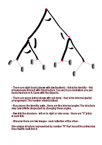

In the dense California redwoods,  a man got caught up in a massive forest fire. Not unusual for the Norcal summer . Luckily he was a climber. He selected a big one and climbed up till he got high enough to breathe, and found a strong branch to sleep on. He tied himself to the branch and slept couple of hours. When he woke up, he felt hungry. There was nothing there up high. Birds had all flown away. He wondered if it was his destiny to die of the hunger rather than being burnt alive in an endless scorch.

Before he got a chance to curse the Gods, he saw a big beehive and also saw the honey dripping off it - the rising smoke must have melted the nectar. The only problem : it was on a soft branch and of course he didn't want to wake up thousands of bees closely guarding their life saving. He figured if he could somehow move below the beehive (and somehow catch the dripping nectar) he could possibly see another sunrise. He carefully did that, though in the process he definitely rubbed few bees on the wrong side, who didn't waste any time in returning the favor.

A wizard angel was flying past in his chariot. His fairer friend who was sitting besides the angel saw the forest fire and asked her wizard to take a swing down - to check if they could help someone. How can we go on with our gifted lives with no attention to those who actually need our skills? - she argued.

Angel smiled for they were expressly forbidden from causing glitches in the world of Mud bloods.  But who may deny the lady of charm her wishful musings. Even `Rama` couldn't convince `Siya` that a golden deer is nothing but a trap. The bridge between the left and right brain is a "protocol" - not "reason", for the very idea of "reason" is to choose one side of the duality.

He took a nose-dive and they both saw this intriguing scene. A strong able man in his mid thirties was hanging off a soft branch that may break any time. And right below him fire was still raging high.  From a distance, they couldn't see that the man was aptly catching the drops of honey falling off the great beehive directly into his open mouth. They also didn't see that some of the bees, seeing someone stealing even though it was a waste, were biting all over him. They were probably enraged by the forest fire that took away their source of collection - the wild flowers; and they wanted someone to pay the price. 

His eyes, ears and lips swollen yet survival was paramount. It appeared from a distance that the man wanted to live no matter what the quality of his life, and the extent of his struggle. We must save this man - said the fairy. At the back of her mind the question that had always irked her - why do humans (like orcs) love their lives of endless misery? I mean I am a fairy and still it seems so boring! - She thought.

The angel still had reservations. He knew the rules. But his lips, culprit of his own desires, didn't abide by the rationale - As you say my lady luck ! - he said -  But we must make it look like a trade deal for we just can´t change the destiny for no good reason. The surveillance has gotten worse these days. They are keeping track of all of us who visit Earth particularly in the flying chariots.

Sure! You do the talking - said the smiling fairy. She was happy that her mate was willing to take on a potential ¨curse for life¨ for her love.

Angel stationed the flying chariot right above the hanging man.  - O man,  I offer you a seat in the chariot for the divine honey you have broken up in this blessed beehive. We both can share this Godly gift and save your life too. He made a ¨proposal¨.

> In Hindi or Sanskrit, a proposal is called a `Prastaav`...

The man probably thought he was hallucinating, or having understood it was divine nectar, he wanted all for himself. He was convinced that the Gods had provisioned this gift solely for him and look what great price he had already paid for this `Amrut`. Is it going to to give me good health or possibly make me immortal? - those questions are for later. For now let me grab all of it. 

No wonder now this angel wants a piece out of my winnings. They always show up at the opportune moments - don´t they? - He thought to himself. Not this time - this time this nectar of immortal life is mine - all of it. 

Out loud he spoke without courtesy or care, without even looking at the chariot or the smiling face of the kind fairy - No - he said -  Go your way angel and enjoy your girl! - Thanks but no thanks for I know your girl desperately wants my honey and its not gonna be cheap!

Angel looked at the fairy and gave the man another chance to think  - fair O'dead man , if you don´t want the deal then know that you will die off the poison of thousand bees, and of course your sugar levels are already high not letting you think straight. You will probably burn in this fire in another hour. Time is of the essence for your survival ! And even if you take the deal it would probably take the divine doc many days to remove all the stings you got from the deathly bees!

O ya! - said the greedy man. More the angel tried to convince, more he got sure that there was something very special in the honey. Tired and irritated for the heat was getting stronger by the minute, the angel flew away !

Whatever happened to the man is another story but surprised at  what unfolded, the fairy asked the angel - how stupid can a man be! Why wouldn't he take your proposal. 

The angel smiled in relief - A proposal is always made by the one who needs something. And accepted (or rejected) by those who have the upper hand. Quite the opposite of ¨charity¨ where the rich offload their excesses ¨as is¨ and poor taketh whatever on offer. 

O' my love - he said - If a proposal comes from the able, the motive is always questioned by the beneficiaries. Only in a rare cases sanity prevails. Such cases are the grace of God! 

Do you know other such cases ? - impressed by the wisdom of angel, she asked - you not only kept my word but also saved yourself from the ultimate curse. Please tell me more. She pressed herself closer to the Angel. Her eyes proud and aroused gazing her love!

The angel thought for a while. He then told her the proposal that `Maharishi Parāśara` made to `Matsyagandha` at the dawn of the new age in an obscure place `Mathura` - on the banks of river `Yamuna` in the northern province of India. An impossibility by any stretch of imagination, yet it worked, and created a race of men that went on to become wizards! Those who have flying chariots. Those who save others from fires and floods. Those who could get as much divine nectar as they wanted from Amazon.com !

---

Back in her tinsel town, the fairy couldn't help share the experience of the forest fire with her friends. And also the insights she got about the "efficacy of a proposal". Most of her friends had their own tales to tell - about the crazy things humans do. They basically downplayed her experience as naive because this was probably the first time she flirted the rules (of the "WizLand").  Some others took a tangent. They insisted she should not have given the option to the man - she knew he was going to burn alive. They probably wanted her down the guilt trap for not being sensitive enough to the fellow beings despite being an activist herself. They unknowingly meant - there is always an excuse for not doing enough! 

> Social conversations mostly route to the bottom where one either meets frustration or mockery. Damned if you did good and more if you did not!

Only one of them pondered about `Matsya` - What happened to the poor girl? Who was her child ? And more importantly - did `Maharishi` ditch her after he got what he wanted - as expected of the powerful of the day - wizards or men.

---

Luckily, that evening, at a social mixer, they got hold of the Angel. The conversation started at a rather skeptic note. How could someone conceive at a sprinkle of water? After all, it was a boat, not a fertility clinic  - they asked the wizard with a cunning smile - as if they knew what actually went down that evening! 

Is there something more to be read between the lines ? - the friend said out loud!

Unaware that the story got leaked into the "social circles", Angel was taken aback. He wanted to cover up. He was apparently concerned if the matter reached the flight controllers, his flights might be revoked for a period if not for good. But few martinis later, he too jumped onto the narrative. And particularly because the focus was not on the man who didn't take his deal. It was on the story of `Matsya and Parāśara`  that was anyway so dear to him.

What exactly is the birth ? - He asked both of them. And waited a bit for their response.

Seeing their faces blank out - Let's go outside for it's too noisy in here. We need a quieter place to talk - he suggested with a smile.

---

As they stepped outside the crowded hall, the light drizzle had just stopped. And a thick rainbow had lit up the evening sky. All three of them, raising their big mugs, took a deep breath of the clean air that was restored with enormous efforts from the angel scientists and equal "hue and cry" of the humane activists. The Angel looked at the rainbow. Marveling at the immensity of the nature; and disclaiming the brevity, he started his monologue ..

There are three basic colors - he said - Red, Blue and Green. They may mix up to make trillions of colors though our eye are limited to around ten million shades. Possibilities are endless but four new colors are rather stable - Orange, Yellow, Indigo and Violet. Together with three basic ones, the seven colors are, as we all know, the colors of a rainbow. They are normally hidden in one "White" but they reveal themselves when elements meet - after the rain when the sun shows up - the suspended droplets (liquid), on tiny dust particles (solids) light up the washed air (gas). As if there is a chorography of all that could be observed. The cosmos shows up it's true nature and beautiful it is! Isn't it? - He paused to check if he made sense, and also to make sure he was not overtly poetical. 

Seeing them both share the pleasant observation, he continued  - they also hold the clues to the very nature of creation - the "birth" as we normally call it.

Each of these seven colors is a statement of separation. For example, an Indigo is a signal that all the other six colors left it alone - a separation occurred yet it survived. What color is that combination of six that we don't see beneath the shining Indigo?  - He waited a bit for the Fairy and her Friend to respond - It must be a color of it's own shade. 

Looking at that shade say "White minus Indigo", we can never tell that it is a shade that conspired against "Indigo" - left the poor "Indigo" alone - he smiled. Let's just call it the "inverse" of Indigo, or "Anti-Indigo" ! The key thing is - looking at something you can never tell that it is an "inverse" of something else - the inverse is just another shade. The truth however is - every observable thing is an inverse of something. It is like a cryptographic public-private key pair - you can never guess one from another. 

Let it sink in for a bit :-) - said he, as he gulped the last ounce from his tumbler - what we observe is the public key but  the private key is always hidden. What appears trivial has certain underlying complexity - a knot!

It was time for the Fairy to reflect - conscious perception is in the separation. A magnet only personifies this idea - we can see the separation of dipoles in a magnet -  though the tenet is applicable to everything we observe or even feel.  Even abstract things like great riches have their inverse in extreme poverty.  Love - hate, care - indifference,  and respect - impudence . Everything manifests in the separation.

Exactly! - said the wizard - Even the "observer" is able to to observe something because there is a separation between the observer and what is being observed. Now here is what they didn't teach in the classrooms - kinda secret that is still kept in the wraps. His voice lowered as if he was sharing a deep insight - In this separation, something potent gets locked in. We can't perceive this "locked-in" knowledge except that it appears Yellow, or Red or Green as the case may be. 

---

He continued after making sure of the heightened curiosity of both his listeners - The thing (knowledge) that is locked-in is complete in itself but in this case the expression is a specific color - Just like in case of a rock the conscious expression is ..well ..that of a rock. In case of a lion, it is a man eating beast; in case of tree it is the fruits and the shade. Our conscious experience may interpret the locked knowledge in infinite different ways because the knowledge is always complete. A full copy is distributed in every animate and inanimate expression - from a super massive black-hole to a puny quark - a distributed ledger of immense proportion if you humor the block-chain technology!

He paused only to restart immediately to drive home the point - The curious question then is what happens when Yellow meets anti-Yellow ? Does it maketh the White or does it make the Black? 

The friend, who had recently learnt  "Abstract Algebra" jumped in now - group operation under addition dictates that a color and it's anti-color put together must give us the "Identity" of the group - a "white" in this case.  Simply because anti-color is "white" minus the color we see. 

You nailed it - said the wizard - In fact, any color mixed with it's anti-color shade should give us the white light. The "White" is thus the identity of the "group" of seven rainbow colors. This identity has it's own inverse - the utter darkness ... but we are digressing. Let's get back to our group of seven colors and their singular identity in "White" - he took a pause to clear his throat - seven colors of the rainbow, along with the identity element "White" are what we say the manifestation engine of "information". 

Identity is again a separation from something. In other words, the white light is born of seven underlying separations - Seven knots in `Vaidik` speak , and it separates itself from the darkness.  No matter how complex a manifestation, it always has it's inverse  - it must separate from something else.  In a three dimensional world the separation is known as a "layer". In other words - white light is a layer that surrounds darkness ! The complexity of seven knots is held within this separation. This complexity , known as knowledge, has an observable expression though the knowledge in itself is complete.

Sure, I give you that - said the friend - energy is trapped in the waves of light and that is what is known as a Photon. As a matter of fact, the separation is lot more ingrained. Every single shade of light is an electro-magnetic wave, and energy shows up as a massless Photon when the wave splits into it's electric and magnetic pulse - that is high school physics! -  she added hastily - But how is this related to the birth of a child? She didn't make any attempt to hide her impatience.

It is - smiled the wizard - you must be patient if you want to understand the ancient `Vaidik Science`. 

Okay - smiled the Friend - I am listening!

---

Imagine the time - thousands of year back - long before  the periodic table - continued the Angel - the broad categories of the matter were - solids, liquids and gases. Every thing that may be observed must be one of these. And the eight colors were considered the means to observe the matter. The matter, be it solid or liquid must have a unique color, air being the transparent white light. So they concluded - All observable things, at max may have eleven transitions - eight colors (the state of information) and three states of matter - solids, liquids and gases. At any given point in time only two were observable - one state of matter and one color. The notion of "work" was to change either of these two - for example if you heat a metal, first it changes the colors and then it becomes liquid.

He paused a little to think the qualifying remarks - even today, with all the science, that basic design of "observability" stands good. Now, in modern science - we we have covered many miles on the observability (of matter) but what about the  "Observer"? What is the dichotomy of an "observer" ? Unfortunately we have never focused much on the "observer".

Well , technically speaking , an "observer" is also matter but we have five senses that are unique to us "observers" - said the Fairy.

You are on the right track - Angel was happy to see his ideas getting registered - but there is little more than mere five senses. First, there is a notion of "space". If senses are incapable of observing the three states of matter and don't see any of the (eight) colors, we say it is dark "space". In addition, an observer has a natural impetus to observe things - we must continuously use our senses to observe - sometimes randomly . This propensity was termed "Fickle Mind" (`Mana`). 

Not only "Fickle Mind" - he added - there is definite mechanism to analyse what we observe. This capacity was termed "Intelligence" (`Buddhi`). So in all, an observer is "matter" that has eight additional assets to process the information - five senses, ability to perceive space, propensity to explore and lastly the capacity to analyse.

It was time for both fairy and her friend to get surprised. No one ever told this perspective to them though it was simple and made sense.

---

The Angel continued - So eight colors and three states of matter - that is eleven basic dualities that we "observe". Now add to this the perceptual facets of the observer - the five Senses (`Indriyas`), Fickle Mind (`Mana`), Intelligence (`Buddhi`) and Space (`Kham`) - these eight are stable knots that make an observer. But there is little more to it ..  an "observer" too has three states ..

> Just like three states of the observable  matter, the observer too has three states - in `Vaidik` speak these states are called `Gunas`. The three `Gunas` are - `Sattva`, `Rajsa` and `Tamsa`. The notion of "Work" (`Karma`), on the observer side, is to transition with in these three `Gunas`.

To put it simply, the three states of matter drive "actions" in the matter - exchange from one state to other - for example solids convert into liquids - liquids into gases. The three `Gunas` do the same in the observer. An observer continuously moves from `Sattva` to `Rajasa` to `Tamsa` or vice-versa or some other order. Unfortunately there is no English word for these `Gunas`. Just think of them as three states of being. 

> Effectively - three states of what is observed and three states of the observer!

Thus eleven physical facets plus eleven perceptual facets create one observer. These twenty two knots combined create an identity. In `Vaidik` system the identity is called `Ahmkara` - a perceptible and conscious shape what we call "I". In `Vaidik Science`, all of these twenty three together, is what we know as the "field" of consciousness.

The more important question, however,  is - what is it that thing that  is held with in these twenty three knots? And the answer is - the way "darkness" is a separation from white light; the "identity" (`Ahmkara`) is separation from "knowledge" (`Atma`). 

Well, I'll need another drink before my mind blows up - said the fairy as she pointed to her empty glass. Three of them walked inside and found  quiet corner with ample food on the table after filling up their fancy tumblers with sacred poisons of their respective choice.

----

But we still didn't get to the "Birth" - said the friend as she pulled out the chair and checked the food. She was on strict diet - eating once a day and it was well past her dinner time!

Okay - let me reveal the big secret - In `Vaidik Science` the human body is the field. It has twenty three oddities as I said. They call it `Kshetra`. As a bio-scientist, I was intrigued by this idea because **we have exactly twenty three pairs of chromosomes!**  Ever-since I learnt it from my mentor, I am trying to link our genetic makeup with this ancient science. No wonder that the ancient hyperbole was ..

> If someone understood this field of consciousness - these twenty three facets, conception may be triggered in any place that could keep the embryo safe for nine months. They say `Maharishi Parāśara` not only figured it out, he passed this science onto `Dwaipayana` (his son) in his mother's womb.

The fairy and her friend looked at him in disbelief. They were not sure if they believed what they heard but the Angel was pretty sure of his theory - he added - such a birth is called a birth through `Yog Maya`. Instead of calling  it a normal birth - a throw of chromosomal dice - they call it a birth targeted for a specific orientation - `Utpatti`. 

`Mahabharata` has many stories of such targeted creations ..

----

The narrative has the power to capture people's imagination. The Fairy and her friend were hooked to the story. They wanted to know how people reacted to see `Matsya` back in the town. Did they recognize her even though her smell was gone? Did she see the same version of reality that she lived in that village couple years back;  or did she see a new version - may be an "anti-version" of her previous world - her "tiny box".

As if the Angel read their minds -  you always see something new when you return to your home town - he said -  that is kinda true for any place where you made some memories, but home is something that flows in your blood. You readily notice the diffs that you had otherwise ignored, for the change is unnoticeable to a boxed observer - like a frog in a boiling pot. A "return" spotlights the change. But that is NOT how you see the anti-Yellow!

The Angel continued talking to a rather surprised Fairy and her friend - to be able to see the inverse of your reality - the other side -  you must change your persona inside-out. No one must recognize you in your own home - he said - No one even looking for your return. And you must be exact opposite of what you were - a beggar if you were a king, rich if you were poor, handsome if you didn't have the looks, a singer if you were a thinker, and fragrant if you smelled like a fish. Such an internal shift ain't easily accessible, that's the reason, we never see the other side [^otherSide]. `Buddha` did it when he returned back to `Kapilvastu`. Despite being on invitation from the king, he went out alone to get food for himself - as a beggar. He wandered alone in darkness the streets and squares that used to be lit up even on expectation of his visit. 

`Buddha` being enlightened knew it doesn't matter if the new vantage is good or bad - the purpose really is to see the "other side". As you become observant of both sides of your tiny box - your reality -  of the color and the anti-color, you have a chance to approach the  "knowledge" held with in - and only a "chance" it is - there is no guarantee that you would spin towards "white" at any moment of the quest. An opposite spin towards "darkness" is as much probable - it is a coin toss unless you have the tools to keep you steadfast on your quest - to find who you are!

The Angel thought for a while, looking at his watch as he didn't expect this conversation to go this long - returning to your home with anonymity, and  with exactly opposite persona is a powerful experience. It is like going to your office after many years of retirement - as "a nobody" where you served as a Deputy or a Boss.  You feel as if the walls and the chairs are mocking you for you never cared to notice them. You thought office was made of the "people" and now realization that the people were the most fungible in that confine -  all your peers are gone long back, and all your subs are probably transferred. Same thing happens when you go back to your school after say twenty years of graduation. 

It proves to you that the "knowledge" held "with-in" is always complete. What changes is how you see it. It appears the way you view it. Beauty, in fact, lies in the eyes of the beholder and so is misery - the Angel thought this was a good point to stop!

Tell us more of her return O, good Angel - insisted the friend fully hyped at the way `Matsya` blossomed as a character - now that you have kindled the interest you can't hold the narrative back. As she said it, the mid night bell rang. The club was about to close. 

May be some other time - said the Angel,  but he quickly changed his mind - On the second thought, how about you see it yourself ?

How ? - asked the Fairy - last I checked we still can't travel back in time - she smiled. 

Yup, we can't travel back in time, but you can see it in your head sets - replied the Angel - How about you come with us - he pointed to the friend - both of you may get into virtual reality at the back seat while I keep my hands on the wheel (and eyes on the road). He didn't miss the opportunity to curse the traffic controllers -  what is the point of self driving chariots if at least one must sit on the steering - he raised his hands in frustration :-)

Yes sure - said the friend - my car can follow yours. There is no need for someone to be on the steering if there is no one in the car - strange rules (of the Wizland) - she laughed -  A chariot may drive itself without living beings but if there is even a dog inside, someone must be on the wheel - They even track the eye balls to make sure the driver is awake!

---

After clearing the bills, the Fairy summoned her old Model X. The friend had the latest iteration - they call it Model ∑ - for it could drive in three modes - on roads, water and air.  The Angel hopped on to the driver seat while the two friends entered the headsets on the back - "Vision Pro 14" the latest combined product from  Apple, Google and Meta. It is the height of centralization but it works :-) , unlike the one from the "decentralized resistance" that has no sense of smell or real touch. 

From the driver seat, the Angel navigated them to a new locale built at the dawn of the civilization. He asked Siri to tune in to the chapter 10 - the "Identity" - the sequence of separation. They could see `Matsya` riding her boat as she waved good bye to `Maharishi`, and her two year old. She had tears in her eyes. And once again, she had no clue what to expect! What is it that she is going to see in her "Knowledge", if she got lucky or would she fail `Maharishi` and her son! She felt pressure of separation building as if it was a test destiny so carefully planned for her. Tears roll up when we don't understand what we are feeling!

`Maharishi's` eyes moistened too. He wished her luck for the reality is fickle. Things may go insanely wrong at the flutter of a butterfly. The business of prediction is risky - he thought - and "Identity" definition is a matter of absolute chance. Despite all the wisdom that he had at his disposal, it had taken him better part of his early life to really figure out what he himself stood for.

In `Sanskrit`, Identity is called `Swaroopa` - the shape of self .. And it is a mirror image of the "Knowledge". It is also the beginning of `Karma` ..

---

It was late morning when Fairy woke up. Angel was still sleeping though he was expected to be at work by noon. She came down to grab a coffee to find her Friend grinding the beans. Waking up to the smell of ground coffee always brought unique pleasure to Fairy.

When did you wake up? - asked Fairy. She had insisted her Friend to stay back last night. It was well past midnight when they reached home and thereafter both of them kept talking about `Matsya`. Angel had almost passed out on the steering wheel, but for  the constant reminders to keep his eyes open - that included mist spray on the face. And as soon as the car announced the arrival, he quietly slipped into his bedroom. The Friend could have gone back to her place. It was only a ten minutes flight for her new flying machine, but flights were on hold from one am to four am - some random offline air traffic update.

Before the friend could respond they heard Angel stepping in  - Good morning everyone - hope you two slept well last night !

Fairy responded "huh" with a smile - I was dreaming about `Matsya`. Send us the link to the next episode. Can't wait to find what was her mission!

If we had the link, we had watched the next episode last night itself - laughed the Friend pouring over black coffee in three mugs - we were anyway chatting about our heroine till 2 am !

Um - we don't have the next episode up yet - said the Angel - and before you figure out next of `Matsya`, you need to check out the story of `Ganga` and `Shantnu`. He waited for a bit looking for a facial response - and I know only outline - half the story - the "Wikipedia" stuff!

That is such a bummer - complained the Friend. There must be a way to get hold of the complete narrative - with story as it happened, and the context. 

To really understand the context, you will need to see my Mentor - Angel said with an apology in his eyes and smile on his lips - he was an encryption expert and now he is trying to create these visuals  - and that too without using any graphics AI!

Wow , can we Zoom in with him ? - asked the Friend - she was genuinely intrigued on Mentor's profile, as much as she was keen on the narrative.

Unfortunately no! - In Summer, he lives off the grid. It is only 20 mins flight though - I can schedule you guys if you wanna go see him at Lake Tahoe - said the Angel and waited for their response.

I wish I could join you guys; but I am gone for a week - he continued - not hiding at all that he hated his work! The worst part - he was not allowed to share his work with his partner - much less with her friends.

How could he tell that he was the lead on "engineered bees" program! They took care to hive them in deep forests where no man had ever gone -  at least in last ten years - zero human footprint, as they say in the IGS [^igs] community, yet the project was turned hush hush. The big idea, with all the internal pomp,  was to resolve the growing demand of honey for humans stopped consuming cane sugars. The new bees did make 5x honey but in third generative cycle they turned 10x poisonous - a consequence that was never considered in the design. The nature demanded - if you have more, you must equip yourself even more to protect . If the woke media got a hint, his career was on the line, but he was more worrisome of the hate he was sure to get from his own circle - The "Fairy", in particular. 

To his good luck, the last episode (with the bees) didn't get much attention even though Fairy, unaware of the situation, posted about it. How could he save the man? The rescue attempt, he was sure, had the Fairy killed at a single sting. She didn't have the patched genes active - a protection against the poison. Even though he knew, a program that killed a single human, was likely to be shut down - pursue only till "one human death" - yet he let a human die just to save the Fairy. 

The lost life was attributed to the forest fire. The identification was impossible for the there was hardly anything left in over-burnt ashes - even the bees had died. The first thing he did after the incident was to remove the spot location from department database. Fortunately there was no entry on the public ledger - he thought - an anomaly but a regular practice in cutting edge biotech. The argument was to save the life altering technology from the bad actors. Somewhat like the conundrum that `Parasara` faced and resolved in favor of freedom. The Angel understood the argument on both the sides but what is the right way? - he still didn't know !

At the end of it, he was happy that he prioritized love over success - and probably that was the good `Karma` that her best Friend too was focused on `Matsya`. The narrative came in handy - he thought - not only at the time of the incident when he could convince the Fairy for an exit, but even her best friend was keen on the story. He wished she never asked questions about the real incident. Lying was not his strong suite! And he did try to rescue the man - at least gave him an offer that the man disrespectfully declined. He wasn't sure if the argument absolved him from the sin but it afforded him comfort to live with himself.

Can we go today ? - his morning train of thoughts was interrupted by Fairy - It's been a while I went to the lake - she said after mulling over her calendar, and also looking at her Friend if she was fine to fly at no notice! And she saw a "yes" in her eyes - I am pretty open today till an evening dinner - the Friend said peeking over her watch and I don't need to file a request if I am flying away from San Francisco. She never missed sharing unnecessary details when it came to the flying cars!

Sure, let me check and I will drop a note from my commute. Do check with him his theory on Prime Numbers. He is a `Guru` on public key cryptography. I too want to understand that piece - Angel was gone with a mug of coffee in his hand and toast in his mouth - busy life of the affluent!

----

The flight to the lake was pleasant. There was still some snow on the peaks but otherwise the green sheet of trees circling white water looked pretty from five thousand feet. They got the first feel of cold air when they stepped out of the chariot. 63 degrees felt like 53. They had landed in front of a small house and they found an old man open the door as they were about to knock. 

He must have seen the notification of an unknown car landing on his porch - they assumed, though the old man had no security cams. Angel had called him on his landline that Fairy had landed on his driveway. Location trackers were a privacy concern but they do have some benefits - he thought .  Angel probably wanted to make sure the Mentor weren't asleep because he loved to have an after meal nap from before the times Angel met him -  almost twenty years back. Some people don't change - he smiled - as he waited for him to pick up the chorded land line - who uses the chord these days of star linked communication! - he wondered not knowing that the resistance had secured a chorded peer to peer network beyond the "watch" of central intelligence in lieu of acceding to unspoken agreement -  "till one human death". The angel was not sure if the Mentor was active member of the "Resistance" but he was aware that he had spread on both sides of the fence. He had friends in the "dark" and the "white" and many times he had brokered high value agreements.

---

Would you like some tea - Mentor asked - pointing them to the chairs in front of his table in rather large study room just by the entrance.

The room had a big table almost eight feet wide -  fully covered with at least two layers of books. There was an old desktop station touching the wall behind his chair. And his chair seemed like a century old. There was smell of old books oozing from the side shelves that went as high as the high ceiling.

The Angel said you two want to create a scene from `Ganga's` story in the new machines - he looked at his old desktop that was probably a 32 bit computer from late nineties incapable of running even the slightest of graphics. The dark terminal was reminiscent of Fortran era.

The friend was surprised. She did have the creative skills but she didn't know she was being recruited. She looked at the Fairy. The look on Fairy's face told her she didn't read the full note from Angel. Apparently, she just noted the location (and time) to pass on the coordinates to the flying machine.

The Fairy looked at her phone again as the Mentor disappeared to a small kitchenette in the living room - to get them the tea. And she handed over the phone to the Friend. The message clearly read that the Mentor was willing to see them if they were okay doing a small animated sequence. To Angel's mind, it was a win win. 

Talk about communication! - the Friend spoke with a whim on her face, as she handed the phone back to the Fairy - Okay but I don't know how long would it take. And I have never done a historical narrative before! 

Yes - they both said as they found the Mentor carrying back a kettle of tea with freshly baked cookies. The aroma of cookies mixed with the smell of old books just felt right for a "yes". And of course the view of the snow covered peaks from the large window at their back - btw Angel said to start from your theory on the Prime Numbers if that is relevant to the narrative .. 

Oh sure - it is actually not a theory - some people try to give undue credit - humility reflected in his voice -  and it is not that hard either - said the mentor as he poured them tea and settled in his old chair, but I do need to know how much you two know about the "Primes" - He was courteous and his intent was to not waste their time in the basics.

The prime numbers, as you know are something that can't be divided by anything other than themselves - and of course by the number "1" - said the Fairy - and that is all I know about them except that they keep on finding new primes almost every day. And btw she read all about asymmetric cryptography while I was looking at the beautiful snow covered peaks - she looked at her friend with a cunning smile!

There are billions of them already known and they say there exist infinite Primes - added the Friend - their biggest use is in crypto - to hide the things or to make them truly public - and I am nowhere close to being even a novice in this area. She knew she was thrown under the bus - first by Angel and now by Fairy but she also knew they both loved her.

Mentor was pleased that he was spared from the definitions - Don't worry. We are not talking crypto here. And that was long time back when I wrote few libraries - he paused to clear up the crypto smoke - So what is "1", is it a Prime ?  He asked to get the conversation started.

Well technically yes - replied the Friend - though it is not counted as one because of some theorem I forgot the name - She was already getting comfortable in this conversation.

You are right. The good reason for "1" not being considered prime is the fundamental theorem of arithmetic, which states that every number can be written as a product of primes in exactly one way. If "1" were prime, we would lose that uniqueness. We could write 2 as 1×2, or 1×1×2, or 1^594827×2. Excluding "1" from the primes smooths that out. If you want to know more I will have you read this [article](https://blogs.scientificamerican.com/roots-of-unity/why-isnt-1-a-prime-number/). May I have your email Ids - He asked turning back to his terminal to send the link to both of them and took a break for dogs' treat-time. 

He had two big white huskies that looked like wolves but behaved like cats. They hadn't even moved from their sofa in the living room since they both arrived - so unlike dogs - the Friend told Fairy. But she was more surprised that people still sent emails from the command line - she always thought terminal was just a nerdy way to install packages!

Walking back in about ten minutes later - The strangest thing about "1" is it looks exactly what we want it to be - for example - "1" book is a book , "1" meter is a meter , "1" home is a home but we can never know what "1" is ! We can never understand the "1" without association to a worldly thing - an "Identity". As for "2", we can at least say it is twice the "1" - " 1 + 1 = 2" - He smiled. 

> Other thing that we all know about "1" - it free from multiplier effect. No matter how many times you multiply "1" with itself, it still remains "1"; but same is not true for addition. "1" gets added to the things and it increases the count. Only "0" is free from material additive property. 
>
> Since "Unity" is free from multiplier effect you can have infinite instances of "1" without altering the universe even a tiny bit. It however dictates one rule - no addition is allowed - a universe with singular operation - of multiplication. It also means if you must have addition then all things made with additions must add together to "zero" - they must cancel each other out to zero because "zero" is free from the additive property.
>
> In a multiplicative universe of "one" infinite instances exist - in an additive world there must be a mirror image - an anti particle to balance it out to just "zero". The multiplicative world is beyond perception simply because it is infinite - the additive world is perceivable only if mirror images are separated or else there is simply "nothing" - a zero sum game!

The mentor got his flow - Now that we are comfortable with the idea of "zero" and "one", let's talk about the primes. The way I like to think about prime numbers is they are the only numbers that exist independently - rest every number is their product. In essence, primes are like scaffoldings that carry "unity" to every other number - including themselves because they are also divisible by "one". 

Both Fairy and the Friend were trying to wrap their minds around what just passed through their ears. They were getting the sense of it - that Mentor was leading them to a better appreciation of "unity" - but how! 

As if Mentor read their expression - Let me explain it with a simple example. Let's take a small composite number - say "8". He thought for a bit - let me draw it for you ... 

He said while looking for a pen and paper - the number "8" has prime factors 2 x 2 x 2. We can display it as say the boats docked on a wharf. 

Mathematically, you may say that the prime factors of eight are only 2 x 2 x 2 - as such it has nothing to do with number five or number seven - but in order for every single boat to be bear an independent identity on this dock, we used all the primes less than 8.  If you consider each prime as a unique prop, the number "8" has all the pre-existing scaffolds - for lack of a better word! - smiled the Mentor.

Very interesting - said the Fairy - I never thought it in this light but it makes sense!

In my field, I had say that it is a multilayered "one way function" - responded the Mentor - if "unity" was a text message , every one of those eight boats encrypt that message in a unique way. In that every leaf on a tree is uniquely identifiable but it hold with in it the same one knowledge.

Wow, that was quite a punch line - thought the Friend but out loud she spoke - But then how this number theory related to the story of `Ganga` and `Shantanu`?

Good that you didn't ask me how to decrypt this natural "trapdoor [^trap] " - for no one knows that - the Mentor smiled -  as for `Ganga`, I think she  understood the significance of Eight. Though she probably didn't think it in terms of numbers. She learnt it through real experience of rivers.  She noticed four rivers tied up eight frozen lakes (glaciers) - he paused for a second - it will be easy if you see this map. He removed many layers of books from the table to spread a big old map of `Gangotri region` - the birth place of Ganges.

In a way, the identity of Ganges was the entire glacial region that she could access as eight frozen water falls (glaciers) and the purpose of Ganges - she thought -  was to unite the knowledge of their existence into one. Ganges brought mountains (her home) to the plains through a primal scheme and to `Ganga` that schema was auspicious. Later, modern geologists marvel at this scheme in the sense such a vast glacier system ultimately manifests into just "one" perennial mega-river. Just like the locals, they too see the magic of God's gift. 

Keep in mind the glacier is retreating almost two miles per century. I spent quite some time in this place - the locals told me every few years a new stream is formed and others vanish because of glacial motion. That is the reason you see many more tributaries now spread around the main rivers in 100 to 150 miles range.

The lunch was a light chit chat. During the discussion, he fired a print command - old dot matrix printer sitting by the desktop started whirring. He grabbed two copies of printed pages. Handing over one to each, he  said - here, I wrote down the story of `Ganga and Shantanu` thinking you will need some sort of document to build your scenes. 

They both quickly glanced at the sheets, chewing their Pizzas. 

You can read it on your flight back. For now I suggest you two go around the lake for this beautiful day is not to be wasted listening to an old-man. I have given quite a bit of geography to let you better visualize the locale.  Rest is your creativity - he smiled.

----

A week flew by and the Friend didn't get  any "creative inspiration". She did research on Prime Numbers aka watched many Youtube videos. And then Youtube started feeding her with more and more on Prime numbers. How can the AI algos be so dumb - she thought - not even basic decency to hide the raw intent - desire to get a click ! A pressure was building in her to get going with the scene but something was amiss that she couldn't verbalize to herself. It became clear when she saw her boyfriend. 

Whats up ? - he asked - you seem to be lost - said the Boyfriend - they were early to their regular club. Their usual weekend watering hole with Fairy and Angel.

Well ! - I signed up for doing this small historical narrative but somehow, I am not getting the hook. Where should I start. And she passed on the printed story to the Boyfriend. 

Wow - you have a print out - must be very important - he said!

It's not an ordinary printout. It is done on a dot matrix printer - she laughed.

Seems like someone trying to glorify a river - he said after a quick read in couple of minutes - not bad though - you can get some good visuals of the rapids and the mountains on "Unity" stock library. In fact, you can simply text prompt "Unreal AI" to render this scene for you in immersive video  - said the Boyfriend - this looks pretty straightforward.

That is least of my problems. I can figure out the tool set - she looked at the Boyfriend as if he was preaching to the choir - the reason we went to see this guy - all the way to Lake Tahoe - was to understand what happened to `Matsya` and he gave us a download on `Ganga` - a completely different character.

Suddenly she realized what was missing! There was no connection! She was not emotionally invested in `Shantanu` or `Ganga` as she was in `Matsya`.

Who is `Matsya` anyways - the Boyfriend played along - wait, you went to Tahoe to get this scene? Is it a big client!

Umm - No ! That is a long story - are you on Fairy's social relay? 

Yes, I am but lately I didn't check up - been busy for the rules are changing. Whales are trying to force us out of the work - he tried to share his boring life but she didn't appear interested. Creatives don't get the tech - a fleeting thought he didn't feel necessary to verbalize though he had this thing with the studios - mostly his clients - what exactly these people do! I mean anyone could have AI render a 3D immersive video with realistic audio. What value these so called "creatives" bring to the table? Yet, the world seems to be obsessed with designers of spaces and sequences and what not in the unreal world. He still had some respect for the original writers, particularly those with the writers' guild who pledged never to use AI prompts to write long texts. They were the ones - he thought - still had a chance at saving human ingenuity - all other art forms were almost dead. But what could anyone do? - he wondered - for virtual worlds were the primary stage of communication these days. Long gone were the days when people went to a live concert or a circus as he used to go with his parents. Things changed so fast. Kids these days may never get a chance to know what real fun was!

She picked up his phone - showed it to his face to unlock; and opened the post - read this while I get you a drink. Yes he still used cell phones (like many in his generation) for most of the younger ones were opting for implants these days. Even parents were keen to request implants for the newborns - parenting was so much easier with implanted infants. They started talking as early as six months - walking by eight. And experiments showed that early implanted kids would be exponentially better adapt at letting their brains be used by AI during sleep - the best way to get nine hours of refreshing vivid dreams while implants used real neural networks to solve the real world problems -  the modern way to contribute and get paid as well!

Holy crap - I heard a man was burnt alive in the forest fire but I didn't know Fairy had tried to rescue him - he said as the Friend got back holding two IPAs back to the table - their usual ones.

Oh - that is not the point. We were talking about the story in the post - `Parāśara` and `Matsya`. She was about to dig a little deeper when she felt a pat on her shoulder. She saw Fairy as she turned around - think of the devil - she smiled at her - where is your Mister Angel!

He should be here any minute. He said he would fly in direct from work - said Fairy - remember he was gone for a week - Did you guys order some food - I got to eat just one wild berry all day long ! I am more hungry than `Matsya` was - she smiled ! The reference made "Boyfriend" cringe if he was missing something really important.

They were in the middle of ordering food when Angel joined in - 16 oz of hazy IPA for me. I had a big lunch late in the afternoon - he looked at everyone. 

How was your meet up with Mentor? - he asked sitting down - no greetings. Angel was always quick to the business particularly with those he knew.

First of all I was not told that I was signing up for a job - she gave Fairy a "look" while responding to Angel - and second, the Mentor gave us something that we were not even looking for. I feel like you were gaming us!

Oh ya - added Fairy - I was like what happened to `Matsya`! And why is it so important to dig deep into `Shantanu`. Seemed totally unconnected to be fair!

The Boyfriend passed on the printed sheet to the Angel - can someone bring me to speed whats going on! - His voice lost in the growing chatter with in the joint.

Let me call him on his landline right away - said the mentor as he finished reading the sheet - he wanted to make sure the Fairy and her Friend were fully plugged into the story (instead of the actual incident). Unlike the "Boyfriend" he read it couple of times as if he was trying to find some connections to defend his position. But none.

Couple minutes into the call - even before he laid out the concern to the Mentor - he looked at the Friend - after putting his phone on mute - he is saying he emailed the next part to you the very next day. He couldn't finish the entire piece before you reached there, so he wrote it up after you left and emailed the same night or probably the next day. Did you get it ? And he is asking if he could see it sometime next week - may be a draft version.

Now it was the turn for the Friend for look down. Fairy didn't lose the chance to reciprocate with a "LOOK" - Talk about communication ! - Fairy said with a whimsical face; raising both her hands.

Who checks emails these days! - The Friend was furious as she looked through her personal inbox. It was there - unopened and unread! She giggled at herself - at least he should have sent it to all so that we could remind each other if one missed. 

The first thing she did was to forward the email to all without even opening the attachment.  Everyone on the table - including her Boyfriend - he too was part of the project now. She looked at him with a smile - you are also recruited now :-)

Her Boyfriend ran a small payments firm that helped independent creatives (like her) process micro payment for their creative work. Despite public payment rails in virtual worlds, whales were charging a hefty fee - even on the tips. He helped small shops set up their own payment nodes and relays to save a better part of their earnings. He was delighted when he read the second part. He couldn't believe that `Shantanu` was in the roots of his business - Payments or Currency. He was the first who used "King's stamp" to turn a wooden block into an "IOU". They called it `Mudra` - the stamp.

> The literal meaning of the Sanskrit word `Mudra` is the stamp. But since the earlier currencies were nothing but king's stamp on piece of wood or leather, the currency itself was called `Mudra`.

----

There were two popular threads that she could easily latch on to start the scene - that of `Ganga` verses `Yamuna`, and that of the prime numbers. There were two other anchor themes that she could use to place the narrative at a socio-moral pulpit - the idea of public good by an ancient king, and more specifically the innovation of currency. But she was keen on something else -  that everyone gets a chance to see their reality from two opposite angles and the contrast that `Matsya` and `Shantanu` had in their lives made them compliment each other. But how do you show such a thing. Visual canvass is very limited - she thought - text could do lot more than the graphics; or was she hitting her own creative limits.

What would you do? - she asked the Boyfriend.

I think we need to listen to the entire narrative before we get down to cut a visual presentation - said the Boyfriend - a standard shpeel most graphics people like to give.

But I need to show him something - I kinda signed up for getting him at least a draft - and may be it is a test - she said - something in me feels this story is important - it needs to be told.

Let's just create one scene - of the boat ride - the peacocks getting pulled to the songs, the fragrance attracting the deers - it's a perfect scene for integrating [olorama](https://www.olorama.com/creative-smells) digital scent in VR - he said.

And top it up with `Shantanu` dropping all his gold coins.  That would be a good place for you to ask for the tips as well - showing the viewers the "tips bucket" tied to the mast - money dropped in the bucket would directly go to your wallet - he smiled - let them pay something for supporting the artist. 

The Friend laughed out loud with her happy jingle - you are a `pucca` payments man! All you care is getting as many zaps as you can :-)

Well - he raised his hands - artists too need to feed their pets! In fact one thing that came out quite loud of the story was - from the oldest times, the creative arts are living on tips (not on donations - there is a difference) - `Matsya` offered a boat ride but the real thing she showcased were her songs and fragrance. Isn't it? - and what commuters paid were "tips" - a tip is what you pay for a "service" - a donation is what you pay for a "cause". I love tips and I hate donations for I want to render services, not change the world!

That would be a myopic view of a mega narrative - it is not for tips - it is to change the world - she said - but it is not a bad idea - she smiled - artists do need to feed their pets!

Well you need to start somewhere - `Mathura` wasn't built in a day! - he smiled - at this stage your goal is to give an opening scene such that it wows your cheque holders and creative writers. They should not hold anything back. Think of it as a promo clip ..

That is a good point - said the friend - time to smell the coffee ... and get to work - she smiled - when it came to capturing ideas, Boyfriend was her Steelman whereas Fairy was her Strawgirl. They three were a team.

---

The Mentor welcomed them on the Friday evening. Fairy had flown in with Angel. And Friend with her Boyfriend -  they arrived a bit early.

Friend did the intros - he is my boyfriend and partner - well payments partner - she smiled.

I see - smiled the Mentor - are you a Bitcoiner or you have your own token!

The Boyfriend smiled shaking his hand - I am more like a "Lightning" plumber and I got really interested when I noticed `Dev` was the first to introduce the wooden currency. It made perfect sense with Ganges water being proof of work .. but! - he stopped - probably thought the introduction is not the time to ask loaded questions.

But ? - insisted the Mentor - he was still smiling as if he expected this question!

I wanted to check if there was a credible reference for such a claim! That would be a pretty big deal! - said the Boyfriend - he didn't want to meddle with a client directly but he was put on spot by his own curiosity.

The Mentor smiled back at him - I would first find out who `Satoshi` was !  Last I heard his Bitcoin paper was sent to us mortals from the future! - he continued smiling - or certain things are best left to the realm of unknown for they serve a greater purpose shrouded in the "mystery"!

The Boyfriend was about to speak when they heard Angel and Fairy stepping in  - wow the door was open. Aren't there bear threats in this part of the woods?  - said Fairy while Angel hugged the Mentor. He wasn't surprised to see Boyfriend there - it was as per the plan - Sorry for being little late - he said.

Is the watch party ready? - Asked the Friend - I brought few extra headsets just in case anyone needs - she was sure Mentor didn't have one! - she attached fresh Olorama singleUse cartridges to the headsets - I give you the custom designed fragrance of `Satyawati`..

The Mentor smiled - thanks I would sure need one but before that I need a beer - who else ? - He looked at everyone's "yes" as he walked to the refrigerator in the kitchenette. 

----

The scene was beyond anyone's expectations. The realism, the attention to details. A collective experience - you could walk on the boat, touch the feel the waves and even touch the water - as if everyone was teleported to five thousand BC.

Looks like you have spent all your creative juices in one shot - said the Fairy as she took off her headset after multiple replays of hardly three minutes experience! 

Now I know why Angel said you are the best - said the Mentor as he struggled to get his beer bottle to his mouth -  still wearing the headset!

The Friend was about to respond when she got a notification on her phone - what ! - she exclaimed - some one zapped a million to my wallet - And then she looked at the Mentor because the transfer was made inside scene.

I can't accept a million Sats for a three minute clip - she said - we integrated my wallet, just to test it out - she looked at the Boyfriend who enabled this feature while she was busy building the scene. Then she turned to the Mentor - I do a full feature for a tenth of this money!

The Mentor smiled at her - No one stopped you from doing this full narrative and trust me it is ten times of any work you did before! - I already have the next piece ready for you - he continued - and I want to keep the "Payments man" happy. He looked at the Boyfriend who couldn't believe his "alpha" code worked - the presentation was perfect. I saw commuters throwing coins. My curious eyes looked at the bucket. As soon as I focused on the bucket, it automatically scanned my iris - boom the transfer happened at a blink of an eye - now I know what they mean by frictionless payments!

Boyfriend smiled - I am sure you saw the options - blink left eye 1000 Sats, right eye 10 K and both together a million. Frankly I myself didn't test both eyes!

Yes I did see the option - replied the Mentor - it was lot easier to blink both eyes - he laughed at the design pattern - the easier choices invariably take you down the rabbit hole where you not only lose your mind but money too - no wonder people bet all their AI grants back into immersive games!

He is a Scamster - Friend looked at her payments man - appreciative and affectionate - he knows how to squeeze money of the innocent eyes!

Angel was happy for everyone was plugged into the story! 

And Fairy was keen on reading the next piece. She wore the headset again - reading on a 130 inch screen made her lose herself in the text while everyone moved to the kitchenette to grab a bite and another drink. Both the dogs came in study and grabbed the empty chairs on both her sides.

---

The flight back home was quiet. The Friend felt she was finally discovered - by the bigger league. The Mentor was definitely more than his humble looks. She recalled `Maharishi` paid `Matsya` a silver coin for a boat ride. Was there a connection - she wondered!

Just like `Matsya`, she felt rich. At least in that moment when Mentor said he would email her a 100 week contract with  100 similar payments - that was one full bitcoin. A million Sats a week for the next two years! Other projects were barely ran a month. They paid her bills but she had to keep an eye on her balances, for the work demanded being in an expensive city. And a flying car was the only way to commute in over crowded San Francisco. If you dared to walk, you were sure to step over a homeless. Despite all the free AI grants - sometimes to scan their irises and other times to recognize scents - the homelessness was still rampant. No one could figure out a solution - so much so that they started saying "the spirit of the city" was in the litter on it's streets. There was one more reason she leased the expensive chariot. She had signed up for a new air fleet service that allowed her to park free at the airport. The car pretty much paid for itself picking up commuters from the airport and across the bay. Her flying car was factually lot better than the dilapidated  boat of `Matsya`, but in a way, it was comparable if you discounted the time and place!

On the other hand, being a back-end guy, the Boyfriend could stay in the suburbs. And walk his two dogs in an oversized Californian ranch. She flew in whenever she wanted a home cooked meal with thoughtfully paired wine. He charged  tenth of a percent for the payments - ten basis points as they talk in money lingo. Not a bad evening for him either - it was the biggest single transaction of his life to date.

Boyfriend loved his work. More than money, he was passionate about the technology of money - almost a borderline geek. He mixed well with Angel and Fairy and that was important to the Friend - this was the only group where she could be herself. And she liked that he made conscious effort to bring in good vibes - donated nice tips to Fairy's random causes - never missed a single birthday or an anniversary weekend - and his home baked banana breads were always his personal "signature" gifts :-).

Things were great in this small inner circle except for one small issue - he wasn't bought into Fairy's ideas of activism and governance. He was fine with fair credit [^fairCredit] to humans. But they were at odds on "regulation". He was vocal for small government and least regulation that Fairy always contested with a credible question - if no regulation than why have governments in the first place? She challenged his "trust" in the elected - if you vote for them then you must believe in the collective wisdom - otherwise what is the point of elections? If you feel government is bad than fix it or galvanize a better way. You don't get to blame governance unless you participate - she used to say!

Climate change was another beef. She was not cosy to burning 90 % of compute (and thus almost half the energy) on data layers. To what avail? - she argued - to keep a track of nickles and dimes! She attributed those forest fires to the increasing global temperature - particularly after visiting one herself that she insisted - she wanted to have a first hand exposure. Boyfriend, on the other side, believed the climate threat was a hoax [^hoax]. 

He made sure he never broached these topic in Friday meet ups but off late, Fairy was getting more critical. She didn't miss a single chance to somehow bring up the discussion. That left little wiggle room in the inner circle - the external media was anyway awash in sensationalising the climate crisis. The media cared less if the compute was invested on AI or on open infrastructure - all they cared were the clicks. However, the general vibe was to consume less among Angels whereas humans wanted more and more of the free stuff.

It sure wasn't for the lack of trying - to put the nuances in layman terms; but Fairy always turned a poker face - how much money do we need? Does any other species care for money? Would your dogs love you more if you had more money and less time for them ?

You can't engage the ones who had already made up their minds - he surmised. And he thought she was averse because she was never exposed to scarcity - thanks to her ultra rich heritage. To her credit, she never asked anything from her parents but everyone knew she had at one key of the multiSig trust - that held hundreds (if not thousands) of coins - of her grand paternal property. Even if she didn't spend, the stash was as an assurance - it opened doors for her. But friends are not supposed to say such things - he lamented to himself - if rich say money is NOT important it feels like a slap to the face of poor - isn't it ? But worst part was her abhorrence made her ignore the beauty of underlying technology - and the problems that it solved.

For example she laughed off to the fact that Bitcoin was never competing with any sovereign currency. It was simply a data layer below the currencies - to record a "proof" - and issue a token in recognition of that computational work. Just like a wooden token was given to someone carrying Ganges water to a village ten miles off the bank - a "proof of work". Because a currency must be accounted to the amount of work it's one unit could get done. 

The traditional way to assign a value to this work was to store a precious metal and issue a paper token. Starting with `Dev's` wooden token all currencies were backed by precious metals. Even the US dollar was substantiated with most precious metal of all times - the silvery white slightly radio active enriched Uranium! - he argued - would you care for the greenback if there wasn't a military industrial complex to back it up? The problem with this method, however, was the amount of work per token (and hence the inerrant value) was fixed. This interalia meant that the prices of commodities would fluctuate based on demand. To circumvent this problem, sovereigns had to deploy monetary and fiscal policies which rarely worked as intended. And businesses had to hedge the futures with contracts at an ever increasing premium. More certainty you seek more inflation you add to the system. 

Bitcoin solved this problem - Inflation (or deflation) was shifted to the token - in essence wheat would always cost the same - if there was more demand (of commodities) the value of token would increase and if there was less the value of token would reduce. This was because the bitcoin allowed to change the service fee per transaction - more demand meant more transactions and hence higher service fee. Higher service fee meant the token gained more value and hence attracted more compute. If miners deployed too much compute the protocol could throttle the complexity of the mathematical problems that compute must resolve as a proof of work. Which also meant you could fix the total number of the tokens in circulation for ever. No more fiscal or monetary policy. No more inflation or deflation because once the prices of the commodities got stable, every thing else became stable - if the price of wheat is stable how much that of a loaf of bread would change? Just minor changes on account of local shocks to the supply chain - say an earthquake or a forest fire that could be easily resolved by extensive help of AI forecasts. Given most of the labourers were anyway robots - the labor and financial arbitrage became a thing of past. Certainty meant no more futures' contracts!

> And in doing so, the "computational power" became the "backfill commodity". Turned out, it was a blessing in disguise to combat blatant growth of AI.

Quite the opposite, Fairy thought he had a wild imagination and may be a bad influence because governments couldn't print money to help the poor - how much revenue a government could generate with voluntary tax system ! If they enforced higher rates, moving to a lower tax jurisdiction was easy. Though it seemed to her the last narrative changed her own position - ever so slightly. She felt more accepting after reading how `Shantanu` and `Dev` started the wooden currency backfilling the precious metals. And they put in a unique accounting method that was built on good `Karma` rather than amassing weapons of destruction - carrying fresh Ganges water to the doorsteps served both as a public service as well as a public ledger. Governments could still do the same if only they cared to innovate. The narrative has the power to capture people's imagination - she smiled to herself!

And the boyfriend did sense this subtle change. We have an uncanny ability to understand unsaid things.  Jokingly, he left a teaser note in Fairy's inbox as he boarded Friend's flying car - I hope you agree currencies only need to provide liquidity among different players before they settle on to an underlying data layer. "Lightening" is a liquidity mechanism to the first native bitcoin currency - a `Satoshi` - before it settles on a transparent public ledger. No one ever stopped any sovereign to provide similar efficient liquidity - in fact most of them tried CBDCs for surveillance - why did they not do so with complete anonymity and public good in mind? They couldn't compete because "Sats" were not only fast, easy and lowest fees - they were also completely private - just like `Dev's` currency - he wrote - I guess no "KYC" was asked before you get a wooden seal for water -:)

Why do you always tease her - she laughed as he showed the note to Friend -  you should appreciate that a common consumer (such as Fairy), may not be interested in payment layers and the geekery that goes with it! 

I give you that - said the Boyfriend - but what about Nostr! It is the backbone of social media. Fairy herself uses it on daily basis - she has her own relay!

I get that Nostr is a general purpose data layer - she said -  for all sorts of applications. But it is hard for people who used legacy application. They easily see separation between an operating system and an application - OS you have on your device to wake it up and an app is what you install on it.  It was easy to comprehend -  data was always intuitively considered part of the application back then. But they can't perceive data as a separate entity in itself unless someone really show them the benefits. May be data is the "knowledge" that gets locked with in the separation of OS and the application - an invisible truth - she smiled as if the wisdom just landed in her! 

And Boyfriend was amazed at her insight - wait a minute - it is a powerful idea ...

> Bitcoin, Lightning and Nostr standardised the data rules and turned them into a "protocol" [^protocol]. With these underlying protocols, Angels [^wizards] democratized the data [^data]. 

---

As a biotech scientist, Angel had little to do with the payment systems. His training was to make sure artificial intelligence was judiciously used in bio research for the obvious risks - to say the least.  To him standardised data layer(s) meant a friction to a biotech world fast getting overtaken by AI. There was hardly any bio application that didn't use AI in some shape or form - some of them downright scary. Just regulatory controls were not sufficient to restrict AI usage in bio hacking. The system must provide better avenues for the investments. Bitcoin offered that alternative. 

He understood for an investor, greater return on their investments was paramount - you can't blame them for doing their jobs effectively. They invest in AI if only it brought better ROI than simply buying bitcoin. Which meant a higher bar for applications.  Only few bio projects were financially viable. In essence tracking was easy. He was now convinced that the fire incident was off the radar. But now his worry shifted to this new project that was taking shape. His next endeavor was looking good but it was even darker. He was asked to join the "Sleep Project" as an expert on "unintended consequences". 

Sleep interface was gaining mainstream acceptance to let human brains be used by compute intensive AI application - such as "personalized" gene therapies - an acceptable name for defying death. It was an attempt to leverage human neural networks - dubbed as "green compute" to lower AI's dependence on Silicon based traditional resources - where AI must compete with the open data layers for exaflops. Since the new usage patterns were far more demanding, they wanted to take advantage of the naturally existing neural networks - order of magnitude bigger than the silicon ones - the human minds. 

Angel was asked to look at the unintended consequences - thanks to his experience with the honey project. He was among the first to identify the loophole in bio designs - and got his voice heard - thanks to association with the Mentor. A part of him felt this new project might risk his relationship with Fairy, but he couldn't say a "no" for Mentor himself proposed him for the job. That - he thought - was the downside of being closer to the powerful - you must adjust your priorities! To his reprieve, he was not the evil architect to capture human brains - he was actually a watch dog. At the end - he liked that now his close group was plugged in - at least Fairy won't complaint if he worked eighty hours weeks - he could always say he was working at Mentor's recommendation. Secrecy was his only problem for all such programs came with a hardened NDA. But he could always count on Mentor to truthfully explain his role in case the media got hint of the designs being hatched. And this time he was determined to play hardball with the power brokers. He looked at Fairy sitting right by him lost in the next chapter that Mentor gave them - again a hard copy printed on a dot matrix Epson - so close yet so unaware of his work - he thought ..

Fairy was busy reading the next post. She was keen on what went down between `Shantanu` and `Matsya` on his return to the boat. She was least concerned of the future or even tomorrow. She simply lived in the moment. She said what she truly felt like and replied a smily to Boyfriend's note - a sign that she was not indulging in discussions - she recognized there were things she couldn't control or may be not even understand. In this moment she wanted to live those human emotions that raved through `Matsya` - so difficult to relate to in her time and her race. 

Off late a new desire was taking shape in her mind that she was unable to place to herself - she wanted to be a mother! She pushed the thought aside thinking may be she was feeling too much for `Matsya`.

> The night had many things going in parallel. New ideas, new convictions, new connections being formed - as if something was getting reorganized - yet it was humble and subtle. It was somewhat like that night on the banks of `Yamuna` when `Shantanu` made a connection with `Satyawati` but in that subtle connection he joined the vast network of `Mathura`. The undercurrent of `Mathura` saw `Dwaipayana` craving for her mother and a mother so devoted to a cause that she couldn't claim her own child - holding her hand.

