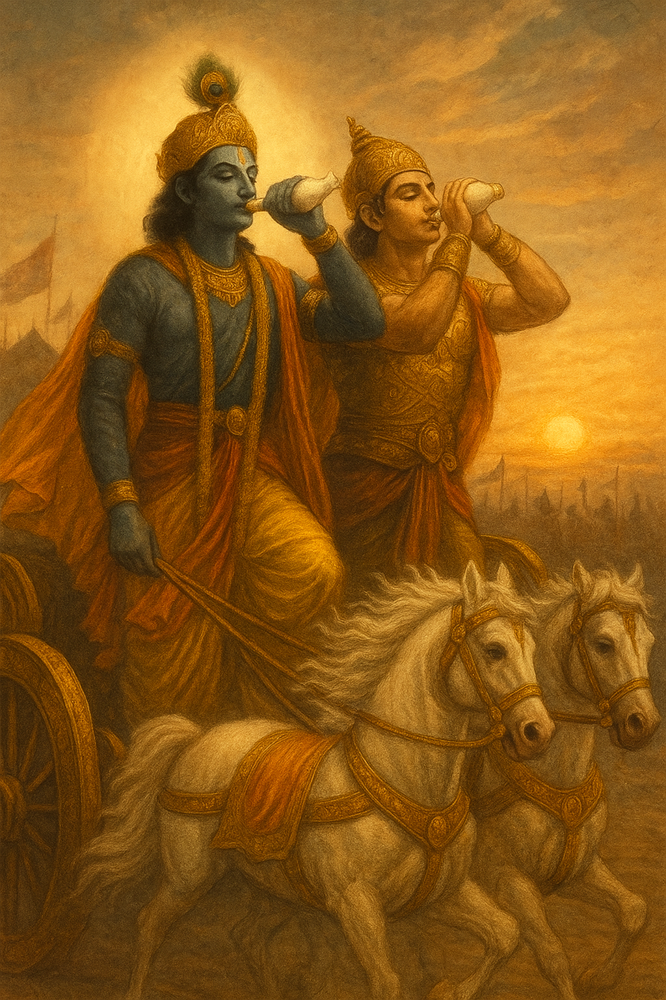

Śrīmad Bhagavad Gītā

 First scribed source of Karmyoga

----

    
    

Image credit : Ghibli Art Studio

  

      <a href="./how.md">Navigation & About .. </a>
  

  

      <a href="./bg00.md">Podcast .. </a>
  

  

      <a href="./changeLog.md">changeLog .. </a>
  

Bhagavad Gita is the first scribed source of `Karmyoga` - first `Smriti`. The general English translation of word  `Smriti` is memory, though the word has a specific meaning when used in context of Vaidik culture. 

 

In the beginning there was `Om` - smooth vibrations of the underlying field. Spoken language originated from this source. Humans developed exceptional conversations, but everyone had to individually remember the contextual history.

Then we discovered scribing!  Given the difficulties of early days, scribes chose the content with utmost care. Intent to scribe must yield full consensus. Only precious information made it to the written form - for offline access and preservation - across time and space. The word "scripture" points to something important, and worthy of writing down.

> It is clear that evolution is heavily biased in favour of text-enabled. Written text, thus, became the collective memory. In Sanskrit, such a collective memory is deemed `Smriti`. By virtue of being the collective memory (of our ancestors), it is embedded into all of us, even if we are not aware of it - a deep-seated memory.

Long before we learnt the skills of scribing and reading, critical information was passed on through rigorous recital - not mere "word of mouth". Such information was called `Shruti` - communicated through repetitive oration. The Sanskrit word later morphed into `Shutri` in Hindi.

Now that it is easier to scribe, and to record audio, we have zettabytes  of information, so much so that it is impossible to scrape through - at least for humans. Besides, the quality of content is questionable. Technology has enabled every individual to exercise their wish without seeking consensus - good or bad ? - we don't know ! 

Revisiting the first `Smriti` is thus finding signal with in endless noise. There are two paths to access this scripture - look inside, or read the text. Both are valid, and probably complimentary.

---

`Arjuna`, the protagonist, is blessed with divine vicinity of `Krishna` as his friend and charioteer.  `Krishna` - the knower of all - represents the consciousness prebuilt into all of us - an embodiment of our `Smrities`. 

In a way, Arjuna represents the skills attained in this birth (current iteration) - the intelligence;  while `Krishna` represents evolutionary wisdom - knowledge beyond ordinary intelligence - soul. In essence, Bhagavad Gita is a conversation between the mind and the soul - particularly at a point when faculty of intelligence gives in. 

Gita is structured as Arjuna's questions followed by Krishna's answers. Just as in AI realm, the formulation of prompts is the key skill, `Arjuna's` questions represent most intriguing human dilemmas. In doing that, he enabled rest of us with an opportunity to tap into our own `Smrities`.

`Arjun uvaach` - the name of this publication - means `Arjuna` spoke - his heartfelt queries.

 

`Arjuna` was a life-long friend, and student of `Krishna`. His voice stands for the questions we mortals have when tested and confused. And also the magical discernment once `Krishna` unveiled knowledge unto him. Their conversation, amidst the battlefield of Kurukshetra, is among the most potent narratives ever penned down - `Bhagvad Gita` - gods' song!

At the end of this conversation, `Arjuna` said :

> `Nashto Moha , Smritir Labdha !`
>
> [I am] devoid off of illusions, [I] attained the universal wisdom - the collective memory!

It is not uncommon to experience a momentary relief from cyclic illusions (`Moha`). Such instances - typically a deep loss - often lead to depression. They leave the disillusioned in a vacuum because absence of `Moha` is a great void. It must be filled up with knowledge quickly, else it turns into a state of limbo where mind stops seeking truth. `Gita` on the other hand, spotlights truth through wisdom embedded in our consciousness (`Smriti`). `Gita` gives us tools to access the very basis of our intelligence - our soul (`Atma`). It does so through active but selfless participation - `KarmYoga`. Instead of a run to exit (`Sanyasa`), `Gita` welcomes the precious gift we all are endowed with - human experience. It, thus, provisions lasting peace and worldly success - a win-win.

`Gita` is for everyone - it is not religion, race, profession or place specific. It is not even an ideology in terms of renunciation or materialism. In that, it takes our mind to a place of freedom, rather than the jail of a rabbit hole.

