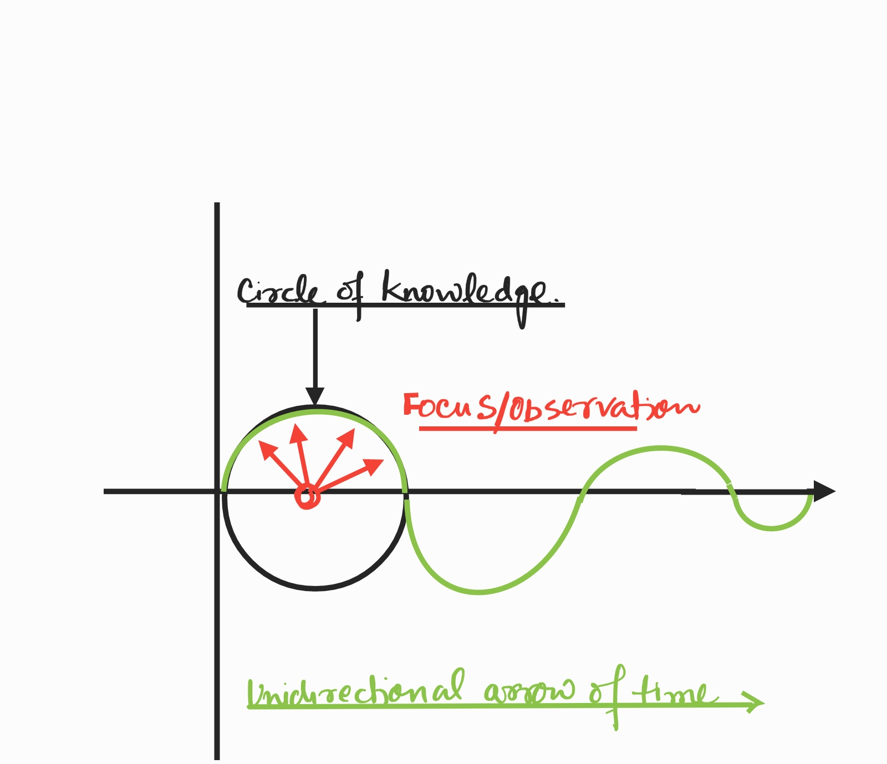

<h1>`Chakra`</h1>

<iframe src="https://archive.org/embed/arjunUvaach/1dot1.mp3" width="350" height="40" frameborder="0" webkitallowfullscreen="true" mozallowfullscreen="true" allowfullscreen></iframe>

> jātasya—for one who has been born; hi—for; dhruvaḥ—certain; mṛityuḥ—death; dhruvam—certain; janma—birth; mṛitasya—for the dead; cha—and; 
>
> tasmāt—therefore; aparihārye arthe—in this inevitable situation; na—not; tvam—you; śhochitum—lament; arhasi—befitting
>
> Death is certain for one who has been born, and rebirth is inevitable for one who has died. Therefore, you should not lament over the inevitable.
>
Krishna said in verse 27 of chapter 2 of Gita that all things born in truth must die and out of the death in truth comes life. This kinda hints at the cyclic reality of our being. In previous article, where we hypothesised the postulates of Gita , we went through a numbered list that we are all endowed with a protected, immutable but encrypted copy of knowledge. We also saw that `Bramh` - the system, provisions everything ; implements everything that we need to run our lives- in our tiny box. In addition it also implements a superior garbage collection system. But we left an important point open that the  underlying reality is a continuum. There is no beginning or an end. It's a everlasting cycle of knowledge to manifestation and vice-versa. 

To understand the "Continuum", let us look at our physical reality. There are two things that don't need any more scientific proofs :-

- First that every thing we observe is a "wave". The light is electromagnetic wave. Sound is a normal longitudinal wave. Even the tiny particles, such as electrons act like a wave as shown in the popular double slit experiment. 

- And second that our notion of Time is linear and unidirectional.

We will use some basic concepts of Physics to get us going but I promise to keep it to bare simple. Lets take a look at waves before we get to the idea of "Time". 
    
## Waves - the basis of our sensory apparatus.

Our world is made of waves. There are three broad types of wave and we are at the cusp of discovering the fourth one (gravitational waves) but we shall leave that out of the discussion for now.

### Mechanical waves 

These are the waves that move through the mediums such as solids, air and liquids by vibrating the matter molecules. When the molecules vibrate perpendicular to the apparent motion of waves they are called transverse waves - e.g. the waves that we see in a pond. When they jiggle in the same direction as the motion of the wave they are called "longitudinal" waves. Sound waves are the example of the "longitudinal" waves. Our ears are the sensors for the sound waves. Since these waves travel through solids , we can hear someone talking across the wall. We can even hear equally well under water if the source of sound is under water but if we mix the mediums - e.g source of sound in air while our ears are under water or vice versa - the waves get messed up. A better understanding of mechanical sound waves led to the discovery of Sonar that helps hear the sounds of under water sub-marines.

## Electromagnetic waves

Electromagnetic waves are the ones that seem to engulf everything around us such as  visible light or radio waves.  Our eyes are a sensor that can receive the information trough the visible part of EM spectrum , just like a radio antenna may interpret the signal from the radio waves. We know that EM waves have a broad spectrum starting from radio waves on one side with longest wavelength to the gamma rays on the other side with the shortest wavelength. Gamma rays may get so much energetic that they may feel like matter - just like bullets being fired from an airgun.

Visible light is reflected by the solids. So the waves of visible light, can be used to see the solids. That is exactly what eyes are for :-) And God , they see colorful things because visible light has a full rainbow with in it. Such is the beauty of our tiny box. So we can hear someone across the wall but we can't see across the wall. There are lot more things going on with electromagnetic waves as to how they get absorbed into solids and how they reflect. These nuances led to the Nobel prize for Albert Einstein in 1921 where he showed the photoelectric effect. He proved that the electromagnetic waves have a particle nature. They are made of photons. Photons at a specific frequency can knock off an electron from a metal plate. Hence the birth of the idea of wave-particle nature (of waves). And of course, depending on the frequencies, EM waves can penetrate through certain solids. This idea led to the discovery of X rays. But the key thing to note here is Maxwell's description of EM waves. The electric and magnetic fields are always at a perpendicular to each other. Which means that EM waves are basically two dimensional waves. We will use this idea later to define our 3D worldview. But before we do that, let us look at third type of waves

### Matter waves. 

We can see the solids with our eyes but how do we confirm the existence of solids. How do we know that the solids that we are seeing are not a video projection on some grand large screen. Turns out we are gifted with another sensor that can help us distinguish the solids from thin air - literally. And that sensor is spread all over our body - it is called the sense of Touch. 

So how do we feel the solids ? What exactly is sense of Touch ? For this we need little bit of history of our science..

> Back in the day, Einstein had proved that the light actually behaves like a particle. And that gave rise to the idea that has mesmerized the scientists as well as philosophers - what we call wave -particle nature of waves. But the idea of Einstein that a wave may behave like a particle, led De Brogli to think the opposite. If wave can act like a particle, is it possible that all the matter - the solids that we touch and feel may also act like waves. He submitted his PhD thesis n 1923 that was summarily rejected by his PI as stupid mental math. To his good luck, somehow his paper made it to Einstein. You see Einstein is everywhere - like God! Einstein saw his paper and not only agreed to the math but he gave him a Thumbs Up. BTW this was the first time that a PhD thesis won the Nobel prize. Now that is called a real brilliant science. It took world six long years to understand what Brogli proved so his prize came in 1929 . I guess it was totally worth the wait because the idea laid the foundation of Quantum Mechanics. What De Brogli showed us is known as "Matter waves". He showed that the tiny electrons are actually a wave. And they are very different from the Electromagnetic waves. 

You might feel that electrons are moving in a wave - like up and down of Mechanical waves. Nope - that is NOT a matter wave. Well, it is easy to say what is "NOT" a matter wave but it is difficult to comprehend  a matter wave. The easiest analogy is when matter waves come together such that their amplitude peaks up like a tsunami - that is where the particle shows up. In other words, particle can be anywhere in the entire universe but it shows up only where the matter waves come together to peak up the crest. These waves are also called probability waves and are put into equation as Schrodinger's wave function. And obviously, if matter waves are opposing such that they cancel each other than we feel nothing there. And here is the worst part, these matter waves are so small that we have no instrument to measure them (unless particle is tiny like an electron or a sodium atom) . But that is a good news too because, since the waves are so small, we can feel the solids as persistent pieces of matter. In other words the baseball that you are holding in your hand is blinking in and out of existence. It is vanishing and showing up but it does it so fast that we feel it is always there in our hands and never there anywhere else. Even electromagnetic waves - such as visible light, can't tell the difference - and that is why we not only feel the baseball but we also consistently see it in our hand. Or we can say that the matter waves are so short that even the electromagnetic waves can't go through them. 

There is one more problem. And that is we need more than three dimensions to explain matter waves mathematically. That is is where the crazy mathematics of "string theory" fits in but that is obviously beyond the scope of this chapter. If you must, I highly encourage you to goog;e Quantum Gravity ten times. After that youtube algorithm will automatically make you are a quantum scientist :-) Caution - your world as you see it today may fall apart and that would be absolutely against `Karm Yoga`. 

### Gravitational waves

I had be wrong if I say there are three types of waves corresponding to three sensors we have. There is actually one more that we recently discovered that we call Gravitational Wave but they are currently beyond our senses and extended senses. From extended sense I mean all the tools and machines and the clever experiments we have to get a true appreciation of our world.  Science is working hard to understand better as they are literally the waves of space-time. In essence the entire reality around us is a wave but unfortunately, we mere mortals, we don't have an express sense to perceive gravitational waves. Nor have we come up with a solid experimental set up yet but it is not to say we won't. 

> The point that I want to make at this stage is - EVERYTHING IS A WAVE. We see, feel and hear ONLY waves. In nutshell our sensory reality is nothing but an infinite ocean of waves - of different nature, of different wavelengths, amplitudes and thus frequencies. Now , you can say that even "waves" may be a figment of our imagination but I tend to believe there is a real manifested world out there and we have three major senses (sight , touch and hearing) to experience this world. In addition we have taste and smell to appreciate the chemical diffusions in our vicinity. Our sensory world is real. Why because if it was me alone imagining things to myself then it had be a very solo and sad world. Why would I choose to live there.The question is if our perceived reality is REAL , where do "waves" fit in ? 

## Waves as carrier of Information

The strange thing about waves is we perceive our sensory reality through them, but we can't perceive the waves. In essence, our senses are decoders of the information carried through waves. For example, I can hear what you say through sound waves but I can't perceive the sound waves themselves till someone puts a mathematical model to explain those waves. Mathematical models and experiments done to test such models often lead to new applications of science. We discover new tools. For example when Maxwell developed a mathematical model of electromagnetic waves , it opened new paradigms of science. Einstein showed that waves can act as matter and De Brogli proved the reverse.We discovered a spectrum of electromagnetic waves that finally led to a revolution in communication technology. Radio and TV are the shining applications of electromagnetic waves but most of us still can't perceive how the thing works. For anyone coming from 18th century, the idea of telephone is almost magical. Yet, electromagnetic waves are beyond our senses. We can only decode the signals sent through EM waves but we can't perceive the waves themselves. As a matter of fact, we can't even see the light that makes us see everything.

Same is true about the matter waves. One of the coolest application of matter waves is of course electron microscope. And along with electron microscope we saw a revolution in particle physics. In a way electron microscope proves that the matter waves exist. The entire field of quantum mechanics sprung up around matter waves. Neils Bohr demonstrated that the electrons appear only in quantum orbits around the nucleus. Heisenberg gave the uncertainty principle. And Schrodinger worked out the wave equations. Yet we can't perceive the matter waves. We only perceive the information carried by the matter waves and that information is matter itself. Something that we not only see with our eyes but also confirm through touch. Understanding waves as the carrier of information is a key step towards understanding the underlying nature of reality. 

The other important aspect of our sensory perception is the unidirectional arrow of time. Time is explained in many ways - for example increase of chaos. Time is also deemed as a separate dimension. All those may be true but I want to investigate "time" from the vantage of information processing.

## What is Time.

### Time is the information field
Look at 1d information field to make it easy to grasp.
### Every point in the information field must have information - Yes or No , 0 or 1. Point with no information can't exist.
In a way time is history(block-chain) of one computing bit.Nothing is also information. 
### Every point in the information field has a information space - kinda memory of that point
### Information Fields of many spatial dimensions can co-exist. That means if you have two spatial dimensions , you don't need two more dimensions for time.
In a multi-dimensional scenario , think a dimension as as a channel feeding some information to an intersection on timelines.Information can comein from any channel, history registers from any channel.
### In a way , Time is universal memory.
### 1d information fields are infinite 
because there is no way to tell where to purge the memory, for that you need 2d time info field which by design becomes dualistic. And second because there is no way to tell how big a dimension can be.
### 2d information field photons- ie information itself. Information is thus infinite and dualistic. 
### Manifestation is finding what you are looking for at a point in time. -- Define Quest first. Linkage to wave nature of manifestation- manifestation happens at the place of highest probability with respect to your quest function - what are you looking for.
Quest is the entry of senses. Senses are there to search something.
### 3d information fields manifest solids. Solids lead to gravity and thus singularity. 
### Thus Kaal Chakra is the cycle from knowledge to manifestation and then manifestation to knowledge. 
Knowledge to Information is in a sense broadcast of information. It ends with manifestation by senses. Manifestation to singularity (gravity) is simplifying the manifestation such that it becomes singularity - matter turns into holographic information.
### Infinite dimensions are possible
3d is a minimum requirement for manifestation of solids. But there is no limit to more dimensions if they could be used for journey from manifestation to singularity. Better coding is another for example DNA. Intelligence is the iterative process to taking shots at that configuration. The configuration itself is the knowledge. Thus singularity is not a point. It is the expression of knowledge. And that is the very reason of quest. Though understanding what we are looking for is too an iterative process. 

It had be rather naive to imagine that this circle is around us. As if we are the drivers of knowledge to information  or from manifestation to knowledge because the cycle in itself is endless. But we do have a complete cycle around who we are. And since our copy of knowledge is same as anything else, our cycle is same as that of the entire universe. 

## Waves to a circle to a dot.

A wave has two primary aspects - time , normally plotted on the x axis and an amplitude plotted perpendicular to the linear time. If we take the time aspect out of the wave, a wave is nothing but a spinning circle. The idea of removing the linear time from x axis is not uncommon. Such plots are called "circular graphs", sometimes also referred to as unit circle. The spin of the circle defines its wave-length  and the size of the circle defines it's amplitude. Together they represent "frequency". 

If we understand that "time" is a creation of our sensory perception, than it is obvious that underlying reality is circular in two spatial dimensions , a sphere in 3D space and something beyond us in four spatial dimensions and above. 

For reference and a better visualization, [check this out](https://jackschaedler.github.io/circles-sines-signals/sincos.html).

Let us assume we are at the center of the circle and we want to observe the circumference in a clock or anticlockwise fashion. What we observe is a wave. This is because our senses focus only at one point at an instance. Thus our focus moves along the circumference. Since we must move forward in time, the circle appears as wave. We will discuss more about this idea down the line in this post. 

One may argue that even circle has some element of time in terms of it's diameter on the x axis. And that is correct. If we remove the diameter too, then we have a dimensionless point. In `Hathyoga` , this point is called `Bindu` - or "focus". Being dimensionless (and thus massless), this point has absolute freedom to move in any dimension. And, since the limitations  of speed (speed of light) arise only with respect to time, we can say such limitations are attached only to our physical reality - as such `Bindu` has no meaning of speed. For example, you can think of a black-hole at the center of our milky way right now. It might take billions of years to reach there in our physical reality.  

When this focus rotates around an expression of knowledge, it must move around the expression to fully encapsulate it. In a way, focus expands to capture a piece of knowledge. On a two dimensional paper, it appears as a loop. And , with addition of unidirectional time, it appears as a wave. We know waves with higher frequency appear as solids to our sensory apparatus - why ? We will discuss down the line. 

This cycle of encapsulation of knowledge into waves of manifestation is the first half of the continuum. The dimensionless point of focus may also be referred to as "Singularity" though our definition is slightly at odds with that of popular science. Will describe this also in more details in ensuing paragraphs. In a way the cycle of "knowledge to manifestation" is same as formation of universe from a singularity to what we have now - an expanding universe. But "singularity to manifestation" is NOT only about the Bing Bang. It is an equilibrium of infinite manifestations happening without any notion of time, with in our own universe and in many other universes. It is a continuum at equilibrium. Knowledge turns into manifestations and manifestations turns into knowledge -endlessly. In that seeking the initiation of our physical reality is meaningless because it is a unique point only in our perception. The birth of universe is quite similar to our own birth - the start of our sensory perception. 

To initiate this first half of a specific cycle, the `Bindu` must move to capture a piece (expression) of "knowledge".  Such motion of "focus" is not limited to three dimensions. It can be any number of dimensions. A two dimensional projection is easy to grasp for us because our sensory apparatus supports a three dimensional view of the manifestations. This is an important differentiation from science in that the manifestation is relative to our perception. In science, our (human) perception used to treated as absolute till Einstein showed that our perception of length, time and mass is not absolute . But we don't need to travel near speed of light to prove the limitations of senses. The study of wave spectrum showed that there are many waves that are beyond our visible spectrum. 

You may ask why this motion of `Bindu` must be circular. The answer is it may NOT. From circular I mean "iterative". That is because to get to the geometric shape of a chunk (expression) of knowledge, focus must iterate multiple paths through multiple dimensions , till it finds a path that fully encapsulates the knowledge i.e it makes a closed loop. This closed loop on a two dimensional surface may appear as a circular vibrating loop; in a four dimensional space-time it will appear as closed strings. If you don't like "geometric" metaphors, it is simply an iterative model of learning. We know, iterations is the only way to perfect our knowledge. To understand something, our focus moves in many dimensions that are hard to describe in four dimensional space-time till we manifest our knowledge into something perceptible. In essence, the iterative nature of decryption of knowledge lends it a circular nature. From quantum mechanics standpoint, we may think this motion of focus as the probability wave. In essence, there is a small chance that `Bindu` may close the loop after circling around entire universe- as much as it may close the loop by circling around itself. All those possibilities appear as vibrations of the most probable loop. Most probable loop is what manifests in the shape of waves when consumed by our sensory apparatus.

Even after the loop is closed, there is tendency to shrink the loop because knowledge can be expressed in yet smaller loop. In a way, it is a continuous process if the information could be packed more densely while is still has a manifestable shape. This nature to represent knowledge in lesser and lesser (multi-dimensional) space is what we know as Gravity. As the loop becomes smaller - first we perceive it as higher frequency waves - e.g. solids. Thus the notion of mass. Further iterations of focus, can lead to a "Black hole" where the focus separates again into a singularity and knowledge spread all over its surface. In a way, `Bindu` always seeks ultimate freedom - true to its nature. Any closed loop holds the `Bindu` in a specific shape - but only so long. At some point the focus figures out better ways to arrange the knowledge such that enormous knowledge seems to be packed into it till it separates away into freedom leaving the knowledge spread all over the surface. 

You may ask, how does `Bindu` gets energy to move around a chunk of knowledge. The answer is it doesn't need energy because it is massless and dimensionless. In our world, it is something similar to our thoughts - you don't need to gas up your car if you just want to go someplace in your thoughts. Agreed, we need to have a brain to be able to think something and brain is the biggest consumer of energy in our body. But that energy is used by the brain to run the body. The physical manifestation. Let us say you are walking. Suddenly you have a thought of your parents living next door. You are still walking. The thought in itself doesn't consume any extra energy. If you imagine your parents being in Australia rather than being next door, it is not that you are going to consume extra energy. The actual meaning of energy is how much effort it takes to decrypt the knowledge that is locked in a loop.

Once `Bindu` closes a loop around an expression of knowledge, it tries to compact it as much as possible. It tries to reduce the size of the loop. As we know from string theory, these closed loops have elasticity. Smaller the circle, smaller are the information waves in terms of amplitude. And faster the angular momentum, more the frequency. Such waves are what we know as solids. As shown by De Brogli, the waves of solids are so dense that waves of bigger amplitude (or less frequency ) such as visible light can't pass through them. We call such loops as manifested. Why ? we will see when we discuss our sensory apparatus. 

The idea of solids (or miniaturization) of loops is not about solids alone. And idea that is well understood reduces to a single statement. For example, Einstein life log focus can now be described in a tiny equation - E=mc^2 . Such things become the physical laws till someone gets a even simpler description. Other property of manifested solids is it is easy to perceive them but the knowledge held with in them is harder to crack. It will need more and more effort to understand the nature of knowledge with held in them. This effort is equivalent to the "mass" we perceive in them. And again, it is NOT limited to solids, Einstein's simple idea also has enormous mass because it takes enormous energy to truly understand the meaning of mass energy equivalence. 

