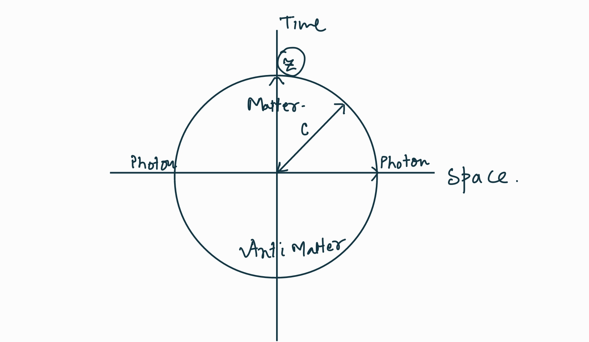
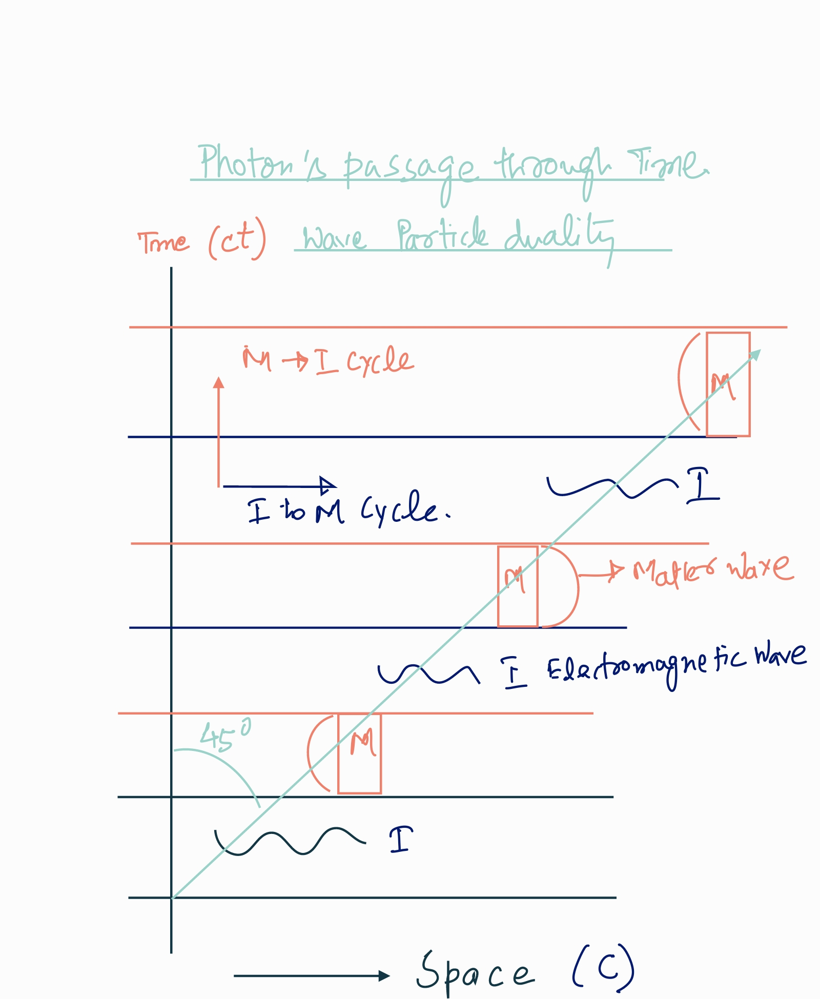
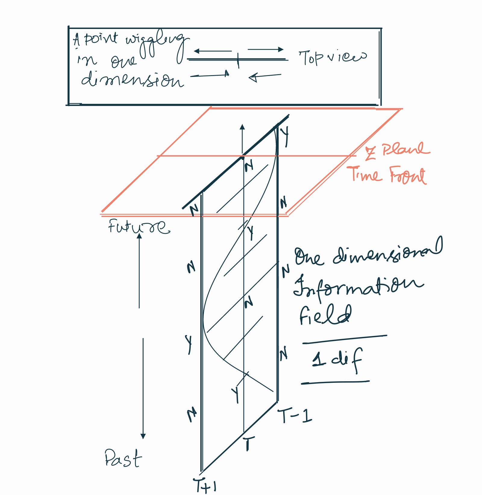
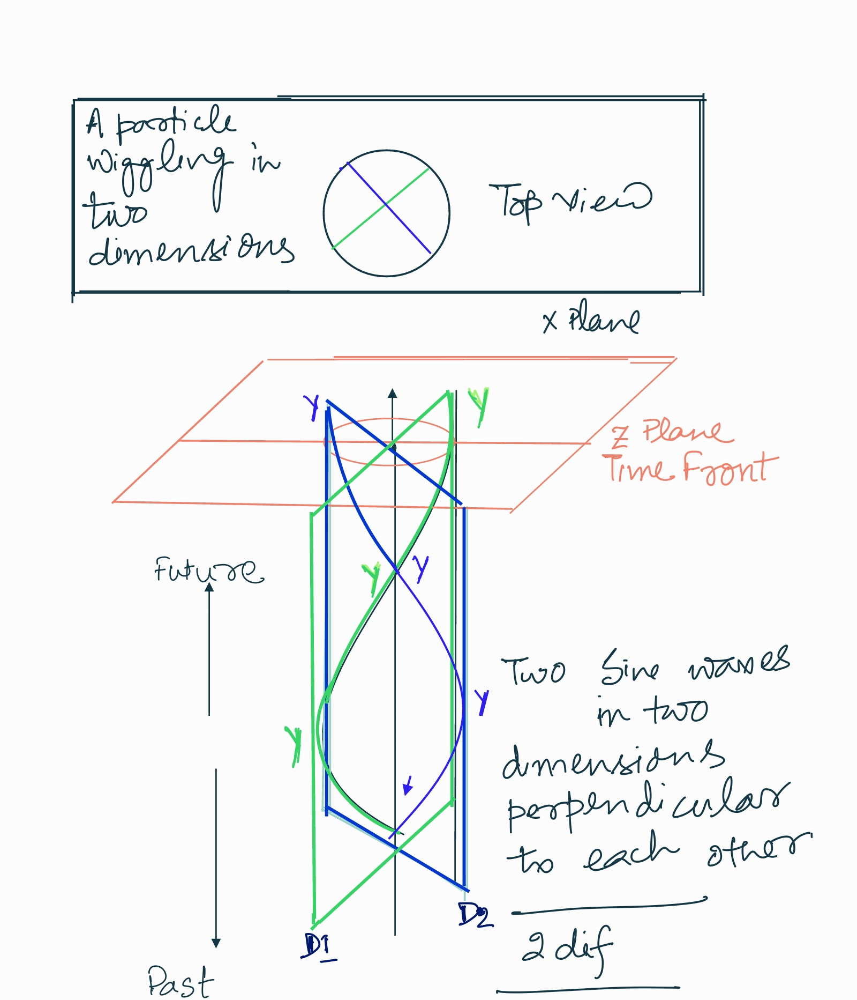
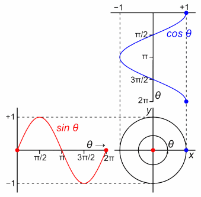
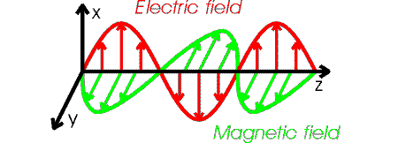

<h1>`Chakra`</h1>

> jātasya—for one who has been born; hi—for; dhruvaḥ—certain; mṛityuḥ—death; 
>
> dhruvam—certain; janma—birth; mṛitasya—for the dead; cha—and; 

Krishna said in verse 27 of chapter 2 that all things born in truth must die and out of the death in truth comes life. This kinda hints at the cyclic reality of our being. In previous article, where we hypothesised the postulates of Gita , we went through a numbered list that we are all endowed with a protected, immutable but encrypted copy of knowledge. We also dwelled on the idea that `Bramh` - an overarching  system, provisions everything - our "tiny box". In addition, it also implements a superior garbage collection system. But we left an important point open that the  underlying reality is a continuum. There is no beginning or an end. It's an everlasting cycle of knowledge to manifestation and vice-versa. This cycle is also called `Kaal Chakra` - the cycle of "Time". Each cycle expresses a specific aspect of "Knowledge". These cycles of Time are scale invariant - i.e they may express an entire Universe or a single atom or even a quark inside an atom. The journey of human life or for that matter any other manifestation is thus too a cycle of Time. 

In Hindu scriptures , the cycle of "Time" is defined as the four `Yugas` "Eons" - `Sattva, Treta, Dwapra and Kali` . These four phases are part of any cycle - a human life , a business organization , a race , a society or a country. All naturally existing systems follow the same pattern of four Eons with varying duration and characteristics for each. In fact, the ideas of religion and science had never been more aligned when it comes to defining the life cycle of our universe. Science is focused on "universe" with a hope that if we are able to decipher the biggest cycle observable, smaller cycles shall be self evident. On the other hand , religion is focused more on the human cycle - such as rise and demise of consciousness. However, the important thing is not the phases, characteristics  or the durations of each phase. It is the idea of "Time" itself.   Despite major improvements in our understanding, time is still as mysterious a thing to a scientist as it is to a religious practitioner.

## Time

One of the reason it is so hard to understand time is we treat time as a measure. For example an year is a duration it takes earth to go around the sun. A day is earth's spin around its own axis. The problem is such measures work for spatial dimensions such as length , width or depth because when I using a meter scale , I can tell that a tree is ten meter tall. I am measuring tree but if I use a day as a measure of time , I have no way to tell if a particular thing is 200 days. In other words we can say that a building is ten meters high. I can prove it you by taking a meter rod and measuring it right there , but there is no easy way to tell if the building is exactly ten years old. And even if we have a way to tell that building is actually ten years old , we don't know for sure how long this building is going to last. A ten meter high building is supposed to stay ten meter high but it is not guaranteed that building is going to be ten years old or say 100 years. In other words - Time is not a spatial measure.

Adding a spatial type of dimension with time is thus a mistake. 

I don' think you will be surprised if I said we all are living at the edge of the time. And "all" includes everything - big or small. The stars , galaxies and of course the chair that you are sitting on. None of us can jump ahead in time even a tiny bit. Why ? Because edge of "time" is NOT a spatial edge. There is no place to jump to. It simply unfolds on us. Still science is very clear that we can move faster or slower in time because we live in a four dimensional world where time is as much a dimension as any other spatial dimension. Einstein adopted this idea in relativity as "Proper Time" - the flow of time experienced by a body in space-time. Proper time for all of us clinging to the surface of earth is same - so insignificantly different that it is beyond measure of our instruments but it sure is different from the bigger stars. Things get really crazy near black holes. Time kinda stops at the event horizon and science is split if it flows in reverse direction (as shown in Penrose diagrams) inside a black hole. Nevertheless, irrespective of the speed, we all still live on the edge of time. From our own experience we can't tell if we are moving faster or slower in Time but one thing we are pretty sure that the moment we are living now, we never lived before. 

To get the basics right about the "time", let us use established principles. Thanks to the work of countless thinker and scientists, it seems like "Time" is now with in bounds of our knowledge. There is a growing acceptance that "Time" is an aspect of manifested objects. It is scientifically proven now that information has no experience of Time. Only manifested things experience time. 

One of the tested and proven  scientific truth is our universe has a strange love with a speed of ~ 300K Km  per second - often represented as "C" - the speed of light. It is only a convention that we call it "speed of light" because "C" has nothing special for light more than it has for me and you. We all , and this all includes "light" too, move at this speed in "space-time". It is a "constant" or a fundamental property of our universe. This fact is a proven truth and equally acceptable to both Relativity and Quantum Mechanics - that everything in our universe must move at at ~300K Km per sec in space-time.

The key word here is we are saying "space-time" NOT "space" alone. If something moves at this speed spatially then their motion in time is zero. We know this is true because photons move at "C" in space. Thus they don't move at all in time. As the speed of an object in space reduces from this constant, they start contributing the difference towards time. This means that Photons generated at the time of big bang (some 13.8 Billion years ago) are still around somewhere in the space. Though they are very very old from our vantage and may be lost in the mess of photons being created from our light bulbs. The notion of old and young is pretty subjective - the above said light is old because it was originated long time back but it is young in the sense it is still looks and behaves exactly in the same manner as the time of its birth. In a way it is old but ageless because aging needs manifestation. 

>It is important to add that the graphic above is only to communicate a concept - the idea of translation of spatial motion to motion in time (whatever it means) but the key thing is motion in time needs physical manifestation. We need information to gain some mass in order to experience "Time". As soon as the information gains mass , gravity shows up and messes up the nice circular diagram shown above. The diagram above ignores gravity just to express an idea. Ignoring gravity is just like ignoring mass and thus ignoring Time itself. 

The bottom line is "Time" and manifestation (mass) are intricately connected. The graphic may also give someone a false hope that if something somehow restricts spatial motion, it may be able  to move faster in time - and vice versa. But again, the only way to experience time is through manifestation and once information manifests, the location in space time and, the motion in space-time is kinda pre-decided. Even photons can't break the rules - the laws of our physical reality. They must move at ~300 K Km per second. You may question this speed limit. Why 300 K km - why not infinite spatial speed ? After all photons are massless. The simple answer is if photons moved at infinite speed , they had be stuck in a moment for ever. The light created say five minutes back had stay there for ever. We won't have any information of the past. In order to move both in space time - even photons need to to manifest. Their manifestation is tiny but they do have a particle nature. They too manifest as a particle to enable them move to the next moment in time but the transitions from wave to particle and back to wave are so fast that we perceive a steady straight line of light. I know it is getting a little confusing - let me break it down further .. 

### Information

This property of Photons - their spatial motion at the speed of light and thus no passage in time - makes them ever-sustained and  omnipresent story tellers of all the things ever manifested. Thus light (photons) is "information". Nothing really ever dies in the realm of information though it does get very very old and kinda loses itself in the jungle of new information. And this is exactly why we complain about "information overload" :-) The good news is scientist are getting smarter by the day to identify these old photons from the new ones and that tells us a lot about the beginning of the universe. The scientific name for these old photons sounds like a super hit Hollywood movie - "The cosmic microwave background radiations- CMB in short". 

But the question is - if Photons don't move at all in time, then how do we get the light from our extreme past? And another equally relevant question is - Do we have access to all that has happened in the past or is there a limit ? Turns out - we can only get information from a three dimensional cone in our past. Anything outside our conical past is beyond us. 

The graphic above explains the iterations of a Photon through space and time . Through space as information and through time as a particle. The horizontal lines represent say a moment in time. To move through time - photons must manifest themselves as a particle and then again into massless information. This life-cycle is ephemeral. Photons transform into mass and then back to wave at incredibly fast rate. Despite the extra ordinary speed of their transitions - there is still a finite speed limit . And that speed translates into a spatial velocity of ~300 K Km per sec. We know for sure that this spatial velocity must follow the curvature of the space. Jury is still out if the space is flat or if it is elliptical or hyperbolic. Latest advances in science do indicate a hyperbolic nature of our space but that description is beyond my comprehension and thus beyond this text. 

The key point to note here is because of these transitions in space and time - light moves at 45 degrees in space-time. In other words - we can observe only a cone of space-time in our past. 

This transition of wave to particle and vice versa is due to by something called electro-magnetic field. We will talk a lot about EM fields and EM waves when we discuss "consciousness" as EM waves enable one of our most important sensory capability - our sense of vision. The point that I want to make here is about the beauty of our design  - and that point is - the EM fields are generated by the manifested objects. In a way manifestation is what cause the information.  Think about it for a moment before we get into more details of manifestation - mass. 

### Mass

Lets use another proven scientific truth to get our arms around the idea of mass. The second law of thermodynamics is considered iron clad. One of the interpretation of this law is any closed system, left alone , gradually increase its entropy over time. Entropy being the measure of disorder. That is easy to understand but the strange thing is even if we make an attempt to reduce disorder in say a part of this system , entropy of the overall system still increases. Hence the comparison with time - just like time , entropy too is unidirectional. 

It kinda makes sense , because if we try to reduce the entropy of say a part of this system , we need energy to move to the subsystem to reduce the disorder. This mechanism to move energy , in turn, creates more disorder. For example our own universe. 

We know in our universe there are four basic forces that are always at work to establish the order. The grandest of these forces is gravity. Grandest because it acts at large distance and becomes the key player between massive things. Gravity reduces disorder by clumping the clouds of disorderly helium and hydrogen into compact stars and planets that further compress the materials into more exotic heavier atoms such as carbon , gold and uranium. These heavier materials lead to complex molecules that give the basis foundation for biological and intelligent life. Which are busy further in reducing disorder in a specific tiny segment of the universe but still adding to overall entropy. 

The other way to reduce disorder is to lose heat. Thus every manifested thing in our universe emits electromagnetic radiations. For example we receive heat from sun in the shape of light which is nothing but electromagnetic waves. In a way information is passage of energy from one manifested body to another. In the process sun is cooling itself down and hence reducing its disorder but overall entropy of universe is still increasing. The fixed speed of information "C" is a measure of electro-magnetic waves that define our space and transfer information in the shape of tiny packets of energy across our universe. 

If we go further smaller in the scale, Gravity had crush the material infinitely. It shall force the electrons into the nucleus. There needs to be another force to maintain an orderly orbit of electrons around the nucleus. So we have something called "weak force". This is the force that 

#### Time is the information field

The easiest way to imagine time as an information field is to try visualize a one dimensional line . Assume a point is wiggling from time line "T-1" to "T+1". T being the center.  Time is unidirectional upwards (future is pointing up and past is down. Plane Z indicates the time front - A frame representing "Now". You can say we have a horizontal one dimensional line and a timeline attached to every single point on that line as shown in T+1 and T-1. The job of the time line is to capture the history of the  point .  

The information is represented as "Y" and "N" . "Y" being particle is visible. "N" being particle is invisible.

So that we don't conflict with planes that connect two dimensions; lets just call our plane as "one dimensional information field". 1dif - for short. The answer that each point of 1dif records is "yes" or "No" based on the question. Question can be - Is something there ? - Answer can be a "yes" or a "no". Or the question can be - is the temperature more than 20 degrees ? - Answer can be "yes" or "no". You got it!  Time stamp only records "yes" or "no". A "zero" or a "One". An "Up" or a "Down". A "plus" or a "minus". The binary information. The question defines what does it mean when time stamp says "yes" verses a "No". In essence, the answer is written in the time line. What you are trying to figure out is a right question. 

You may ask why the point is wiggling ? Why is it not at rest ? That is a valid question. The answer is if a massless point is not wiggling , it has no information. Means it doesn't exist. In order to exist, everything must wield some information and everything that has information also has motion. Thus motion is the "information". Absolute rest is beyond "information" - no signal. You must have noticed this phenomenon in the face of your spouse when you do a late night with your friends out of the home. Absolute rest - Blank face- no information :-) And that is an ultimate test for your focus :-)

The wiggle in one dimension creates a sine wave in time. As shown in the graphic above. So our particle knows that it exists. It sure can estimate from the timeline that it is wiggling. However, this information is not very useful. All it knows is that it exists. It can't see a shape. It can't frame any meaningful question. We need some manifestation to be able to shape our quest. Means there is some work needed. But who is there to help our tiny particle in this single dimension unless it decide to help itself.

You may tend to think that it is you observing this particle. No - it is just the massless particle. Imagine this particle is entire universe. All this particle is doing is wiggling in a single dimension to know that it exist. In `Hath Yoga`, we call this point a `Bindu` - which literally means a point but a better English translation is the "Focus". In essence, this point is the unit of conciousness. The purpose of consciousness is to make sense of the information. As we noticed in our discussion in first section "Quest" that intelligence is something that spans optimum dimensions to facilitate knowledge to express itself into a manifestation.

The question now is what new dimension our particle must create and how. What is the first question that `Bindu` may ask ? Imagine you woke up from a timeless coma in the middle of nowhere. Would you like to check the weather if you don't even know who you are ? Where you are located? In a way the first intelligent question is  - "Who am I ?"  But as we agreed above, the answers are only "Yes" or "No" - means the question needs to be framed in a different way. It can ask "Am I a human?" or "Am I a chair ?" and that would be like asking -  Is it 1? Or Is it 2? . All the possible shapes or things in the universe. There must be a better way .. 

> At this point you may breathe and marvel a "bit" on the overall design. 
>
> - The quest is a Sine wave thus all the information is supplied to the sensors in the same format - a sine wave. 
>
> - Time is a chronological system to record the signal. 
>
> - A single timeline serves all the dimensions of quest (will see how it works down the line). 
>
> - Quest needs some sort of manifestation. 

Let us examine how this manifestation happens. 

#### A two dimensional information field. - 2DIF

The easiest way to imagine a 2DIF is to draw two lines at right angle. Every single point of the respective information plane record the history of the particle. Choice of right angle is arbitrary. It can we any other angle but keeping it a right angle shall help us down the line when we discuss the electromagnetic field. 

Both the dimensions are feeding into one timeline. Timeline is thus the line along the intersection of two 1Difs.

The graphic shows three pairs of "Y"s . Pairs are to represent information coming from two dimensions though we could very well use only one "Y" along the time line. The central value is where the circle is just a dot but it is still a circle. The bottom and top pair is where circle is of full size. You may like to imagine this circle as a wine opener screw rotating and moving in the direction of time.

  

  

> High School Math :- As you can see from the graphic above same sine wave oscillating perpendicular to each other is a circle in two dimensions. In high school math lingo we call these two sines at a phase difference of 90 degrees or if you were a trigonometry buff , you already know these are sine and cosine waves. 

By projecting itself into an additional dimension, the information took a shape - a circle. A pattern emerged in the ocean of bits.  In case of right angle information planes , this pattern is a circle. In a way,  a specific property of the particle took expression. This is by far not all the knowledge that particle may have. It is just a beginning. Particle now may give itself a name - a circle. In essence, it got an identity. 

 So now our lonely "point" got a description for "who am I". Now it can ask a valid question - Am I a circle ? Another thing to notice here , there is only one question for both the dimensions. This is a profound thing because we removed all the "No"s. What we achieved here is rather than recording raw information (as it is) from signals from two dimensions, we are asking a question about the manifestation. The answer remains "Yes" as long as the particle remains wiggling in two dimensions. If we remove the second dimension at any point, it again turns into information. If there is no particle wiggling at all then of course the answer is no. In a way, the manifestation confirms existence and it compacts information into a simpler format. That is what "Intelligence" is - making sense of information to express a property of inherent knowledge and at the same time compacting the information. Instead of "Yes"s and "No"s along the infinite length of each dimension, we have only one time line with a "Yes" or "No". 

It is important to state that the notion of "a dimension" is something that is not influenced from any other dimension or anything external. It has nothing to do with the width or the thickness - those measures come into play when we start viewing the world in three dimensions. Since no information is allowed from outside , the idea of spinning a second dimension , must come from with in the first dimension. This means - the idea of finding "who I am" is in-built into a dimension itself. Thus "Quest" is fundamental. "Who am I" is the first question. A new born child wants to know it. A new born cell too. So does a new born universe. The downside, however, is quest is endless. It never stops. 

At this point, you may feel that the circular shape as we discussed above is some sort of projection. Like something on our TV screen. Einstein proved quite the opposite. He showed that a two dimensional EM field actually manifests a physical particle. A photon - that can knock off an electron from the surface of a metal plate. These days , the idea of the "fields" is pretty common. The "Quantum Field Theory" provisions twenty three more such fields to our universe to describe all the elementary particles of standard model. The way EM field gives rise to a Photon , these fields manifest all the building blocks of our universe something akin to matter waves. A transformation of information to manifestation. 

Let's look at a single time line of two dimensional electro-magnetic field. "X" is the dimension of electric field, "Y" is the dimension of magnetic field and "Z" is the Time pointing towards past. 

  

  

As long as the electromagnetic field exist, the history of timeline continues to be yes. Since EM field (like other fields of QFT) is universal that means Photons are everywhere. In particular when they hit an electron, the interaction changes their energy level. This disturbance passes through this field at the speed of light. That is how we see the objects because our eyes are a sensor for the photons.

### Knowledge to Manifestation

Information Fields of many spatial dimensions can co-exist in a single timeline. That means if you have two spatial dimensions , you don't need two more dimensions for time. As shown in the graphic above - the timeline captures "Yes" or "No" for the circle. In a multi-dimensional scenario , think a dimension as as a channel feeding information to timelines. When the timeline becomes unique for multiple dimensions, the knowledge is said to be decrypted and manifestation happened. Both of these are instantaneous. 

Intelligence can add as many dimensions as it deems necessary to manifest a shape. For example , in case of photon, the "point" needed only two dimensions. 

#### Automation
With in entire space, wherever the conditions are met, manifestation happens automatically. For example for a Photon , the only conditions needed are pre-existing electromagnetic field, thus Photons manifest automatically wherever an electromagnetic field exists. In essence automation is built in the knowledge. As long as there is an external intervention (action) is needed , knowledge is still incomplete - timeline is still not converged to a single yes or No - Triage for a better configuration of dimensions is still going on. 

We see this phenomenon all around us. When the conditions are met, the swamps are filled up with fish. Forests are filled up with trees. Insects show up. Most of the products that we humans make, are not fully automated. Thus the notion of manufacturing , supply chains and monetary systems. As we improve our knowledge , most of the basic things will be available to every one just like water and air. Now you may say trees are NOT available on Mars, you are absolutely right , because a critical dimension in case of trees are water and air . And the fertile crust of Earth. If such conditions are met on other planets - Trees and biological life will automatically spring up and who knows it might already be there. 

The obvious question is how water, air and solids like Earth showed up. The information for these are in "matter waves" and goes without saying , manifestation of solids needs third dimension. Thus "Inflationary Epoch" was creation of third dimension - i.e creation of space itself as we perceive it. The obvious thing is such knowledge needed very few preexisting conditions. Those conditions should be available even now. And that is right , even now space is being created and it is expanding our universe greater than the speed of light. That is the reason galaxies are drifting apart. Thus idea of limiting "Time" to speed of light is just a scale for our electromagnetic space. Time for every manifestation is its own information beat. Gita calls it `Kaal Chakra` - The cycle of time.

#### Complexity

Transformation of knowledge into manifestation and automatic spread of manifestations wherever required information exists is a simple cycle. It might appear gargantuous but it is scale invariate - means a "point" is similar to entire universe. A point has complete knowledge as much as the entire universe. Every manifestation in between, though has an entire copy of knowledge but only a certain part expresses itself through decryption of certain set of knowledge. Thus manifestations are complimentary. They are like pieces of a jigsaw puzzle. Thus they come together to form more complex expressions. Just like modules in a complex application. Together they give rise to our beautiful world. These complex manifestations - such as living beings - we humans, follow the same principle - single timeline. But they don't need to discover the timelines of constituents. As such entire universe has just one timeline. It exists or it doesn't. Yes or No. 

However this complexity gives rise to superior intelligence what we know as consciousness. A way to perceive the universe in it's beautiful glory. Ability to seek pleasure in being. But complexity is only an intermediate thing.

#### Garbage Collection

In such a complex intermediate or internal state , conditions may change such that requirements for existing manifestations are no more met. Thus the idea of garbage collection. Such perished manifestations breakdown into their primary constituents and are available to form parts of other manifestations that have the ability to thrive in changed conditions. Thus the cycle of birth and death with in universe. But such birth and death is NOT to be confused with the reverse cycle of "manifestation to Knowledge". It is just reshaping of manifestations. 

#### Infinity and Duality

1d information fields are infinite because there is no way to tell how much to wiggle. As such this state is pure information. Manifestation needs minimum two dimensions and thus the birth of Duality. All fundamental particles must have an anti particle. Duality expresses itself in different ways in complex manifestations.

#### Who am I

At the very core, manifestation is answer to the fundamental question - Who am I? Thus all the manifestations have identity. Thus identity is dualistic. 

### Cycle of Manifestation to Knowledge.

In our physical universe, Black Holes are probably the most fascinating objects. Theory of Relativity predicted black holes but Stephen Hawkings took our understanding of Black Holes to next level. The problem however is , unlike the regular manifestation or even the tiny sub atomic particles, Black Holes are beyond our observatories. We can only describe them through mathematics. And math of black holes is insanely complex. To put it intuitively, a Black hole is a place where information separates from the knowledge. The physical manifested objects are restored back into pre manifested state. The information spreads along the surface of the black hole (event horizon)  and knowledge acts like a singularity. The question "Who am I" doesn't make sense. The quest ends. The knowledge inside a Black Hole is self sustained. That is the reason it is also called a singularity.

Scientifically , our understanding of black holes is still primitive. Of the few things we know about Black Holes is one that is particularly intriguing. And that is Black Holes are incredibly cold places. The The new theories of Quantum Mechanics such as ADS-CFT predicts that our universe is a holographic projection of the information held at the surface of a Black Hole and we are all living inside a Black Hole. The math of ADS-CFT is impeccable to say the least. In a way , the entire universe is inside a singularity . It is our tiny point before it started wiggling. 

We may not be in position to understand the black holes but there are many things in our ordinary life, with increasing complexity , the context and the answer stop making sense. For example when I ask "Who am I" the single answer is my name. That is good to run the things. My signatures are good for the bank but my name doesn't really communicate who I am.  Even the things that we humans make reach a level of complexity where answer doesn't make any sense. For example if you ask someone what is it that she is talking on - the answer is a "smart phone". But what does the smart phone mean? The knowledge held in the tiny device is so complex that it is beyond our normal perception. At this stage, it appears that the knowledge is hidden or the answer is a mere abstraction of vastly complex set of knowledge. Abstractions need explanations. For example an electron or a Photon makes same sense to an alien as much as it makes to us but our car is beyond description to an alien. The context of the car is a machine used for transport by humans living on an obscure planet called earth that runs in a tiny solar system in the far flung regions of milky way. Understanding such a context is difficult for even us that's the reason we resort to abstractions. 

The question at this stage shifts from knowledge asking "who am I ?" to a manifested objects such as a human (or a car) asking  "who am I?" Who am I under this abstracted name? What is the nature of my knowledge ? A better question is "Why am I what I am?". Manifestation itself becomes a mystery. 

The good news is we are all in this state. We are all manifested beings of immense complexity. Every aspect of our identity is an abstraction of thousands of abstractions. Thus knowledge is invisible to us. 

The question is how do we access or feel or get a glimpse of our knowledge. The thing that created us is hidden to us. Now obvious extension of the question is why do we need to access this knowledge ? Why not let it be where it is ? The answer is - Not knowing is a legit choice. But it comes at a cost. Since we (and everything around us) is manifested out of a wave, the nature of our life is a wave - in that there are cycles of elation and pain. It is a never ending roller coaster. I don't know if we can experience a black hole or become one where we may be able to separate information from knowledge but thankfully Gita suggests a simpler approach - `Karm Yoga`. This is the path to see or feel our internal hidden knowledge in this manifested body. 

The first aspect of `Karm Yoga` is to understand that this cycle of knowledge to manifestation and vice versa is end less. There is no victory post. The journey never ends. In some shape or form it continues. In this universe or somewhere else in a parallel universe. There is no entry or exit. The notion of exit is exit from the cycles of elation and pain. In essence the goal is to ride the waves. We are NOT trying to solve the mysterious universe. Neither are we destined to create new ones. The idea is to feel the peace wherever we are. However, end of pain does mean end of happiness too. There is no silver bullet that may keep you ever joyous. The choice is entirely subjective. If you feel like trying this path, read on .. 

----

 
<h2> 2.0 </h2>

