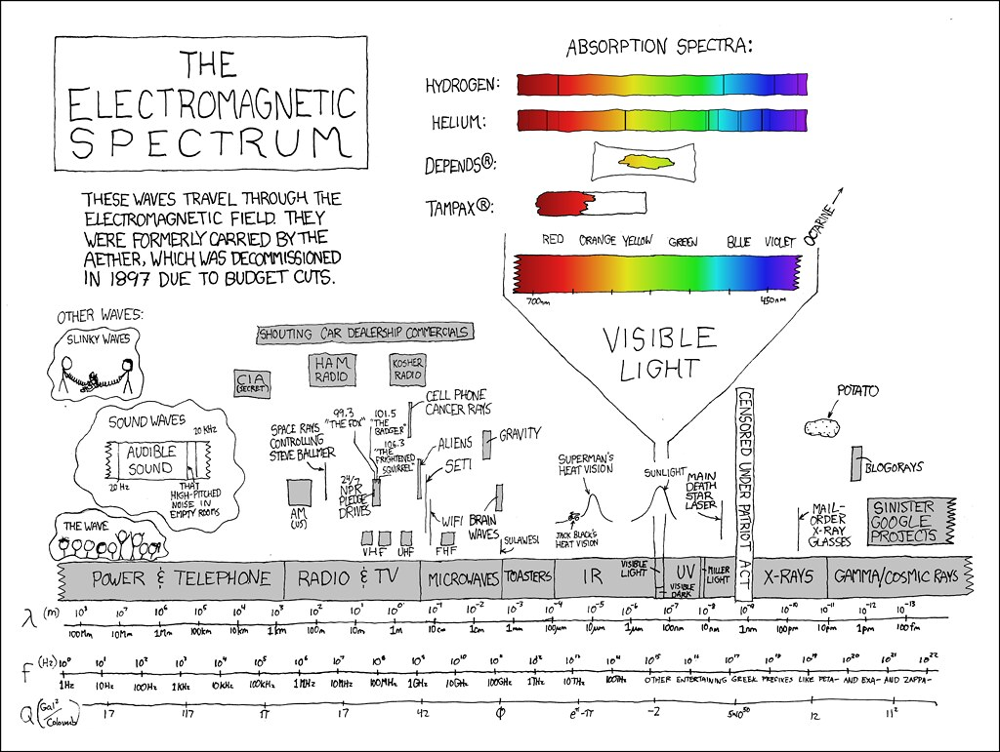

<h1>`Chakra`</h1>

<iframe src="https://archive.org/embed/arjunUvaach/1dot1.mp3" width="350" height="40" frameborder="0" webkitallowfullscreen="true" mozallowfullscreen="true" allowfullscreen></iframe>

> jātasya—for one who has been born; hi—for; dhruvaḥ—certain; mṛityuḥ—death; dhruvam—certain; janma—birth; mṛitasya—for the dead; cha—and; 

Krishna said in verse 27 of chapter 2 that all things born in truth must die and out of the death in truth comes life. This kinda hints at the cyclic reality of our being. In previous article, where we hypothesised the postulates of Gita , we went through a numbered list that we are all endowed with a protected, immutable but encrypted copy of knowledge. We also saw that `Bramh` - the system, provisions everything ; implements everything that we need to run our lives- in our "tiny box". In addition it also implements a superior garbage collection system. But we left an important point open that the  underlying reality is a continuum. There is no beginning or an end. It's a everlasting cycle of knowledge to manifestation and vice-versa. 

The question is how do we understand this underlying reality ? The only path we have is to observe our current physical reality and make an informed guess. This approach is both scientific as well as a religious truth. We observed the Sun,  the Moon and the stars and wondered if we were the center of the universe. With iterations over many centuries we have a better understanding. It is not us or even the Sun. Sure, we had many conflicts over these centuries but those conflicts forced us to refine our rigor. Math and science are born of this rigor - to explain our reality at a more fundamental level. To decrypt the truth or to find the signal in this noise. And that exactly is the stated goal of religion. We will see down the line how these two strategies harmonize as we get a better appreciation of "Continuum".

To understand the "Continuum", let us use the same strategy - look at our physical reality. 

There are three things that don't need any more scientific proofs. They are accepted truths of our experience that are well validated by science . Both are important because our experience may be tricky. In a way these are part of  our collective knowledge. 

- First that we all are searching something. 

    A hundred years from now, historians AI may write -

  >in the beginning of 21st century, human race conducted one of the largest survey. They invented something called "internet". The stated goal  of internet was to provide free information. Things called websites were set up to see what attracts humans the most. The idea was to create an online replica of everything  because measuring interest based traffic in real physical world was impossible. They  (humans) came up with sophisticated mechanisms of that time (though primitive from 22nd century standpoint), to understand their own behaviour. Turned out humans liked to search. A small company called Google became the most visited website. By an order of magnitude.  Humans flocked around search tools way more than social media, entertainment, news or even sports. The realization was that the way Google's crawlers search the web, humans were crawling through physical reality to catalog everything. In search of something". 

  Search  is fundamental. We may NOT know what we are searching or why ; but we are all searching something. Searching for "Nothing" is a search too. There is no way for us to know what it means to NOT search at all. The fact that you are here on this page means you are searching something. May be Google brought you here or some friend told you to look at this page. The means don't matter. What matters is the "quest". 

- Second that every thing we observe is a "wave". The light is an electromagnetic wave. Sound is a normal longitudinal wave. Even the tiny particles, such as electrons act like a wave as shown in the popular double slit experiment. 

- And the third,  that our notion of Time is linear and unidirectional.

We will use these three basic truths to establish underlying reality is a continuum. Along the way, we might use some basic concepts of Physics but I promise to keep them bare and simple. Lets take a look at "Quest" before we get to the "waves" and "Time". 

## Nature of Quest

You may ignore the 22nd century's artificial historians as naive because they may not understand our motivations. We know it was not a planned survey at all. Internet just evolved, and since we are the basis of its evolution , it looks just like our reality - a swath of information to crawl through. All individually on their own quest.  Just look at your browser history. We are searching something, almost on a daily or hourly  basis. That is the reason Google gets 3 billion hits daily. And it is quite amazing their web page has nothing. It's a plain white page with a single dialog box. BTW reviewing our  browser history is a useful exercise to know who we are. How is our quest evolving over time? If Google can estimate "who we are ?" from our search history; we sure can find "who we are" by looking at our own search. We will talk about this idea when we discuss "Triangulation" - A process to locate where we are in this maze. For now let us focus on nature of our quest. 

Let us say, we are to search number 10 from a range say 1 to 50. We can ask questions but the only answer we get is a "Yes" or a "No". One of the way is to ask fifty questions. Hey - is it 1 ? No ! ;  Is it 2 ? No ! .......  We shall get to the answer in ten question because the number is 10. What if we were searching for 49 ?  Asking 49 questions seems really dumb. Is there a way to shorten our search. We are not only searching, we want to search as quickly possible. Don't we ? There is a better way. We can get to answer in around five questions. How ? 

- Lets ask first question - Is it greater than 25 ? - No ! --> Means it is between 1 and 24.
- There is no point asking if it is less than 25 because we already know that. So our next question is - Is it greater than 12 ? - No ! --> Means it is between 1 and 12. 
- Next question - same drill - Is it greater than 6 ? Yes ! --> Bingo ! We got a smaller range. The number is between 7 and 11. 
- Is it greater than 9 ? Yes! --> Means number is either 10 or 11.
- Is it greater than 10 ? - No ! --> Means the number is 10. 

So we got to the answer in five questions. Did you notice anything special in this approach ? We divide the population in roughly two halves and search one half. If we know the object of search is not there , we move on to next half. Either ways, we  again split the population (search area) and repeat the operation. Does it look like a familiar pattern ? May be a Sine wave?  A sine wave that is reducing in wavelength and thus increasing in frequency. No matter how big our search space (1 to a billion instead of 1 to 50) , the wave shortens in wave length pretty quickly and gets to almost a straight line. After that we may continue to cycle through the halves as long as we want. Infinitely. Is it 10 ? The answer always remains "Yes". We can of course close the probing when the game ends. But Answer 10 for this specific session of the game is written down in the history of games between me and you :-). This is knowledge. The answers "Yes" and "No" - the wave - is information. 

The first thing to note here is turning information into knowledge is an iterative process. And knowledge is a sum of the question (context) and the answer. It takes many but finite number of cycles to get to the context and then unlimited cycles to keep the knowledge fresh.

The key thing in this splitting algorithm is, we must be open to searching outside our search space. We can split the space only if we agree to search the second half after the first. This also means, we keep expanding our search time till we find what we are looking for. In the process our search space becomes smaller and smaller till it becomes almost a straight line. This also means that the "knowledge" is bound between two boundary conditions. There is a finite start and a finite end. We are unaware of truth before and after. Since our search algorithm is designed to look outside our search space, we are always curious of the things beyond the boundary conditions. What happened before big bang? What happens after the universe ends? What happened before our birth ? What happens after our death ? The boundary conditions always intrigue us. So much so that most of the times we seek truth beyond the boundaries while the answer could very well be in front of us. The reductive nature of our sensory apparatus makes us efficient searchers but it also makes us impatient and restless.

Other thing we notice that we never search the half that we already searched. There is no point going back there because we want to search as quickly as possible. Does it feel like our search is unidirectional ? Just like the "time" ! It is always pointed towards future. As a matter of fact we had the answer in the very first question. That the answer of our quest was in second half (between 1 to 25). In fact we had the answer even  before the quest - the number was between 1 and 50. But we keep on refining the quest till knowledge becomes exact. Or it gets packed in the least volume of possibilities. In a way, we are querying the future to get to a singular truth hidden in the reality. This makes our sensory apparatus seekers of discrete answers rather than someone who rides a wave of possibilities.

> Math Alert - The idea that we can shorten the search to say five-ish questions (if our range is fifty) is based on a mathematical model. Fifty lies between the 2^5 and 2^6. Or alternatively we can say that that we should find the answer in log 2 (50) attempts . Which is around 5.6. This is the basis of a subject called "Information Theory" that was postulated by Claud E Shannon in the forties. Question - Why log of 2? Probably because our answer is either "Yes" or a "No" - a binary bit ! A tiniest amount of knowledge. 

In other words it doesn't matter how big is our search space. The only knowledge we have is if the object of our desire exist there or not . The answer is only a "Yes" or a "No". The question is a dimension. This makes "knowledge" multidimensional. You may say we only have three dimensions. And that is true. The manifested reality around us appears three dimensional or four dimensional if you grace "Time" a separate dimension, but string theory shows us we need many more to get to this 3D experience. And that is simple physical stuff. If we try to decipher the philosophical questions such as "who am I?" we probably need thousands of them. The "Yes and No" answers to all the dimensions packed in the least volume of possibilities is the knowledge. More dimensions mean more iterations to get to one "Yes" or one "No". 

A natural question is , how do we determine what question to ask? How do we split our questions into multiple dimensions so that all the answers come together to the least volume ? All the dimensions converge to intersect at one point ? Our ability to design questions is called "Intelligence". Intelligence is always driven by our physical reality. Google can only give us answers, it can't give us questions to ask. Our questions are driven by our contact with physical - real or imagined. In a way , our intelligence creates a mesh of questions to decipher our physical reality - knowledge is held in those dimensions in the shape of a web. This web is our identity. In essence, our quest is driven by who we are and every additional dimension changes who we are. Thus quest is never ending and is cyclic.

You may be tempted to think that quest emerges with consciousness as if it is a phenomenon of living beings and specifically humans. Our quest for food , life and survival seems apparent but quest is fundamental in the nature of universe. For example physics now shows us that fundamental particles question their vicinity. They communicate . That is how an electron knows to repel another electron. As such quest is a property of our universe. If anything, higher intelligence may be better prepared in channeling our quest.

An obvious interpretation may be why indulge in this quest. Why open a new dimension and triage it with actions to forge a discrete answer? Why don't we just stop searching? Krishna says it is not possible. We are always forced to engage in actions. Even most aware of the scientists - `Nyaan Yogies` can't withhold the quest. That is the reason we have "Theory of Relativity" and "Quantum Mechanics". Thus the idea of "not indulging in actions" is futile. We must embrace our quest as our natural instinct. He says - 

>    Na [nor] Hi [certainly] Kashchit [anyone] Kshnam [a moment] Api [too] Jatu [at any time] Tishthati [stays - sit down] Akaram Krit [doing nothing];
>
>    Karyate [forced into] Hi [certainly] Avashah [helplessly] Karma [actions] Sarvah [All] Prakriti-Jaih [born of their nature] Gunaih[qualities]

---

## Waves - the basis of our sensory apparatus.

We noticed from above discussion that our quest is a sine wave. The question is how do we search ? What is the apparatus ? We have three primary sensors to explore our physical reality- Ears , Eyes and Touch. We perceive the world through these senses. Perceiving is, in a way, probing the reality with questions. And understanding what the reality is telling us. We are very good at getting the answers to what we regularly probe. For example when you look at your chair - you don't ask - Are you a table ? Or are you stool?. We instantly know that it is a table. But for the things that we have never seen before - we ask the questions. Are you a planet ? - No , Are you are star?  - No, Are you a Black hole ? - Yes. Viola! Once we recognize it is a Black Hole , our quest wave gets shortened in wavelength and high in frequency. Just like they do when we look at a "Chair". Must I mention that our questions can be in different shapes. For example we can tell a star from a planet by just checking the twinkle. It is really that simple. Stars do whiles planets don't. Now we know why they say "Twinkle Twinkle little star" :-)  To confirm a black hole we check for patches of sky for high intensity x-rays. 

Another key question is what is it that we search in ? We probe the reality for what we are looking for but what exactly is the nature of reality? The answer to these two fundamental questions become bit less hazy as we understand the waves around us because reality is not very different from our quest. 

Let us look at different type of waves and the corresponding sensors we have. By the end of this discussion , hopefully , will see everything around us as a sine wave. A signal that we may choose to decipher if we want to ..

### Mechanical waves  - Ears.

These are the waves that move through the mediums such as solids, air and liquids by vibrating the matter molecules . In essence, these are the waves of "manifested" objects. For the purpose of this article, I might  refer to solids as a set of all manifested objects that include solids , liquids , air , living and non living - anything that is made of atoms and molecules.  When the molecules vibrate perpendicular to the apparent motion of waves they are called transverse waves - e.g. the waves that we see in a pond. When they jiggle in the same direction as the motion of the wave they are called "longitudinal" waves. Sound waves are the example of the "longitudinal" waves. Our ears are the sensors for the sound waves. Since these waves travel through solids , we can hear someone talking across the wall. We can even hear equally well under water if the source of sound is under water but if we mix the mediums - e.g source of sound in air while our ears are under water or vice versa - the waves get messed up. A better understanding of mechanical sound waves led to the discovery of Sonar that helps hear the sounds of under water sub-marines. The bottom line is these waves pass information in the manifested mediums such as solids , liquids and the air. They can't travel through the space. We shall discover the "space" when we discuss EM waves.

The key point however is we are trying to hear what the reality is telling us. Is it a roar of a lion or a roar of the clouds ? Deeper study of the nature of sound waves can help us make better sensors such as Sonars but the goal is to better decipher the reality around us for what we are looking for. In a way , all the tools that we invent is an extension of our sensory apparatus. They help us collect more and more information but the knowledge held in such extension is still a "Yes" or a "No". Let us say you are looking for an ice cream on a hot summer day. You see a coffee shop. You can understand there is coffee there but what you really know is that there is "No" ice cream there. Each of such extraneous sources of information are what we shall refer to as "Noise from extra dimensions of our quest". Too much of such noise can drown down the signal of our Quest. Finding an ice cream shop in a mall is lot harder than finding one on the road :-)

## Electromagnetic waves - Eyes.

Electromagnetic waves , such as visible light or the radio waves, engulf everything around us. These waves are radiated out of heated (or charged) matter though they can travel even in absence of matter. That is what makes them the motherly lap of "Space". In  fact, our space is nothing but expanse of electromagnetic waves. Our observable universe goes only as far as the electromagnetic waves . In the absence of matter, these waves travel at a fixed speed - the speed of light. As we know waves are "information" , thus the speed of electromagnetic waves in space is the limiting speed of information. Since EM waves have a speed limit, that means anything we observe at a distance is a slightly older version of itself in time. For example the Sun that we may see at this time is around eight minute older (or younger :-) Thus the space we observe is slightly curved in time. This curvature is real in the sense if Sun magically disappears at this moment, we wouldn't know for next eight minutes and after that we won't know anything else. Even having a Spacex rocket wouldn't help because reaching the speed of light is simply not possible. So no matter how fast you run in your rocket, death of Sun shall catch on you and that shall be THE VERY END. 

While we are still around, our eyes are a sensor that can receive the information through a tiny set of EM waves - the "light". There is a vast range of EM waves that are beyond our eyes but we have machines to sense these "invisible" waves - a radio antenna may intercept the signal from the radio waves. EM waves have a broad spectrum starting from Radio waves on one side with longest wavelength to the Gamma rays on the other side with the shortest wavelength. Since Gamma rays have very short wavelength , they feel like a discrete tiny particle traveling at the speed of light. Gamma rays may get so much energetic that they may feel like matter - just like bullets being fired from an air gun but the good news is most of the Gamma rays need very high energy source such as Quasars circling a Black hole. In our real life, the sad experience of such waves is radio-active decay. There are news that Gamma radiations are still around Chernobyl and higher levels of radiations are reported as the Russian troops marched the protected area around the location of 1986 disaster. I can go on and on on EM waves but whats the point - this xkcd tells it all ..

While EM waves travel at a fixed speed in space, they can't do so in matter. In air, the visible part of EM waves slows down a tiny bit - by around ninety km per second.  It is reflected by the solids. So the waves of visible light, can be used to see the solids. That is exactly what eyes are for :-) And God , they see colorful things because visible light has a full rainbow with in it. Such is the beauty of our tiny box. But the real purpose of EM waves is to define our spatial boundaries. Our universe is filled up with Electro-magnetic field. There is no manifestation beyond this space. This is the entire space around us where light may reach. In essence this is the reality of our existence and ultimate frontier for our probing.

#### Electro Magnetic Field.

So we can hear someone across the wall - thanks to mechanical waves. But we can't see across the wall. There are lot more things going on with electromagnetic waves as to how they get absorbed into solids and how they reflect. These nuances led to the Nobel prize for Albert Einstein in 1921 where he showed the photoelectric effect. He proved that the electromagnetic waves have a particle nature. They are made of photons. Photons at a specific frequency can knock off an electron from a metal plate. Hence the birth of the idea of wave-particle nature (of waves). And of course, depending on the frequencies, EM waves can penetrate through certain solids. This idea led to the discovery of X rays. But the key things to remember here are the basics -  Maxwell's description of EM waves. 

  

  

 The electric and magnetic fields (what we refer to as electromagnetic field) are always at a perpendicular to each other and they fill these two dimensions across our entire space. Which means that EM waves are basically two dimensional waves. In other words what we see is the outcome of information flowing to us from two dimensions. Or even more accurate way of saying this is - what we see with our eyes is an outcome of what we are searching in two dimensions at a given point in time. This two dimensional view can only give us a 2d view of reality - like the experience in a cinema hall but we can't really touch of feel such perception.

> Science Alert :-  In a way, electro magnetic field is a two dimensional section of our 3D reality.  What exists in that section is a Photon. The appearance of this 2d massless object is a circular rotation because if you merge two sine waves of same frequency and amplitude what you see on an oscilloscope is a circle. In essence a circular rotating manifestation of a photon is an outcome of information flowing to us from two dimensions. The energy of this photon increases or decreases based on the oscillations of the field. Shorter wave lengths (higher frequency) make them bullet like photons of gamma rays. Bigger wavelengths make them low energy photons of radio waves. This field goes till our observable universe because the light from those far flung places reaches us (that is how we can observe them). Beyond that is the universe beyond our sensory apparatus. From sensory apparatus I means all the tools and machines of science that help our senses collect information. The larger part of our universe is unobservable unless we device a worm hole or learn to travel more than the speed of light ..which of course Mr. Einstein won't approve !

A better understanding of EM waves can help up build better tools to collect more information. For example we built Radios, TVs and Phones as we better understood the EM waves but again, the point is more information doesn't guarantee you what you are looking for because information exists in "unobservable" universe too - beyond our sensory reach. In fact it may create more noise and distractions. The knowledge held in such distractions is pretty useless if not downright counterproductive.

### Gravitational waves

The next obvious question is what creates the space itself that is inundated with EM waves. Einstein predicted existence of something called Gravitational waves in general relativity. You see whenever it is a question of waves, Einstein is always around :-). If you want a crude physical analogy than imagine a pond. There are always some waves in a pond even if there is no wind. That is something like EM waves. But is there a wave that is expanding the "pond" itself ? You can say that the regular waves do help expand the pond. They do, but we are talking massive increase in the size of the pond. Like a swimming pool in our backyard to something that spans across entire Earth. Such expansion can't be cuz of regular waves. Such waves are thought to be the primary cause of exponential expansion of our universe in a split second after the big bang - the birth of our universe. In essence, these waves created the space itself. 

The sad part is, we cant perceive these waves in our daily life with our regular senses. Scientists have won many Nobel prizes in figuring out how to detect Gravitational waves and actually detecting them. Though the idea is rooted back in 1890s, it is still at the bleeding edge of science. Why ? Because if we better understand the gravitational waves, we may be able to build devices to use space as a signal. Yup - we are talking about the worm holes and wrap drives and time travel :-) But for now, all that is still a Hollywood fantasy though the mathematics and science is quite strong. I mean they don't give Nobel prizes for random pieces of imagination. 

That said, I must add , it is once again more information. It doesn't change the fact that our Quest is intrinsic to who we are rather than how big or small is our universe. A universe of the size that we live in, I guess, is quite big for us to find what we are looking for ! However, gravitational waves do give us a beautiful insight. That is when solid objects of massive size and scale (think black holes or super novae) dance around each other, they send out massive energy that can't just be consumed in the existing space. Thus the space itself must expand. This energy can be so intense that it may kick a Black hole (a singularity) out of its place and start the initial wiggle. Which means Gravitational waves from some other universe could be the cause of wiggling of the singularity that led to creation of our universe. No wonder its a thought insane enough even from a science fiction standpoint but a real scientist said that gravitational waves are the waves of our "Thought"

### Matter waves - Touch.

We can see the solids with our eyes but how do we confirm the existence of solids. How do we know that the solids that we are seeing are not a video projection on some grand large screen. Turns out we are gifted with another sensor that can help us distinguish the solids from thin air - literally. And that sensor is spread all over our body - it is called the sense of Touch. 

So how do we feel the solids ? What exactly is sense of Touch ? For this we need little bit of history of our science..

> Science History - Fun Stuff 
>
> Back in the day, Einstein had proved that the light actually behaves like a particle. And that gave rise to the idea that has mesmerized the scientists as well as philosophers - what we call wave -particle nature of waves. But the idea of Einstein that a wave may behave like a particle, led De Brogli (Pronounced Broy) to think the opposite. If wave can act like a particle, is it possible that all the matter - the solids that we touch and feel may also act like waves. He submitted his PhD thesis n 1923 that was summarily rejected by his PI as stupid mental math. To his good luck, somehow his paper made it to Einstein. You see Einstein is everywhere - like God! Einstein saw his paper and not only agreed to the math but he gave him a Thumbs Up. BTW this was the first time that a PhD thesis won the Nobel prize. Now that is called a real brilliant science. It took the  world six long years to digest what De Brogli proved so his prize came in 1929 . I guess it was totally worth the wait because the idea laid the foundation of Quantum Mechanics. What De Brogli showed us is known as "Matter waves". He showed that the tiny electrons are actually a manifestation of waves. And these waves are very different from the Electromagnetic waves. So between Einstein and De Brogli - It got proved that everything is dualistic - waves have particle nature when they manifest and particles have a wave nature when they turn into information. And almost 100 hears later , I am still scratching my bald head !

You might feel that electrons are moving in a wave - like up and down of Mechanical waves. Nope - that is NOT a matter wave. Well, it is easy to say what is "NOT" a matter wave but it is difficult to comprehend  a matter wave. The easiest analogy is when matter waves come together such that their amplitude peaks up like a tsunami - that is where the particle shows up. In other words, particle can be anywhere in the entire universe but it shows up only where the matter waves come together to peak up the crest. These waves are also called probability waves and are put into equation as Schrodinger's wave function. And obviously, if matter waves are opposing such that they cancel each other than we feel nothing there. And here is the worst part, these matter waves are so small that we have no instrument to measure them (unless particle is tiny like an electron or a sodium atom) . 

> Deep Science - Cautiously funny. 
>
> Since the waves are so small, we feel the solids as persistent pieces of matter. Why ? Because we need infinitely many waves to come together at the same point in "Time". This means a three dimensional interference pattern is almost unique in a very large universe. Or in other words - the perceptible bands of this 3D spectrum are universe apart, may be in other dimensions.  That is the reason the  baseball that you are holding in your hand is blinking in and out of existence. It is vanishing and showing up but it does it so fast that we feel it is always there in our hands and never there anywhere else in our universe. 
>
> What if the pattern shows up somewhere and we see two tsunami peaks? 
>
> At our scale, it happens in Hollywood but technically,  that is possible and has been observed at sub atomic scales. Physics has a very romantic name for such particles - they are called "Entangled" ! 
>
> We may  mistake such particles as two different particles. They are actually the same particle manifested at two places in space. We will define space-time down the line in this post, when we get to more intriguing stuff - "Time".

This persistence is further confirmed by multi sensory experience. Even electromagnetic waves - such as visible light, can't pass trough these infinitely small waves.  And that is why we not only feel the baseball but we also consistently see it in our hand. Not only that , our hearing also confirms the solids manifestation . As we know the mechanical waves travel through matter. If we pluck (or tap) a manifested matter shape, it produces sound waves . Just like sound waves that are produced deep in the guts of matter, EM waves are also produced by matter but from it's surface. Science has a funny name for this too - they call it "Black Body Radiation'! If you see closely , Science and Hollywood are pretty close when it comes to naming the things :-)  

Thus we focus all of our three wave senses on the matter. In other words matter waves manifest a solid that we can touch, EM waves reflect from solids so that we may see them at a location in space and our hearing confirms the distance at human scales unless you are flying a supersonic jet. This is the real solid manifestation of reality around us. Now you may start thinking that this reality is illusion. That would be a mistake because this solid reality is a reflection of our quest. In essence, it is who we are.

Thus waves are the basis of our sensory experience. This also means our senses as well as manifestation is real or external. It is not something that is happening in our minds alone. 

There is one more problem. And that is we need more than three dimensions to explain matter waves mathematically. That is where the crazy mathematics of "string theory" fits in but that is obviously beyond the scope of this chapter. If you must, I highly encourage you to search "Quantum Gravity"  ten times on Google. After that Youtube algorithm will automatically make you a quantum scientist :-) Caution - your world as you see it today may fall apart and that would be absolutely against `Karm Yoga`. 

> The point that I want to make at this stage is - EVERYTHING IS A WAVE. We see, feel and hear ONLY waves. In nutshell our sensory reality is nothing but an infinite ocean of waves - of different nature, of different wavelengths, amplitudes and thus frequencies. Now , you can say that even "waves" may be a figment of our imagination but I tend to believe there is a real manifested world out there and we have three major senses (sight , touch and hearing) to experience this world. In addition we have taste and smell to appreciate the chemical diffusions in our vicinity. Our sensory world is real more because if it was me alone imagining things to myself then it had be a very solo and sad world. Why would I choose to live here? And later we will see that we are what we want to be - what we believe in. You may already know it but I must prove it scientifically - to myself ! 
>
> For now , the question is if our perceived reality is REAL , where do "waves" fit in ? 

## Waves as carrier of Information

The strange thing about waves is we perceive our sensory reality through them, but we can't perceive the waves. Our senses are decoders of the information carried through waves. For example, I hear what you say through sound waves but I can't perceive the sound waves themselves till someone puts a mathematical model to explain those waves. In essence, the sound waves are the "information". The "words" that I hear are discrete decoding of this information signals.  As we saw earlier, our sensory apparatus is very limited in perceiving the waves. We perceive discrete binary answers - "Yes and No". This decoded information is what we know as "Manifestation". 

Thus words are the manifestation of  sound waves . However random words are pretty useless . They are noise unless they are understood in a context. The context and the meaning of the words is what "knowledge" is. Both are inseparable - the question - that doesn't change with time (except for the initial probing to get to the context), and the answer that is linked to a specific time stamp. Our mission is to keep this little piece of decrypted knowledge in smallest shape and keep it fresh because that is the best way to respond to changing conditions. "Fresh" and "real" knowledge is crucial to survival of our manifested body. That is the reason you don't want to take your eyes off the base ball till you actually hit it. But you don't want to engage a lion roaming free in the jungle into "eye contact". The knowledge tells you to immediately climb a tree.

Mathematical models to understand the nature of waves and the experiments done to test such models often lead to new applications of science. We discover new tools. For example when Maxwell combined waves in electric field and those in magnetic fields perpendicular to each other, it opened new paradigms in science. Einstein showed that the manifestation of these two waves is a "Photon" that may act as matter and De Brogli proved the reverse. We discovered a spectrum of electromagnetic waves that finally led to a revolution in communication technology. Radio and TV are the shining applications of electromagnetic waves. With them we can see the moving pictures on our TV screen but we don't perceive the electro magnetic field itself. For anyone coming from 18th century, the idea of telephone is almost magical. Yet, electromagnetic waves are beyond our senses. We can only decode the signals sent through EM waves but we can't perceive the fields themselves. In a way, the underlying infrastructure of information and its transfer into knowledge is hidden to us. Our sensory perception is tied to the manifestation of information. We can experience this manifestation to draw underlying knowledge. 

 Same is true about the matter waves. One of the coolest application of matter waves is of course electron microscope. And along with electron microscope we saw a revolution in particle physics. In a way electron microscope proves that the matter waves exist. The entire field of quantum mechanics sprung up around matter waves. Neils Bohr demonstrated that the electrons appear only in quantum orbits around the nucleus. Heisenberg gave the uncertainty principle. And Schrodinger worked out the wave equations. So many Nobel prizes got distributed in the pursuit, yet we can't perceive the matter waves. We only perceive the information carried by the matter waves and that information is matter itself. And the mechanical waves produced in the matter. And the EM waves originating from the heated matter. Matter is something that we not only see with our eyes but also confirm through touch. In this context, when I say solids, they include liquids and gases too. Their subtle differences we shall talk later in the book. The beauty of solids is sound waves originate and travel through them. They are the ones who create the EM field that we use to see them. It feels as if solids are asking us to observe them. They are giving a total sensory immersion. But just like what we may see or hear , perception of solids too have a noise to signal ratio. Just because we can see lot of matter around, doesn't mean we have unlocked the knowledge. The key question again is we need to parse this noise from what is in reality and what we are looking for. That means the real question is "what we are looking for" verses what the reality is telling us ? I guess we might find the answer if we understand the "time" - the cycle of time to be more accurate.

---

## Time - expanse of information.

I don' think you will be surprised if I said we all are living at the edge of the time. And that "all" includes everything. The stars , galaxies and of course the chair that you are sitting on. Why ? Because none of us can jump ahead in time even by a tiny bit. I can prove it to you scientifically that time has speed of light and none of us may take the liberty to move beyond this speed limit,  but that will be an awful waste of words cuz we know from our concrete experience that none of us can move ahead in time. This is one area where our experience and science are of the same opinion !

Nor can we go back in time.  Why ? Now this is a profound idea. Technically , travelling back in time should be possible because quantum Mechanics deems "Time" directionless - Means you can move back in time. Such a motion  wouldn't disobey the limit of speed of information. But if you noticed from our conversation on the "Quest" in the first part of this post, our quest is unidirectional. Because we don't want to search the signals that we already did. Thus nature of our Quest makes the "time" unidirectional. And hence we can't jump back in time. More intuitively, if you want to jump back in time, you will need to request every single Photon to jump back in time. Given Photons fill up our entire space , that will be quite a task:-).

An easier way to imagine our "life at the edge" of time is to think our universe is made of trillions of balloons. Each one again made of trillions of them. And continue for trillions of times. If you see it holistically , it is just one large balloon. If you see at the level of photon , it is still one balloon - the tiniest possible. Now , as a moment passes , some of these balloons inflate, some of them deflate but nothing is standstill. Every moment, every balloon is a new balloon. Just like any other manifestation , we too are new every moment. That is a good news because you can write-off all your debts of yesterday :-) But unfortunately there is an accounting system that ties us to our past (:- And that system is Time.

Now you may ask, why don't these balloons just fly away ? What binds them together ? You might say it is the gravity. But gravity only acts on the Mass . What about massless things ? We know from science that Photons are massless. If gravity can't hold the smallest unit of our existence together than how can it hold the entire universe ? Quantum mechanics does show us that Gravity doesn't work at the micro sub atomic scales. This dilemma is at the center of our scientific quest for almost a century now - the elusive "theory of everything" that may combine the laws that govern macro stuff with those that govern the micro states. 

The answer, however, right there in front of us. Just now we all agreed that nothing can jump ahead in time even a tiny bit. Not even a Photon. And every time we take a tiny step into the  future, we do need to account for the past. That clearly means "Time" is the something that keeps everything from randomly flying apart. No balloon can expand faster than the speed of information.  Einstein - like an ultimate traffic controller of our physical universe - put a max speed limit to the speed of information - and that is the speed of light. Thus we can define "Time" in terms of "information"

> Time defines the axis of our observable information cone. It starts at the beginning of a manifestation and ends with the end of the manifestation. The manifestation can be a photon, an observer like us with a specific birth date and expected death date or our entire universe. Time is a mechanism to keep a track of historical information. It is the big accounting system  for eternal unidirectional quest that keeps track of cycle of "information to manifestation( birth)" and also  "Manifestation to information (death)" . Thus it accounts for both - the inflation as well as the deflation of every entity - every single balloon.

To unpack the "time" little more, we need to understand time at two levels - first what it means to the tiniest balloon - the smallest bit of information - the photon. And what it means from the point of view of something like us that has manifested. The point that we are trying to understand is all manifested things originate at a point in past, they grow and then they diminish - the balloon metaphor. Just like a sine wave. This phenomenon is true at the scale of a photon as well as at the scale of entire universe. However there are two phases where things actually move faster than the speed of light. Now, we know for sure that our big universe, expanded lot faster than the speed of light immediately after the big bang. It was as if space itself was created. Massive manifestation happened in a blink of eye. We have another Hollywood style name for it - "Inflationary Epoch". What we don't yet have is a "Deflationary Epoch" but I am sure we will find it someday because common sense demands if something can be created in a blink of eye , it must vanish too in another blink of eye. 

There are many ways to approach this and probably Einstein was the first among us humans who understood "time" in its deepest sense. But even Einstein couldn't come to terms with what math showed him that our universe is expanding. He thought it can't be true because entire universe should stay same size. Thus he introduced a "cosmological constant" in "General Relativity" , that he later dropped acknowledging as the biggest intuitive mistake of his life. Rest assured, I am not going to take you down the Relativity rabbit hole. To save us from mind breaking math , let  us just focus on time as we perceive it. We shall start with a one dimensional model to keep the things simple knowing very well that 1 D model is just for illustration. Nothing in our world is one dimensional unless you are living in the realm of strings of "string theory". Even a Photon is a 2 dimensional entity.

### Time is the information field

The easiest way to imagine time as an information field is to try visualize a one dimensional line . Assume a point is wiggling from time line "T-1" to "T+1". T being the center.  Time is unidirectional upwards (future is pointing up and past is down. Plane Z indicates the time front - A frame representing "Now". You can say we have a horizontal one dimensional line and a timeline attached to every single point on that line as shown in T+1 and T-1. The job of the time line is to capture the history of the  point .  

The information is represented as "Y" and "N" . "Y" being particle is visible. "N" being particle is invisible.

So that we don't conflict with planes that connect two dimensions; lets just call our plane as "one dimensional information field". 1dif - for short. The answer that each point of 1dif records is "yes" or "No" based on the question. Question can be - Is something there ? - Answer can be a "yes" or a "no". Or the question can be - is the temperature more than 20 degrees ? - Answer can be "yes" or "no". You got it!  Time stamp only records "yes" or "no". A "zero" or a "One". An "Up" or a "Down". A "plus" or a "minus". The binary information. The question defines what does it mean when time stamp says "yes" verses a "No". In essence, the answer is written in the time line. What you are trying to figure out is a right question. 

You may ask why the point is wiggling ? Why is it not at rest ? That is a valid question. The answer is if a massless point is not wiggling , it has no information. Means it doesn't exist. In order to exist, everything must wield some information and everything that has information also has motion. Thus motion is the "information". Absolute rest is beyond "information" - no signal. You must have noticed this phenomenon in the face of your spouse when you do a late night with your friends out of the home. Absolute rest - Blank face- no information :-) And that is an ultimate test for your focus :-)

The wiggle in one dimension creates a sine wave in time. As shown in the graphic above. So our particle knows that it exists. It sure can estimate from the timeline that it is wiggling. However, this information is not very useful. All it knows is that it exists. It can't see a shape. It can't frame any meaningful question. We need some manifestation to be able to shape our quest. Means there is some work needed. But who is there to help our tiny particle in this single dimension unless it decide to help itself.

You may tend to think that it is you observing this particle. No - it is just the massless particle. Imagine this particle is entire universe. All this particle is doing is wiggling in a single dimension to know that it exist. In `Hath Yoga`, we call this point a `Bindu` - which literally means a point but a better English translation is the "Focus". In essence, this point is the unit of conciousness. The purpose of consciousness is to make sense of the information. As we noticed in our discussion in first section "Quest" that intelligence is something that spans optimum dimensions to facilitate knowledge to express itself into a manifestation.

The question now is what new dimension our particle must create and how. What is the first question that `Bindu` may ask ? Imagine you woke up from a timeless coma in the middle of nowhere. Would you like to check the weather if you don't even know who you are ? Where you are located? In a way the first intelligent question is  - "Who am I ?"  But as we agreed above, the answers are only "Yes" or "No" - means the question needs to be framed in a different way. It can ask "Am I a human?" or "Am I a chair ?" and that would be like asking -  Is it 1? Or Is it 2? . All the possible shapes or things in the universe. There must be a better way .. 

> At this point you may breathe and marvel a "bit" on the overall design. 
>
> - The quest is a Sine wave thus all the information is supplied to the sensors in the same format - a sine wave. 
>
> - Time is a chronological system to record the signal. 
>
> - A single timeline serves all the dimensions of quest (will see how it works down the line). 
>
> - Quest needs some sort of manifestation. 

Let us examine how this manifestation happens. 

### A two dimensional information field. - 2DIF

The easiest way to imagine a 2DIF is to draw two lines at right angle. Every single point of the respective information plane record the history of the particle. Choice of right angle is arbitrary. It can we any other angle but keeping it a right angle shall help us down the line when we discuss the electromagnetic field. 

Both the dimensions are feeding into one timeline. Timeline is thus the line along the intersection of two 1Difs.

The graphic shows three pairs of "Y"s . Pairs are to represent information coming from two dimensions though we could very well use only one "Y" along the time line. The central value is where the circle is just a dot but it is still a circle. The bottom and top pair is where circle is of full size. You may like to imagine this circle as a wine opener screw rotating and moving in the direction of time.

  

  

> High School Math :- As you can see from the graphic above same sine wave oscillating perpendicular to each other is a circle in two dimensions. In high school math lingo we call these two sines at a phase difference of 90 degrees or if you were a trigonometry buff , you already know these are sine and cosine waves. 

By projecting itself into an additional dimension, the information took a shape - a circle. A pattern emerged in the ocean of bits.  In case of right angle information planes , this pattern is a circle. In a way,  a specific property of the particle took expression. This is by far not all the knowledge that particle may have. It is just a beginning. Particle now may give itself a name - a circle. In essence, it got an identity. 

 So now our lonely "point" got a description for "who am I". Now it can ask a valid question - Am I a circle ? Another thing to notice here , there is only one question for both the dimensions. This is a profound thing because we removed all the "No"s. What we achieved here is rather than recording raw information (as it is) from signals from two dimensions, we are asking a question about the manifestation. The answer remains "Yes" as long as the particle remains wiggling in two dimensions. If we remove the second dimension at any point, it again turns into information. If there is no particle wiggling at all then of course the answer is no. In a way, the manifestation confirms existence and it compacts information into a simpler format. That is what "Intelligence" is - making sense of information to express a property of inherent knowledge and at the same time compacting the information. Instead of "Yes"s and "No"s along the infinite length of each dimension, we have only one time line with a "Yes" or "No". 

It is important to state that the notion of "a dimension" is something that is not influenced from any other dimension or anything external. It has nothing to do with the width or the thickness - those measures come into play when we start viewing the world in three dimensions. Since no information is allowed from outside , the idea of spinning a second dimension , must come from with in the first dimension. This means - the idea of finding "who I am" is in-built into a dimension itself. Thus "Quest" is fundamental. "Who am I" is the first question. A new born child wants to know it. A new born cell too. So does a new born universe. The downside, however, is quest is endless. It never stops. 

At this point, you may feel that the circular shape as we discussed above is some sort of projection. Like something on our TV screen. Einstein proved quite the opposite. He showed that a two dimensional EM field actually manifests a physical particle. A photon - that can knock off an electron from the surface of a metal plate. These days , the idea of the "fields" is pretty common. The "Quantum Field Theory" provisions twenty three more such fields to our universe to describe all the elementary particles of standard model. The way EM field gives rise to a Photon , these fields manifest all the building blocks of our universe something akin to matter waves. A transformation of information to manifestation. 

Let's look at a single time line of two dimensional electro-magnetic field. "X" is the dimension of electric field, "Y" is the dimension of magnetic field and "Z" is the Time pointing towards past. 

  

  

As long as the electromagnetic field exist, the history of timeline continues to be yes. Since EM field (like other fields of QFT) is universal that means Photons are everywhere. In particular when they hit an electron, the interaction changes their energy level. This disturbance passes through this field at the speed of light. That is how we see the objects because our eyes are a sensor for the photons.

### Knowledge to Manifestation

Information Fields of many spatial dimensions can co-exist in a single timeline. That means if you have two spatial dimensions , you don't need two more dimensions for time. As shown in the graphic above - the timeline captures "Yes" or "No" for the circle. In a multi-dimensional scenario , think a dimension as as a channel feeding information to timelines. When the timeline becomes unique for multiple dimensions, the knowledge is said to be decrypted and manifestation happened. Both of these are instantaneous. 

Intelligence can add as many dimensions as it deems necessary to manifest a shape. For example , in case of photon, the "point" needed only two dimensions. 

#### Automation
With in entire space, wherever the conditions are met, manifestation happens automatically. For example for a Photon , the only conditions needed are pre-existing electromagnetic field, thus Photons manifest automatically wherever an electromagnetic field exists. In essence automation is built in the knowledge. As long as there is an external intervention (action) is needed , knowledge is still incomplete - timeline is still not converged to a single yes or No - Triage for a better configuration of dimensions is still going on. 

We see this phenomenon all around us. When the conditions are met, the swamps are filled up with fish. Forests are filled up with trees. Insects show up. Most of the products that we humans make, are not fully automated. Thus the notion of manufacturing , supply chains and monetary systems. As we improve our knowledge , most of the basic things will be available to every one just like water and air. Now you may say trees are NOT available on Mars, you are absolutely right , because a critical dimension in case of trees are water and air . And the fertile crust of Earth. If such conditions are met on other planets - Trees and biological life will automatically spring up and who knows it might already be there. 

The obvious question is how water, air and solids like Earth showed up. The information for these are in "matter waves" and goes without saying , manifestation of solids needs third dimension. Thus "Inflationary Epoch" was creation of third dimension - i.e creation of space itself as we perceive it. The obvious thing is such knowledge needed very few preexisting conditions. Those conditions should be available even now. And that is right , even now space is being created and it is expanding our universe greater than the speed of light. That is the reason galaxies are drifting apart. Thus idea of limiting "Time" to speed of light is just a scale for our electromagnetic space. Time for every manifestation is its own information beat. Gita calls it `Kaal Chakra` - The cycle of time.

#### Complexity

Transformation of knowledge into manifestation and automatic spread of manifestations wherever required information exists is a simple cycle. It might appear gargantuous but it is scale invariate - means a "point" is similar to entire universe. A point has complete knowledge as much as the entire universe. Every manifestation in between, though has an entire copy of knowledge but only a certain part expresses itself through decryption of certain set of knowledge. Thus manifestations are complimentary. They are like pieces of a jigsaw puzzle. Thus they come together to form more complex expressions. Just like modules in a complex application. Together they give rise to our beautiful world. These complex manifestations - such as living beings - we humans, follow the same principle - single timeline. But they don't need to discover the timelines of constituents. As such entire universe has just one timeline. It exists or it doesn't. Yes or No. 

However this complexity gives rise to superior intelligence what we know as consciousness. A way to perceive the universe in it's beautiful glory. Ability to seek pleasure in being. But complexity is only an intermediate thing.

#### Garbage Collection

In such a complex intermediate or internal state , conditions may change such that requirements for existing manifestations are no more met. Thus the idea of garbage collection. Such perished manifestations breakdown into their primary constituents and are available to form parts of other manifestations that have the ability to thrive in changed conditions. Thus the cycle of birth and death with in universe. But such birth and death is NOT to be confused with the reverse cycle of "manifestation to Knowledge". It is just reshaping of manifestations. 

#### Infinity and Duality

1d information fields are infinite because there is no way to tell how much to wiggle. As such this state is pure information. Manifestation needs minimum two dimensions and thus the birth of Duality. All fundamental particles must have an anti particle. Duality expresses itself in different ways in complex manifestations.

#### Who am I

At the very core, manifestation is answer to the fundamental question - Who am I? Thus all the manifestations have identity. Thus identity is dualistic. 

### Cycle of Manifestation to Knowledge.

In our physical universe, Black Holes are probably the most fascinating objects. Theory of Relativity predicted black holes but Stephen Hawkings took our understanding of Black Holes to next level. The problem however is , unlike the regular manifestation or even the tiny sub atomic particles, Black Holes are beyond our observatories. We can only describe them through mathematics. And math of black holes is insanely complex. To put it intuitively, a Black hole is a place where information separates from the knowledge. The physical manifested objects are restored back into pre manifested state. The information spreads along the surface of the black hole (event horizon)  and knowledge acts like a singularity. The question "Who am I" doesn't make sense. The quest ends. The knowledge inside a Black Hole is self sustained. That is the reason it is also called a singularity.

Scientifically , our understanding of black holes is still primitive. Of the few things we know about Black Holes is one that is particularly intriguing. And that is Black Holes are incredibly cold places. The The new theories of Quantum Mechanics such as ADS-CFT predicts that our universe is a holographic projection of the information held at the surface of a Black Hole and we are all living inside a Black Hole. The math of ADS-CFT is impeccable to say the least. In a way , the entire universe is inside a singularity . It is our tiny point before it started wiggling. 

We may not be in position to understand the black holes but there are many things in our ordinary life, with increasing complexity , the context and the answer stop making sense. For example when I ask "Who am I" the single answer is my name. That is good to run the things. My signatures are good for the bank but my name doesn't really communicate who I am.  Even the things that we humans make reach a level of complexity where answer doesn't make any sense. For example if you ask someone what is it that she is talking on - the answer is a "smart phone". But what does the smart phone mean? The knowledge held in the tiny device is so complex that it is beyond our normal perception. At this stage, it appears that the knowledge is hidden or the answer is a mere abstraction of vastly complex set of knowledge. Abstractions need explanations. For example an electron or a Photon makes same sense to an alien as much as it makes to us but our car is beyond description to an alien. The context of the car is a machine used for transport by humans living on an obscure planet called earth that runs in a tiny solar system in the far flung regions of milky way. Understanding such a context is difficult for even us that's the reason we resort to abstractions. 

The question at this stage shifts from knowledge asking "who am I ?" to a manifested objects such as a human (or a car) asking  "who am I?" Who am I under this abstracted name? What is the nature of my knowledge ? A better question is "Why am I what I am?". Manifestation itself becomes a mystery. 

The good news is we are all in this state. We are all manifested beings of immense complexity. Every aspect of our identity is an abstraction of thousands of abstractions. Thus knowledge is invisible to us. 

The question is how do we access or feel or get a glimpse of our knowledge. The thing that created us is hidden to us. Now obvious extension of the question is why do we need to access this knowledge ? Why not let it be where it is ? The answer is - Not knowing is a legit choice. But it comes at a cost. Since we (and everything around us) is manifested out of a wave, the nature of our life is a wave - in that there are cycles of elation and pain. It is a never ending roller coaster. I don't know if we can experience a black hole or become one where we may be able to separate information from knowledge but thankfully Gita suggests a simpler approach - `Karm Yoga`. This is the path to see or feel our internal hidden knowledge in this manifested body. 

The first aspect of `Karm Yoga` is to understand that this cycle of knowledge to manifestation and vice versa is end less. There is no victory post. The journey never ends. In some shape or form it continues. In this universe or somewhere else in a parallel universe. There is no entry or exit. The notion of exit is exit from the cycles of elation and pain. In essence the goal is to ride the waves. We are NOT trying to solve the mysterious universe. Neither are we destined to create new ones. The idea is to feel the peace wherever we are. However, end of pain does mean end of happiness too. There is no silver bullet that may keep you ever joyous. The choice is entirely subjective. If you feel like trying this path, read on .. 
