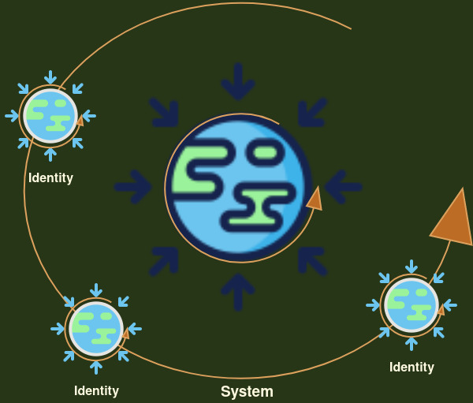

Before we try to wrap our heads around the "continuum" , we need to take another look at our linear reality. We can't travel back in past or go into the future. Unless we are in a science fiction , this unidirectional reality we observe with our senses, is our truth. The question is what is so special about our observations that we are served one moment at a time and once we move forward, there is no way to undo things ? 

## Nature of our observations.

The first obvious thing is all observations are based on our senses . We can extend our senses with tools, the machines or apparatus of science but any scientific observation , weather we use a powerful microscope or a large telescope , finally needs to be interpreted by our senses. Thus we can say our reality is basically a "Sensory Reality". Even this post that you are reading is because you are using your eyes or ears if you are hearing it. 

And the second is , observations are always of a finite duration. There is always a start and an end.  Just like any scientific observation, our own physical journey has a well defined start and a unique end. The most obvious fact of our life is it has finite duration. We were all born on a specific date . And we will sure die some day. There is no denial to this truth because this phenomenon is under our constant vigil - 24 by 7. Our life is our longest and most meticulous observation. And the good news is we don't need any apparatus of science to observe our life. We all have all the sensors, millions of them , pre built into us to test this sensory reality - the reality of own lives.

The thing about start and end is we can't fully perceive the boundary conditions. From boundary conditions, I mean the split second before the start and same after the end . We are always uncertain as to what led to the conditions where we are starting to observe and what happens after the observation. 

You may say that our own birth and death is kind of a unique situation because we didn't have fully developed senses at the time of our birth and in kinda similar fashion, our senses bail out on us when we are experiencing death. Absolutely true. And that is exactly what I am saying. The underlying reality precedes the inception of our sensory capability and it continues long after . Even if we do crowd sourcing , our collective experience here in this universe is a tiny fraction. All the things that precede our experience, we can only be speculative about them. And all the things that succeed ; we obviously have little to say about them. Don't get me wrong ; we have gotten very good at math but the problem is such speculations are too difficult to wrap our heads around. You would know what I mean if you ever ventured into the math of "String Theory" :-)  That is the reason we crave for an experimental proof because a mathematical model that is beyond our current experimental tests is just too difficult to comprehend. 

This is what forces us to become reductive in our experimental observations. We reduce the scope of our experiments . For example Heisenberg's uncertainty principle is flawless when we are observing the tiny subatomic particles but it is hard to test it at human scales. A beam of photons that we use to observe a subatomic particle , deflects the particle , thus we can't predict the position and velocity together with certainty.  At human scales, the beam of light doesn't make a big enough impact to alter the speed. But even at subatomic levels , the Heisenberg principle is not about the velocity of particles. It is about the information. It basically means that as soon as we observe the particle, we get uncertain about the boundary conditions. Velocity is just a reductive experimental observation to prove the point. 

Thus the generalized Heisenberg principle is about the limitation of our "observations". We can't be sure of the immediate past or the future.

## Limitations of Observation 

The other way to look at the uncertainty principle is - if we were certain about the immediate past or the future of our observation, then they are also part of our finite observation and then again we don't know what happened before or after . There is always something before we have complete knowledge of the process and there is always something after we close. We can continue to expand that split second to  say for 13.8 billion years and reach the start of the universe but there is still scope to pre-pone our start . It doesn't really matter if we are talking of our own birth or the birth of this universe , or for that matter any other sensory observation , there is always something more to know - something that created the conditions of our observation . Or something that created (or expanded) our sensory perception itself. 

We now assume that universe expanded in a split second before we have scientific fact of observation . We do have a concrete scientific evidence in cosmic microwave background radiations that take us as close to say four hundred thousands years from the big bang . And indirect evidence through gravitational waves might take us down to a pico second - a trillionth of a second close to big bang but there is still a pico second - and a vast unknown before that. That split second is what science believes where this universe became one from zero but it is beyond our observations.

## Arrow of Time

If we leave the murkiness before the start aside and the same that exists after the end of the observation, we can attach specificity to these two points. May be with some assumptions. Our senses are designed to take the shortest distance between these two points - the fastest way to consume. In a scientific observation we know this as "accuracy" of the machine.  We want our instruments to take precise measurements as quickly as possible. Faster the better. In normal life we can call this sensory attribute as "survival". Survival of the fittest means the most accurate and fastest way to consume what is available to our senses - food , information and entertainment - everything that we can perceive with our senses. 

In other words , this specific start and end is what gives us the illusion of linearity of time - the arrow of time. We can say, linearity of our time is an outcome of our sensory observations because senses always want to take the shortest distance, the straight line. Why so ?

## Desire

The definitive thing about our sensory perception is we always want to know about that split second. What happened just before the start ? And what is going to happen after the end. And it is quite logical. Let us say we are looking for a needle in a 'proverbial' haystack. The most logical way is to split the stack in two and search first half. If we found the needle, we don't need to search the rest. Else split the rest in the two halves and repeat the same operation. If we continue this operation many times, the stack gets smaller and smaller. Kinda a straight line.

If we don't find the needle at all in our stack, we can add little more of the hay from the field and repeat the same operation. In a way we always want to expand our sensory observation till we find what we are looking for. This algorithm of splitting the observable space in two and targeting one at a time is what we know as wave function. Wave is oscillation of our focus in one half and than another . As soon as we find our desired object - our needle , the wave collapses. 

If we don't find what we are looking for , we keep on extending our search space. Next page of google search. Than next and next. It is because of this reason we have already expanded our tiny box from our own lifespan to the lifespan of the universe - 13.8 billion years. Our tiny box is now a big universal box :-) , though we now have more questions than what we started with :-) The quest is endless and so is the supply of 'proverbial' hay. We can expand our search wave as long as we want. Smaller the wave amplitude , more like a straight line it is. And also there is no point in looking at the hay stacks that we already searched. That would be an awful waste of limited resources our senses have. So it is efficient to make the algorithm unidirectional. And particularly , if we know that the things are going to repeat in a circle as we will see in next few paragraphs when we look at our physical and meta physical systems.

In a way, wave function collapses as soon as we observe the particle. Or we can say , the particle appears because we are looking for it. But our senses have one more trick up their sleeves. As soon as we find what we were looking for, we deploy our senses into next quest. Again this is about maximising the useability of our senses. We don't want our machines to unnecearily idle.

Krishna says .. 
>Na [nor] Hi [certainly] Kashchit [anyone] Kshnam [a moment] Api [too] Jatu [at any time] Tishthati [stays - sit down] Akaram Krit [doing nothing];
>
>Karyate [forced into] Hi [certainly] Avashah [helplessly] Karma [actions] Sarvah [All] Prakriti-Jaih [born of their nature] Gunaih[qualities]

no one can sit idle even for a moment, at any point in time. All of us are forced into actions based on the qualities born out of our nature. 

This expansionary nature of our sensory perception is what we know as "desire". Desires are what makes us expand our sensory footprint. We want to have bigger home, bigger and many cars just the way want to know everything in our universe and beyond. Before our universe and after it. 

It doesn't really matter if my observations are small like those of a tiny insect or big like us humans , if our focus is expansion - that split second - then we are in pursuit of expansion - the desires. Our physical survival itself is manifestation of millions of such desires. Desires to breathe, eat , drink and procreate. In a way, we have already made a huge straight line what we know as survival. We have already transformed the underlying true reality and locked ourselves in our sensory box. Our tiny box ..

The question is what is underlying true reality. We understood that our desires make our sensory reality a unidirectional arrow of time but if we remove our senses or desires , there must be something out there ? If I stop observing , world should not cease to exist ! To make it easy to understand , we need to review our observation space. 

## Physical and meta-physical

If we see closely as to what we perceive, there are two types of systems in our sensory reality. The physical systems that we can perceive with our senses - we can touch or feel them; for example the earth as part of the solar system, or even the tiny atomic particles that we can observe through our extended senses. 

On the other side we have meta-physical systems. These systems are based in some physical system (or a mix of them) but we extend them further. For example a class room is based on physical four walls of a room in our primary school, but a class is lot more than just a room. It is a place for learning , networking and so many more things. We spend most of our lives in these mental constructs. These systems govern most of our sensory observations. Even if we observe, pure physicality, our interpretations (of observations) are invariably in the context of a meta-physical system. Even the scientific observations are with in some community, some society or some project. Unlike the physical systems, the meta-physical systems are highly elastic. We can shrink or expand them based on our desires. Thus desires exist in these meta-physical systems. 

Both physical and meta-physical systems have one thing in common. They both are continuously spinning. 

## The spin.

In our physical systems everything and everyone pulls everything else towards its center. Newton named it Gravity. Gravity is a fundamental force. This constant and impartial pull towards the center, gives everything a circular shape. Or a spherical shape if we want to see it in three dimensional model. Effectively in a large enough physical system, once we reach an equilibrium of some sort everything becomes spherical. We see it in planets , stars , galaxies and even in black holes. We know for sure that central pull exists no matter the size or shape. 

Inherent in this notion (of gravity)is the idea that we are also being pulled by everything else. Towards their center.  The existence of two such forces - inwards ; what we call centripetal force and outwards what we know as centrifugal force (may be due to the rotation) is a hallmark of every observable physical system. Btw we now know that gravity can be inflationary . If the core is made of energy rather than compact matter , gravity is repulsive. And also , the circular or spherical nature of our physical systems is more basic because that is preexisting to our observations of inwards or outwards pull. Two opposite forces exist because there is a continuous spin. 

This outwards pull is what gives the stars and planets their orbits or their identity because otherwise they will just fall into the central one. Lighter things revolve or rotate around more more massive things. Thus the notion of a system in which everything is spinning about itself and also rotating around something else. Planets rotate around sun. Sun rotates around a massive black hole at the center of the milky way and who knows milky way is rotating around some super super massive black-hole at the center of the universe. We don't know ..

Now in physical systems, we might see some particles or say some meteorites, that don't seem to obey this rule . They seem to be on their path but we know sooner or later they will merge into a planet or a star. Even the photons (light) shall bend around if the gravity is strong enough - say in a black hole. 

Even in the meta physical systems - say a class room. A teacher is the central force . In a family mom holds the strings together. In a nation there are governments as the central force and in business there is always a nasty boss looking over our shoulders :-) In a way , the meta physical systems are not that different from the physical systems - when it comes to spin. They may not appear to have a spherical shape but the very idea that there is a central agency, means they are spherical in nature. If we try to represent a top down model geometrically , we will end up into a circle on a 2 dimensional paper. In essence a circle or a sphere is the most probable configuration of our systems. 

So we get it that our meta-physical systems are circular, but how do we know they too are spinning ? For that we need to expand our observation window to a slightly bigger horizon. If we see the political history of any nation, the same set of ideologies rule the nations in a circular fashion. Liberals and conservatives take their turns at the helm one after the another. If you heard your parents, the advise is never to throw away your old clothes because the fashion repeats itself in about seven to ten years. Mark Twain once said that history doesn't repeat itself but it always rhymes. 

The other way to look at the circularity of the underlying manifestation is to see it from a distance. In our physical systems, the Earth appears flat because we are very close to it but Sun and Moon appears circular because they are at a distance. The notion of "distance" in our physical systems turns into a "dispassionate view" in our meta-physical systems. If we are too much vested into a political party, we feel that four years after the loss had never end. And after a win, we feel as if we are never going to lose again. The truth is cyclic nature is baked into the circular underlying reality. A wave is nothing but an elongated observation of a circle. Every crest must follow with a trough. It also means that if history is repetitive (or rhyming) , we obviously need not go back in the past. Neither do we need to traverse to the future because future is anyway going to come to us. A more efficient use of sensory apparatus that is busy in search is to wait for the next iteration of similar events. Thus it makes sense that our sensory reality is unidirectional and we feel we can't travel to past or future. Thus a unidirectional arrow of time with a cap on time travel is the most optimum set up for the search and that is what our sensory reality is. 

If this is so, the question is what is the purpose of our  linear stable reality ? There must be a good reason for us to chase survival ? The simple answer is nature is allowing us to build the skills.  In a way , our sensory reality is our training and testing ground. It is the launch  pad that enables us prepare for the next rhyme of the history. 

## Why Skills 

The notion that history repeats itself though always with a new(er) set of circumstances, means we can leverage the skills we develop but each time with a new set of challenges. Thus building skills is a useful exercise. Gita says building the skills is collection of something called `Daivy Sampad` - divine wealth. The  system - `Bramha` can assign us certain tasks only if we have some skills. That is very easy to understand. In our workplace , we get to do specific jobs based on what are our skills. If you are a good coder , you will get to code. If I am a good writer , I will get to write the  documentation :-) . Again, this is not to say one skill is better than other. All the skills are equally important. In the bigger universe, insects breed to clean up the mess, then other species evolve to clean up the insects. Thus evolution is about application of skills based on new set of realities. 

## Evolution 

The idea of evolution is very succinctly captured by Darwin in the phrase - "Survival of the fittest" . What does it mean to be fit ? Fitness is not about killing others. It is in being most skillful at the task that we are designed to do. It means most efficient application of our skills. The question , however, is how do we develop such skills. Gita suggests `Yazna` - ritual of actions ; as the means to perfecting our skills . 

## Yazna

Let us say you want to research on cellular biology. You want to understand it inside out. I guess you will grow the cells in a lab. May be from stem cells or some other tissue depending on what aspect you wanna study. It is almost impossible to understand cellular mechanism without having a real cell in your lab. And obviously, you need a lab. A lab is a place where you can remove all the external interactions. You can create a focused environment to study the scope you have in your experiment.

Think of `Yazna` as one of such focused environments that we create to figure out the true nature of underlying reality. `Yazna` has many aspects but the core of it is building a skill - doing all the things that you will otherwise do to build a skill in real life but doing so without attachment to worldly expectation. Why ? Because we want to remove all the "desires" from this particular observation. We want to see what happens if we take an elongated observation without the influence of desires. We will talk in great length about the skill building aspect of he `Yazna` in the section on  "Practice and Skills"  ; suffice to say here that Krishna says .. 

> Yajna-arthaat [Done for the sake of Yajna] Karmanah [actions] Anyatra [otherwise] Lokah [world] Ayam [this] Karm-Bandhnah [bondage by work];
>
> Tat [For it] Artham [for the sake] Karm [righteous actions] Kaunteya [O son of Kunti] Mukt-sangh [liberated from the curse of association] Samachara [do dexterously and balanced].

> Things that we do for the sake of `Yazna` - the ritual of actions, are `Karma`. Rest everything is a bondage to the pseudo reality. Thus do your  actions, liberated from the curse of association , external influences `Muktsangah `and with equanimity `Samachara`- looking at the things without any bias. Being `Muktsangah` and `Samachara` are the prerequsites to create a pristine lab - A lab where we want to act without desires. 

In a way , the very definition of `Karma` is the actions that we undertake to accomplish a `Yazna`. I may also add that `Yazna` is just part of `Karm Yoga`. `Karmyoga` includes righteous applications of the skill we build through `Yazna`. In a way, our linear reality is a lab where we can conduct `Yazna` and in addition it also provides us an opportunity to test those skills. 

Coming back to our example of cellular biology. If someone questions as to why are we conducting the experiment in the first place. May be we want to bring out a vaccine . May be we want to solve the mystery of cancer. May be we just want to understand how the cells actually work. The first two are called `Sakaam Yazna`. The last one , where we only crave for the truth is called `Nishkaam Yazna` - A `Yazna` without desires. You may say there is still a desire. A desire to know the truth . And you are right in your assessment. Even `Nishkaam Yazna` has an underlying desire for true knowledge but given that we already have a physical body ; we can't reach a state of `Absolute No desire` unless we know the truth. Thus this last desire is a valid one - the desire to know the our inner self. Our own copy of true knowledge. The true nature of our underlying reality - the continuum.

----

To sum it up and recap , Gita says that our senses are there to provide us a virtual world to hone our skills. Our goal is to develop the skills based on our opportunities in this tiny box. We test and apply these skills in this virtual world but the process of attaining these skills and their application, makes us aware of the underlying cyclic nature of universe - both at physical as well as meta physical levels. In other words, perfecting our game means exit from the game. The way to perfect our skills is to get a handle on our desires and indulge in ritual of actions `Yazna` without the curse of association and biases. Krishna says ..

> Yah [ one ] Tu [ but ] Atma-ratih [ busy in self ] Eva [ certainly ] Syat [ stays, remains ] Atma-triptah [ satiated  ] Cha [ and ] Manvah [ human ];
>
> Aatmni [ In herself ] Eva [ only ] Santushtah [ satisfied ] Tasya [ for her ] Karyam [ work,, duty ] Na [ does not ] Vidyte [ exists ] .
>
> But one who is busy in herself and stays satiated ; satisfied in herself for her there is no work.

Once we develop the skills, we need to act righteously based on our situation. In a way, the linear stable reality that we have is a gift. Not using this opportunity to the best is a wasted opprtunity. Krishna says ..

> Evam [thus] Pravartitam [ transformed ] Chakram [ cycle] Na [ no] Anuvartaytih [ adapts and practices; follows] Iha [ in this life] Yah [ one who];
>
> Agha-Aayuh [ sinful life] Indriya-aaramo [ seeker of sense gratification] Mogham [ uselessly] Parth [ Arjuna] Sah [ that person] Jeevati [ lives].
>
> Thus , one who doesn't adapts and practices this transformed cycle ; the way it is meant to be. Such a person , full of misconduct and seeker of sensory gratification, lives uselessly. Sensory gratification is in chasing the desires. The expansionary nature of our senses. Or taking the shortcuts on our duties.
