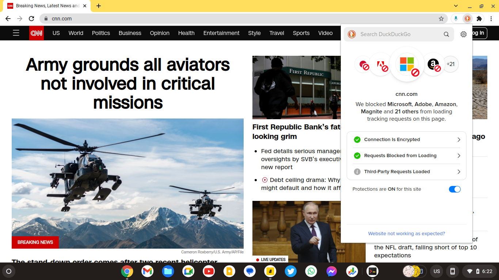

# Icons and navigation ..

As far as the features go, you can:

- toggle the chapter menu by clicking on the cheeseburger menu on top left: <i class="fa fa-fw fa-bars"></i>
- search the book using the magnifying glass: <i class="fa fa-fw fa-search"></i> 
- turn pages by clicking the left and right angles:<i class="fa fa-fw fa-angle-left"></i> <i class="fa fa-fw fa-angle-right"></i> 
- You can also navigate by using your keyboard's left and right arrows. 
- On the top right of the page, you can visit its Github <i class="fa fa-fw fa-github"></i> repository, where the source code lives.

# `arjunUvaach` ..
`arjunUvaach` is a collection of books and  essays around `Bhagvat Gita`. It is published using open source tools and freely available themes. The content is (being) written with open source tools as well. Part of the mission [^mission] of this publication is to promote "free" internet. "Free" in this context means - Cookies free , trackers free, advertising free and of course free as in free beers!

Since web-browser is a general purpose application, fine-tuning it for the purpose of pure "reading joy" is somewhat a necessity. And it sure isn't rocket science with light weight applications such as mdBook.

## mdBook
This website was generated using a program called [mdBook](https://github.com/rust-lang/mdBook). `mdBook` turns the written text [^text] into a website! That's a big deal for independent writers, because with this little tool a public domain book may reach any device that could run a browser [^browser]. The “web app” , thus created,  has several goodies baked in. For example 
- It handles the layout and responsive design so my focus stays on the content of this book instead of the architecture of the site. 
- At the same time, this application, keeps the essential book experience intact. Particularly on a tablet [^tablet]or even on a smartphone browser. It even supports the foot [^foot]notes :-) 
- One of the best (and probably least appreciated) feature of this app is "search" . The search, in here provides a three level view 

For example - if I search for `Siva`, as shown in the graphic above, it gives me the name of the book (`Mathura` in this case, the name of the chapter (Prologue),  and finally it shows me the name of the heading with in the sections. When you click on the search result , not only does it take to the appropriate section, it highlights the 'search term' in blue color for easy attention. 

### Theme
The theme is based on [maholvi](https://github.com/ashutoshmjain/maholvi). A yellow background with black care-free `Kalam` fonts form "Indian Fonts Foundry". Since this is the only theme I test-review from experience standpoint (before publishing), I have restricted other mdBook standard themes[^theme], such as `ayu` , `navy` etc.
### Favicon
The little picture right in front of your browser's url bar (where you type the address of the website such as https://gita.shutri.com) is called a favicon. 

The favicon for this web-app is a "Trefoil" knot. Trefoil is the first non-trivial knot - means it can't be further simplified into an "unknot" (a circle). In `Vaidik` scriptures, Trefoil is considered as the most fundamental `Karm Bandhan`. For living beings, this is the minimum needed for the life to exist. The three colors indicate the three basic potencies of creation - the color charges of particle physics or the three `gunas` of `Vaidik` science.

Trefoil knot is also "Chiral" - means the mirror image of Trefoil exists (Unlike a "circle" where mirror image has no meaning). In that sense, it is the first three dimensional structure that passes the "parity symmetry". A self contained mirror image allows the manifestation(s) to ask the question - who am I? - the very reason eternal knowledge binds itself into actions.

### Cover Photo
The cover picture is a pencil sketch of `Ganesa` by [Madan Maholvi](https://poems.shutri.com). 

In `Hindu` mythology, `Ganesa` is considered as the embodiment of superior intelligence. On account of his intelligence, he is the first  "problem solver" diety. In that, `Ganesa` (being the mind child of `Siva`) represnts the supreme consciousness. As per `Vaidik` science, the evolution (rise of consciouness) takes place to determine the answer to the profound question - "who am I?" The limitation, however, is `Ganesa` can't suggest the questions, he can only answer. Framing the right questions is left to the evolution. 

> One who has all the answers doesn't know of any question!

## Privacy

The mdBook application is highly customizable. It is for the writer to make sure that they don't use any "cookies or trackers". And the readers are saved from random profiling and pesky advertisements. Privacy is not only a readers' right, it is also a good design because it makes pages faster to load.

You can configure `Safari` (on a Mac) to block all the cookies. Press  "command + Comma"  in Safari to block the cookies, as shown below on the `Privacy` tab 

.. btw , if you did that , you won't be able to load most of the websites (eg facebook or Instagram)  because ..well you know why ! :-)

A better compromise is to use "duckduck go" privacy extension. It stops trackers (and cookies) that are there on the page for the sole purpose of profiling you but it allows those that are needed for the functionality of the website. Not an ideal case but still the best among available options. Not only it will save you from being profiled by hundreds of unknown data aggregators, it will help your pages load much faster.  And save you from those small videos clips at the bottom right of your screen that make the reading experience a living hell. I was surprised that reputed sites such as cnn.com use as many as 21 trackers, screen shot below

> As a rule, and design imperative, I don't use any trackers or cookies whatsoever. You can test it through "duckduck go" privacy extension. You will never notice any advertisements on these pages.

## About the content ..

As you will see when you toggle the chapters, this web app has two main sections :

- The first section — `Mathura` is a historical narrative that discovers the "writing revolution" when humans adopted “written word” as primary medium for preserving knowledge. I believe this revolution took place around seven thousand years ago when `Krishna Dwaipayana` scribed `Maha-Bharata`. Study of this first major shift in human cognition — from spoken to written word — makes a fascinating quest narrative. And at the same time, it might resolve the dilemmas we face as we are moving from analog to increasingly digital realm. 
- I also believe that the knowledge that `Dwaipayana` (also known as `Ved Vyasa`) wanted to communicate was summarized in `Bhagvad Gita`. He carefully, by design, kept it center-folded in a highly immersive narrative. So immersive that even after seven thousand years, the `Maha-bharata` is still as interesting a read as the day it was written. Thus the **second section** of this online resource provides original translation of `Bhagvad Gita`, followed by my essays discovering core concepts of Gita. This ‘point of view’ may be useful to "tech-savvy" readers who desire to see `Gita` in prevailing rationale of popular science.
- The third section `Maha-Bharata` is the original translation of the entire epic, done by `Kisari Mohan Ganguly`, at the beginning of last century. I highly recommend reading his [preface](http://mahabharata.shutri.com/) to review the guiding motivations of translation work — an immense task without the luxury of modern computing tools. 
    
The collective name of this entire work, is `arjunUvaach`! You may call it the name of this web-app, rendered to you at https:/gita.shutri.com . 

## Licence stuff

All the content in this website is under creatives common v1.0. Which means everything is under public domain. The net of this license is as below
 

 For more details please refer to details of [license](https://github.com/ashutoshmjain/gita/blob/main/LICENSE) at github repository for this work.

 Since `Mahabharata's` and it's translation by `Kisari Mohan Ganguli` is also in public domain , thus using any of this work should technically follow the same rules. 

## Style 

- I normally use maroon color for  `Hindi` or `Sanskrit`.  
- Hyperlinks are in "blue" color. 
- `Mathura` is a historical "narrative". The focus is on "narrative" rather than historical accuracy. 
- I refrain from using citations as much as possible. The reason is simple — it is NOT a narrative chasing accuracy. The goal is to imagine possible scenarios, and then review them with an eye to seek comparative probability. This also means it is a subjective discretion.
- Instead of building one concept, or one character, in a single chapter ; I rather try to visit the ideas in subsequent chapters. Thus order is important — each chapter builds on previous. Simple words, say for example "knowledge" , might take a different definition as you progress along. In absence of sequential reading, the article would still make sense, but it might lose the punch.
- It is not a didactic religious document ! The goal is not to impart `Gita`. And for a good reason — no one might ever tell it better than `Dwaipayana`. The purpose of this narrative is to seek that information that writer withheld at that time to avoid "stating the obvious". Having lost the context after thousands of years, we now crave for that information.
- Footnotes are used to avoid verbosity in the body of article, but they do carry useful information. For paucity of time, if you happen to "skip-over", or for keeping the flow of reading, I suggest to run by them after finishing the chapter. I try to keep chapter size small so that reader has time to indulge in foot notes :-)

## Contact

You can reach me at [whatsApp](https://wa.me/message/QTKE4LV2EBGCH1) for any questions or suggestions. Since I don't use any cookies or trackers on these pages, only way for me to know you are reading this text, is if you drop me a text ..hopefully of appreciation :-)

## research and notes:

[^mission]: Mission of this publication is to realize the original promise of the internet. A universally accessible, anonymous and clutter-free way to communicate. Free internet is beautiful. It is the biggest library and the web-browser is the most used app.  Some of the benefits of reading on the internet are 
- Truly decentralized and open system - There are hundreds of web browsers - offered by the biggest of corporations to the lone developers working off their garages.
- Open source alternatives - many browsers are fully open sourced such as Firefox. 
- Omnipresent - Browsers are available for every platform.  For popular graphical platforms such as Mac, Windows, iOS or Android, the choices are practically limitless.  Even for pure terminal users there are many choices - w3m, lynx, elink to name a few. 
- For writers, advantages are many. Prime among them is shaking off intermediary publishers and content aggregators. In addition, simple html allows infinite customizability. For tech savvy writers, markdown offers easy scribing. And the best is that publishing direct to the web is 100% free. 
- The content published directly to the web is future proof in the sense no matter the evolution of devices from desktops to smart phones to AR/VR headsets, the open internet content will always be available. The content locked in platforms such as Wikipedia or Facebook will always be subject to the policies of aggregators. It may go behind a paywall at a short notice, as happened in case of Medium.
- Universally accessible - Nation states may ban big platforms such as Twitter in China and Tiktok in USA, it is almost impossible to censor individual websites published directly to the internet. Even if that happens, changing the url isn't complicated. Web 3.0 is all about sponsoring censorship resistant perpetual content!

Browsers are particularly suitable for the long text ..
- Easily reach the embedded links for references and jump back in at your reading point  - that is the very purpose of the browser, but if you are reading on apps or devices such as "kindle" or on a epub reader or simply a pdf , this feature may not be as easily accessible. You will need to anyway fire up a browser.
- With text to speech plugins, most major browsers offer AI based reading. Which means you can listen to a page on demand. With onset of AI revolution, this feature is going to further improve.
- Offline reading - Yes, a page once loaded, can be viewed as long as it isn't refreshed. Thus webpages should be one full chapter. Even a small full book may easily fit in one web page these days. You can always save a page as a file on your computer with a single press of "ctrl+s" on most browsers.
- In-page and global search - most browsers let you search through the page with Control+f. In essence, you don't need book marks. Because book mark is the last word that you remember.
- Word meanings and pronunciations - simply select a word or phrase, right click and most of the browsers take you to a dictionary. "Safari" makes it even more intuitive with a little dialog box that pops on the word.
- Notes - you can easily add plugins such as "Zotero" to take notes. I am sure there are many other options.
- If you are into keyboards and shortcuts, then browser is something you already love. There may be some nuances for different browsers may implement different key bindings for the same shortcut. Or the shortcuts may be different on Windows v/s a Mac. One of the way to circumvent this problem is to use plug-ins such as "Vimium". Vimium or similar plugins are available for the big threes - Chrome, Firefox and Safari. Vimium implements uniform bindings based on "vi" that is almost like a universal standard, available for not only browsers but many editors, spreadsheets, photo galleries and countless other applications.

> That said, the reading experience on Browsers is compromised! You don't think of a web browser when you indulge yourself into a four hundred page book! This is partly because great content is NOT carefully "webbitized" but more because being the most open and used application, browsers are targets of prying eyes. Advertisers want to track your eye movements with trackers and cookies :-) Search engines and most content providers clutter the page with click-baits.  Instead of starting a twitter campaign, I thought why not create an ideal online resource (myself). And that morphed into kinda mission for this work.

----

[^text]: `mdBook` takes the text written in `markdown` format to publish it through the web app. `markDown` is an open source implementation that allows conversion of text into `html` format through a set of simple notations. 

---

[^browser]: Because of limited resources, I only use ‘Google Chrome’ for testing. Expectation is it should work on all browsers but all the features may not be available on older ones such as w3m or elinks that don't support javascipt natively.

---

[^tablet]: This book was “designed” for ‘in-browser’ reading experience on an Apple or Android tablet. It should work pretty well on kindle browser as well, if you want to read it in the bright sun light, though you will need an internet connection. Of course it will work fine on a laptop browser - duh:-)

---

[^foot]: When you click on the foot note marker in the main text, it brings you down to the relevant note at the bottom. You can always press the browser back arrow on computer (or on tablet) to get back to where you were reading - back to the foot note mark in the main text. Isn't that lot better than reading a paper book!

---

[^theme]: Modern  web-apps, offer a multitude of 'Themes' - the fonts, color combinations, and the font sizes. It is almost impossible to review the text though all the possible combinations. Thus a lone writer-editor must choose one to preview the write ups (:- . It was much easier in older times when all books had the same white-ish color and all words were mostly a shade of black :-)

---
