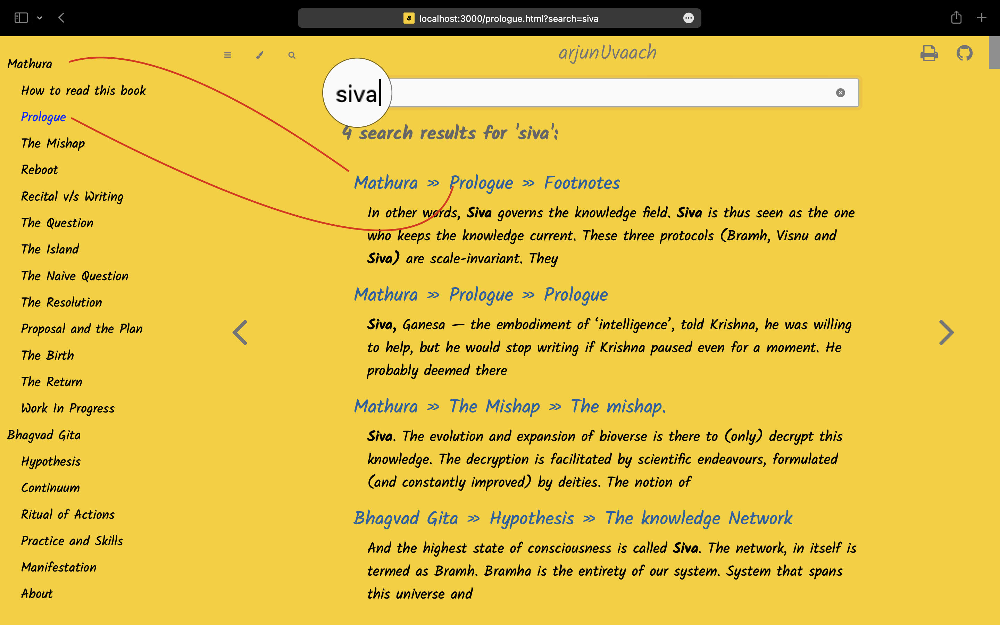
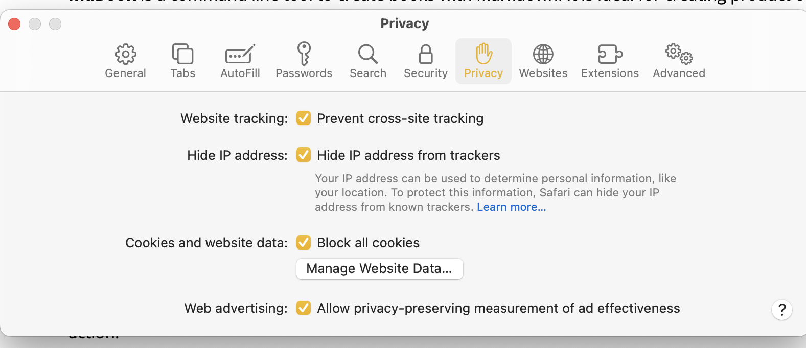

# How to read this book

As far as the features go, you can:

- toggle the chapter menu by clicking on the cheeseburger menu on top left: <i class="fa fa-fw fa-bars"></i>
- search the book using the magnifying glass: <i class="fa fa-fw fa-search"></i> 
- turn pages by clicking the left and right angles:<i class="fa fa-fw fa-angle-left"></i> <i class="fa fa-fw fa-angle-right"></i> 
- You can also navigate by using your keyboard's left and right arrows. 
- On the top right of the page, you can visit its Github <i class="fa fa-fw fa-github"></i> repository, where the source code lives.

This book was generated using a `Rust` program called [mdBook](https://github.com/rust-lang/mdBook). Well, it'll ‘technically’ be wrong to call it a "Book" because `mdBook` turns the written text[^text]into a website! That's a pretty big deal because with this little tool a public domain book may reach any device that could open a browser — a laptop, desktop, tablet or even a smartphone — no matter if it is an Apple device or one from Google or even what type of Browser [^browser], you may choose to use. Thus, it would be appropriate to call it a “web app” , that has several goodies baked in. For example 
- It handles the layout and responsive design so my focus can lie on the content of this book instead of the architecture of the site. 
- At the same time, this application, keeps the essential book experience intact. Particularly on a tablet [^tablet]or even on a smartphone browser. It even supports the foot [^foot]notes :-)
- One of the best (and probably least appreciated) feature of this app is "search" . The search, in here provides a three level view 

    

    For example - if I search for `Siva`, as shown in the graphic above, it gives me the name of the book (`Mathura` in this case , than the name of the chapter (Prologue),  and finally it shows me the name of the heading with in the sections. Since I use a heading for even "foot notes" , you can easily tell if the your search term is in the main chapter or if it is buried deep into foot notes ! When you click on the search result , not only does it take to the appropriate section, it highlights the 'search term' in blue color for easy attention. 

    There are few limitations though - Search index is being served to you over the internet (there is no central server), thus search index can't be too big. Which means if the book is too big , search gets painfully sluggish. That is the reason , I am publishing the third section of this online resource `Maha-Bharata` as a separate mdBook. The other limitation is, as of now search supports only English. Probably I haven't dug deeper into the features of this app! To circumvent this limitation, I am abstaining from publishing any text in script other than English. 

    Despite these limitations, I think search is by far the most useful feature, particularly for a narrative that tries to build a complex message interwoven across many chapters. I highly encourage the reader to use search if they are looking for any specific thing. It can even take you to the text you were last reading if you remember a line or few words — that is the best that technology could do without having the user to "register" for reading and keeping a track of your reading habits. 

- Last , but not the least ; **the privacy** :  the application doesn't use any "cookies or trackers" whatsoever. Which means no one is really watching what you are reading. A word of caution - your browser may still be tracking you ! If you care, I highly recommend using `Safari` on a Mac and block all the cookies. Press  <<command + Comma>>  in Safari and block the cookies , as shown below on `Privacy` tab 

    

    
    .. btw , if you did that , you may not be able to load most of the websites (eg facebook or Instagram)  because ..well you know why ! :-)

# About this book [grr - online resource]

As you will see when you toggle the chapters, this web app has three sections :

- The first section — `Mathura` is a historical narrative that discovers the "writing revolution" when humans adopted “written word” as primary medium for preserving knowledge. I believe this revolution took place around seven thousand years ago when `Krishna Dwaipayana` scribed `Maha-Bharata`. Study of this first major shift in human cognition — from spoken to written word — makes a fascinating quest narrative. And at the same time, it might resolve the dilemmas we face as we are moving from analog to increasingly digital realm. 
- I also believe that the knowledge that `Krishna` (also known as `Ved Vyasa`) wanted to communicate was summarized in `Bhagvad Gita`. He carefully, by design, kept it center-folded in a highly immersive narrative. So immersive that even after seven thousand years, the `Maha-bharata` is still as interesting a read as the day it was written. Thus the **second section** of this online resource provides original translation of `Bhagvad Gita`, followed by my essays discovering core concepts of Gita — from the vantage of a technical writer. This ‘vantage’ may be useful to "tech-savvy" readers who desire to see `Gita` in prevailing rationale of popular science.
- The third section `Maha-Bharata` is the original translation of the entire epic, done by `Kisari Mohan Ganguly`, at the beginning of last century. I highly recommend reading his [preface](http://mahabharata.shutri.com/) to review the guiding motivations of translation work — an immense task without the luxury of modern computing tools. 
    
    As said above, `Mahabharata` is too big to provide effective "mdBook search" feature.. My goal is to reformat this work in web-app format for obvious comfort of consumption on smart devices and search - it is a work in progress. `Maha-bharata` and this translation is in public domain, thankfully received from [sacred-texts](https://www.sacred-texts.com/). The benefit of reading it at [mahabharata.shutri.com](https://mahabharata.shutri.com) is obvious comfort of this presentation format (except for the sluggish search :-)

The collective name of this entire work, is `arjunUvaach`! You may call it the name of this web-app, rendered to you at https:/gita.shutri.com . 

# Licence stuff

All the content in this website is under creatives common v1.0. Which means everything is under public domain. The net of this license is as below
 

 For more details please refer to details of [license](https://github.com/ashutoshmjain/gita/blob/main/LICENSE) at github repository for this work.

 Since `Mahabharata's` and it's translation by `Kisari Mohan Ganguli` is also in public domain , thus using any of this work should technically follow the same rules. 

## Footnotes:

[^text]: `mdBook` takes the text written in `markdown` format to publish it through the web app. `markDown` is an open source implementation that allows conversion of text into `html` format through a set of simple notations. 

---

[^browser]: Because of limited resources, I only use ‘Google Chrome’ for testing. Expectation is it should work on all browsers but all the features may not be available on older ones such as w3m or elinks that don't support javascipt natively.

---

[^tablet]: This book was “designed” for ‘in-browser’ reading experience on an Apple or Android tablet. It should work pretty well on kindle browser as well, if you want to read it in the bright sun light, though you will need an internet connection. Of course it will work fine on a laptop browser - duh:-)

---

[^foot]: When you click on the foot note marker in the main text, it brings you down to the relevant note at the bottom. You can always press the browser back arrow on computer (or on tablet) to get back to where you were reading - back to the foot note mark in the main text. Isn't that lot better than reading a paper book!

---

[^experience]: Modern  web-apps, offer a multitude of 'Themes' - the fonts, color combinations, and the font sizes. It is almost impossible to review the text though all the possible combinations. Thus a time-pressed editor must choose one to preview the write ups (:- . It was much easier in older times when all books had the same white-ish color and all words were mostly a shade of black :-)

---
