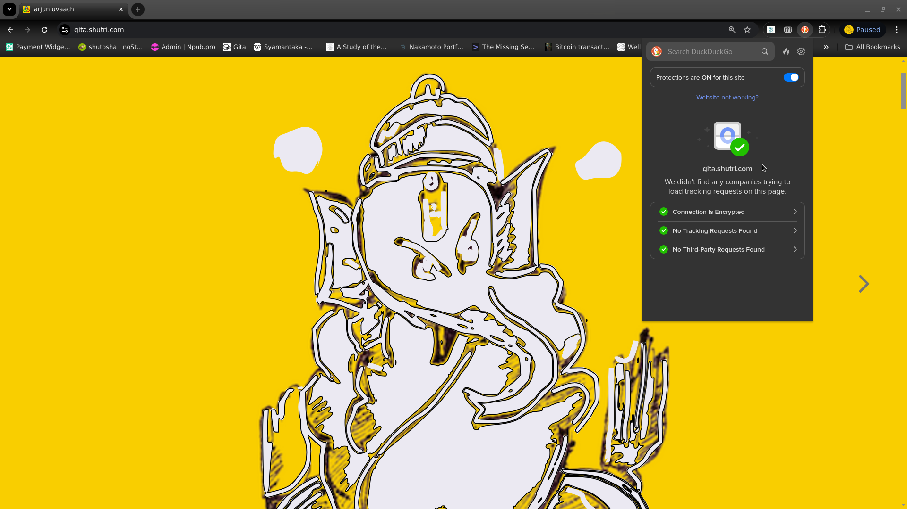

This web[^mission] publication aspires to dip into wisdom of  `Bhagvad Gita`, the first `Smriti`, from its history to its timelessness.  It is a "clean internet" publication.

 

In the beginning there was `Om` - vibrations of the underlying field.  Spoken language took originated from this source. Just like a river, it gradually filled up an ocean of words. Humans quickly developed exceptional conversations, but everyone had to individually remember the contextual history - and of course, the survival skills!

> Then we discovered scribing!  Given the difficulties of early days, only important information was scribed. The word "scripture" points to something important enough, and worthy of writing down.

Written text, thus,  became the collective memory. In Sanskrit, collective memory is called  `Smriti`.  Before we learnt writing, critical information was passed on through rigorous recital - not mere "word of mouth". Such information was called `Shruti` - communicated via listening. The Sanskrit word later morphed into `Shutri` in Hindi.

In modern parlance, world wide web is like `Smriti`, and `Podcasts` are akin to `Shruties`. Given that it is way easier to scribe text and record audio, thanks to computers and smart phones, we now have tons of scribed information, but the quality is questionable. Thus looking at the first `Smriti`, in both text and audio formats, opens up a profound source of wisdom.

---

`Arjuna` is the main character of `Bhagavad Gita`. He is blessed with vicinity of `Krishna` as his charioteer and thus the opportunity to ask questions directly to ultimate source of wisdom. `Arjun uvaach` - the name of this publication - means `Arjuna` said.

 

`Arjuna` was a life-long friend, and student of `Krishna`. His voice stands for the questions we mortals have when tested and confused. And also the magical discernment once `Krishna` unveiled knowledge unto him. Their conversation, amidst the battlefield of Kurukshetra, is among the most potent narratives ever penned down - `Bhagvad Gita` - gods' song!

At the end of this conversation, `Arjuna` said :

> `Nashto Moha , Smritir Labdha !`
>
> [I am] devoid off of illusions, [I] attained the universal wisdom - the collective memory!

It is not uncommon to experience a momentary relief from cyclic illusions (`Moha`). Such instances - normally a deep loss - often lead to depression. They leave the disillusioned in a vacuum. `Gita` on the other hand, spotlights truth through wisdom embedded in our intelligence (`Smriti`). Just the way large language models are trained on scrapes from internet, our own intelligence is trained on `smrities` - timeless books. `Gita` gives us tools to open the door to the very basis of our intelligence - our soul (`Atma`). Instead of a run to exit (`sanyasa`), `Gita` welcomes the precious gift we all are endowed with - human experience. In doing that, it provisions lasting peace and worldly success - a win-win. 

`Gita` is for everyone - it is not religion, race, profession or place specific. It is not even an ideology in terms of renunciation or materialism. In that, it takes our mind to a place of freedom, rather than the jail of a rabbit hole.

# Orthogonal publication:

`Arjun Uvaach` isn't a periodic publication. We don't have new articles every week - or on monthly basis. Instead, a new version of existing articles is published. An iterative approach to refine the text, and the insights therein. I call this approach "Orthogonal Publishing". The idea is to revisit articles as many times as possible to see if there are new insights. Repeat the process many times so that articles start relating to each other and finally take the shape of a well formed book. The side hustle is to capture the changes in a git repository -  to visualize the conversion of information into knowledge.

A summary of weekly changes are listed in the [changeLog](./changeLog.md) every week.

## Navigation and icons:

- cheeseburger on top left <i class="fa fa-fw fa-bars"></i> toggles the chapters' sidebar. On mobile devices, you may swap right. 
- search the publication using the magnifying glass: <i class="fa fa-fw fa-search"></i> 
- turn pages by clicking the left and right angles:<i class="fa fa-fw fa-angle-left"></i> <i class="fa fa-fw fa-angle-right"></i>. On mobile devices, the angles show up at the bottom of page.
- you can also navigate with left and right arrows on keyboard.
- The theme selection (brush icon) is currently disabled.

## Content:

If you toggle the sidebar, this web app has three main sections :

 

## Gita

The first section is original Sanskrit to English translation of `Bhagvad Gita` - by `Kiasri Mohan Ganguly`, circa 1896. 

`Bhagvad Gita` is the source code of `Karm Yoga`. While `Karm Yoga` is proven means to exit sufferings, it also benchmarks value-exchange. It establishes the spiritual framework for selfless pursuits (`Nishkaam Yazna`). 

> Open pursuits, without desires of personal gains, enable society adopt work (`Karma`) as primary measure of value. 

Work done under influence of desires - to seek preferred outcomes - skews the measure of effort involved. For example if you were seeking money, you may unknowingly inflate the effort on market fit; if you were seeking recognition, you may end up investing time in publicity and assume it as necessary part of work  - it is not.

Working without expectations is hard - but that is only the start. `Gita` goes a step further. It advocates to stay put on `Nishkaam` path even in the face of imminent adversity. Prime example being `Arjuna` - a warrior par excellence but trapped in `Moha`. At the prospect of fighting his clan, `Arjuna` wanted to shun his responsibilities. Through `Gita`, `Krishna` advised him to stick to his `Karma`. 

The translation is followed by an AI generated chapter wise podcast discovering core concepts of `Gita`. Podcast is designed as an easy listen for young English audience. It provides a verse by verse overview leaving the details for self exploration. 

On my path of discovery, I found writing the core concepts in my own language was useful. That led to number of essays I wrote. They may be useful to readers who are predisposed to see `Gita` in prevailing rationale of popular science. I would encourage serious readers to write their understanding in their own words. Writing and revisiting the content, on daily basis, is the best way to train our intelligence - `Smriti`.

## Mathura (work in progress)

The second  section is a historical narrative.  It discovers a period some five thousand years back - around the city of `Mathura`. It ventures into the time when we first adopted written word as primary medium for information storage.

Text was a profound discovery. With it, we learnt to send information to distant places - and to future generations. `Gita` was the first written message preserved for the future. It was encapsulated in a large carrier narrative - `Mahabharata`. The carrier narrative went through multiple iterations - for around six hundred years - but `Gita` stayed immutable. The reason is simple - there is only one version of truth.

`Gita` defined `Karm Yoga` as a path to accumulate value - `Daivvy Sampad`. And gradually merge into the most valuable - one immutable and inexpressible knowledge. Despite scholarly attempts to decipher, it stays a mystery as to how someone could articulate a message so pristine - unless it was a divine intervention -> hence the name gods' song !

`Mathura` was the hotspot of writing revolution - our move from speech to text - as an external store of information. `Mahabharata` was written down and unveiled here in series of eighteen books. In addition to immutable truth in `Gita`, the written word laid the foundations for spread of gold - as a portable  store of value - somewhat like what internet is doing to enable and spread the use of bitcoin. 

> Value store must follow the properties of information store. If information could be sent to distant places, value must do the same in space and time !

## Mahabharata

Divine author `Krishna Dwaipayana`, by design placed `Gita` center-folded in a highly immersive narrative - `Mahabharata`. Even after thousands of years, the epic is as interesting a read as the day it was written. 

The third section is the original translation  of `Mahabharata` - the longest poem, ever written in any language. I recommend reading `Ganguly's` [preface](http://mahabharata.shutri.com/) before you take a plunge - to appreciate the guiding motivations of translation work.

## Clean internet 

The way oceans are filled up with plastics, the internet is infected with countless cookies and trackers. Some of them useful for the functions of websites - but most to profile the users - to serve them pesky ads. Put together, they have turned the internet into a giant advertising billboard, if not a surveillance apparatus!

An immune response is the rise of freedom tech - privacy tools - VPNs, ad-blockers, encrypted chats, and scramblers.  These tools are not only complicated, they make internet slow. My aspiration is to provide a reading experience as it was meant to be - Cookies free , Trackers free, Advertising free - without the reader having to use privacy crutches. 

As a rule, and design imperative, I don't use any trackers or cookies whatsoever. You can test it through "duckduck go" privacy extension. It should show up as below ..

**The goal is NOT to fight ! Internet is too big to change and all models of content delivery may co-exist! It is only to do my part as a digital native - leave the place as clean as I found it.**

## Open source tools

Since web-browser is a general purpose application, fine-tuning it for readability is somewhat a necessity. I use an open source publishing tool [mdBook](https://github.com/rust-lang/mdBook) to bind[^text] these pages into a book-like reading experience. The web-app thus created has many features :  

 

- It handles layout and responsive design, so my mind stays on the content - instead of technology. 
- It keeps the essential book experience intact - even on a tablet or smartphone.
- Website may be installed like an app. Browser based apps are called [progressive web apps](https://developer.mozilla.org/en-US/docs/Web/Progressive_web_apps/Guides/What_is_a_progressive_web_app). They can be installed on computers or smart devices for offline reading.
- The app comes with three tier search - probably the least appreciated feature !  For example - if I search for `Siva`, it gives me the name of the book, chapter, and section heading. When I click on the search result , it highlights the 'search term' in blue color. 

Content is written in Markdown on Vim - both open and time tested. I mostly use Debian - a fully open distribution of Linux.

## Theme

The theme is a [custom design](https://github.com/ashutoshmjain/maholvi). A golden background with black `Alkatra` fonts form `Suman Bhandary`. I have restricted other standard themes[^themes], such as rust, ayu or navy because this custom theme is the (only) one I test from readability standpoint.

## Favicon

The favicon[^favi] for this web-app is a [Trefoil Knot](https://en.wikipedia.org/wiki/Trefoil_knot). Trefoil is the first non-trivial knot - it can't be simplified into an "unknot" (a circle). In `Vaidik` thought trefoil (`triguna`) is the fundamental `Karm Bandhan`. The three colors indicate the three basic potencies of creation - the color charges of particle physics or the three `gunas` of `Vaidik` science.

## Cover photo

The cover picture is a pencil sketch of `Ganesa` by [Madan Maholvi](https://poems.shutri.com). 

In `Hindu` mythology, `Ganesa` is the embodiment of superior intelligence. `Ganesa` being the mind child of `Siva` represents the supreme consciousness. As per `Vaidik` science, the evolution (rise of consciousness) takes place to answer the question - "who am I?" The limitation, however, is `Ganesa` can't suggest the questions, he can only provide the answers. Framing the right set of questions is thus left to the evolution. 

> One who has all the answers doesn't know of any question!

## Licence

The publication is under creatives common v1.0. Which means everything is under public domain. `Mahabharata` and it's translation by `Kisari Mohan Ganguli` is also in public domain 

The net of this license is as below

 

The fonts used are under SIL OPEN FONT LICENSE Version 1.1 - 26 February 2007

## Style and motivations:

- The content is designed for reading in a desktop or tablet[^tablet] browser.
- I normally use maroon color for  `Hindi` or `Sanskrit`.  
- [Hyperlinks](https://shutri.com) are in "blue" color.
- The background color is Gold #f9ce00
- The font is Alkatra.
- `Mathura` is a historical "narrative". The focus is on "narrative" rather than historical accuracy. 
- I avoid citations as much as possible. It is not a narrative chasing accuracy. The goal is to imagine scenario around the time we adopted written word - as primary store of information. There is obviously no written history to refer to.
- Instead of building one concept, or one character, in a single chapter ; I visit the ideas in subsequent chapters. Thus, order is important — each chapter builds on previous. Simple words, say for example "knowledge" , might take a different definition as you progress along. In absence of sequential reading, the article would still make sense, but it might lose the punch.
- The goal is not to impart `Gita`. And for a good reason — no one may ever tell it better than `Dwaipayana`. The purpose of this narrative is to seek the information that writer withheld to avoid "stating the obvious". After thousands of years, we now crave for that information - events that led to scribing.
- Footnotes[^foot] are used to improve the reader flow. They do carry useful information. If you happen to skip-over, I suggest running by them after finishing the chapter. 

## Tips and Donations:

Tips normally mean you are happy with your worker. Donations are something that show you support a cause. I may be wrong in my definitions - but you can't go wrong in supporting this work - either "tips" or "donations" - both are welcome. You can use the donation box below to send money in `Satoshies` - commonly called `Sats`. Sats are convenient because there is no credit card involved or computations for the exchange rates - it is one simple global money for the internet.

<lightning-widget 
  name="Thanks for supporting the publication" 
  accent="#f9ce00" 
  to="shutosha@primal.net" 
  image="https://nostrcheck.me/media/5af0794606a15b5641e25aa23d04af4cb0d7d5e68b11cacb47e56a4698fca8c4/49ff6d00cb5bc819cd19f77783d4815fbd46a5b99b6fbdead1eaecfab798187b.webp" 
/>

To send Sats with above widget, you will need a "lighning wallet" . Please visit [free lighning address](https://lightningaddress.com/) for a choice of wallets. Wallets are available for pretty much every platform and jurisdiction. They are extremely easy to install. One of the motivation of this publication is to promote the usage of Sats as a medium of monetary exchange.

## notes and other stuff:

[^mission]: This publication aspires to adhere the original promise of the internet. A universally accessible, anonymous and clutter-free way to communicate. Free internet is beautiful. It is the biggest library and the web-browser is the most used app.  Some benefits of reading on the internet are 
- Truly decentralized and open system - There are hundreds of web browsers - offered by the biggest of corporations to the lone developers working off their garages.
- Open source alternatives - many browsers are fully open sourced such as Firefox. 
- Omnipresent - Browsers are available for every platform.  For popular graphical platforms such as Mac, Windows, iOS or Android, the choices are practically limitless.  Even for pure terminal users there are many choices - w3m, lynx, elink to name a few. 
- For writers, advantages are many. Prime among them is shaking off intermediary publishers and content aggregators. In addition, simple HTML allows infinite customizability. For tech-savvy writers, markdown offers easy scribing. And the best is that publishing direct to the web is 100% free. 
- The content published directly to the web is future-proof in the sense no matter the evolution of devices from desktops to smartphones to AR/VR headsets, the open internet content will always be available. The content locked in platforms such as Wikipedia or Facebook will always be subject to the policies of aggregators. It may go behind a paywall at a short notice, as happened in case of Medium.
- Universally accessible - Nation states may ban big platforms such as Twitter in China and TikTok in the USA, it is almost impossible to censor individual websites published directly to the internet. Even if that happens, changing the url isn't complicated. Nostr protocol is all about censorship resistant perpetual content!

Browsers are particularly suitable for the long text ..
- Easily reach the embedded links for references and jump back in at your reading point. You may laugh off this point as "obvious", but if you are reading on apps or devices such as a  "kindle", this feature may not be as easily accessible. You will need to anyway fire up a browser.
- With text to speech plugins, most major browsers offer AI based reading. Which means you can listen to a page on demand and possibly in many voices. With onset of AI revolution, this feature is going to further improve. Days are nit far that every web page would sound like a well crafted podcast.
- Offline reading - Yes, a page once loaded, can be viewed as long as it isn't refreshed. You can always save a page as a file on your computer with a single press of `ctrl+s` on most browsers.
- Notes and bookmarks - One of the most interesting thing on the web-browser is to take and save your notes on the note-taking app that you regularly use. For example on Android, I normally use "Google Keep" for my notes. Simply select a piece of text on the page and share it with Keep. Google will not only save store and let you edit your notes later, it will also bookmark the exact place on the webpage where you picked up the note - again, it's not only a link to the webpage , it is to the exact lines your selected on the page. I use this feature not only to take a note but also to store my bookmarks in one place. For example if I am reading say five different long posts on blogs or news sites, I just share a line with my Keep to remind me where I left the page 
- Word meanings and pronunciations - simply select a word or phrase, right click and most of the browsers take you to a dictionary. "Safari" makes it even more intuitive with a little dialog box that pops on the word. On Chrome, you can install "Google Dictionary" extension and Firefox's most recommended add-on for the spell is "dictionary anywhere" among hundreds others. 
- If you are into keyboards and shortcuts, then browser is something you already love. There may be some nuances for different browsers may implement different key bindings for the same shortcut. Or the shortcuts may be different on Windows v/s a Mac. One of the way to circumvent this problem is to use plug-ins such as "Vimium". Vimium or similar plugins are available for the big threes - Chrome, Firefox and Safari. Vimium implements uniform bindings based on "vi" that is almost like a universal standard, available for not only browsers but many editors, spreadsheets, photo galleries and countless other applications.
- You can save a snapshot of a webpage as a legal proof with open archive's "wayback machine". [wayback machine](https://archive.org/web/) allows you to catalog web pages even if the site is totally removed from the internet. 

> That said, the reading experience on Browsers is compromised! You don't think of a web browser when you indulge yourself into a four hundred-page book! This is partly because great content is NOT carefully "webbitized" but more because being the most open and used application, browsers are targets of prying eyes. Advertisers want to track your eye movements with trackers and cookies :-) Search engines and most content providers clutter the page with clickbaits.  Instead of starting a twitter campaign, I thought why not create an ideal online resource (myself). And that morphed into kinda mission for this work.

----

[^text]: mdBook takes the written words in "markdown" format and churns out a fully deployable webApp.
- markDown is a "translation engine" that translates a piece of simple written text into HTML that is easily understood and parsed by web browsers. You still need to follow markdown notations. It is not a bad deal because markdown notations are lot easier than typing HTML tags.
- markDown is pre-built into mdbook.  It thus takes the text written in Markdown format and converts it into a static website that looks and feels like a book. You still need a server to deploy this website. And you still need to connect it with a domain name.
- a static website is something that doesn't change its content till a new version is deployed. 
- Since static websites put minimal load on the web-servers, places like GitHub or Gitlab allow free hosting and publishing. They also allow connection to your own domain name if you have one.
- If you are a Nostrich you already know you can publish text to any number of nostr relays - a much better option for the writers because you are not tied to one walled garden, and you can possibly monetize your work.

---

[^themes]: Theme
- Modern  web-apps, offer a multitude of 'Themes' - the fonts, color combinations, and the font sizes. 
- Though choice is a good thing, it is almost impossible to review the text though all the possible combinations. Thus, a lone writer-editor must choose one to preview the write-ups (:- . It was much easier in older times when all books had the same white-ish color and all words were mostly a shade of black :-)

---

[^favi]: Favicon
- The little picture right in front of your browser's url bar (where you type the address of the website such as https://gita.shutri.com) is called a favicon. 

---

[^tablet]: This content is “designed” for ‘in-browser’ reading experience on a laptop or a desktop. It should work pretty well on Tablets and Smartphones, even on a Kindle browser (if you want to read it in the bright sunlight), but the mainstream browsers ( Safari and Chrome ) are purposefully kept dumbed down on smart devices. For one, you can't install extensions or "add-ons" on most of the browsers on smart(er) devices :-) I prefer [Kiwi](https://kiwibrowser.com/) Browser just because it allows me the ability to add extensions. Kiwi uses open source Chromium project as the base along with web kit. Highly recommend.

---

[^foot]: Footnote
- When you click on the footnote marker in the main text, it brings you down to the relevant note at the bottom. Think of it as a hyperlink with in the page.
- You can always press the browser back arrow on computer (or on tablet) to get back to where you were reading - back to the footnote mark in the main text. Isn't that lot better than reading a paper book!

