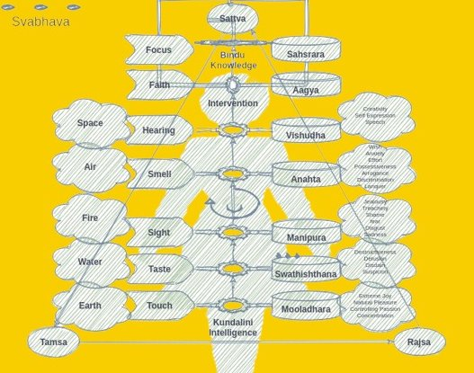

The craft of reciting `mantras` with an ascetic lifestyle purposed to a singular focus on diction, was called `Naad Yoga`. This `yoga` must be practiced with a strict daily routine (`Bramhacharya`). The idea was to tune human body into memorizing, understanding, and chanting - switching all material distractions off - an expression, so profound that it became an art form.

 

`Abhivaykti`, in `Sanskrit`, means expression - the final act of all creative pursuits. In `Vaidik` science, there were two primary expressions - `Naad and Mudra`.

> While inner (evolutionary) knowledge is inexpressible (`Avykta`), knowledge acquired through external means could be expressed (`Vykta`) - to varying degree of success. A distinction must be made here between information and knowledge. Information doesn't have the manifestative potency - knowledge has. Most of the communications we receive are information. For example the user manual is information. It may answer "how to use the gadget" -  it wouldn't enable you build one.  In order to convey knowledge - the ability to manifest - both sender and the receiver must be willing to put in enormous repetitive efforts - `Yazna`.

`Naad` was original expression of external knowledge - rigorous spoken content with manifestative potency - `mantras`. In contrast, `Mudra` was that of internal knowledge. Since internal knowledge is already manifested into  beings and things, presentation of human body in various forms was deemed an expression to celebrate the existence. Old Indian dance forms such as `Kathakali` are based on `Mudra` - so are the ancient carvings on cave walls. They wouldn't enable someone recreate the universe, but they allowed to express gratitude. In that sense, `Mudra` was considered an expression of devotion, whereas `Naad` was that of human pride - only humans had the capability of sophisticated verbal communication. Both were, nevertheless, termed `Yoga` because they were connected to knowledge . `Yoga` simply means connection to the underlying field of knowledge - sometimes referred to as `Param-Atma`  - the source of all souls manifested in the observable.

With passage of many millennia, `Naad` is now morphed into elocution, vocals and music; and `Mudra` is seen as the origin of performing arts - dance, sculpting and painting. `Siva` is believed to have created both art forms to please his soulmate `Adi Shakti` - the first force. `Siva` is also known as `Adi Yogi` - the first `Yogi`. One who is connected to both internal and external knowledge and is thus capable of expressing both.

Humans developed exceptional sophistication in vocal expression. In West, vocal expression reached its pinnacle in "opera". On the Eastern side, it achieved perfection in `Vaidik` recital — a format so distinguished that spoken `Sanskrit`, finds it's roots in `Vaidik` recital.  Vocals, however, had a limitation - they were not the best storage medium. Reciters always inflicted their own distortions besides forgetting if they missed few days of practice. The bigger problem, however, was that of portability - vocal communication needed physical proximity.  Written word had to be invented to circumvent these limitations. As the body of knowledge expanded, `Naad Yoga` split into two faculties -  research and recital. Research was later named `Nyaan Yoga`, leaving the original name to pure recital. `Mudra` was further refined into `Hath Yoga` - the complex body postures (`Aasnas`) to stretch and unlock internal energies - the common perception of `Yoga` in the West. 

A `Nyaan Yogi` would conduct `Yazna` (the repetitive actions) to go deeper in pursuit of "hundred skills". A `Naad Yogi` would do the same for the purpose of undistorted rendition. Both were complimentary to each other. There was no point in cumulating knowledge if it couldn't be preserved - over generations. Similarly, there was nothing to recite if it didn't carry specific knowledge. Thus, `Naad Yogies` worked in close interaction with `Nyaan Yogies`.  The role of `Vyasa` was of utmost importance in holding these two arms of `Yoga` together. It was like a bridge between expertise and expression -> hence, a very sought after title, and one that needed dexterity in both. `Vyasas` controlled the flow of information — somewhat like the editors of main stream media these days. They decided what must go to the public consumption, & what could be left to obscurity. 

This arrangement for cultivation and communication of knowledge through rigorous focus (and gratitude) is called `Snatana Dharma` - a faith that has no beginning and the one that never decays. `Sanatana` was the way of life for at least ten generations of `Vaśiṣṭhas` - starting well before `Rama` and going up to the days of `Krishna`. During this period, it gathered enormous social and political capital and thus the driver seat on direction of mankind. 

With great power came the conflict. Some `Nyaan yogies` wanted to make their work imperishable by committing it to a text themselves - they probably felt ignored by reciters! On the other side, such attempts were cursed - they were seen as lustful acts to undermine the sacred tradition. They were anyway destined to fail, for the written language was not standardized. And writing tools were still in their infancy.

## 3.1
----

An ascetic lifestyle was important for `Naad Yogies`. Not only was it necessary for extreme focus on recital, rich hosts would select a trusted rites-admin only if they believed the ritual maker didn't want any of the material gains — an assurance that all the blessings would come directly to the host (without any cut). In a way, rites were the marketplace between humans and their deities where a `Naad Yogi` acted like a catalytic intermediary. Humans invested their allegiance, time and money while deities provisioned things they wanted in return. No one knew for sure if the marketplace actually worked, but it was a matter of belief, and it worked for those who believed. In addition to apparent divine exchange, the arrangement funded the ‘knowledge ecosystem’. At the same time, rituals normally followed with charity to the poor. This reinforced the status of the powerful hosts. To the world, it appeared as if `Naad Yogies` endorsed the their hosts; giving legitimacy to their endeavours. Generational cycles of this model led to a highly federated power structure. Every rich house had the rights to bear arms to protect their wealth with a direct line of command to the king.

The rich hosts and the powerful, as patrons, provided enough alms and homage to allow `Yogies` invest their time in spiritual as well as in material research. This primary research led to groundbreaking insights that centuries later influenced at least four major religions — Hinduism, Buddhism, Jainism and Sikhism; along with hundreds of factions that thrive in South East Asia - and beyond. Not only religion, it also formed the primitive basis of science that includes linguistics, mathematics, cosmology, medicine, surgery, and lot more. It was like the "open source" movement of our time. `Yogies` shared their knowledge free of charge and lived on donations hence collected. That said, the ritual hosts did get early access to the new insights simply because they were close to the `Naad Yogies`. These insights led to them excelling in their pursuits; and hence more wealth - a virtuous cycle. Such successes were seen as the blessings of deities. 

The formalization of rituals ensured the knowledge stayed immutable over the course of passage from one generation to the next. Imagine a world without written word - no books, no libraries and of course no internet. In that world, `Naad Yogies` would recite for days to a gathering of entire village without missing a single beat or breath (`Prana`). They were the vessels of knowledge that held water from different streams of `Nyaan Yoga`. For example a skill such as a `Vaidya` (doctor) may need to know botany (`Vrakayurveda`); human anatomy (`Ayurveda`); and horticulture (`Krushi`). This would allow him to understand the properties of herbs, how to use them to cure diseases; and how to grow them - a complete package. On the other side, a `Nyaan Yogi` would focus all his time and energy only on one stream.

Collectively `Naad Yogies` were called `shutosha`. The syllable `shut` stands for the hundred (skills) - a doctor or a metallurgist etc. And `osha` means a cumulation - for example in `Sanskrit` a treasury is called `Kosha`; `Santosha` means satisfaction available to saints.

## 3.2
---

The literal meaning of word `Naad` is a dense voluminous sound, produced from the bottom of lungs. For example - the roar of lion (`Singh`) amidst a dense forest is called `Singh-Naad`. Most of the `Acharyas` (teachers) were necessarily `Naad Yogies`. Through years of practice (and sacrifice), they had learnt to channel internal knowledge in upper `Chakras`[^chakra] -  in heart `Chakra` (`Anahata`) for compassion, and in throat `Chakra` (`Vishudhi`) for vocal perfection. 

Moving energy to upper `Chakras` was a distinguished proof of being superior to rest of the species. Other species held the life energies in two lower `Chakras` — `Swadhishthana` (sexuality) ; and `Manipuraka` (consumption).  By moving energy up the spinal column, referred to as raising the `Kundalini`, `Naad Yogies` separated humanity from animal kingdom - first quantum jump that made humans a representative identity of all mammals. Being a representative, they must watch for the benefit of all - `Sarv Eva Bhavantu Sukhinah` - peace and prosperity for all. They believed it was `Naad Yoga` that made humans bipedal in the world of quadrupedal mammals. Not only that taller you stand, farther you could see and speak ; the vertical spinal column allowed the `Kundalini` to rise, thereby opening access to upper `Chakras`. 

The `Chakra` system was believed to be closely linked to the five senses. Each sense represented an element - as shown in the graphic below. The way a sense was to an external element, a `Chakra` was considered the nerve center of internal traits - `Vritties` [^traits].

    
 

By bringing life force to throat, `Naad Yogies` perfected the repeatable public recital, making it an ‘art of vocal expressions’. If your interest is peaked in what kind of renditions were these, I recommend listening to this one-minute clip of `Shanti Mantra` from `Brahmin` priest Santosh Mudgal [here](https://www.siddhayoga.org/shanti-mantras/om-dyauh-shanti). Notice the stresses on the syllables and over-all elocution. `Vaidik` elocution is a complete genre of rendition practiced standing tall or sitting in upright position. Speech is restricted lying down or any other posture (`Aasna` or `Yougic Mudra`) that curls the spinal column. A curled up spinal column was believed to obstruct the rise of energy from lower to upper `Chakras`. 

In a way `Naad` was an improvement over `Mudra`. Humans first perfected facial and body gestures (`Mudra`) that gave them an edge over predators. Once we accomplished physical security, speech took over for it enabled the barter for value-exchange. Barter was based on immutability of "spoken word". A popular quote from `Ramayana` in local dialect is ` Pran Jahi per vachan na jahi` - means one may sacrifice life but never go back on the spoken commitment. It was the underlying principle of barter.

## 3.3
---

There was no “generally” cherished art of 'writing'. The primary use of written word was to send telegrams through pigeons. Short, cryptic and perishable. There were attempts to write messages on the cave walls or on the interiors of temples. Small chisels and hammers were adapted (from sculpting) for this purpose but the process remained utterly time consuming as well as painstaking.

Some researchers (`Nyaan Yogies`), did consider the idea of converting the `Mantras` into text format — even before `Parāśara`, for obvious advantages of durability and portability.  What if all the `Vyasas` died? What if human race met its demise though epidemic, or other extinction level event. The ancient wisdom must be preserved beyond human shelf life. Those questions existed, but without the comfort of a Mac, “writing” was a herculean task! Jokes apart, "writing" was considered a solo training of mind - an attempt to train our neural network - `Sahsrara Chakra`. And reading was akin to getting lost in one's own brain. The idea of a book was similar to visiting an immersive virtual reality in the eighties - an impossible craving that appeared to have no chance of success.

There were some bold attempts. But they were mostly experimental in nature — half-baked, grammatically obsolete and contextually incoherent. The focus was not on the content. It was on the 'writing apparatus' or to test the claims of writing aficionados. The advocacy on the pro-text side was the obvious notion of asynchronous freedom. Some of them believed in the crazy stuff - they claimed if text could be passed from one generation to the next, the reverse should also be possible - written word , being time insensitive, might flow from future to the past. They called such a flow "Divine information" . And the promise that the divine information could be made accessible to all. The idea had a sound logic - if someone read a book say ten generations from now, they would be able to build today's world in their minds. And given the rate of progress, what if they could correct the mistakes in our current thinking ! Wouldn't that change our own world? Books, they thought, were the bridges of continuum.

Such grand claims aside, there were immediate benefits. It allowed the `Nyaan Yogies` engaged in life long pursuits to remember intermediate discoveries - something like taking notes and reminders! In absence of a version management system, in the end they could inform how it worked but they themselves lost the knowledge that accumulated one step at a time with each iteration. In essence they knew how but very few could tell why! The "why" was acquitted to deities.

Majority of the `Vyasas and Naad Yogies` didn't believe written word could ever replace the rigor and authenticity of recital. Some beneficiaries of spoken layer, even announced that efforts to ‘jail’ the wisdom into written symbols was downright demonic. Somewhat like main stream media's nervousness towards internet aggregators these days! Though writing meant lot more content could be scribed, and passed on to far-flung places; but the act of writing (and reading) wouldn't invoke elemental powers — they thought! Their arguments, sometimes, sounding sheer absurdities -  how would you send the homage ,  the butter (`ghee`), fruits and milk to the deities without proper ritual? Other times the arguments were even more vicious - they thought that the written words were sent by the demons of future for they always invoked concepts and ideas that were unthinkable in the past. As if spoken word was "here and now" truth, written word a far fetched fantasy !
 
## 3.4
----

The "recital-model" had seen eighteen generations of `Vaśiṣṭhas` - it was fully saturated by the time of `Parāśara's` birth. One of the reason it warranted a lash-back was - somehow, the ritual had gotten more important than the content. While writing had no payback, chanting meant they could perform the rites for the kings and the rich, in lieu of ‘necessities and niceties’. Rich were mandated to perform rites at least sixteen times through their life span — birth, marriage and death being the major milestone rituals. In addition, every year, they must perform a rite for the peace of their dead — `Shradha`. Kings had even more rituals at their hands. In all, it was a flourishing economy of rituals and ritual makers.  Priests were more important than a family physician ! Kings didn't even take on a simple journey without consulting their spiritual `guru`. The organised religion was still a thing of future but the clout many leading reciters enjoyed was a beginning of faith intermingling with politics. The nexus of politics and faith is a vicious cycle for they feed on each other. Reciters were turning into the gate keepers of power.

Writing, on the other hand, had no such incentive. There was no kindle book store, no way to barter the text. It did have a promise to democratize the information and that did appeal to some, but such people were few and far. Most felt a commoner had no reason to access `Vaidik` knowledge without a qualified gate keeper. And most thought the job of a `Vyasa` was eternal — fully protected till the end of humanity - immortal. Those who didn't believe in rituals and thus by extension defied the `Vaidik` wisdom were named `Asuras` — a class of outspoken people just short of being a monster (`Rakshsa`).

New rituals were being added left right and center. A new ritual if you want to enter a new home. Another if you bought a horse and a cart. Yet another to start the harvest.  Sages developing distinct artifacts of knowledge `Rishies`, somewhat like PhDs of our times, weren't entirely happy in current arrangement. They were not sure if adding more rituals was the right path forward. People who had attained demonstrable mastery in a specific field or indigenously developed a new area of research `Maharishies`, often got most of the attention from `Vyasas` — the editors. But new `Rishies` often had problems in getting their work ritualized. It was hard to get attention from the chanting community. As such, they had no way to preserve their work other than scribing it themselves.

## 3.5
---

`Parāśara` understood and appreciated this growing concern among budding `Rishies`. He also noticed the hardships of writing first-hand, when he scribed his own work `Krishi Parāśara` - the first book on agriculture. His lineage and the work on agriculture won  him a title of `Maharishi` though it cost him better part of his prime. He wanted to invest more time on improving the ‘writing experience’. 

He had one more reason for this desire — his first love — Astrology (`Jyotish`). Astrology was something beyond the spoken means — it needed charting various planets and stars that were hard to capture for any purely spoken language. 

> Astrology (`Jyotish`) is the long old ancestor of modern day cosmology. Most people think astrology's secret sauce is somehow foretelling the future through broad predictions that had apply to almost anyone. In truth, it is a deep understanding of space and time. Effect of motion of massive celestial bodies in space-time, on our physical reality — our tiny box. Clues of effect of celestial motion on earthlings were apparent in changing weathers, and it had already found applications in agriculture - the subject of `Parāśara's` early investigation, but he found seasons impacted the moods. There was something in the extra terrestrial that connected deep with the spirit of not only humans but animals too.

Astrology was considered the ultimate science for it warranted knowledge of all the "hundred skills". One could predict only if s/he knew everything that was there to know. Not only the hundred skills, it needed deep understanding of three potencies of knowledge - particularly `Vishnu` the very source of manifestation. Armed with this ultimate spiritual science, he figured out how to predict expression of a specific traits in a new born — with high degree of accuracy. Even today, in India, a priest (`Pandit`) would pictorially draw the state of heavenly bodies at the time of child birth, called `Janmpatri` — a cosmic birth-chart. This document, normally kept as a scroll, details the exact positions of seven main `grahas` (the sun, moon and five main planets), and twenty seven stars `Nakshtras` at the time of birth. It also details the effect of the motion of this system on the subject child's future. It is an important consideration (in many Hindu families) to determine the suitable marital match. 

>Charting the stars and planets was impossible in spoken word. A proper framework of scribing was a necessity!

An accurate practice of this skill was like controlling the “chromosomal dice”. If someone could predict child's future owing to the effect of cosmic alignment at the time of birth — `Janmpatri`; then s/he could reverse engineer the logic to ascertain the best time to conceive a child for a specific target future -  though such a strategy, also meant long wait for the appropriate planetary alignment — sometimes, many generations in the future. **`Krishna Dwaipayana` was one such awaited child**. His birth was predicated by `Maharishi Parāśara` — the astrologer extraordinaire, and very rightly known as the ‘father of Astrology’. His epic book `Brihat Parāśara Hora Shastra` is considered the starting point of Astrology.

An English translation of this epic work is embedded here below for reference ...

<iframe src="https://archive.org/embed/BPHSEnglish" width="560" height="384" frameborder="0" webkitallowfullscreen="true" mozallowfullscreen="true" allowfullscreen></iframe>

## 3.6
---

`Maharishi Parāśara` was excited at the prospect of organizing the entire wisdom and he believed written text was the only way to pull off such a miraculous thing. At the same time the issue was about freedom of expression. `Siva` invented dance (`Mudra`) for everyone and everyone was free to enjoy this art-form as much as they desired, but the spoken word was gradually getting corrupted. Greed had made in-roads into once ascetic `Naad Yogies`. As such, not only they preached the things favorable to their powerful patrons, they also supported suppression of ideas that were not in line with the vested interests. In the guise of keeping the society in checks and balances, the balance of expression was tilted in favor of rich. Thus more focus on rituals that glorified the kings instead of helping researchers get their word out to the world. While absolute freedom of expression was still a long way, there must be a legit path available to keep important research from getting lost. 

He, however, had no illusions. He knew scribing technology, might take more than a lifetime to reach maturity where it was accessible enough to write and read. There was another reason for this wait. Every new generation appeared to get a new version of the ‘core kernel’. Something that made acceptance of newer convictions lot easier. He, himself, was working hard on many inscription strategies that were promising, but still not ready for the prime time, particularly for his generation subsumed in the magic of spoken words. He thought, it would take a generational shift to gain acceptance for these tools. That was probably the trigger for craving to have a child who could further his work into next generation.

> Even today, we are not beyond “generational shift”. For example, Baby Boomers were comfortable with their land lines and emails. It took a generation for the internet to take firm hold particularly with smartphones. Boomers were happy with their cable TVs. Our generation takes streaming video, as a commodity. We assume smartphones and streaming is for ever, while the Gen Z and Gen Alpha may wonder how could people block their hands — the most important organs of human body, with smartphones. Why would someone watch stuff on a tiny five inch screen when VR allows them to jump right into the experience? The next generations will have implants to let them talk, walk and work simultaneously.  Their reality may seem like a virtual reality to us, just the way our way of life is living in a VR for people three generations back. With every generation, new tools become effortless and universally acceptable simply because new tools become part of the `Sanskara` - the first steps of learning.

And it wasn't just the tools — the pen and the paper; he must find ways to wrap a payback method around ‘writing’ to make it a self sustaining model like `Dravya Yazna`. And he must steer this ship safe from the ones with vested interests in then existing paradigm of spoken rites, because labeling someone `Asura` was easy for the power-brokers — even for a slightest clue of non-compliance. Even today, changing the existing power-structure isn't free from risk. Music labels killed Napster. China banned free internet. Central banks hate Cryptos. The play of vested interest is to sustain the past through "suppression of information";  while progress demands "fearless expression" for rapid innovations. 

It was an ambitious and tall order that might bear fruits in next generation — `Maharishi` thought — he must perpetuate his life's learnings, and those from his ancestors to a worthy heir. He believed fate blessed him the Astrology, to ensure he found one. 

## notes and stuff:

[^chakra]: Chakra System and Hathyoga
- In `Hath Yoga`, human energy system is said to have seven interference points called `Chakras`. The bottom most `Chakra` is called `Mool-adhara` - the `Chakra` of `Sanskara`. Rising from the bottom are `Swadhishthana`, `Manipuraka`,`Anahata`, `Vishudhi`, `Ajna`, and `Sahsrara`. 
- At the time of birth, the energy is situated at the bottom most `Chakra`. During the course of life, just like animals, energy rises to second `Chakra` for procreation and to the third for consumption. Humans have the capabilities to raise energy to fourth and fifth points that enable them to have compassion and communication. These two qualities formulate the knowledge graph and are relevant for `Naad` and `Nyaan Yogies`. 
- Rise of energy beyond this point is possible only through intervention by spiritual `Guru` who uses sixth point `Ajna` to invoke her energy into disciples. A relevant point for the `Bhakti Yogies`. 
- The last point `Sahsrara` is the final destination for `Hath Yogies`. This is where `Karm Yoga` is said to invoke itself. `Sahsrara` means one thousand. Humans are said to have fifty traits - `Vritties` , each with it's own mirror image. Every `Vritti` expresses itself through ten senses. Thus each `Vritti` has twenty expressions. Mind `Chakra` thus controls one thousand expressions. One who has full control on all the thousand expressions is said to be a `Karm Yogi`. However, accessing `Karm Yoga` through this approach is like walking on the water. Managing one thousand variables on 24 by 7 basis is almost impossible. There must be a better way! 

---
[^traits]: A SENSE explores variations in one unique `Tattva` - the Element and it is the primary mechanism to invoke a perception for the associated `Vrittis` - traits related to the specific sense. The elements represent `Prakriti` the "Intelligence". There are five innate elements - `Panch Bhoota`.  Let us not confuse these ELEMENTS with the chemical elements such as Oxygen or Carbon. The chemical elements are based on number of electrons they have to understand their electro-chemicals properties. The ELEMENTS `Bhootas` described in Gita is a different way to categorize. Just as we can categorize the population by gender or orientation or by ethnicity or by countries.  
- Skin (Touch - `Sparsha`) - Earth - Touch explores variations in the texture of SURFACE. SURFACE is represented by solids  and thus by EARTH `Prithvi` . Earth is the element linked to `Mooldhara`. Beyond obvious perception of touch , it contols four `Vrittis `- Extreme joy  , natural pleasure ,  delight in controlling passion , blissfulness in concentration. You have probably seen animals rolling in the mud to express the natural pleausre. On the opposite side of specturm, look at the absolute concentration hunter animals sport before they attack to take their pray down. 
- Toungue (Taste - `Rasa`) - Water - Tougue is the only part of the body that can tell the difference in taste. The "taste" is enabled by the liquids `Rasa` and thus WATER `Jala` represents its eleement. The water is linked to the second `Chakra` - known as `Swadhisthana`.  The six petals of this `Chakra` represent the following modes of consciousness:  affection , pitilessness , feeling of all-destructiveness , delusion , disdain , suspicion. `Swadhisthana` is often associated with pleasure, sense of oneself, relationships, sensuality and procreation. It is blocked by Guilt. Svadhishthana is also associated with the unconscious and with emotion. It is closely related to the `Mooldhara` in that `Mooldhara` is where the different `Samskaras` lie dormant, and `Swadhisthana` is where these `Samskaras` find expression. `Swadhisthana` contains unconscious desires, especially sexual desire. Thus, in addition to sense of taste (the tongue) it is linked with reproduction (the genitals).
- Eyes (Vision - `Drishti) - Fire - Eyes explore variations or different shades of LIGHT. Nature produces the medium of light through element -FIRE `Agni`. In traditional `Hathyoga` the Chakra for fire is `Manipura` that comes with the Vrittis : spiritual ignorance , thirst , jealousy , treachery , shame , fear , disgust , delusion , foolishness ,  sadness.  `Manipurka Chakra` is considered the center of dynamism, energy, will power and achievement, which radiates `Prana` throughout the entire human body. It is associated with the power of fire and digestion, as well as with the sense of sight and the action of movement. Through meditating on `Manipurka`, one is said to attain the power to save, change or destroy the earth (living soil).  Being related to the sense of sight, it is associated with the eyes, and being associated with movement, it is associated with the feet.
- NOSE (Smell - `Ghrana`) - Air : The variations in SMELL `ghrana` are enabled by the AIR. If there is no AIR there is no smell.  The `Chakra` related to air is `Anahta`. The `vrittis` of this Chakra are  asha: wish, desire, hope , chinta: thoughtfulness, anxiety , chesta: effort , mamta: possessiveness, fondness , dhamba: arrogance, vanity , viveka: discrimination , vikalata: languor , ahamkara: conceit, egoism, pride , lolata: covetousness, avarice , kapatata: duplicity, hypocrisy , vitarka: indecision, argumentativeness , anutapa: regret, burning misery
- Ears (Hearing - `Shravan`) - Space: Like two dish antennas, ears are always open to observe the variations in the sound of SPACE. SPACE is the fifth element called `Aakasha`. The Chakra for space is `Vishudha` .  This chakra is known as the purification center. In its most abstract form, it is associated with higher discrimination and is associated with creativity and self-expression. When `Vishuddha` is closed, a person undergoes decay and death. Just like ears , when it is open, negative experiences are transformed into wisdom and learning. The success and failure in one's life are said to depend upon the state of this chakra, whether it is polluted or clean. In addition to the  element Akasha, or Ether, and the sense of hearing, this `Chakra` is related to the action of speaking.
> So five SENSES of conscious agents to measure variations of the MEDIUMS of five Elements. In other words - five Sensors to calibrate five Fields. The collection of these five fields is CONSCIOUSNESS FIELD. We can't observe anything that's not described by sight , touch , taste, smell or space. This, however, doesn't mean there is nothing beyond our senses. There is whole lot more beyond our sense observable universe.

---

[^shruti]: `Shruti` meant the spoken word when the humans used to sustain knowledge, only in the vocal format. Maybe because scribing was difficult. With the advent of writing tools, many `Shruties` were scribed. In essence the scriptures were born out of `Shruties`. The words that got written down, entered the collective memory of humanity.  Such written down early scriptures were called `Smrities`. For example `Manu Smriti` is among the oldest written down scripture, trans-encoded from `Shruti` to `Smriti`. The Sanskrit word `Shruti` got deformed into `Shutri` in Hindi with passage of time. It is important to bear in mind that every thing that we talk (chatter) is NOT `Shruti`. `Shruties` were consciously identified pieces of wisdom, preserved through formal recital to enable passage of knowledge from one generation to the next.
<lightning-widget 
  name="" 
  accent="#f9ce00" 
  to="shutosha@getalby.com" 
  image="https://nostrcheck.me/media/shutosha/nostrcheck.me_8a0b72e8f2ca443709f3a651bea683dbc6a418a4861b3ba9.webp" 
/>

