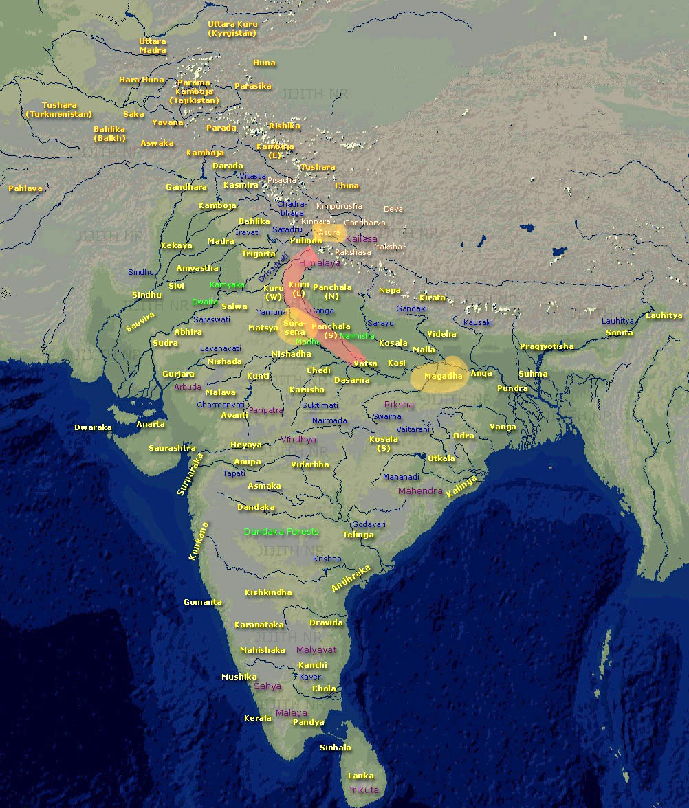

In the dense California redwoods,  a man got caught up in a massive forest fire. Not unusual for the Norcal summer . Luckily he was a climber. He selected a big one and climbed up till he got high enough to breathe, and found a strong branch to sleep on. He tied himself to the branch and slept couple of hours. When he woke up, he felt hungry. There was nothing there up high. Birds had all flown away. He wondered if it was his destiny to die of the hunger rather than being burnt alive in an endless scorch.

Before he got a chance to curse the Gods, he saw a big beehive and also saw the honey dripping off it - the rising smoke must have melted the nectar. The only problem : it was on a soft branch and of course he didn't want to wake up thousands of bees closely guarding their life saving. He figured if he could somehow move below the beehive (and somehow catch the dripping nectar) he could possibly see another sunrise. He carefully did that, though in the process he definitely rubbed few bees on the wrong side, who didn't waste any time in returning the favor.

A wizard angel was flying past in his chariot. His fairer friend who was sitting besides the angel saw the forest fire and asked her wizard to take a swing down - to check if they could help someone. How can we go on with our gifted lives with no attention to those who actually need our skills? - she argued.

Angel smiled for they were expressly forbidden from causing glitches in the world of Mud bloods.  But who may deny the lady of charm her wishful musings. Even `Rama` couldn't convince `Siya` that a golden deer is nothing but a trap. The bridge between the left and right brain is a "protocol" - not "reason", for the very idea of "reason" is to choose one side of the duality.

He took a nose-dive and they both saw this intriguing scene. A strong able man in his mid thirties was hanging off a soft branch that may break any time. And right below him fire was still raging high.  From a distance, they couldn't see that the man was aptly catching the drops of honey falling off the great beehive directly into his open mouth. They also didn't see that some of the bees, seeing someone stealing even though it was a waste, were biting all over him. They were probably enraged by the forest fire that took away their source of collection - the wild flowers; and they wanted someone to pay the price. 

His eyes, ears and lips swollen yet survival was paramount. It appeared from a distance that the man wanted to live no matter what the quality of his life, and the extent of his struggle. We must save this man - said the fairy. At the back of her mind the question that had always irked her - why do humans (like orcs) love their lives of endless misery? I mean I am a fairy and still it seems so boring! - She thought.

The angel still had reservations. He knew the rules. But his lips, culprit of his own desires, didn't abide by the rationale - As you say my lady luck ! - he said -  But we must make it look like a trade deal for we just can´t change the destiny for no good reason. The surveillance has gotten worse these days. They are keeping track of all of us who visit Earth particularly in the flying chariots.

Sure! You do the talking - said the smiling fairy. She was happy that her mate was willing to take on a potential ¨curse for life¨ for her love.

Angel stationed the flying chariot right above the hanging man.  - O man,  I offer you a seat in the chariot for the divine honey you have broken up in this blessed beehive. We both can share this Godly gift and save your life too. He made a ¨proposal¨.

> In Hindi or Sanskrit, a proposal is called a `Prastaav`...

The man probably thought he was hallucinating, or having understood it was divine nectar, he wanted all for himself. He was convinced that the Gods had provisioned this gift solely for him and look what great price he had already paid for this `Amrut`. Is it going to to give me good health or possibly make me immortal? - those questions are for later. For now let me grab all of it. 

No wonder now this angel wants a piece out of my winnings. They always show up at the opportune moments - don´t they? - He thought to himself. Not this time - this time this nectar of immortal life is mine - all of it. 

Out loud he spoke without courtesy or care, without even looking at the chariot or the smiling face of the kind fairy - No - he said -  Go your way angel and enjoy your girl! - Thanks but no thanks for I know your girl desperately wants my honey and its not gonna be cheap!

Angel looked at the fairy and gave the man another chance to think  - fair O'dead man , if you don´t want the deal then know that you will die off the poison of thousand bees, and of course your sugar levels are already high not letting you think straight. You will probably burn in this fire in another hour. Time is of the essence for your survival ! And even if you take the deal it would probably take the divine doc many days to remove all the stings you got from the deathly bees!

O ya! - said the greedy man. More the angel tried to convince, more he got sure that there was something very special in the honey. Tired and irritated for the heat was getting stronger by the minute, the angel flew away !

Whatever happened to the man is another story but surprised at  what unfolded, the fairy asked the angel - how stupid can a man be! Why wouldn't he take your proposal. 

The angel smiled in relief - A proposal is always made by the one who needs something. And accepted (or rejected) by those who have the upper hand. Quite the opposite of ¨charity¨ where the rich offload their excesses ¨as is¨ and poor taketh whatever on offer. 

O' my love - he said - If a proposal comes from the able, the motive is always questioned by the beneficiaries. Only in a rare cases sanity prevails. Such cases are the grace of God! 

Do you know other such cases ? - impressed by the wisdom of angel, she asked - you not only kept my word but also saved yourself from the ultimate curse. Please tell me more. She pressed herself closer to the Angel. Her eyes proud and aroused gazing her love!

The angel thought for a while. He then told her the proposal that `Maharishi Parāśara` made to `Matsyagandha` at the dawn of the new age in an obscure place `Mathura` - on the banks of river `Yamuna` in the northern province of India. An impossibility by any stretch of imagination, yet it worked, and created a race of men that went on to become wizards! Those who have flying chariots. Those who save others from fires and floods. Those who could get as much divine nectar as they wanted from Amazon.com !

# `Prastaav` ..

It was as if `Matsyagandha` found a reason to live. `Maharishi Parāśara` got off the boat but he left a boatload of hope for `Matsya`. Every night she waited at the docks. She had gotten a new set of questions. What did `Maharishi` mean? Why would he even talk to someone like her. At times, she thought she was an insipid laughter for a `Yogi` — maybe he just wanted to let her feel good, other times she wanted to look beautiful — she must get herself ready for the bigger purpose — but she knew no ways. She wanted to smell good but she couldn't afford the Sandal wood — a wood used in making perfumes. The hope and despair played the cycles of pains and joy. She was caught into duality of the prospects, and unlike the waves in `Yamuna`, waves of duality were hard to navigate. She must go through this fire to harden herself for a path unknown. 

One more subtle change happened. She discovered a new confidence in just being herself. For the first time, she saw her smell as a virtue. She felt she existed despite being all alone in this world. `Maharishi's` simple anecdote almost changed her self-perception for good. She wondered, why did she not see the simple reality the way she see it now !

## 8.1
---

About a year later, on the night of `Vijya Dashmi` — the tenth night of Hindu month `Ashwin`,`Maharishi` returned to the wharf. Entire `Mathura` was celebrating the auspicious autumn night to commemorate victory of Lord `Rama` over `Ravana`. A noble king verses a tyrant — good over evil. The middle of peak festive season in entire India, and more so in this part because of the perfect weather conditions. Wet season (monsoons) ended almost a month ago in mid August (per English Calendar), to let this time of mid September dry with mild temperatures and acceptable humidity. No one was expected working on the docks this night, except that `Matsyagandha` was there, for 'waiting' was her daily ritual —  `Karma`. 

`Maharishi` smiled at `Matsya` as if he expected her there waiting for him. He didn't have the courage to ask her why she was here? Why not celebrating the night with the rest, for he knew he was the one who put her to this test. And she sure came out with flying colors!

`Matsya` returned the smile as if she simply erased the wait of last four seasons from her memory. He asked her to ferry the boat to the island. She happily toed the boat into waters. As the boat got stable, she looked at `Maharishi` in anticipation. She could feel her time had come. The moment she was preparing herself for a year had arrived

`Maharishi` read her thoughts. She was like an open book to him — uncorrupted and pious. Her big expressive eyes said what her lips would not. Without much ado, he asked her if she could give him a son. No preamble, no sweet romantic chatter. All he added — it was for a much bigger cause. A cause, she would appreciate in due course. And of course, she may ask anything in return for the favor of this service!

Service! — `Matsya` though wildly imaginative, had never thought such a ‘service’ existed. To put it mildly, it was passionless. To say the truth, it was blunt! No one asks a woman for a child in their second meeting (spaced an year) without any courtship. She was poor but she wasn't sold out. She worked hard for a living and she bore the wrath of society for no apparent reason. Despite all the attempt to cancel her, she was a proud woman. A part of her felt as if the man was total noob in worldly things. Even more than her. But other reassured her that he meant what he said — He is not here to steal! He is here to give! He had a winner proposal for her if only she believed!

> Both of them unaware that what `Maharishi` asked `Matsya` was the biggest sacrifice a human could do. Soliciting a new born of a first time mother — be it a human or even an animal, is the most audacious of the 'asks' imaginable. Every cell of a mother's body works nine months, non-stop, to manifest a baby. Not only does she make flesh and blood, she even drafts milk for the new born — to ease the child into inhospitable world. This selfless act is the natural incidence of `Karm Yoga`. Even for a pronounced `Karm Yogi` , giving up on such a manifestation - the feat of binding conciousness to a biological form , is too much to ask. But none of them had this physical experience before. Neither comprehended that the price of such a service was more than entire cosmos !

## 8.2
---

As the moment passed, she staged a quick recovery. Years of training to handle unexpected discomforts - from those of prying eyes to the outreach of groping hands, helped her regain her rationale. She was definitely taken aback at the unexpected proposal. It was quite an anticlimax to the high hopes she had whipped up in her mind. She had no clue what to say and what to ask, but she knew `Maharishi Parāśara` was a `Yogi`. There was no one in `Mathura` who didn't know `Maharishi`. Since last year, her interest in the `Yogi` had peaked. She had found everything there was to know about him in public domain. He could have had any woman if he wanted to, but why then he chose her? He sure was not a womaniser. He wasn't doing it for fun.

More clarity emerged with another passing thought! She knew he could bless her with whatever she wanted — she felt the aura of calm and the strength he exuded, that made her believe the stories of his wizardry she had overheard commuters. Ever since their last meeting, she had wondered what she had in store. Her over sized imagination had led her to many scenarios but none of them was to bear his child. For one, he wasn't attractive, nor did he took care to look one. But more importantly, she knew that `Maharishi` would never take her (or anyone else) as a wife for his life was dedicated to the celibate work of God. Then why does he need a son, what exactly is the ‘bigger purpose’? She didn't realize, her curiosity had already shifted to the ‘purpose’ rather than her prospect of being a single mother in this transaction.

She thought for a while. She wasn't even sure if he really wanted a baby or this was a way to ask for sex? Or he might be asking me as a wife. Why am I not sure? How do I seek clarity. Her mind chose to play a question for a question — the best strategy to seek more when uncertainty strikes. She whispered  — what would people say? As if there were people staring at her in the middle of the river.

Looking at `Yogi` she asked — how could I possibly hide such a thing from the village? She meant she wanted to be in, but how? 

Boat was leaving the banks of `Yamuna`- heading mid stream. The rise and fall of waters simulated in the rise and fall of her breath. She could hear herself breathing and it wasn't because she was rowing the boat alone. She could boat off this bank like a child would step into walk of her mother. The anxiety stemmed from that no one had ever asked her a sexual favor and here she had a `Yogi` asking for a child! Does he like me or is he playing with me? Or is it something else? 

And the fear of unknown! She had never imagined herself pregnant!

`Rishi Parāśara` had a sigh of relief. First he didn't get a plain ‘no’, or was asked to jump off the boat. After all, his reputation was at stake. No matter how high a man in chain of command, in front of a woman he is still the one pleading for attention. And second, he too wanted it a furtive union. Not only was he not ready for a wife, he knew `Matsyagandha` must go on, for she had a larger role to play in her later life. 

And he had a plan — I know a nice cavern hidden in the island. We may stay there. I will be around you entire pregnancy and will have no dearth of food or shelter. After couple days, I will have a pigeon sent to the village head that you took on a journey downstream with me, as a sailor. And that we were gone to get lifesaving herbs from the East where `Yamuna` meets the most pious river `Ganga`.  

## 8.3
---

***Let me add a bit on the geography of the place before we move forward :-***

Rivers `Ganga` and `Yamuna` run parallel through the fertile plains of North India. They formed the boundaries of the powerful kingdom established (long back) by King `Kuru` . Shown as Kuru (West) and Kuru (East) in the map below.  He built a grand capital in `Hastinapur`on the banks of `Yamuna` — nowadays known as Delhi, the capital of India. `Hastinapur` was around hundred miles upstream from the abode of `Maharishi`. 

`Kuru's` grandson King `Shantanu` currently ruled the place. `Maharishi` could have approached the king for help with herbs but they grew beyond his borders deep into kingdom of `Magadha` with capital in `Patliputra`. 

`Hastinapur` and `Patliputra` had ups and downs in the political relations. Thus, the (imaginary) trip had to be clandestine. Technically, `Rishies` were free to travel across state boundaries and `Maharishi` was not even a native of `Kuru-kingdom` because his `Ashrama` was on the western bank of `Yamuna` — a vast land infested with many `Rakshsa` lords. After his early days of warring with `Asuras` in this area, `Maharishi Parāśara` helped `Ugrasen` take the reins of a new small kingdom named `Sur Sena` (Good people's army).  Thanks to the "fire-traps" of `Maharishi`, most of the rebellions either left the place or were living a subdued life under cover.

`Maharishi` decided to continue stay in his grand father's (Maharishi Vasishta's) `Ashrama`, on the bank of `Yamuna` in the capital of `Sur Sena` — a city (now) known as `Mathura` — a mile upstream from (now) famous `Vishram Ghat` of `Mathura`. 

The village where `Matsya` stayed, was run by an erstwhile `Asura` lord — `Dashraaj`. He was defeated by `Maharishi` but got his life back after he promised to live a conformal lifestyle. That he did, but inside, he wanted to be important. His ambitions, still played young even though old age caught up on him. On the surface, he served the `Ashram` and stayed in close with the ideology of `Maharishi`.

	
>The [map](https://commons.wikimedia.org/wiki/File:EpicIndia.jpg) above (published under creative commons license at Wikimedia), shows the locations of Kingdoms mentioned in the Indian epics. Focus is on `Mahabharata`.  Due credits to the publisher as per license.
>
>Names in Yellow were the main kingdoms. The river names are shown in blue, the mountains in purple and forests in green. You may need to enlarge the map to appreciate the extensive spread of populations, and complexity of the political landscape.

`Asuras` had their own kingdom run by `Vrishaparvan` — an `Asura` royal sage, though `Asuras` were spread beyond their indicated location. It is important to understand the difference between `Asuras` and `Rakshasas`. `Raskshsas` were the tribal population of "bigger built" who obviously wanted to continue with status quo because of advantage of their muscle power over animals and civilized humans. On the other hand `Asuras` were the educated humans who just didn't subscribe to `Vaidik` way of life. Many `Asura` lords naturally developed close ties with `Rakshas` as they had a common enemy in civilized world but this is not to say that all `Asuras` or `Rakshsas` were inherently against scriptures (or the ones who believed in scriptures). In fact the palace of `Pandavas` - grand sons of `Dwaipayana` was built by a `Rakshsa` architect. 

`Asuras` were neither against scientific discovery nor deities. They had their own weapon systems and they too worked hard to invoke celestial powers. They just didn't subscribe to the idea of one God and the tenets of `Vaidik Science`.

> I have highlighted the `Kuru` territory and the location of `Maharishi Parāśara` abode (in `Sur-Sena`). The western boundary of `Kuru` kingdom was river `Yamuna` and eastern side was bound by river `Ganga`. Both major water ways for transport and source of irrigation in prosperous `Kuru` empire. 

An advantage of staying in `Sur-Sena` was no `Kuru` kingdom laws applied to the `Ashrama`. `Maharishi` was free to run his experiments and live the way he wanted. Prime among them was to optimize tools for writing such that common sages could easily scribe their work. 

When it came to writing, fear of retribution wasn't as big as fear of becoming a laughing stock. Writing thus far was done on cotton clothes. Cotton was too expensive because the writing was more like big posters — a page, standing six feet tall. It was more like replicating the carvings in old caves. It usually cost one Gold coin to create hundred human size posters. Only possible for ultra rich or for the kings. He wanted to see if he could grow some new plant that served as the main material for a paper like experience. His goal was an order of magnitude reduction in size as well as the cost. If he could bring down the cost to a silver coin, many more books would enter publishing domain and many new players. These experiments led him into agriculture and hence his book `Krishi Parāśara` exploring new crops. Finally, he figured cotton could be mixed with wood to create a new medium that would be known as paper in due course but we are getting ahead of ourselves. Between the cotton posters and real paper, one more step was destined - the palm leaves, that `Maharishi` saw on the island after his `Samadhi`. All this was to fulfill his grand father's vision to scribe the scriptures. He knew he had covered much ground but there were many more miles to go.

Staying off the main-land (`Kuru Kingdom`) also ensured only real seekers had the courage to reach him. Thus, less time spent on social and political disputations. And most probably, he had a fascination for the virgin island and the deep cave system that led to this cavern he was talking about. He believed that the path forward must emanate from the middle of two opposites of good and evil, and one need to dive deeper into the caves of soul to seek the ever illusive peace.

## 8.4
---

`Matsyagandha` thought for a while and finally nodded her consent. Her eyes hollow. She was still not sure it was happening to her but the plan seemed workable. `Maharishi` looked at her and he figured she wanted something else. He stood up and asked — Do you want something else `Matsya`? — His voice full of gratitude.

What will happen to me after ? I will need to feed the new born at least for a year!  But what after that? — asked `Matsyagandha`.

`Maharishi Parāśara` thought for a while. He wanted to make sure he found the right words as much as he wanted to say the truth. He said — after two years, once child is ready to go with me, you may, if you wish, return to the village.

`Matsya's` face turned red. Her body shaking and her words broken — this village hates me. If older women figured out I lost my virginity, they would despise me even more!

As it is, `Matsya` was living a hell. This would only add more to the antipathy she already received. They would most likely name her a whore and burn her alive as a culprit of prostitution — a recognized sin in `Kuru-land`. Stories of such incidents were rampant though no such incident had yet happened in her village. If they were kind, they would most likely hand her over to some `Asura` lord where she had be enslaved for life, and possibly gang raped daily. That was considered a fair punishment for the sinful hookers!

No one would recognize you `Matsya`! — `Maharishi` said with conviction that was hard to ignore — I would bless you into the most beautiful woman ever lived. You will smell of Sandal all day and all night. People will call you `Yojangandha` for your musky fragrance shall surround a distance. (The literal meaning of `Yojan` being a mile and `Gandha` means fragrance.) Fares would line up to take your boat. And one among them might take you as a wife, having fallen madly in love with you. And thereafter, you would rule the world!

`Matsya` couldn't believe her ears. The prospect of smelling good and the idea that the village that hated her bowed to her beauty, set butterflies in her. She was not sure if it was the prospect of revenge, or expectation of success, but the proposal now seemed like a true blessing. She folded both her hands and kneeled. And then she looked up straight into deep eyes of `Maharishi`. Her eyes said `Yes`. `Maharishi` met her gaze. He wanted to be sure — you need to say a 'Yes' `Matsya`. 

As he reconfirmed the acceptance, he touched the thumb of his right hand between her eyes and with left hand he pulled out his wand, lowered it into the waters of holy `Yamuna` and threw few droplets on her face. She felt her head spinning and she lost her consciousness. 

The place between the eyes, right above the nose is called `Aajna Chakra`. This is where a `Yogi Guru` may touch with his thumb to associate you with his "knowledge". Once the pathway is opened, there is no going back. You are now one with your `Guru`. In `Hindu` tradition, this is why a `tilak` is placed here, particularly if you participate in a ritual. `Matsya` was now part of a `Maha Yazna`. She would take `Maharishi's` vision for grounding in reality!

-----

The fairy was consumed in the story . She smiled at the wizard angel and asked him for more !

Wait o' fairy queen - I will love to but we might get into `Mahabharata` - the most interesting and consuming story ever told. I must caution you that this story may change your mind and your life for ever ! 
