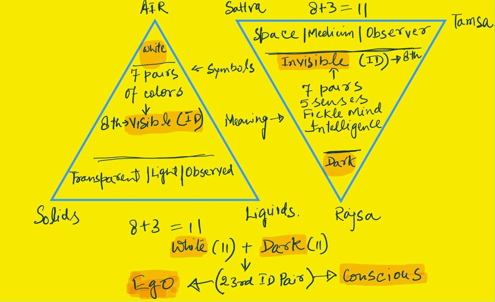

Back in her tinsel town, the Fairy couldn't help share the experience with her friends - first-hand account of forest fire was a big deal - worth a long post on social media. Her intent though was to headline a new definition of "proposal" versus that of "charity". She probably wanted to rub her charitable friends in high places. Charity was a big component of the social score.

Most her friends had their own tales to tell - about the crazy things humans do! Some of them downplayed her experience as naive - because this was the first time she flirted with "the rules".  Some others took a tangent. They indirectly meant she failed to save a human life! 

Not only did they miss the point, they probably wanted her down the guilt trap.

> Social conversations never go the way you wanted. They mostly route to the bottom where one either meets frustration or mockery. Damned if you did good, and more if you didn't!

Only one of them showed some interest in `Matsya` - What happened to the poor girl? Who was her child ? And more importantly - did `Maharishi` ditch her - as expected of the powerful - wizards or men. Even angels were a coin-toss when it came to relationships!

---

That evening, at a mixer event, Fairy happened to meet this curious Friend and they got hold of our Angel. 

The conversation began at a rather skeptic note! How could someone conceive at a sprinkle of water? - with a magical wand! After all, it was a boat, not a fertility clinic  - they asked with a cunning smile - as if they knew what actually went down that evening!

Is there something more to be read between the lines ? - the Friend did not try to hide the scorn in her voice!

Unaware that the story got leaked into "social circles", Angel was taken aback. For a second, he wanted to cover up. If the incident reached the regulators, his project might get shelved. But few martinis later, he too jumped in the discussion. For one the focus wasn't on the fire incident - it was on `Matsya and Parāśara`. And second he couldn't take an epic being trolled.

What exactly is the birth ? - He asked both friends. And waited a bit for their response.

Seeing their faces blank out - Let's go outside, it's too noisy in here. We need a quieter place to talk - he suggested with a smile.

---

As they stepped outside the crowded hall, a light drizzle had just stopped. A thick rainbow lit up the evening sky. Three of them, raising their big mugs, took a deep breath. The clean air was restored with enormous efforts from angel scientists. Humans had littered the planet into a wasteland. Fortunately most of the waste swamps were bio-engineered into thick forests. The downside, however, was rampant forest fires despite angels regularly monitoring over the biosphere. 

Angel looked at the rainbow. Marveling at the immensity of the nature; he started his monologue. He had decided to sacrifice the evening to a deeper conversation - on manifestation - and he wanted to prepare his mind for details.

There are three basic colors that our [eyes](https://www.allaboutvision.com/eye-care/eye-anatomy/color-vision) are designed for - he said - Red, Green and Blue[^RGB]. They mix up to make millions of colors. Our eyes are limited to around ten million shades. Possibilities are endless, but four new colors are rather stable - Orange, Yellow, Indigo and Violet. Together with three basic ones, the seven colors are, as we all know, the colors of a rainbow. They are a special group because they are normally hidden in one "transparent invisible" light - as if they formed a perfect union to have a common name - a representative identity. We normally call this identity sun light or  "White" light - even though it is nothing like White.  

Fairy liked the poetic monologue - Maybe White makes sense because the opposite is utter darkness! - she added.

Angel took a big sip, to resume with a clear throat - They do reveal themselves when elements meet - after the rain when the sun shows up - the suspended droplets, on tiny dust particles - light up the washed air. As if there is a spectral choreography of all that could be observed. The cosmos shows up its true nature - and beautiful it is! Isn't it?

Seeing them both share the pleasant observation, he announced  - they also hold the clues to the very nature of creation - the "birth" as we normally call it. The announcement invited a "head turn" - from both the friends. A sign - that he got their full attention.

Each of these seven colors is a statement of separation. For example, Green is a signal that all the other colors left it alone - a separation occurred, yet it survived. What color is it that we don't see when our eyes see the peaceful Green?  

He waited a bit for the Fairy and her Friend to respond. Finding them silent but curious, he added - White light minus Green is Magenta. Anything that appears Green must absorb the Magenta - to reflect back Green.

Looking at beautiful Magenta, we can never tell it is a shade that conspired against the "Green" - left the poor "Green" alone - he smiled. Let's just call it the "inverse" of Green, or "Anti-Green" - semantics don't really matter - we can call them "complimentary" too - because together they create an Identity - the white light!

The key thing is - the "Magenta" is just another shade. On the face of it, we can never tell it broke up with "Green". In fact, every observable thing is an inverse of something. It is like a cryptographic public-private key pair - you can never guess one from another unless you already know. For example, now we know Green and Magenta are complimentary. That is the hidden "knowledge". Information is what our senses see or feel - "knowledge" is what is hidden behind the apparent view. Knowledge always needs work - for example even now you can't be sure that Magenta and Green are complimentary - you need to check it yourself to know the truth. Or else, by definition, it is still information!

O - you mean what happened on the boat was a public view aka "information" and more complexity was hidden beneath? - questioned Fairy - her tone borderline diffident. She was still pissed at the responses to her post last week.

We are getting there. Let it sink in for a bit - he said, as he gulped the last sip from his tumbler - what we observe is the public key, but  the private key is always hidden. What appears trivial has certain underlying parity - it is a knot! The color and its anti color are tied to each other. Every sensory observation is always one side of a pair - a binary knot.

Ya, I am with you! - it was time for the Fairy to reflect - conscious perception is in the separation. A magnet literally personifies this idea - we can see the separation of dipoles on a magnet -  though the tenet is applicable to everything we observe or feel. Even abstract things like great riches have their inverse in extreme poverty.  Love - hate, care - indifference,  and respect - impudence. Everything manifests in the separation. Everything is a knot - an inseparable pair.

Exactly! - said the Angel - Now here is what they didn't teach in the classrooms - kinda secret that is still kept in the wraps. His voice lowered as if he was sharing a deep insight. In this separation, something potent gets locked in. We can't perceive this "locked-in knowledge". To our sensory eyes, that see only one side of the story, it appears assimilated in what we are seeing - because it neither changes the Green nor the Magenta - it is just the awareness as to how two colors are connected to each other. This locking in of something potent in a pair is at the center of every knot. It is the basis - the root birth - manifestation as we call it!

Interesting idea! - said the Friend - is it why when a light switch  is On, it can't be Off. Who knows this arrangement! Are you saying that knowledge is inbuilt into the circuit?

Yes - the Angel continued after making sure of the heightened curiosity of both his listeners - The imperceptible thing that is locked-in - is complete in itself - because it is simply a logic of separation - the rule for a cell to split into two - same for a branch of tree to split into two. It is the knowledge of the all the children elements - complete lineage. In other words it is the Identity of a group. 

---

The Friend, who took pride in her mathematics degree, jumped into the conversation - what do you mean by "Complete" and that it acts as the "Identity"?

Complete is simple to explain - replied Angel - it means, if you look at the group of all colors -  as a whole - the locked in knowledge is awareness of all the separations. Means it doesn't only know Magenta is complimentary to Green , it knows the complementarity of all the combinations. Think of it something at the center of the Group - not just a color pair!

Identity is little hard to fathom - he continued. It means that this knowledge is pre-built into all the child branches. It is in every member of the group, but it doesn't change the appearance of any of the constituents. This awareness creates the separation in first place - to know "who am I". It is as if this island is looking at itself from two separate banks of the river. The interesting concept is however the opposite of "Separation". In mathematics we call it "operation".. for example when we add +1 to -1 , we call it "an operation under addition". Operation leads to Identity. To carry on with our example, +1 and -1 added is equal to zero. Thus zero is the Identity. If the operation is addition, than zero doesn't change any of the constituents - one plus zero is still one.

Wow, that is a great way to put it - said the friend - I never thought "Separation" as opposite to "operation"!

But the story doesn't stop here - he added.  This identity - white transparent light in case of our group of seven rainbow colors - has its own inverse - the utter darkness. In other words, the white light predates the seven separations of colors - Seven knots in `Vaidik` speak, and it was separated from the darkness.  No matter how upstream an identity, it always has its inverse - it must separate [^separation] from something else to become observable. In a way, what we experience with senses is an inverted tree - root at the top and branches hanging down. We see the branches. The root is far upstream.

Sure, I give you that - said the friend -  But how this all related to the birth of a child? She didn't make any attempt to hide her impatience.

It is - smiled Angel - you must be patient if you want to understand the ancient `Vaidik Science`.

Okay - smiled the Friend - I am listening!

---

The three phases of the matter are - solids, liquids and gases. Excluding Plasma, which is kind of a superposition of the three phases and is not a natural occurrence on earth - Angel continued ...

Every thing that may be observed must be one of these three phases. Along with the eight colors, these eleven were considered the means to observe the matter. The matter, be it solid or liquid must have a unique phase and a unique color . So the ancients defined the "state" of all observable things. The state had two simple parameters - phase and color. The state information was important in metallurgy. For example if you heat a metal, first it changes the color, and then it becomes liquid. In absence of a sophisticated temperature gauge, all information was communicated in terms of state. Even today we use this in cooking - heat the onions in melted butter till they turn brown - Angel smiled.

Even today, with all the advancements, that basic design of "observability" stands good. But what about the "Observer"? What is the dichotomy of an "observer"? Unfortunately we didn't focus much on this half of the equation in modern science!

Well, technically speaking , an "observer" is also matter, but we have five senses that are unique to us "observers" - said Fairy.

You are on the right track - Angel was happy to see his ideas getting registered - but there is little more than mere five senses. First, there is a notion of "space". If senses are unable to observe the three phases of matter, and don't see any of the (eight) colors, we say it is dark "space". In addition, an observer has a natural tendency to observe things - we must continuously use our senses to observe - we just can't stop[^stop] our sensory apparatus even in sleep - as if it follows a random function. This quality of sensory system was termed "Fickle mind" (`Mana`).

In addition to "Fickleness", there is a sophisticated mechanism to analyse what we observe. This capacity was termed "Intelligence" (`Buddhi`). It is the intelligence that weaves random events into a discerning narrative. 

So in all, an observer is "matter" that has seven additional pairs to process the information - five senses, fickle mind and intelligence. These seven pairs give rise to another Identity. Just the way seven color pairs lead to white light ; these seven pairs create darkness - inverse of the white light. Because all Identities must have their own inverse. In `Vaidik` parlance, this darkness is referred to as "desire". 

It was time for both fairy and her friend to get appreciative. No one ever told this perspective to them though it appeared simple and made sense. It didn't take any complex knowledge of math or science to derive this mental model - just observation.

---

The Angel continued - So eight colors and three phases of matter - that is eleven basic dualities that we "observe". Now add to this the perceptual facets of the observer - the five Senses (`Indriyas`), Fickleness (`Mana`), Intelligence (`Buddhi`) and Space (`Kham`) - these eight are stable knots that make the information gathering aspect of an observer - desire to know. But there is little more to it ..  an "observer" too has three phases of its own being ..

> Just like three phases of the observable  matter, the observer too has three phases - in `Vaidik` speak these phases are called `Gunas`. The three `Gunas` are - `Sattva`, `Rajsa` and `Tamsa`. The notion of "Work" (state change), on the observer side, is to transition with in these three `Gunas` and the elements of desire. At any point in time the state of the observer is defined as the controlling `Guna` along with one of the sense organs (or fickleness or intelligence).
>
> The way a physical object exudes information - colors; the observer seeks information. Desire is the name for that emptiness (empty dark space) that strives for fulfillment. As soon as we know, the desire moves on to something else because of built in random function. `Sattva` is the phase when observer feels satiated (with information), `Rajasa` is when observer craves for information, `Tamsa` is when observer doesn't know what it is seeking.

Unfortunately there is no English word to describe `Gunas`. Just think of them as three phases of mood. For example when you play just to participate, it is `Sattva`, when you play to win - it is `Rajsa`, and if you rather sleep when it is time to play, it is `Tamsa`.  Thus the recipes on the observer side are always communicated in terms of `Guna` and `Indriya`, just like in physical world we say stop heating when the butter melts and onions turn Brown. You can say for example that keep thinking with intelligence  till you feel `Sattva` rising and then start speaking. Or go to sleep when `Tamas` appears to be taking over senses. Binding the observer to this framework is the beginning of `Yoga`.

Thus, a conscious observer inherits eleven physical facets of matter,  plus eleven perceptual facets of desire. These twenty-two knots combined create an identity. In `Vaidik` system this identity is called `Ahmkara` - a perceptible physical shape along with the information we collect randomly.  The English term for `Ahmkara` is Ego.  

The inverse of Ego is what we know as Consciousness. Just like white light and darkness, both Ego and consciousness are physical things. Between Ego and Consciousness pair, an eternal awareness exist. In `Vaidik system`, this awareness is called `Atma`. It is knowledge locked in this separation - and it connects us to the root of the upside down tree. An observer moves between Ego and Consciousness but Identity (`Atma`) emerges only under a specific operation. And no - the operation is not simple addition or multiplication - Angel looked at the Friend with a smile - we don't know the exact operation but it is said to be one's `Swabhava` - the nature. Actions done as per one's nature reveal the identity locked between consciousness and ego.

Well, I'll need another drink before my mind blows up - said Fairy as she pointed to her empty glass. Three of them walked inside. They found  a quiet table with ample food in their plates, after filling up fancy tumblers with sacred poisons of their choice.

----

But we still didn't get to the "Birth" - said Friend as she pulled out the chair and checked the food. She was on strict diet - eating once a day, and it was well past her dinner time!

Angel grabbed a large napkin from the table while friends started eating their portions - Let me first draw what we talked outside - he felt happy for converging a complex conversation to decent conclusion ...

Okay - let me share my little secret - said Angel as he finished showing around his sketch. In `Vaidik Science` the human body is the field. It has twenty-three fundamental knots as I said. They call this field `Kshetra`. As a bio-scientist, I was intrigued by this idea because **we have exactly twenty-three pairs of chromosomes!**  Ever-since I learnt it from my mentor, I am trying to link our genetic makeup with this ancient science. No wonder that the ancient hyperbole was ..

> If someone mastered this field of ego and consciousness - these twenty-three knots - conception may be triggered in any container that could keep the embryo safe for nine months. They say `Maharishi Parāśara` not only figured it out, he passed this science onto `Dwaipayana` (his son) in his mother's womb.

The fairy and her friend looked at him in disbelief. They were not sure if they believed the pseudo-science they heard from a qualified bioengineer. But the Angel was pretty sure of his theory - he added - such a birth is called a birth through `Yog Maya`. Instead of calling  it a normal birth - a throw of chromosomal dice - they call it a birth targeted for a specific orientation - `Avtaran` (incarnation).

It is not that `Parāśara` was the only one with this ability. `Mahabharata` has many stories of such targeted incarnation. For example `Arjuna` was incarnated by king of all deities - `Indra`, `Karna` was incarnated by Sun. One may argue if the science had reached such advance back then! One possibility is information has no past or future. It reaches every place where ever it is sought. Or we may say there is no past or future - it is simply a continuum.

Okay, I am done with the science of spirituality - smiled Fairy - tell us the story now. What happened on the island ? She didn't know Angel was a believer though she liked his new-found persona.

# `Avtaran`

`Matsya` found herself in a bed made of flowers when she woke up. It was day but Sun was still low in the East. Light was filling up the East facing entrance of the cave. She quickly fixed her rags and hair, and stepped out of the cave. `Maharishi` was sitting in a `Samadhi` (sitting upright in a trance). There was holy fire burning in front of the `Yogi`. The place smelled of Sandal wood. Later she learnt this part of the island was full of Sandal trees. 

She sat there, grasping the serenity of the space, trying to make a sense of it all. The events of last night played in her mind. She tried hard to sequence the things, but there was no recollection after she lost herself on the boat. Entire evening felt hazy and distant as if a memory was pulled off her brain. Last thing she knew was a sprinkle of cold `Yamuna` water on her face.

While she was thinking of the night she missed, a thick smog surrounded the cave. It was as if the smoke from the holy fire froze to make an invisibility cloak around the cave. She felt comforted in the seclusion — free from her painful past. She also felt a strange feeling in her lower belly. As if, a life had taken place in her.

Am I pregnant? — She didn't intend to disturb the `Samadhi`, but the words just came off her mouth. `Parāśara` opened his eyes. He gazed at her with a welcome look — Yes — he said. Do you need anything? There is fresh milk and fruits, and he pointed to a grotto next to the entrance of the main cave.

The main cave descended to a cavern that had sweet `Yamuna` water flowing at it's base. She also saw her boat moored there. Now she understood why `Maharishi` loved the island. It was beautiful and serene. She also got an inkling that the place was given ghostly character to keep the tourists and wanderers away. For the first time, she felt as if she was part of something bigger. She felt excited and curious at the same time. What exactly is going on? She wanted to know. `Maharishi` could guesstimate what was playing on her mind.

"Hope you found the place comfortable !" — She heard `Maharishi` at her back. She turned back to him. A smile on her face conveyed she was happy and was on board.

## 9.1

Next few months were magical for `Matsya`. She would wake up to the slow chants of hymns, and the smoke from holy fire. She would go out with `Maharishi` to pick up fruits. There were goats to get milk. `Maharishi` showed her the skills to survive in a jungle. After first full moon, `Maharishi` told her the time had come to start `Dwaipayana's` education for the things he would learn in the comfort of motherly womb, would last him a lifetime.

`Maharishi` taught her `Sanskrit`. She quickly picked up the difficult language. `Maharishi` himself chanted all the `Mantras` to her. It became a daily ritual. Learning Sanskrit got lot easier for her, because `Maharishi` used the method that he had learnt from his grandfather. In this new learning process, reciting and scribing, go 'hand in hand' . And he used palm leaves for scribing. The island was the only place in and around `Mathura` with Palm trees. Maharishi would stack a dozen palm leaves every night on the fire such that they were slowly smoked inside out. They both used these leaves to scribe the `Bramhi` alphabet —  first `Maharishi` wrote, and then `Matsya` copied the alphabet to simple words. Slowly she started scribing simple sentences and got at ease in conversing. She realized that the language was natively developed to speak poetry on the go! `Maharishi` said that learning to scribe was the fundamental training that opened a portal to continuum of information! She didn't understand the idea but she believed.

There was subtle, but planned experimentation , `Matsya` noticed, `Maharishi` gradually increased the smoking duration, temperature and distance from the fire to get the best possible texture in palm leaves — and flexibility like a cloth. And that he was refining the ink as well. Starting with simple Henna paste, he had mixed number of soils and heated the mixture to get a permanent impression of inscription. Now she understood why `Maharishi` was carrying the Palm leaf with him when he returned from the island in their first meeting.

It was probably a daily mud bath followed by a fresh water swim in `Yamuna` that made her beautiful, or the Sandal wood lotion that `Maharishi` himself made for her; or a vegetarian diet of milk and fruits, or the growth of internal knowledge. But she assumed it were the blessings of `Maharishi`! And who knows?

As `Matsya` was learning, her mind took on new dimensions of curiosity. She started asking more questions. More she asked, more did `Maharishi` explain.  Not only her mind, but her body started taking a new shape. Her skin glowed. Her hair got long and silky and her smell was gone, replaced by everlasting musk. Songs came to her lips. She learnt to dance slow with setting sun —  to exhale the excess energy. And she learnt to recite Vedas with rising sun - to fill the universal energy back in. She attained fine equilibrium with universe as she got proficient in breathing techniques (`Pranayama`) — the core of `Naad Yoga`. `Maharishi` started digging deeper into the hymns, beyond the superficial meaning that met untrained eyes. And `Dwaipayana` heard it all, in the safety of his mother's womb.

She gazed and understood the motion of stars. And she understood the effect of lunar phases on the waves of `Yamuna`. She knew it was `Yamuna's` holy water that blessed her with a divine son, but she wondered if `Maharishi` ever embraced her! Ever made love to her like a man would do to his wife. She wanted to know, but she was too shy to ask. And she wouldn't change an iota of this relationship, for it felt divine. Even if she was a surrogate, it was well worth the time - and the experience. But she didn't know the darkness of that night got carried to her womb. The boy would be darkest of complexion, and one seeking to know it all. And thus the name `Krishna` that meant born out of darkness - darkness being the true observer. His spirit captured all the stars of that night. He would see depths of the space that no one in the sun-lit day could ever. He would see beyond the motion of “Time” and bind it to the words. Words that would flow like `Yamuna` to carry all other opinions along with. And just like `Yamuna` they would span the heights of `Himalayas` to the depths of the ocean.

## 9.2

Time moved fast. She was carrying the weight of a divine child. Her breasts swelled up as motherhood took over her. She wanted to be close to `Maharishi`, but he knew better. He knew the joy was transient. Enormous pain was waiting for `Matsya` when she must let a part of her own body go — the curse of motherhood. If you create something complete, you must let it go - to prove the "completeness". But her curse was bigger of all mothers. She must leave him. For a mother, the biggest pleasure is to see her creation grow. `Matsya` must let go the warmth of vicinity - she must break the biggest bond.

`Maharishi` knew, every upswing must follow equal downturn. He wanted to keep his distance - not get caught in the wave of pleasures and sorrows. He knew it was a grace that `Matsya` was turning into a beautiful woman, but he had underestimated the desires that might take on his own mind. It took all his learning and then some, to keep his heart unflinching, and yet fully attached in every chore. Never letting `Matsya` feel the absence of his strength. Without ever crossing the line. He knew it was a test. A test he must pass to pave a new path for the rest. Every night he burnt his desires in the holy fire and turned them into hideous smog. He knew he was only a father — not a lover. And he knew his sacrifice was a minion, for the biggest was for the mother - to leave her offspring behind - even if in the hands  of a trusted `Yogi`.

The question that haunted him: how `Matsya` would bear the pain that his plan must inflict upon her. He must give her the tools to understand the truth. He must let her see the duality of knots. 

And that he did. He named her `Satyawati` — bearer of Truth. The first name is always given by the parents - unaware of the traits of a child. The second time around, the name is given by the teacher. Thus the second name must be reflection of truth.  

True to her second name, `Maharishi` showed her the truth lies amidst the extremes of dualities - beyond our conscious perception. We only see one side of the coin. If we are lucky, we may be able to comprehend the other side. We can ascertain through logic that for a "Green" to exist, there must exist a "Magenta", but this is just the beginning of the quest. The true journey begins when we take baby steps to understand what is the nature of "knowledge" held with in ...

In a subtle manner, he imparted to `Satyawati`, learnings of his quest - to make her worthy of the name! `Krishna` heard it all. 

 

Desires are the root of all pains. In that he denounced `Dravya Yazna` as it was rooted into desires. `Satyawati` asked then why would anyone work!, for she thought desires were the basis of all that we do. 

`Maharishi` pointed her to the nest that a bird-pair made atop the tree where they were sitting. He asked her if these birds made the nest out of desires or was it their `Karma`?  He then pointed to `Yamuna` — Does this river flow out of desires? Smiling to confused `Satyawati`, he said — Desires are not the basis of actions, for nothing in this universe may stay action-less even for a moment. "Action" is fundamental because every manifestation must follow a cosmic order - they must act even if they don't want to. In fact, "action" is the present. It is the only way to connect with the continuum. Desires, on the other hand, make us action-less for we invest time thinking about desired objects, or scheming for specific outcomes. And channeling our natural actions into the ones that appear to get us closer to a desired goal. He further added — desires are the source of our wave nature. Waves of joy and grief. If we get what we desired, we feel happy, if we don't, we feel miserable. In essence desires lend wave nature to conscious observer, that makes our reality dualistic. He cited his father `Śakti Muni` who postulated that most humans change their ‘one chosen’ path because of failure to meet desired goals. They than chase another goal, another deity, and thus get caught on the web of bondage. Thus, it is the desires that take one away from their natural path (`Swadharma`). `Śakti` means power. His father was named `Śakti Muni` because he demonstrated that dominion over one's desires was the only way to sustain inner power over duality.

Only way to overcome desires is to stay busy in ‘actions’. Desires lead to momentary elation (followed by sorrow) — ‘actions’, on the other hand, lead of peace and knowledge.

What kind of actions one must do? — asked `Satyawati` — If one must not be driven by the desires, then how was she expected to know what are the right actions for her.

That is exactly what `Krishna` is supposed to figure out! — smiled `Maharishi`— How do we overcome desires and still be indulged in actions? Is it one set of actions for all the human beings or is it different for everyone? How does it change with time and situation? The righteous actions.

This was the opening of `Karm Yoga` that young `Krishna` learnt in his mother's womb. And, among many things, it stayed with `Satyawati` too. She, truly subsumed herself into a new identity. She didn't even feel the pain of labor. As `Satyawati` took him for first holy dip in `Yamuna`, the mighty river rose to touch his feet. It washed over `Satyawati` too, to give her the true perspective. Truth that the child in her hands was not hers alone. He must go on to strife the world off duality. And that she must enable him with all the right actions. She found her purpose. How could she let duality take over her mind when she was literally the mother of the one destined to define the 'righteous path'.

 `Krishna Dwaipayana` was born on full moon night of Summer. The day is celebrated to this date, as `Guru Poornima`.

## 9.3

Two years of hiatus, away from `Ashrama`, had two goals for `Maharishi`. Birth of a spiritual heir who would carry forward his mission, and to fine tune the scribing techniques. However, his two years long absence was an opportunity that many `Asuras` were waiting for — particularly `Kansa` — son of `Ugrasen`.

With `Maharishi` gone, there was no one to stop `Kansa` from whatever he wanted to do. As he got sure `Maharishi` was gone for good, he house-arrested aging `Ugrasen` and assumed the throne. Exposure to independent rule, further flamed his lust for power. He needed more to improve his army, cavalry and elephants. But more so because his needs for pleasures were endless.

Driven by equally ill advisors, `Kansa` announced a major decree on the `Ashrama`. Half of all bovine wealth and precious metals must be sent immediately to king's exchequer for the past dues, or vacate the holy land of `Vaśiṣṭha`, `Sakti` and `Parāśara`. And hence forth, he demanded an annual cut. That was quite reasonable — he thought —  given the congregation was literally awash in wealth - `Kaam Dhenu`.

`Maitreya`, who was running the congregation in absence of `Maharishi`, didn't take the new rules without contest. He approached `Ugrasen` for the excesses of `Kansa`, only to find `Ugrasen` was even more helpless. He then approached `Vasudev`, `Kansa's` brother-in-law, who was a rational man as much as `Kansa's` sister `Devki`. Both of them raised the concern to the council of `Naad Yogies` in `Ugrasen's` court, but they found all of them pawns, playing in the hands of `Asuras`. `Vasudev` and `Devki` were deeply worried and wondering whether continue building their new wedding in `Mathura`, or move to the nearby empire across `Yamuna` where king `Shantanu` was heard to be just and peace loving. And his son `Devvrata` was a true leader of good men.

Before `Vasudev` could take further action, `Kansa` limited his mobility too — a house arrest till he is tried under fake charges of treason. Without `Maharishi` , `Maitreya` was at a stalemate except that he had a trusted friend in the council who sent him daily updates of `Kansa's` plans. 

Unfortunately, those updates only aggravated his worries ..

## notes and other stuff

---

[^RGB]: The RGB color model is an additive color model. Video display device (such as a monitor or television) only know how to display by mixing varying amounts of 3 pre-defined lights of colors: red (255,0,0), green (0,255,0), and blue (0,0,255). Our eyes on the other hand are designed to receive only said three colors - of course in varying degrees of mix proportions.
- In RGB, the color white is represented as (255, 255, 255) - each component representing full Red, Blue and Green - which equates to "all on." The full value for each of the red, green, and blue color components is displayed, which creates such a high light intensity that we perceive the color as white. Conversely, the color black (0, 0, 0) is the "default" state of the display device. When no color light is displayed ("0"), the result is black, or the absence of color.
- What we normally learn in school is known as a subtractive color model, versus the additive color model used by RGB. RGB color system, constructs all the colors from the combination of the Red, Green and Blue colors.  The red, green and blue use 8 bits each, which have integer values from 0 to 255. This makes 256x256x256= 16777216 possible colors.
- Each pixel in the LED monitor displays colors this way, by combination of red, green and blue LEDs (light emitting diodes). When the red pixel is set to 0, the LED is turned off. When the red pixel is set to 255, the LED is turned fully on.  Any value between them sets the LED to partial light emission.

---

[^annihilation]: The reason physics concludes "annihilation" is simple - physics, being reductive tries to observe a single particle (or it's anti-particle). They are by definition inseparable. The moment physicists separate them , they both disappear! - a false impression of annihilation.

---

[^separation]: On a two-dimensional paper, the separation is a simple line that makes two visible halves - one on the left and other on the right. In a three-dimensional world the separation appears as a "layer". In other words - white light is a layer that surrounds darkness in our three-dimensional world ! Likewise - each separation of color and anti-color too is a layer. We obviously need a higher dimensional model to represent the separation of seven layers with in one. The higher dimensional complexity of seven knots is held hidden within the parity of Black and White. This complexity is known as knowledge. It has a partial observable expression in our three dimensions though the knowledge in itself is complete in infinitely many of them.

---

[^stop]: We can't ever stop our ears from listening or nose from smelling. In case of eyes, one may argue that we can shut down our eyes. That would be similar to closing our ears or nose. Our senses stay active in sleep too. As soon as we close our eyes in sleep, we start seeing, listening and smelling in our dreams. That is because senses are NOT just the physical apparatus. Physical eyes or ears are just an interface that can be easily bypassed.

---

