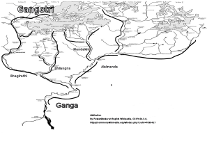

It was late morning when Fairy woke up. Angel was still sleeping though he was expected to be at work by noon. She came down to grab a coffee to find her Friend grinding the coffee beans. Waking up to the smell of fresh beans always brought unique pleasure to Fairy.

When did you wake up? - asked Fairy. She had insisted her Friend to stay back last night. It was almost one am when they reached home and thereafter both of them kept talking about `Matsya`. Angel had almost passed out on the steering wheel, but for  the constant reminders to keep his eyes open - that included mist spray on the face. And as soon as the chariot announced the arrival, he quietly slipped into his bedroom. The Friend could have gone back to her place. It was only a ten minutes flight for her new flying machine, but flights were on hold from one am to four am. 

It seems the air traffic system is getting an offline update - said the Friend - the system is capable of live updates but you need to be extra cautious when you are talking about thousands of silent chariots flying around in the night sky - solely on central navigation - even headlights aren't allowed in night - to accommodate and respect star gazers. Fairy felt she was obsessed with her new toy but she brushed the thought. People spend so much on art these days - a flying car is after all a useful thing - she reasoned to herself - and if you spend an year worth of wages, you do get to show off a little bit.

The other option was to let the machine self drive on the crappy roads. That meant keeping the eyes open on the steering. She was definitely not up for spending another hour on the wheel though they ended up talking for at least two -  with a round of hot tea.

The topic was obviously - what would `Matsya` see and what sort of plans she had in store for her!

Good morning everyone - they heard the Angel - hope you two slept well last night !

Fairy responded "yes" with a smile - and please send us the link to the next session. Can't wait to find what was `Matsya's` mission.

If we had the link, we must have watched the next episode last night itself - laughed the Friend pouring over black coffee in three mugs

Hmm - we don't have the next episode up yet - said the Angel - and before you figure out next of `Matsya`, you need to check out the story of `Ganga` and `Shantnu`. He waited for a bit looking for a facial response - and I know only half the story - the "Wikipedia" stuff!

That is such a bummer - complained the Friend. There must be a way to get hold of the complete narrative - with story as it happened, and the context. 

To really understand the context, you will need to see my Mentor - Angel said with an apology in his eyes and smile on his lips - I really didn't see it getting so interesting for you guys! He showed he underestimated the curiosity ..

Can we Zoom in with him ? - asked the Friend.

Unfortunately no! - In Summer, he lives off the grid. It is only 20 mins flight though - I can schedule you guys if you wanna go see him at Lake Tahoe - said the Angel and waited for their response.

I wish I could join you guys; but I am gone for a week - he continued - not hiding at all that he hated his work! The worst part was he couldn't tell it to Fairy - much less to her friends.

How could he tell others that he was the lead on "engineered bees" program. They took care to hive them in deep forests where no man had ever gone -  at least in last ten years - zero human footprint, as they say in the IGS [^igs] community, yet the project was turned hush hush. The big idea, with all the pomp,  was to resolve the growing demand of honey for humans stopped consuming cane sugars. The new bees did make 5x honey but they turned 10x poisonous - a consequence that was never considered in the design. The nature demanded - if you have more, you must equip yourself even more to protect it. If the woke media got a hint, his career was on the line, but he was more worrisome of the hate he was sure to get from his own circle - The "Fairy", in particular. 

To his good luck, the last episode (with the bees) didn't get much attention even though Fairy, unaware of the situation, posted about it. How could he save the man? The rescue attempt, he was sure, had the Fairy killed at a single sting. She didn't have the patched genes active - a protection against the poison. Even though he knew, a technology that killed a single human, was programmed to be wiped off (that was the bargain that "Intelligence" secured with a promise to a practically free life for all the humans) - pursue till "one human death" - yet he let a human die just to save the Fairy. 

The lost life was attributed to the forest fire. The identification was impossible for the there was hardly anything left in over-burnt ashes - even the bees had died. The first thing he did after the incident was to remove the spot location from department database. Fortunately there was no entry on the distributed public ledger - he thought - an anomaly but a regular practice in cutting edge biotech. The argument was to save the life altering technology from the bad actors. Somewhat like the conundrum that `Parasara` faced and resolved in favor of freedom. The Angel understood the argument on both the sides but what is the right way? - he still didn't know !

At the end of it, he was happy that he prioritized love over success - and probably that was the good `Karma` that her best Friend too was focused on `Matsya`. The story came in handy - he thought - not only at the time of the incident when he could convince the Fairy for an exit, but even her best friend was keen on the story. He wanted she never asked questions about the real incident. Lying was not his strong suite! And he did try to rescue the man - at least gave him an offer that the man disrespectfully declined. He wasn't sure if the argument absolved him from the sin but it afforded him comfort to live with himself.

Can we go today ? - his train of thoughts was interrupted by Fairy - Its been a while I went to the lake - she said after mulling over her calendar, and also looking at her Friend if she was fine to fly at no notice! And she saw a "yes" in her eyes - I am pretty open today till an evening dinner - the Friend said peeking over her watch and I don't need to file a request if I am flying away from San Francisco. She never missed sharing unnecessary details when it came to the flying cars!

Sure, let me check and I will drop a note from my commute. Do check with him his theory on Prime Numbers. I too want to understand that piece - Angel was gone with a mug of coffee in his hand and toast in his mouth - busy life of the affluent!

----

The flight to the lake was pleasant. There was still some snow on the peaks but otherwise the green sheet of trees circling white water looked pretty from five thousand feet. They got the first feel of cold air when they stepped out of the chariot. 63 degrees felt like 53. They had landed in front of a small house and they found an old man open the door as they were about to knock. 

He must have seen the notification of an unknown car landing on his porch - they assumed, though the old man had no security cams. Angel had called him on his landline that Fairy had landed on his driveway. He probably wanted to make sure the mentor didn't sleep because he loved to have an after meal nap from before the times Angel met him -  almost twenty years back. Some people don't change - he thought - as he waited for him to pick up the chorded land line - who uses the chord these days of star linked communication! - he wondered not knowing that the resistance had secured a chorded peer to peer network beyond the "watch" of central intelligence in lieu of granting the rights -  "till one human death". The angel was not sure if the Mentor was active member of the "Resistance" but he was aware that he had spread on both sides of the fence. He had friends in the "dark" and the "white" and many times he had brokered high value agreements.

---

Would you like some tea - Mentor asked - pointing them to the chairs in front of his table in rather large study room just by the entrance.

The room had a big table almost eight feet wide -  fully covered with at least two layers of books. There was an old desktop station touching the wall behind his chair. And his chair seemed like a century old. There was smell of old books oozing from the side shelves that went as high as the high ceiling.

The Angel said you two want to create a scene from `Ganga's` story in the new machines - he looked at his old desktop that was probably a 32 bit computer from late nineties incapable of running even the slightest of graphics. The dark terminal was reminiscent of Fortran era.

The friend was surprised. She did have the creative skills but she didn't know she was being recruited. She looked at the Fairy. The look on Fairy's face told her she didn't read the full note from Angel. Apparently, she just noted the location (and time) to pass on the coordinates to the flying machine.

The Fairy looked at her phone again as the Mentor disappeared to a small kitchenette in the living room - to get them the tea. And she handed over the phone to the Friend. The message clearly read that the Mentor was willing to see them if they were okay doing a small animated sequence. To Angel's mind, it was a win win. 

Talk about communication! - the Friend spoke with a whim on her face, as she handed the phone back to the Fairy - Okay but I don't know how long would it take. And I have never done a historical narrative before! 

Yes - they both said as they found the Mentor carrying back a kettle of tea with freshly baked cookies. The aroma of cookies mixed with the smell of old books just felt right for a "yes". And of course the view of the snow covered peaks from the large window at their back - btw Angel said to start from your theory on the Prime Numbers if that is relevant to the narrative .. 

Oh sure - it is actually not a theory - some people try to give undue credit - humility reflected in his voice -  and it is not that hard either - said the mentor as he poured them tea and settled in his old chair, but I do need to know how much you two know about the "Primes" - He was courteous and his intent was not to waste their time in the basics.

The prime numbers, as you know are something that can't be divided by anything other than themselves - and of course by the number "1" - said the Fairy - and that is all I know about them except that they keep on finding new primes almost every day.

There are billions of them already known and they say there exist infinite Primes - added the Friend - their biggest use is in cryptography - to hide the things or to make them truly public.

Mentor was pleased that he was spared from the definitions - So what is "1", is it a Prime ?  He asked to get the conversation started.

Well technically yes - replied the Friend - though it is not counted as one because of some theorem I forgot the name - She was already getting comfortable in this conversation.

You are right. The good reason for "1" not being considered prime is the fundamental theorem of arithmetic, which states that every number can be written as a product of primes in exactly one way. If "1" were prime, we would lose that uniqueness. We could write 2 as 1×2, or 1×1×2, or 1^594827×2. Excluding "1" from the primes smooths that out. If you want to know more I will have you read this [article](https://blogs.scientificamerican.com/roots-of-unity/why-isnt-1-a-prime-number/). He emailed the link to both of them and took a break for dogs' treat-time. He had two big white huskies that looked like wolves.

Walking back in about ten minutes later - The strangest thing about "1" is it looks exactly what we want it to be - for example - "1" book is a book , "1" meter is a meter , "1" home is a home but we can never know what "1" is ! We can never understand the "1" without association to a worldly thing - an "Identity". As for "2", we can at least say it is twice the "1" - " 1 + 1 = 2" - He smiled. Other thing that we all know about "1" is that it is free from multiplier effect. No matter how many times you multiply "1" with itself, it still remains "1" ; but same is not true for addition. "1" gets added to the things and it increases the count by one. Only "0" is free from material additive property. Since "Unity" is free from multiplier effect you can have infinite instances of "1" without altering the universe even a tiny bit. It however dictates one rule - all things made with additions of "1" must unite together into "one". In that everything in this room is just one room. Everything in this home is just one home. In fact entire universe is just "one" universe!

The mentor got his flow - the way I like to think about prime numbers is to imagine rivers flowing into an ocean. They all become "One" ocean. The special thing about "this" ocean is that only prime number of rivers are allowed to flow in. You may also think about it as a flower plant . For example think about a bouquet - each flower with seven leafs - one flower on every one of the five branches. And then five branches on two stems each.

> 70 leafs = 7 Flowers x 5 branches x  2 stems = "1" flower plant.
>
> The key thing is, this is unique way to organize 70 leafs. This is because the fundamental theorem of Arithmetic dictates that number 70 has a unique set of prime factors = 7 x 5 x 2 . For example if a genetic mutation put flowers with 35 leafs each on 2 stems (35 x 2 = 70) the flowers will automatically rearrange themselves into 7 leaf flowers on 5 branches over evolutionary cycles. If we try to put flowers of seven leafs each on ten branches (7 x 10 = 70), the ten branches would automatically reorganize themselves into five branches on 2 stems each over a longer evolutionary horizon. Nature gravitates towards the prime factors because - well - they are uniquely identifiable. 
>
> Every number must have prime factors, and no two numbers have same set of prime factors - the very definition of Identity.

Wait! You made quite a bouquet of flowers, and I am lost in the basic math - said the Fairy - Could you please repeat?

Oh! Absolutely - said the mentor - Let me explain it with a rather simple example. Let's take a smaller number - say "8". He thought for a bit - let me draw it for you ... 

He said while looking for a pen and paper - the number "8" has prime factors 2 x 2 x 2. We can display it as say the boats docked on a wharf. 

If you consider each prime as a unique idea, the number "8" has all the pre-existing ideas in harmony - for lack of a better word ! - smiled the Mentor - and btw it is the first non prime number on the Fibonacci [^fib] sequence.

Very interesting - said the Fairy - I never thought it in this light but it makes sense!

Bingo - you got it. Good that you asked the question & made me draw the picture - a part of my study is to figure out such numbers of higher order say 23 that exhibit similar behaviour and to speculate what those "prime" ideas could be. For example "2" underscores the idea of Duality, "3" that of "Trinity", "5" angles may be five senses as different angles to see the things, and "7" being the largest single digit prime might evoke "Intelligence". Goes without saying that this is pseudo science. There is no proof. In a way, it is like a puzzle - you iterate prime phenomenon exhibited in nature and try to fit them to a prime number to see if works - then you try the same set of ideas with a bigger number to figure out it's nature and more often, you end up tweaking the ideas. In essence it is a good way to spend the time - he laughed.

But then how this number theory related to the story of `Ganga` and `Shantanu` - asked the Friend..

`Ganga` understood the significance of Eight. Though she didn't think it in terms of numbers. She learnt it through real experience of rivers.  She noticed four rivers tied up eight frozen lakes (glaciers). It will be easy if you see this map of `Gangotri Region` - the birth place of Ganges.

In a way, the identity of Ganges was the entire glacier region that she could access as eight frozen water falls (glaciers) and the purpose of Ganges - she though -  was to unite the knowledge of their existence into one. Ganges brought mountains (her home) to the plains through a primal scheme and to `Ganga` that schema was auspicious. Later, modern geologists marvel at this scheme in the sense such a vast glacier system ultimately manifests into just one perennial mega-river. Just like the locals, they too see the magic of God's gift. Keep in mind the glacier is retreating almost two miles per century. That is the reason you see many more tributaries now spread around the main rivers in 100 to 150 miles range.

The lunch was a light chit chat. During the discussion, he fired a print command - old dot matrix printer sitting by the desktop started whirring. He grabbed two copies of printed pages. Handing over one to each, he  said - here, I wrote down the story of `Ganga and Shantanu` thinking you will need some sort of document to build your scenes. 

They both quickly glanced at the sheets, chewing their Pizzas. 

You can read it on your flight back. For now I suggest you two go around the lake for this beautiful day is not to be wasted listening to an old-man. I have given quite a bit of geography to let you better visualize the locale.  Rest is your creativity - he smiled.

# `Ashtdha` - Eight Fold ..

The other side of the river `Yamuna` belonged to the empire. `Shantanu` — A king known for his justice, wealth and valor in the lineage of even bigger names. His empire was primarily spread between rivers `Yamuna`, `Sarswati` and `Ganges`. On the north it reached the peaks of `Himalayas` that protected it's border like a wall of snow, and also a perennial source of fresh water to all the rivers and hundreds of tributaries that joined them to form a complex mesh of `Ganges-Yamuna` river system.

In the absence of freeways, most big cities shaped up along the rivers, including `Hastinapur` — the capital city of `Shantanu`. In addition to pure water, the river system served as the primary transport layer. Wood, Weapons, and Produce, moved through the rivers. In other words, the river system was the lifeline of this empire. King had built large wooden floaters that were used to carry rice and wheat downstream, and were taken over for moving military supplies during the war-times. It was easy to move the things down-stream but upstream traffic was still a mystery. Many times they used elephants to move the cargo upstream but in deeper stretches it was hard. Nevertheless, the elephants and their owners were important part of lumber and grain movement.

And there was another problem. Rampant floods made living near the rivers a major risk. There was a need to make sure water stayed in the rivers. While there were many rituals designed to appease the Gods of rain, people were figuring out means to deepen the rivers, particularly in stretches where the depth was shallow and thus rivers used to spread in miles. Though most of their efforts lacked the top down planning and also innovation of tools. No one had made it a mission of their lives.

As the king circled right of the middle age, he got interested in music, religion and philosophy. Expansion of his kingdom dropped off the priority. He wanted his people safe, well-fed and well taken care.  Luckily, his son, `Devvrata` was even more prudent in managing the vast province. In addition to being a warrior par excellence, he brought primal understanding of the water ways. He developed the signalling system with pigeon points located along the river banks — to serve as early warning system for the floods. He had his large teams of soldiers and craftsmen build the wooden bridges, transport jetties, docks, dams and water locks. 

This deep knowledge of the rivers made him popular. People started calling him `Ganga-putra` — the son of Ganges! The ancient `Vaidik` system was a matriarchy where able offspring bore the name of their mothers though in this case it was quite appropriate. His work brought prosperity and security to the kingdom never seen before. People said that the skills that `Devvrata` had, were natural to him because he was son of `Ganga` (Hindi name for the river Ganges). That was true because name of his 'human' mother was `Ganga` too; though the hyperbole is `Ganga` (the mother) was a true incarnation of the river itself - literally. 

Even the scripture noted that river `Ganges` manifested into a beautiful woman called `Ganga` to bear `Devvrata` and seven other `Vasus` - the elemental deities. In `Mahabharata`, `Vasus` are considered as eight identities of the manifestation ..

| Vasu      | Meaning    |
|:--------- |:---------- |
| Dhara     | Earth      |
| Aapa      | Water      |
| Anala     | Fire       |
| Anila     | Wind       |
| Pratyusha | Sun        |
| Prabhasa  | Sky        |
| Dhruva    | North Star |

> It was believed that the `Vasus`, long before `Kalmashpada`, wanted to steal `Kaamdhenu` - the knowledge of `Vasishtha's` congregation and were thus cursed to be born as humans.

# 11.1
---

Just like the pious river, `Dev's` real mother was born on the peaks of Himalayas — near the birth place of river `Ganges` — a place called `Gangotri`. She grew up navigating the rivers in her small kayak — playing and moving fast through the dangerous rapids of Ganges in tall mountains of it's decent. Her fascination for the water and that for river Ganges,  was such that she used to spend all her time on the river. The local villagers started calling her `Ganga` — after the name of the river in local dialect. People forgot her real name — not that it mattered anymore, for she was a true embodiment of Ganges — through her actions (`Karma`)

As she got into her late teens, she and her friends would go on longer voyages in Ganges. Many times for days and weeks. They designed two person Kayaks. They would kayak downstream through rapids and falls, and then carry them back on their shoulders — two persons supporting one Kayak. Climbing the mountains with Kayaks on their backs, used to be painfully long, and arduous — sometimes through the thick uncharted forests. Her dream was to design a boat that could sail upstream. Or something that could sail the boats up without depending on elephants. She didn't know yet that she was imagining "water-locks" in her teen mind. 

> Even more cherished dream was to find out how and where 'Ganges' ended? She had heard (from travelers) that the mighty river finally met into a vast ocean that could retain water of a thousand rivers! `Ganga` used to wonder why couldn't they make an ocean right here in `Himalayas`, to store the water for irrigation and boating. Little did the young girl know that stopping the water is like stopping the circle of life. And she learnt it as she entered her early youth.  In a way Ganges was a definition of time for her. Her childhood in `Gangotri` — the origin of the river ; her teens in the upper rapids ; her youth in the flat stretch where the mighty river walked like a gorgeous woman of reason, action, and pride. And she wanted to see  the endless sea to mark the completion of her time! 

Longer voyages, and turn to adulthood, made it clear to `Ganga` that the floods were the biggest problems for common people downstream. In one of her trips, she saw the devastation firsthand, when she and her crew, narrowly escaped the swelling river. The legend says that the real `Ganga` was born out of that massive swell. They probably meant that the resolve, and the dedication to a singular focus in her life, incarnated out of that flood. Without saying out loud, she started a mission to deepen Ganges wherever it was flattish. She wanted to bound the river with in two banks. Bondage is a prerequisite to manifest - she must have thought.

Good deeds gain support from the masses. Her crew grew in size and skills. Starting from the very top near the origins, she and her team finally reached the plains — working through one gorge to the next. It was as if she (and her team) shaped a new Ganges. They were welcomed by the local people as they brought skills to deepen a running river. They had designed tools to form a constellation of Kayaks tied to each other with ropes, and then lower a heavy metal harvester to scour the bottom. Many times they recovered valuables, but the business was not risk free. Many died in the pursuit of these riverbed scouring projects. True to her name, `Ganga` committed her life to this cause that turned into a long series of semi-engineering projects. The work, however, was not conflict free. Deeper river meant that elephants had even harder time moving the floaters upstream. 

Her work, along with the negative politics of rich cargo movers, got her so popular that the news reached the king `Shantanu`. He was happy to see people taking on the public works in their hands rather than depending solely on the high priests or the king, but the elephant owners were important for the movement of goods, and they were a major revenue stream for the kingdom. He wanted to settle the disputes himself. In addition, he wanted to see if the tools and boats her team designed could be used to anchor his army, mid-stream, in a fast running river. A definite advantage in war-times.

He also wanted to lend the official support to the project(s) for the public opinion was with her, NOT the cargo movers. But most importantly he wanted to see `Ganga` — the woman every one talked about for her courage, charisma and dedication.

## 11.2
---

It was love at first sight.

Being of the age when passion knows no bounds, the King admired `Ganga` for her altruism and engineering prowess, and she admired the king for his zest to make people's life better. They talked for hours. She was never tired of detailing her expeditions and he was never tired of listening to her. One fine evening, `Shantanu` proposed to `Ganga`. He offered her the first (and the only) queen of the vast empire. 

She had her heart out for the king, but she was dedicated to the cause. Being a queen meant to be stationed at the capital with thousands of chores that come with the crown. Like the river, her flow was unstoppable. She was free, and she wanted to stay that way. 

I don't want to give up my mission that brought you to me in the first place — she told `Shanatnu` with love in her eyes and passion in her words —  we may meet here as long as you are willing to see me at `Ganges` !

But I can't stay here for ever. I must attend to my people — said `Shantanu`, bit confused with `Ganga's` proposal.

You may leave as you need to. Your duties as a king, to your people are ever more than our obligations to each other — said `Ganga` — and come back when you crave for me. 

> Such an arrangement was not new — there was even a name for it  — `Gandhrva Vivah` — A marriage among equals with no strings attached.

The counter proposal seemed fair to `Shantanu` for he was hardly stationed at his capital. And most of the times he was anyway sailing through `Ganges` or `Yamuna` - I do need an heir for this vast empire. Someone who has your passion and love for my people - he told `Ganga` holding both her hands.

`Ganga` thought for a while - I will give you one and it will be the eighth of our union. An "Identity" for our love. Like the seven colors of the rainbow, the first seven will combine their skills into the youngest. One that would make you proud. And also have a life long commitment to our people. But we will need to go to `Bramh-rishi Vasishtha` to forge this union. He can ordain a wedding for us such that our bond not only manifest what we want but also sets us free from previous bondages. 

## 11.3
---

`Bramh-rishi` welcomed both `Ganga and Shantanu` with his grand son `Parasara`. He had rebuilt his congregation after attack on `kaam-dhenu` that took his son `Sakti Muni` though this was not the first attempt to steal the wealth of people. He recalled eight `Vasus` (Deities of the fist order) had tried to steal from the congregation whom he had cursed a life of mediocrity. On their pleading guilty and humble appeal for repentance, he blessed them an exit from the curse. They would still take birth like men but their life would be for a purpose bigger than what they could do as Wizards. An attempt to steal knowledge, must be repaid with a lifetime of service to the common man - to whom "knowledge" truly belonged. `Bramh-rishi` saw `Shantanu` and `Ganga` as the best couple to parent the cursed Wizards - to offer them a superior chance at the public service.

`Bramh-rishi` if I have permission to speak - asked `Ganga`. Seeing the bearer of primordial knowledge nod, she submitted - we want one of our children to truly represent our bond. And one of them such who could serve the people as much as the King does, and I care. "Able progeny" is the biggest gift a couple could ask - in this case the ask was for the greater good.

`Vasishtha` was pleased at the good will of the young girl - seven verses to bless your bond into an identity that you seek `Ganga`. Seven verses - each to serve as a primal joint for this union. Seven of your sons will shine as as seven colors of the rainbow. Together they would blossom into eighth who would be oriented from the very first breath as you seek. One who would make both of you proud. His name shall be the centerpiece of the history [^history]

`Bramh-rishi` asked `Parasara` to light up a `Vaidik` fire. All the `Yogies` and their families stood around the holy fire as `Ganga` and `Shantnu` took seven circles of the fire. One with each verse:

### First verse

The ceremony started with a `Swastivachan` - a good wish from all the present - all the witnesses of the union.

> Ihemavindra Samnudam Chakravakev Dampati;
>
> Prajyouno Swastikou Viswamayurvya Ashnutaam.

O Lord, may you bring this couple together, like a pair of `Charavaka` ducks. They may bear auspicious children. Their union is for such progeny that set an example for entire world to follow!

### second verse
`Bramh-rishi` pointed towards `Ganga` to invoke this second verse in herself ..

> Dhairham Prithvitvam;
>
> Raitoham, raitobritvam;
>
> Manohamsmi Vaaktvam;
>
> Saamhasmi Rikarvam;
>
> Sa Mam, Anuvrata bhav.

I am the sky, you are the earth;

I radiate energy and you hold it to manifest things in this physical world;

I am the thought (`Mana`) and you are the words. 

I am `Saama` the music, and you are `Rika` the song

I and you follow each other. 

### Third verse

This is bride's expression of Trust in this union - said `Bramh-rishi` as he recited one of his own verse ..

> Tat Chakshuh Devhitam, Shukram Uccharta;
>
> Pashyema Shardah Shatam, Jeevema Shardah Shatam.

Your foresight favours the work of Deities. Your auspicious vision is bright and rising. It may pan out for next hundred years. May we live to see it taking shape.

### Fourth Verse

Having moved with `Ganga's` expression of Trust, `Shantanu` made worldly commitments. In the fourth verse he said ..

> Dharmecha Arthecha Kaamecha, Imam Naticharami;
>
> Dharmecha Arthecha Kaamecha, Imum Naticharami.

In my Duties (`Dharmecha`), In my financial responsibilities (`Arthecha`) and in my physical needs (`Kaamecha`), I will always consult you. I will actively seek and act per consensus.

### Fifth verse

And also moved with bride's expression of spiritual love, `Shantanu` thanked the Gods for this good fortune. He praised the deities for bringing `Ganga` to his life. He said ..

> Gribhnami te Soubhagstvay, Hastam Maya Patya Jardishtirysthasa;
>
> Bhago Aryama Savita Purandhir Mayama Tva Durgahptyay Devah.

I thank the deities of enjoyment (Bhaga) , deity of wisdom (Aryama) and the deity of the creative force (Savitaru) for bringing you in my life. Not only these deities , I thank the entire universe `Purandhir` a name of `Bramha` , for the good fortune of being together. 

### Sixth verse

The sixth verse was the celebration of companionship. They wished not to lose this friendship even if they lose everything else. 

> Sakha Saptpada Bhav;
>
> Sakhayou Saptpada Babhoove;
>
> Sakhyam Te Gameyam
>
> Sakyat te Mayosham
>
> Sakhyanme Mayoshthah

Oh friend we are taking seven steps together.

Having gotten the taste of your company, I am enchanted with the magic of your companionship.

It's you who I always talk about. Your conversations are always on my lips.

### Seventh verse

> Saha Naav[au]-Avatu | Saha Nau Bhunaktu | Saha Veeryam Karava Vahai |
>
> Tejasvi Naav[au]-Adhiitam-Astu Maa Vidvissaavahai |

May we two Move Together,  

May we two Relish  Together ;

May we indulge in our objectives with Vigor , 

May we never doubt or be jealous of each other. 

## 11.4
----

`Dev` was a divine gift from river `Ganga`. At an early age he understood the intricacies of motion of water. The last of eight brothers, all of whom dedicated their lives to improve peoples' lives. Two of them were sent to the North by `Ganga` to create a map of Ganges and source glaciers. Other two went South East where Ganges meets the ocean. They too had the similar goal — charter Ganges path to the ocean. `Ganga` wanted complete picture of the Ganges — from the mountains of her birth to the ocean of it's salvage. Brothers coordinated their work through pigeons to draw one comprehensive map of river system that makes the most fertile plains of North India. 

> The hyperbole is that `Ganga` threw her first seven kids back into the Ganges, which is not entirely wrong because they did serve their lives to the cause of the mighty river.

Fifth brother worked on setting up bridges on Ganges. Sixth worked on techniques to move the boats and tree logs upstream through a system of water locks. Seventh on making levies for low-lying villages where floods caused havoc in rainy seasons. 

Having learnt from all his brothers, who had dedicated their lives to Ganges, the youngest `Dev` pulled the biggest of all engineering feats at a young age. He built a dam and changed the direction of Ganges such that more people could get help from the waters. During rainy seasons, the dam could be opened to let the water flow in two streams. People thought he was the water bender. They named him `Ganga-putra` —  Son of `Ganges` — the river. `Dev's` life mission was to stay true to the kingdom and it's people. A vow that he carried till his last breath.

Good times go fast. `Ganga` had to move South East, towards the point where `Yamuna` met `Ganges`. King and Dev were left behind. Busy in serving the river and people, she wanted to continue to follow her dream. She wanted to see the grand unified river merge into the vast ocean. And she thought meeting the ocean was her final destination, just like it was for the river.

## Research and notes:

[^igs]: Intelligent GPS systems were - IGS were set up in late 90s , inspired by the Hollywood movie "Minority Report". Early break through in Google Maps led to the idea if GPS based AI models could predict the near future location of a crime or an accident. The public face of the effort was "Traffic Prediction". Not that the technology was still early alpha, soon they realized that predicting the present (the next action) was almost impossible. The project was abandoned in 2020. Google did share the map history of everyone. They acknowledged that they did keep track of everyone's geographical location but for most it was not a bad thing. They thought it was an additional free service Google is providing. Even those with inner knowledge of the project, didn't see any issue in this. The project data was archived and it found it's use in obscure things such as "Zero Footprint locations" - pockets of land where humans have never gone. Such locations need not be things like North or South poles. These locations may exist in your backyard. 

---

[^fib]: The Fibonacci numbers were first described in Indian mathematics, as early as 200 BC in work by `Pingala` on enumerating possible patterns of Sanskrit poetry formed from syllables of two lengths. They are named after the Italian mathematician Leonardo of Pisa, also known as Fibonacci, who introduced the sequence to Western European mathematics in his 1202 book `Liber Abaci`. The series - 1 , 2 , 3 , 5 , 8 , 13 ... is derived by adding two previous numbers. All the numbers leading up to "8" are prime.  

----
[^history]: The eighth son of `Ganga and Shantanu` was `Devvrata`, commonly known as `Bheeshma`. The biggest and central chapter of `Mahabharata` is called `Bheeshma Parv`. As the name suggests the entire chapter is centered around `Bheeshma`. `Srimadbhagvad Gita` the most potent piece of knowledge in human history is at the center of `Bheeshma Parva`. 
