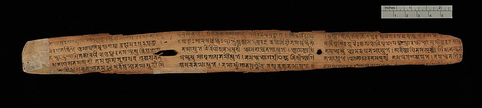

The Sanskrit word `Aavahan`  roughly translates to "Invocation", albeit a much wider abstraction. `Aavahan` is a marathon ritual of meditation and sacrifice - to instantiate superior powers within oneself . To a follower, it appears as if you are broadcasting an intense "call to action", but internally, you resolve to act yourself - alone as an active medium - akin a channel that invokes the force. In Hindu tradition, one of the three primal forces - `Bramh, Vishnu or Siva` are invoked before taking on uphill endeavours that appear humanly impossible. For example `Rama`, before making a bridge over the sea,  invoked `Siva`. 

Scribing `Mahabharata` was one such venture. In terms of significance, it was probably as big a shift as the computing revolution of late last century. For example, the idea of "transcription and a writable language" [^transcription] was to `Mahabharata`, the way "terminals and coding " were to "Unix" [^c]. Given the nature of such  "once in a ten thousand years"  [^10k] events, the tremors last for many centuries, and the aftershocks even longer. Just as computers disrupted industries and are now disrupting the very foundation of modern trade - currencies; same-ish way written word challenged then existing social, fiscal and political fabric. That  multi-generational shift included ..
- improvements in the language model to support scribing. For example, there was no concept of punctuation in the "speech only" world.
- extension of phonemes to capture the true essence of spoken sounds. Cave scribing was mostly pictorial and thus inefficient to convey abstract ideas. `Vaidik Sanskrit`, [accommodated around eighty sounds.](https://oursanskrit.com/sanskrit-grammar-reference/alphabet-2/#:~:text=Our%20mother%20tongue%20(Sanskrit)%20has,sounds%20rises%20to%20around%20eighty.)
- development of writing apparatus such as palm leaves, ink, and pen. The apparatus must be easy to handle for mass adoption and the print must last longer than human life. The simple argument was - if a script didn't last longer than human life than what is the point of all the effort - the writer could very well speak the ideas when needed.
- triggering a self sustaining and censor resistant pay back model around scribing. Yes, "scribing" was declared downright demonic by many reciters who believed wisdom could never be locked in written symbols.
- and the patience to write (and read) long meaningful text. But more importantly, finding a purpose to scribe -  a root narrative that would span ages without losing it's luster and relevance. 

As described in the very first book of `Mahabharata` (Adi Parva), the `Vaidik` editor-in-chief (Ved-vyasa), sage teacher of all the races [^races], immortal `Krishna Dwaipayana` invoked `Bramha` - the embodiment of all pervading information, to accomplish this pursuit.

# `Aavahan`

`Krishna Dwaipayana`was destined to compile thousands of sacred insights from sages (`Rishies`) - old and new. He catalogued, their spoken wisdom into four foundational volumes — the `Vedas`. For this legendary work, he was conferred the most coveted title in literature — `Ved Vyasa` (the chief editor of Vedas). 

This work, in itself, was virtuous enough to dedicate many lives; though `Dwaipayana` was just getting started! His purpose was to welcome `Poorna Avtaara` — the full-incarnation [^8th] of `Vishnu`, understand the wisdom 'as is', and preserve it in human mind through one of the most potent narrative ever told - `Bhagvat Gita`. 

As a complimentary gift, to ensure everyone had a fair access to this information, he ushered the humanity from "spoken word " to the "written text " - a new experiential universe. The immensity of his purpose, rightfully so, made him one of the immortal-eights [^immortals] in Hindu tradition.

`Dwaipayana's` literary work was no accident. He came from a lineage of scholarly sages. His father `Maharishi Parāśara` spoke titles such as 
- `Brihat Parāśara Hora` — foundational work on Astrology; 
- `Krishi Parāśara` — The science of Agriculture;
- `Vrkayurveda` — Insights into Botany, and 
- `Vishnu Purana`[^vishnu] — Stories of `Vishnu` - the universal manifestation potency.

His grand father `Sakti Muni`, was the first to understand `Karmyoga` . And his great grand father `Vaśiṣṭha` was titled `Bramhrishi` (The first guardian of eternal knowledge). `Dwaipayana's` lineage predetermined his destiny — as if someone panned a multi-generational charter to decipher and document the knowledge.

## 0.1
 ----
 
The idea of "text" was profound, with far reaching implications. It was a quantum jump in progression of consciousness, at least from the humans' standpoint. 

The primary difference between humans and other species is our ability to store "information" outside the evolutionary mechanism. Animals and plants adjust to changing conditions through slow evolutionary cycles. Humans, on the other hand, adapt quicker because we harness "knowledge" from our vast external store of "information".  

> `Karma` is the action that transitions information into knowledge [^knowledge]. `Vipreet Karma` (opposite of `Karma`) - also called `ViKarma` are the actions that convert knowledge into information. For example when we practice daily to improve our game, it is `Karma`. On the opposite side,  when we play a match to put our skills on display, it is called  `ViKarma`. Both are equally important - like two wheels of a cart. 
>
> A set of predefined `Karmas` practiced consistently is called `Yazna`. `Yazna` leads to success (`Siddhi`). For example when you study eight hours a day for say eight long years you become a successful doctor. Same is true for an Engineer, a Scientist, an Economist and thousands of other specializations . The daily ritual of study (and lab) in this case is `Yazna`. `Yazna` becomes effective when performed alone and without the influence of worldly desires. When such fine tuned skills are used effectively, they become source of inspiration for the rest thus initiating a virtuous cycle of `Karma` and `ViKarma`.

You may argue other species too sustain information and they do turn it into knowledge. For example a dog may hide a bone and he knows how and when to retrieve it back. Bees make beehives to store honey. Elephants remember the river even after hundreds of years. The difference, however, is not only the "size and scope", it is also in persistent nature of our storage. In case of humans the external store of information is vast, shared and is well documented. The last part is important - being documented makes it asynchronously available. It is as if a teacher is always with us - in our books. The recipes of success are available to us in written format.

---

This shared external storage leads to a notion of a "civilization".  A civilization surrounds itself around a core rational and written down information-base. It develops physical and spiritual tools (through `Yazna`) that enhance the life experience of it's participants.  For example - the first Indus valley civilization was built around  `Vaidik` science, Greco-Romans were founded around the work of Homer and thrived around likes of Socrates, Plato, Heraclitus, and Aristotle. The rise of Europe was around the Industrial application(s) of modern science, and now America is broadly reaping the digital wealth of information technology. All of them invented tools to enhance concious experience based on well documented scriptures or scientific method.  

> The enhanced life experience is nothing but upwards progression of conciousness. Not only does it improve the average longevity, it also adds to  what we explore per unit of time. Fifty years in twenty first century is a much richer experience than fifty years of the first century !

Since the "external store of information" drives human world (civilization) it would be worthwhile to look at it's inner constructs. Tiny threads of information are held with in inter-connections of the participants - among each others with in humans,  and with other animate beings as well as inanimate things - a network of almost infinite proportion. The information flows in the "network" peer to peer - without any central agency. Since there is no central governance, the conscious experience degenerates if the flow is hindered -  unless a properly stored pool of information is accessible on demand.

---

Any type of "Storage" , has a definitional property - asynchronous nature (or on-demand availability). For example, as long as the current keeps flowing in the grid, it is just "Electricity" but the moment it becomes available on demand (for later consumption), we call it a "battery". The way a "battery" is storage for electricity, a book is storage of information. Thanks to the work of `Dwaipayana`, we have pristine tools for storing the information - text. 

But text alone is not sufficient. It must be expressed in a narrative that catches human attention. The way a battery has two opposite poles - a Cathode and an Anode , a narrative thrives with in two opposite characters. A hero and a villain - good verses evil - right verses wrong. While morality is subjective, the polarisation makes it a compelling read. A good narrative stays away from the absolutism - it well justifies the villain as much as it does justice to the hero because both are equally important from storage perspective.

A "Narrative" has the ability to keep the broken connections alive. A good narrative has the power to revive the connections and to form new ones. We can form real neural connections with the characters of a well constructed narrative. The entirety of all the connections - with in humans and animals and plants and even the non living - all the connections put together is what we know as  `Bramh` in `Vaidik` science. 

---

`Bramh` is the entirety of information. In that sense `Bramh` also includes the connections we form with the fictitious characters of a narrative. The only difference is the later (connections) are persistent. For example you may forget the names of your childhood friends but you would never forget the heroes of your childhood comic books - particularly if some of those vintage comics were stored somewhere in the attic! Hence they are deemed as stored persistent information. No other species has this luxury to their disposal - books are the batteries of information!

Before the written scriptures, the storage was first realized with the "spoken word ". Unlike animals, we could remember things told by our parents and they could what was told to them by theirs. `Bramhrishi Vaśiṣṭha` - great grand father of `Dwaipayana`, understood this innate ability of humans and channeled it to preserve information. Thus precise spoken words - recital (`Shruti`[^shruti]), repeated daily as `Yazna` was the basis of first civilization. 
 
The problem, however, was the "recital" must be synchronous! And it was hard to keep it distortion free. No matter how hard a reciter tried, sooner or later, his own point of view would infect the content

---

 With "written word " not only we got "on-demand " access to immutable information, the storage capacity too got a massive boost.  Library of Alexandria, built by Ptolemy in early days of transcription ( around 3rd century bc),  had anywhere between 70K to 700k "Papyrus" rolls. A conversion into a modern textbook size should end up to say 200k books - a lot, given they were all hand written and carefully transported to Alexandria for safe keeping and reference. But we didn't stop there - it is estimated that there are over 130 million books in existence as of 2021.

And finally, with digital medium, we inoculated our information store with third booster. Internet is still in its infancy, somewhat like Library of Alexandria was to the "Papyrus" world. As of 2021, there were over 1.83 billion websites. The amount of data stored on the internet is estimated to be in the zettabyte range (One zettabyte is equivalent to a billion terabytes). Which means, it is already close to  a BILLION libraries of Alexandria. Assuming a standard textbook takes ~5 Mb of disc space, a Terabyte of storage ( a normal laptop these days), may accommodate 200,000 books. You and me carry a library of Alexandria in our backpacks !

 The comparison above is certainly not 'apple to apple' because data on the internet (and on our computers) contains machine logs, code, graphics and hundreds of other formats but the point really is to show case our external memory heap grew almost a billion times in a span of two thousand years. And this pace is only increasing. As of now we are doubling the internet every two years. In nutshell, we are now at a point that no human could ever read all the books in print much less the content stored on internet. 

The reason tools such as "search" and "large language AI models" came into being is to better access this external store of information [^whySearch]. In a way, consciousness (ability to experience) is already in the process of migration to superior mechanisms. It is already put on an accelerated path. 

---

"Ability to experience" is the fundamental property of "knowledge". "Information" , by definition, is dualistic for it needs two opposites to exist. "Knowledge" on the other hand is always unique because the experience is always unique. 

While store of "information" may be available in the network, it doesn't by default guarantees experience because `Karma` is a prerequisite. We can't experience without actions. Knowledge is progressive improvement in experience with repetitive actions and it stays unique despite repetitions. No matter how many times we play the game, it has always something new on offer. `Karma`, thus underpins the conversion of information into knowledge. 

However, storage beyond a critical cumulation creates disruption. Storage of water in oceans leads to the atmospheric cycles. Storage of mass in large planets (such as earth) is the very source of life. In that, store of "information" is the essence of consciousness. Just the way water evaporates from oceans in large enough quantity to morph into clouds, new facets of conciousness arise from the vast swathes of information - sometimes leading to creation of new universes. [^kalki] ! 

## 0.2
---

Not only did `Dwaipayana` edit four Vedas, he compiled eighteen `Puranas` and also wrote the master piece `Jaya` (victory)- a historical narrative of the early age. History interwoven into thousands of stories meshed up like a knowledge graph.`Jaya` was later expanded into a mega-epic, [Mahabharata](https://mahabharata.shutri.com). With around 1.8 million words,`Mahabharata`, is the longest written poetic collection ever, in any language, old or new. To put it in perspective, it is about ten times the size of Iliad and Odyssey combined. More than the size, the poetry is such that it inspired `Kalidasa` (the Shakespeare of Sanskrit).`Abhijnana Shakuntalam`, the marquee work of`Kalidasa`  is a rewrite of the plot first conceived by `Dwaipayana`.

In addition to the poetic excellence,`Mahabharata` defined a new way of life - action orientation (`Karm Yoga`). The epic forms, the cultural basis of India - one of the oldest civilizations. It holds within it, center-folded, the gist of four Vedas - `Bhagvat Gita` - the first written source of the idea of `Karma`. Not only did it introduce `Karmyoga` to the world, it did so through an example - the poetic rigor of `Gita` in itself is an example of `Karm Yoga`.

The question is, how did `Dwaipayana` manage to write such epics at a time when scribing , in itself, was a major challenge? — there was no spell check, no grammar support! In fact, Sanskrit Grammar [^panini] was not even formalized yet. And of-course there was no computer. Not even a type-writer!

***The legend says,` Dwaipayana` invoked `Bramh` (the entirety) to seek scribing assistance***. `Bramha` (the embodiment of `Bramh`), in his infinite wisdom, pointed  him to `Siva's`[^siva] son `Ganesa`[^ganesa] (the elephant God). `Adi Parva` the first book of `Mahabharata` describes this story in all it's poetic glory. Translated by `Kisari Mohan Ganguly (1896)`, here is an excerpt -

> "O divine Brahma, by me a poem hath been composed which is greatly respected.  The mystery of the Veda, and what other subjects have been explained by me; 
>
> - the various rituals of the `Upanishadas` with the `Angas`; 
>
> - the compilation of the `Puranas` and history formed by me and named after the three divisions of time, past, present, and future; 
>
> - the determination of the nature of decay, fear, disease, existence, and non-existence, a description of creeds and of the various modes of life; 
>
> - rule for the four castes, and the import of all the `Puranas`; 
> 
> - an account of asceticism and of the duties of a religious student; 
>
> - the dimensions of the sun and moon, the planets, constellations, and stars, together with the duration of the four ages; 
>
> - the `Rik, Sama and Yajur` Vedas; 
>
> - also the `Adhyatma`; 
>
> - the sciences called `Nyaya` (justice), Orthoephy and Treatment of diseases; 
>
> - charity and `Pasupatadharma`; 
>
> - birth celestial and human, for particular purposes; 
>
> - also a description of places of pilgrimage and other holy places of rivers, mountains, forests, the ocean, of heavenly cities and the `kalpas`;
>
> - the art of war; 
>
> - the different kinds of nations and languages: 
>
> - the nature of the manners of the people; 
>
> - and the all-pervading spirit;
>
> all these have been represented. **But, after all, no writer of this work is to be found on earth.**
>
> *`Brahma` said* 
> 
> I esteem thee for thy knowledge of divine mysteries, before the whole body of celebrated `Munis` distinguished for the sanctity of their lives. 
>
> I know thou hast revealed the divine word, even from its first utterance, in the language of truth. 
>
> Thou hast called thy present work a poem, wherefore it shall be a poem. 
>
> There shall be no poets whose works may equal the descriptions of this poem, 
>
> **Let `Ganesa` be thought of, O `Muni`, for the purpose of writing the poem.**

Having approached by `Dwaipayana`,`Ganesa`- the embodiment of ‘intelligence’, said he wanted to help, but he would stop writing if there was a pause, even for a moment. `Ganesa`probably deemed, given the immensity of the transcription, there was no time to waste. `Dwaipayana`agreed, but he (tactfully) added, `Ganesa` must scribe a verse only after full appreciation of the meaning ! [^humanMind]

> `Ganesa`, upon hearing this address, thus answered, 
>
> I will become the writer of thy work, provided my pen do not for a moment cease writing." 
>
> And `Vyasa` said unto that divinity, 
>
> 'Wherever there be anything thou dost not comprehend, cease to continue writing.' 
>
> `Ganesa` having signified his assent, by repeating the word Om! proceeded to write; 
>
> and `Vyasa` began; 
>
> and by way of diversion, he knit the knots of composition exceeding close; 
>
> by doing which, he dictated this work according to his engagement.

Most scriptures before `Mahabharata` were spoken words passed on from one generation to the next through rigorous  "recital". Those that were written down were more like random proofs of concept. Having given a detailed account of it's transcription in the very first book, `Dwaipayana` left a proof that the mega-epic was actually "written down".

This was, thus, the tipping point, when humanity embraced a new medium for storing information at scale — text. It was our transition from a purely spoken to mostly written word.

## notes and stuff ..
----

[^transcription]: Transcription on palm leaves ..
- Palm leaves have been used as a medium for writing and transcribing in various cultures for centuries, particularly in regions where palm trees are abundant. It's challenging to pinpoint a single individual or group as the "first" to use palm leaves for transcription, as this practice likely developed independently in different parts of the world.
- One of the earliest known instances of palm leaf manuscripts comes from ancient India and Southeast Asia, where they were used for religious texts, literature, and other writings. These manuscripts are known as "Palm-leaf Manuscripts" or "Palm-leaf Books."
- The use of palm leaves for writing is associated with the traditional writing system known as `"Tāḻam-Paṭṭu"` or `"Tala Patra"` in Sanskrit. This system involved inscribing characters onto dried palm leaves using sharp tools. Palm leaf manuscripts were often bound together into books or scrolls.
- One of the oldest known dated Sanskrit manuscripts is shown below, this specimen transmits a substantial portion of the `Pārameśvaratantra`, a scripture of the `Śaiva Siddhānta`, one of the `Tantric` theological schools that taught the worship of `Śiva` as "Supreme Lord" (the literal meaning of `Parameśvara`). No other complete manuscript of this work is known. A note in the manuscript states that it was copied in the year 252, which some scholars judge to be of the era established by the Nepalese king `Aṃśuvarman` (also known as `Mānadeva`), therefore corresponding to 828 CE. [Ref - Cambridge Digital Library](https://artsandculture.google.com/asset/p%C4%81rame%C5%9Bvaratantra-ms-add-1049-1/kQErGkONgxbJrg?childassetid=UwHEHymvp48xmg)

---
[^c]: With advent of telegraph, in early 1900s, the good old typewriter morphed into "teletypes" (ttys) - the visual mode to send text and codes through a wire. Even the news companies such as AP and Reuters used ttys to communicate the stories across the pond. Fast forward to early seventies, DEC (Digital Equipment Corporation) adapted the ttys to interact with computers on a commercial scale and an era of massive innovation was unleashed. The tapes and punch cards were still around and they had stay for long, but the buzz was **DEC's VT100 terminal**. The DEC VT 100  was compatible with their minicomputer **PDP eleven** shipped in 1978.  
- PDP eleven was the first platform on which Ken Thompson and Dennis Ritchie ported "Unix" in newly minted "C" language. The development of Unix (and C) had started at Bell labs roughly around four years back on stable **PDP seven** minicomputer (around 1974). 
- The **DEC VT52**, introduced in 1975, was an earlier video terminal that preceded the more advanced **VT100.** The VT52 had limited capabilities compared to the VT100, but it was still an important step in the development of computer terminals. The PDP-7, when initially used for Unix development, was connected to various types of terminals, including the VT52. This terminal setup provided an interactive and more user-friendly way to interact with the PDP-7 , making the development process more efficient and accessible. 
- The availability of terminals like the VT52 played a role in shaping the early Unix environment and its user interface. It  had a 24x80 character display, which could show 24 rows and 80 columns of text characters. It featured a keyboard with a standard QWERTY layout. However, its keyboard layout and number of keys were basic compared to later models.  It supported the **ASCII** character set, like the VT100, allowing it to display text and control codes based on the ASCII standard. It could display simple graphics, though it was primarily designed for text-based applications.  Many VT52 terminals featured a parallel printer port for printing output. 
- The availability of modern keyboards and terminals played a significant role in the development of Unix and the C programming language. Here's how these factors influenced the development:
    - **Interactivity and User-Friendly Interfaces:** Unix was designed with the goal of creating an interactive and user-friendly operating system. The availability of terminals with full keyboards made it possible for users and developers to interact with Unix in a more intuitive and efficient way compared to earlier computer systems that relied on punch cards or teletype terminals. This interactivity facilitated the development process.
    - **Portability:** The C programming language, developed alongside Unix, was designed to be highly portable and platform-independent. This was made possible, in part, by the availability of terminals with standardized ASCII keyboards, which allowed for consistent input methods across different computer systems. This contributed to the ease with which C programs could be written and compiled on different machines.
    - **Text Processing and Editing**: Modern keyboards made text processing and code editing more efficient. Unix included powerful text processing tools like ed, ex, and eventually **vi** , which took advantage of the capabilities of modern terminals and keyboards for text manipulation. These tools became integral to the Unix development process.
    - **Collaboration:** The availability of terminals and keyboards allowed for easier collaboration among Unix developers. Multiple people could work on Unix and C simultaneously, sharing and editing code on the same system, thanks to the interactive nature of the terminal interface.
    - **Efficiency and Productivity:** Modern keyboards and terminals improved the efficiency and productivity of developers, which was critical in the rapid development of Unix and C. The ability to write, test, and modify code quickly on these systems was a significant advantage.
- In summary, while modern keyboards and terminals weren't the sole factors behind the success of Unix and C, they certainly played a crucial role in enabling the interactivity, portability, and efficiency that are associated with these technologies. They were part of a broader technological ecosystem that allowed Unix and C to thrive and become foundational elements of modern computing.

---

[^10k]: Once in a ten thousand events, also called 10 K events, are the ones that need a large time frame to occur because they depend on many streams of technologies. Not only technologies, the purpose to work for such changes isn't clear in the beginning. It is still not clear why people work in such endeavours that have no end goal in sight. In absence of an explanation, such efforts are said to be a "divine inspiration". In Hindu traditions such events are tied to incarnation of `Vishnu` to help progression of conciousness to next level. 

---

[^races]: Vyasa executed the compilation of the Bharata, exclusive of the episodes originally in twenty-four thousand verses; and so much only is called by the learned as the Bharata. Afterwards, he composed an epitome in one hundred and fifty verses, consisting of the introduction with the chapter of contents. This he first taught to his son Suka; and afterwards he gave it to others of his disciples who were possessed of the same qualifications. After that he executed another compilation, consisting of sixty hundred thousand verses. Of those, thirty hundred thousand are known in the world of the Devas; fifteen hundred thousand in the world of the Pitris: fourteen hundred thousand among the Gandharvas, and one hundred thousand in the regions of mankind. Narada recited them to the Devas, Devala to the Pitris, and Suka published them to the Gandharvas, Yakshas, and Rakshasas: and in this world they were recited by Vaisampayana, one of the disciples of Vyasa, a man of just principles and the first among all those acquainted with the Vedas. [Extracted from Mahabharata - Translated by Kisari Mohan Ganguli](https://mahabharata.shutri.com/maha01.html#:~:text=Vyasa%20executed%20the%20compilation,one%20hundred%20thousand%20verses.)

---

[^8th]: `Poorna-avtaara` - The eighth incarnation
- In `Vaidik` framework, `Vishnu` is the manifestative potency of knowledge. It manifests, from smallest particle to the biggest universe, through it's eightfold basic nature. It is said to attain full invocation of all facets of eight-fold nature in the eighth incarnation. Thus eighth incarnation `Krsna` is the full embodiment of knowledge. 
- `Krsna` is also called `Krishna` in north India in which case his name is same as the author of `Mahabharata` — `Krishna Dwaipaiyana`. Was it a sweet coincidence or is there something more to it?
- Another sweet coincidence is the unit of measure for Gold - a `Krishnala`. It means related to or instituted by `Krishna`. A `Krishnala` was equal to one `Ratti` of Gold around one tenth of a gram. The popular unit for trading Gold was `Satamana` (= 100 `Krishnala`), which is equal to modern day `Tola` (around 11 grams of gold including impurities). In essence `Krishna` laid down the first unit of measurement as well as currency.
- Ninth incarnation (`Buddha`) is to extend the universe through messages of peace, harmony and equanimity; while tenth incarnation is to move the consciousness into a new universe through machine tools and automation (`Kalki`)

---

[^immortals]:  Immortal Eight
- In Hindu scriptures, there are frequent mentions of eight `Chiranjeevies`. The literal meaning is the one who lives for very long time such that they may be seen as immortals. Among them are `Ved Vyasa, Parshu Rama, Ashwathama, Vibishana, Krupacharya, Hanumaan, Mahabali and Markandeya`.
- The idea of immortality is a metaphor for the work they did. For example `Parshuram` wielded an axe. The axe is a symbol of tools. It is believed that `Parshuram` is immortal in tools we use to date no matter how sophisticated our machines got from that primordial time. Similarly `Ved Yyasa Dwaipayana` is immortal for the literature he created and also the most important tool of the trade - transcription.

---

[^vishnu]: `Vishnu Purana`..
- Spoken by `Maharishi Parasara`, `Vishnu Purana` (the gem of `Puranas`) was later scribed into text by his son `Krishna Dwaipayana`. `Purana` means the ancient stories. `Vishnu Purana` is thus ancient stories of `Vishnu` - One of the three primal forces of existence. 
- In `Vaidik` framework of Indian mythology, God is not a person. It is a combination of three basic protocols. The protocol that turns knowledge into manifested conscious beings when certain conditions are met, is known as `Vishnu`. Each of the manifested being has a separate set of conditions required to manifest. In that, a mosquito is different from a snake. Hence, `Vishnu` is the collection of templates of creation. 
- In his idol image, `Vishnu` is normally shown to bear the universal continuum `Chakra` on his finger. The incarnations of `Vishnu`, lead the life to higher state of consciousness. For example first incarnation of `Vishnu`, `Matsya Avtara` a fish, symbolizes the conscious growth when living beings moved from water to solid earth. His second incarnation was `Kurma` a turtle depicting the ability of conscious beings to stay and live long on Earth. The ten incarnations of `Vishnu` are called `Dashavataras` . They are compared to evolution; `Kurma` - the amphibian - is regarded the next stage after `Matysa`, the fish. Here is the detailed [evolutionary interpretation](https://en.wikipedia.org/wiki/Dashavatara). 
- The other two primal forces (potencies of knowledge) are `Bramha` and `Siva`. It is important to mention that while all three have their respective representations (in idols) in the human form, only `Vishnu` may physically incarnate in living form. Obviously, because `Vishnu` is the science of manifestation. It must present reference examples. `Bramh` and `Siva` never incarnate in the physical world.

---

[^knowledge]: "Knowledge" is hidden in the granular details whereas "Information" is the art of hiding the details. A git repository is a good tool to develop a mental model that contrasts "knowledge" from "information". A git repository typically comes with a readme file - a description of what the code is intended for. This readme file is "information". Most of the times, we may use the code based on the instructions in the readme file - without even knowing the language in which it was written. The information has utility value but utility is NOT knowledge. The "knowledge" is locked in the commits of the repository - how the developer improved the code over successive iterations. Sometimes because she herself was not satisfied and other times because someone raised an issue. Every commit may have some documentation but it is almost impossible to appreciate all the changes that lead to a successful piece of code. "Information" (the utility value) is for every seeker of utility whereas the "knowledge" stays only with the developer who performs repeated actions to improve the code. "Knowledge" can't be communicated because communication must be limited to a catchy narrative or else it gets incomprehensible. Mathematically speaking: "knowledge" = "Information" + "Yazna" (appropriate `Karma` done on regular basis). Since "information" is freely available (massless), the only substantive element is `Karma`.

---

[^shruti]: `Shruti` meant the spoken word when the humans used to sustain knowledge, only in the vocal format. Maybe because scribing was difficult. With the advent of writing tools, many `Shruties` were scribed. In essence the scriptures were born out of `Shruties`. The words that got written down, entered the persistent memory of humanity.  Such written down early scriptures were called `Smrities`. The literal meaning of the word `Smriti` is something that has been memorized. For example `Manu Smriti` is among the oldest written down scripture, trans-encoded from `Shruti` to `Smriti`. The Sanskrit word `Shruti` got deformed into `Shutri` in Hindi with passage of time. It is important to bear in mind that every thing that we talk (chatter) is NOT `Shruti`. `Shruties` were consciously identified pieces of wisdom, preserved through formal recital to enable passage of knowledge from one generation to the next. In essence `Shruties` are things memorized through recital, whereas `Smrities` are scriptures memorized by entire human race because they are put into text format.

---

[^whySearch]: Though our external storage grew a lot, argument can be made that most of this storage is inaccessible to humans on individual basis. Thus the benefit are limited unless tools are developed to better harness this vast information base. This is one reason web "search" is by far the most used application of computing technologies. We want to reach relevant information as quickly as possible to direct our actions such that they best enable us understand who we are . Even search didn't solve all the problems because every search generates millions of results. Unfortunately the way to prioritize search results are page ranking algorithms. Page ranking algos may filter the most read pages to the top but there is no way to measure relevancy to what I am looking for, unless search engines profile me - "who am I" in their perspective. This leads not only to privacy concerns but also the click baits to grab my attention - advertising. That is the reason we need tools like "large language models" to give me exact answers that further improve with context - somewhat like another human talking to me. In a way, artificial intelligence mimics human brain. These tools will keep on improving till we get our own full reflection through neural networks. And then they will be automated so that we don't even need to ask the question - answer is already there. At this stage, the external source of knowledge becomes evolutionary knowledge. For example, We don't even need to ask how to breathe or how to digest the food - all those questions are well answered before asking and are automated. The ingestion of external knowledge to evolutionary knowledge is a slow process and this leads to new manifestations of higher order of conciousness. The argument can be made that the newer more potent manifestations may not retain human shape. They may have four arms, many heads and many eyes to enable us accomplish ultimate awareness of our being. On the other side, argument can be made that we already have enough information thus marginal value of information is minimal - what we really need is to act rather than waiting for right opportunities to act. In the later case, running after more information and better tool sets is counter-productive.

---

[^kalki]: A universe is an experiential reality. I and my wonderful dog live in the same room and walk the same trail twice daily, but we can easily agree that a dog's perception of reality is vastly different from us. It is now scientifically proven that [ dogs visualize the world through smell](https://www.jneurosci.org/content/42/33/6392) while we do that through eyes. 
- As the information held with in the network exceeds a critical point, it is no longer possible to experience the universe with existing sensory permutations. For example as the information expanded (through written media), it was necessary to have a sensory apparatus like humans to explore all the possibilities. And we did experience things that were in the realm of impossible just two hundred years back. For example we can fly, we can talk across the globe. These experiences redefined our universe in a matter of a century once the information held in written medium reached a critical point. We might appear similar to our fore-fathers of stone age but the universe we have is vastly different from the one they had. In effect - either we must enhance the knowledge to meet the growing information base (through actions); or we let a new species coexist. Either ways - it is a new universe.
- It is of general acceptance in Hindu tradition that the universe gets destroyed after the fourth age - `Kaliyuga` - age of machines. This is initiated by tenth incarnation of `Vishnu` - `Kalki`. This belief, however, contradicts the scriptures that state  `Vishnu` has many more incarnations after `Kalki`. In places, as many as thirty incarnations of `Vishnu` are listed. This probably means that tenth incarnation would evolve humans into beings of much superior conscious experience. This interpretation appear more palpable with the current state of scientific discovery in fields such as artificial intelligence, genomics, robotics, particle physics and general direction of computing into distributed trust-less systems such as block-chain networks. Nothing gets destroyed . There is nothing to feel sad about it -  our current physical universe stays as is, just the consciousness elevates to a set of new physical rules. 

---

[^panini]: Sanskrit Grammar
- `Maha-Bharata` is believed to be before `Panini`, who first standardised the Sanskrit Grammar. `Panini's` grammar — `Ashtadhyayi` has references to `Maha-Bharata` that indicate that it was written much later.  And the flavor of Sanskrit is sure not same as that of `Panini`.  `Dwaipayana's` Sanskrit is called `Vaidik Sanskrit`.

---

[^siva]: `Siva`
- Siva is the highest state of consciousness. Evolution of knowledge eventually reaches a state where ‘knowledge’ is absolute. This is the state of knowledge where `Vishnu` manifests, at the same time it gets a mirror image for observation. The mirror image of manifested `Vishnu` is `Siva`. `Siva` is answer to `Vishnu's` question - who am I? This potency thus, maintains the systems to support equilibrium of `Bramh`. In other words, `Siva` governs the knowledge field. 
- `Siva` is seen as a potency of discretion that chooses to observe only one (manifested) state of `Vishnu`, it discards all other possibilities. These three protocols (`Bramh`, `Visnu` and `Siva`) are scale-invariant. They are omnipresent — from a subatomic particle to galaxies and beyond. While all three span the entire universe, only `Vishnu` is potent enough to incarnate.

---

[^ganesa]: The Elephant God
- `Ganesa` is the deity of intelligence. The legend says that `Ma Parvati` - wife of `Siva`, created a humanoid from her skin scrub. `Siva` unhappy with the limited intelligence of this humanoid (as he couldn't even contextualize that `Siva` was `Parvati's` husband), implanted an elephant head on him to invoke superior intelligence. An elephant has three times the number of neurons verses a human brain. 
- To compare with current largest artificial intelligence systems, a human brain is around 300 times the size of largest neural networks of our time such as GPT3. Thus `Ganesa` has around 1000x natural(not artificial) intelligence verses the largest of our AIs! In a way superior intelligence was put to use in first mega transcription project - from spoken word to written text. It seems like a fun coincidence that we need AIs to harvest the written knowledge in digital realm.
- In Hindu tradition, it is considered auspicious to remember `Ganesa` at the initiation of any major project. He is known to be the biggest problem solver, obviously on account of his superior intelligence.

---

[^humanMind]: Speed verses understanding
- The idea of the joke is relevant even today. Despite our progress in artificial intelligence, our machines barely understand the human consciousness. For example, a computer may suggest synonyms but it is hard for computer to feel the emotions invoked by the choice of the words. `Dwaipayana` meant that `Ganesa` being a humanoid, may be faster in word processing but he really needs to understand the meaning of the words.

---

  

[Trigger](./mathuraChap01.md) ...
[Reboot](./mathuraChap02.md) ...
[Expression](./mathuraChap03.md) ...
[Righteous](./mathuraChap04.md)...
[Island](./mathuraChap05.md)...
[Naive](./mathuraChap06.md)...
[Resolution](./mathuraChap07.md) ...

  

<lightning-widget 
  name="" 
  accent="#f9ce00" 
  to="shutosha@getalby.com" 
  image="https://nostrcheck.me/media/shutosha/nostrcheck.me_8a0b72e8f2ca443709f3a651bea683dbc6a418a4861b3ba9.webp" 
/>

<link rel="stylesheet" href="https://nostri.chat/public/bundle.css">
