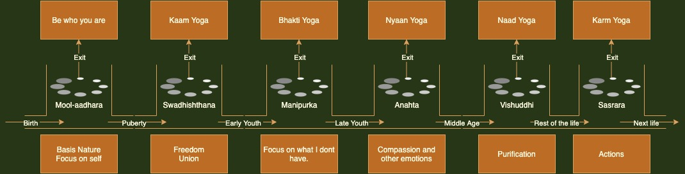

# Triangulation

In trigonometry and geometry, triangulation is the process of determining the location of a point by forming triangles to the point from known points. {Wikipedia}

Let us try to find our position from the set of knowns. In fact we are search for the "truth" but truth is who we are ? The most importnat command in Unix world is `whiami`. If we want to understand "who we are" then we need to listen to our own noise. How my heart feels and how my mind reacts. 

One of the common confusions among seekers is normally what path to take. There are so many different types of `Yogas` and each is heralded as the ultimate path. The truth, however, lies in where we are because the path is always relative to us. 

As shown in the graphic above, one of the easy way to understand where we are is to think of the `Chakras` as the gates or stages with respect to the age. 

# The trick of Nature

As shown above, there is a path available at every stage of the life or in every `Chakra` based on our natural orientation at that age. The problem is as soon as we try to take the exit route, we are pushed to the next stage. For example, our focus is completely on self when we are born but as we hit the puberty, we want to be anything but self. We kinda hate ourselves and want to project us as the `Cool` or `Hot` . Later we discover that the best bet to success is "Be Yourself" but the ship has alreacy sailed. There is no way to be "ourselves" now that we are already something else. Again there is path available in our intense longing to mate. `Kaam Sutra` offers a way to bliss and ultimate realization. But before we mature our longing into a `Yoga` we are already looking for things that we don't have. `Manipuraka` is our quest for one missing thing. Be it food or status. We now crave for the missing piece. We don't appreciate what we already have. Our entire intelligence (or focus) is now on that little thing that we don't yet possess. Once we have that, we are seeking something else. Such is the nature of manifestation. A

Once we understand who we are, then only we can plot where we want to go. Yoga is nothing but this path. The internal evolution from what you are to what you want to be is thus Yoga. Karm Yoga goes a step further. It says that you should aspire to be someone who fully understand and comprehend the situation at hand ; and acts righteously without expectations. In a way, such person does what this universal machine wants him to do. Deliverance of such responsibility also entails our ability to fully understand ourselves , our emotional response and an innate ability to keep a check on our nature while we are in pursuit of the task or duty at hand. Thus Karm Yoga encompasses all the yogas. And that also means why `Karm Yoga` is most misunderstood concept. 

# Guna Indicator

The primary way to ascertain our nature is to check the rise of Gunas in yourself. Are you feeling lethargic. Do you want to consume. Do you want to fall or let go. This happens when Tamsa rises. The only way to get out of this state is to indulge in actions. Just force yourself to do chores.

If you are feeling as if you are chasing a desired outcome. You are most probably on Rajasa. The way to handle this state is to question - what is it that you are chasing? What happens if you get it? Will the life be all flowery after that? What happens if if you don't get what you are chasing for. Will the world cease to exist? Generally you will find that the thing that you are chasing is kinda fad. It will pass.

If you feel calm, and creative; you are probably in Sattva. You want to engage in creative things. You want to chase a higher purpose. 

The last state is where you are beyond these three Gunas. Key thing is it is not actionless state. In this state you have singularity of focus. You are not swayed by the desires. You automatically act righeously because "righteous" is not different from what what you want to do in this state. This state is called `Gunateet`.

# Mind body indicator

The other way to look at what you want to do is to ask - are you doing this to please your mind or are you doing this to please your body . May be you want to watch TV. That is to please your mind. May be you want to eat - that is to please your body. What is your state ? Do you want to watch TV while eating ?

A simple rule if thumb is pleasing your body is more important than pleasing your mind. 